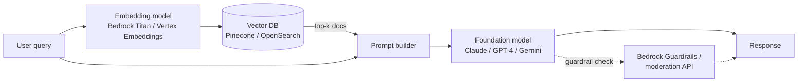

# AI/ML Cloud Services

> Stop training. Start calling. The API is the new architecture primitive.

## The hook

Three years ago, "use AI" meant standing up a GPU cluster, wrangling a dataset for a month, and praying your training run converged. Today it means making an HTTP call.

AWS Bedrock. Azure OpenAI. GCP Vertex AI. Every cloud now offers managed access to foundation models, inference endpoints, vector databases, and AI-specific compute. The question stopped being "how do I train a model?" and became "do I call somebody else's, or do I run my own?"

For most teams, the answer is call. The build-vs-call decision is the new architecture question, and getting it wrong is expensive in both directions.

## The concept

Cloud AI services stack into four layers. You almost always touch the top two and rarely need the bottom one.

- **Foundation model APIs** — call GPT-4, Claude, Gemini, Llama through a vendor endpoint. Pay per token. Zero infrastructure. AWS Bedrock, Azure OpenAI, GCP Vertex AI.
- **Managed model hosting** — bring your own model (or fine-tune one), the provider runs the inference servers. SageMaker, Azure ML, Vertex AI Endpoints.
- **Vector databases** — store embeddings, query by similarity. The retrieval half of RAG. Pinecone, Weaviate, AWS OpenSearch, Azure AI Search, GCP Vertex Vector Search.
- **Specialized AI** — pre-built models for vision, speech, translation, document parsing. AWS Rekognition / Textract, Azure Cognitive Services, GCP Vision API / Document AI.

Underneath all of this sits raw GPU compute — P5 instances with H100s, NDv5, A3. That's where the actual training happens. Most teams will never provision one.

The default in 2025: foundation model API plus a vector DB. Reach lower in the stack only when you have a specific reason.

## Diagram

A typical Retrieval-Augmented Generation (RAG) flow touches every layer:



The user's question gets embedded, similarity-searched against pre-embedded docs, the top matches join the prompt, and the foundation model writes the answer. One pattern, four layers, every major cloud.

## Example — a customer support AI, end to end

A SaaS company wants an assistant that answers customer questions from its help docs and ticket history. Here's the build, layer by layer.

**1. Embeddings.** Chunk the knowledge base into ~500-token pieces. Run each chunk through Bedrock Titan Embeddings (or Vertex Embeddings, or OpenAI's `text-embedding-3`). Store the resulting vectors in Pinecone or AWS OpenSearch with the original text as metadata. One-time cost: a few dollars for tens of thousands of docs.

**2. Retrieval.** When a user asks a question, embed the query with the same model, then run a vector similarity search. Take the top 5 matching chunks. This is a sub-100ms operation against a managed vector DB.

**3. Generation.** Build a prompt: system instructions, retrieved chunks, user question. Send it to Claude on Bedrock or GPT-4 on Azure OpenAI. The model answers using only the retrieved context — no hallucinated policy, no made-up SKUs.

```python
# pseudocode — uses placeholders for credentials
client = bedrock.Client(api_key="<YOUR_BEDROCK_KEY>")
response = client.invoke(
    model="anthropic.claude-3-sonnet",
    prompt=build_prompt(retrieved_docs, user_question),
)
```

**4. Guardrails.** Wrap the call with Bedrock Guardrails (or Azure Content Safety, or your own moderation pass). Block PII leaks, off-topic answers, and prompt injection attempts.

**5. Observability.** Log every prompt and response — PII-redacted — to a tool like LangSmith, Langfuse, or Arize. You will want this the first time a customer screenshots a weird answer.

**The numbers.** Per-query cost typically lands at $0.01 to $0.10 depending on token count. End-to-end latency runs 1–5 seconds, mostly token generation. The same architecture works on every cloud — different APIs, identical shape.

## Mechanics — AI services across clouds

Same four layers. Different vendor flavors.

| Layer | AWS | Azure | GCP | When to pick this layer |
|---|---|---|---|---|
| **Foundation models** | Bedrock (Claude, Llama, Titan) | Azure OpenAI (GPT-4, GPT-4o) | Vertex AI (Gemini, Claude, Llama) | Default for any LLM use case. Lock-in: low — prompts and patterns port across providers. |
| **Managed hosting** | SageMaker | Azure ML | Vertex AI Endpoints | You have a custom or fine-tuned model and don't want to run inference servers. Lock-in: medium — model artifacts port, serving config doesn't. |
| **Vector DB** | OpenSearch (k-NN) | Azure AI Search | Vertex Vector Search | RAG, semantic search, recommendations. Third-party (Pinecone, Weaviate) is portable across all three clouds. Lock-in: low–medium. |
| **Specialized AI** | Rekognition, Textract, Transcribe | Cognitive Services (Vision, Speech) | Vision API, Document AI, Speech-to-Text | Off-the-shelf vision/speech/OCR. Faster than building your own. Lock-in: high — APIs differ a lot. |
| **GPU compute** | P5 (H100), P4d (A100) | NDv5, NDm A100 v4 | A3 (H100), A2 (A100) | You actually need to train or fine-tune at scale. Lock-in: low — it's just instances. |

Pick from the top of the table down. Drop a layer only when the one above it doesn't fit.

## Related concepts

| Concept | What it is | How it relates to cloud AI |
|---|---|---|
| **Serverless** | Function-as-a-Service like Lambda, Cloud Functions | Most AI calls live behind a serverless function — short, bursty, perfect for FaaS. |
| **Edge computing** | Compute close to the user (Cloudflare Workers, Lambda@Edge) | Smaller models now run at the edge — Cloudflare Workers AI, Vertex Edge — for latency-sensitive inference. |
| **Managed databases** | Vendor-run database services | Vector DBs are a sub-class of managed DB. Same operational model, different query shape. |
| **Cloud cost management** | FinOps, billing alerts, budgets | Token costs scale linearly with traffic and prompt size. Caching, prompt trimming, and tier selection are the levers. |
| **Prompt engineering** | The discipline of writing prompts that get reliable answers | Half of "the model is wrong" is actually "the prompt was wrong." Treat prompts as code — version, test, review. |
| **Retrieval-Augmented Generation (RAG)** | Pattern: retrieve relevant docs, then generate | The dominant pattern for grounding LLMs in private data without fine-tuning. |
| **Fine-tuning** | Adjusting a base model's weights on your data | A step beyond RAG. Skip until RAG hits a wall — fine-tuning is harder, costlier, and locks you to a model version. |
| **Model evaluation** | Measuring how well a model does on your task | Without evals you're guessing. Build a small test set early; rerun on every prompt change. |

## When (and when not) to use cloud AI

**Use it when:**

- You're building a production AI feature and want to ship this quarter — foundation model APIs are excellent, cheap, and hands-off.
- You're prototyping. Calling an API beats waiting on a training cluster every time.
- You're integrating LLMs into an existing app — chat, summarization, classification, extraction. RAG plus a vendor model covers most of these.
- You need vision or speech and the off-the-shelf model is "good enough" — Rekognition / Vision API / Cognitive Services will save you months.

**Skip it when:**

- Your latency budget is sub-100ms. Hosted inference adds round-trip and token-generation overhead that you can't engineer away. Run a smaller model locally or at the edge.
- Regulation or contract blocks sending data to a third-party model provider. Some industries still require on-prem inference. Check before you build.
- You actually need to fine-tune or train from scratch — and you have the ML expertise, the data, and the budget for GPU hours. This is rare and expensive.
- The use case doesn't need AI. "AI as a feature" gets pitched into things that a `WHERE` clause would solve faster and cheaper.

Foundation models put PhD-level capability behind one HTTP call. Use it. Don't train a model when an API call is good enough.

## Key takeaway

- **In 2025, most teams should call AI services, not train models.** The API is the new architecture primitive.
- **RAG is the default pattern** — embedding model + vector DB + foundation model. Fine-tuning is a later move, not a first one.
- **Lock-in is mostly low at the top of the stack.** Foundation model APIs differ in shape but not architecture — switching costs are real but manageable.
- **Watch token costs early.** Cache prompts, trim retrieved context, and use a smaller model for the easy cases.
- **Latency budget decides everything.** Seconds are fine for chat. Milliseconds are not.

---

*Quiz available in the SLAM OG app — three questions on the RAG pattern, latency budgets for hosted models, and where the AI bill actually comes from.*
