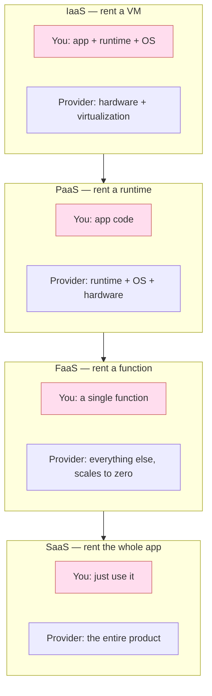

# Cloud Computing 101

> Cloud isn't a place. It's a ladder of abstractions — pick the right rung.

## The hook

Every conversation about modern software architecture eventually mentions "the cloud." The problem is that everyone means something different.

To one person, cloud means *AWS EC2 — a Linux box I rent by the hour*. To another, it means *Salesforce — software I log into through a browser*. To a third, it means *Lambda — I upload a function and forget about it*. All three are right. None of them is the whole picture.

This page is the shared vocabulary. What cloud computing actually is, how the abstraction levels work, and why where you stand on the ladder changes how you build.

## The concept

Cloud computing is renting compute, storage, and services from a provider over the internet, on demand, paying for what you use.

That's it. That's the definition.

Three things make it worth renting instead of owning:

1. **Elasticity** — scale up when traffic hits, scale down when it doesn't. You don't pay for the spike capacity 24/7.
2. **Managed services** — the provider runs the database, the queue, the load balancer. You stop being a part-time DBA.
3. **Global reach** — deploy to 30 regions in an afternoon. You'd need a decade and a balance sheet to do that with your own hardware.

The catch: you're trading control for less ops, and paying a markup for the convenience. How much you trade depends on which rung of the ladder you choose.

The four rungs are **IaaS, PaaS, SaaS, and FaaS** — each one shifts more of the stack from "you manage" to "they manage."

## Diagram

Pink is what you manage. The higher you climb, the smaller your slice.

## Example — one startup's climb up the ladder

Watch the same team trade control for less ops over three years.

**Year 1 — IaaS.** Two co-founders, a Rails app, and a launch deadline. They rent an EC2 instance on AWS. SSH in, install Postgres, install Redis, install Ruby, deploy the app. They own everything from the OS up. When Postgres needs a security patch, they patch it. When Redis runs out of memory, they're up at 2am. Cost is low. Ops cost is high.

**Year 2 — PaaS-ish.** They've got users. They're tired of being part-time DBAs. They move Postgres to **RDS** (managed database), Redis to **ElastiCache** (managed cache), and the app onto **ECS** (managed containers). They still write all the application code. But the provider handles backups, failover, patching, scaling. They give up some knobs they used to turn — the ones they were turning wrong anyway.

**Year 3 — FaaS for the hot paths.** Their read traffic has gotten spiky. The product gets hammered when a customer's content goes viral. They peel off the read API into **Lambda** functions behind **API Gateway**. Now those endpoints scale from zero to 10,000 requests per second on their own. They pay only for the milliseconds they execute. The rest of the app stays on ECS where steady traffic is cheaper.

**Where they ended up.** Same cloud (AWS), same product, dramatically less infrastructure to babysit. They didn't pick one rung and stay — they picked the right rung for each piece. That's the actual skill: matching workload to abstraction level.

## Mechanics — the four service models

| Model | What you manage | What they manage | Examples | When to use | Lock-in |
|---|---|---|---|---|---|
| **IaaS** | App, runtime, OS, patches | Hardware, virtualization, network | AWS EC2, Azure VMs, GCP Compute Engine | Lifting an existing on-prem app, niche OS needs, max control | Low (a VM is a VM) |
| **PaaS** | App code only | OS, runtime, scaling, patching | Heroku, Cloud Run, App Engine, App Service | New apps where you don't want to think about servers | Medium (each platform has its quirks) |
| **SaaS** | Your data and config | The entire product | Salesforce, Notion, Workday, Gmail | Solving a business problem where building it yourself is a waste | High (export your data, that's it) |
| **FaaS / Serverless** | A function and its trigger | Everything else, including scale-to-zero | AWS Lambda, Cloud Functions, Cloudflare Workers | Spiky workloads, event-driven glue, APIs with unpredictable load | High (functions don't port cleanly) |

Higher rungs cost more per unit of compute but less per hour of your time. The math depends on what your team's hours are worth and how predictable your load is.

### The big three providers

| Provider | Strengths | Roughly | Pick when |
|---|---|---|---|
| **AWS** | Widest service catalog, deepest ecosystem, mature tooling | ~30% market share | You want every Lego brick ever made |
| **Azure** | Tight Microsoft integration, enterprise sales motion, strong hybrid story | ~25% | You're a Microsoft shop or you need on-prem + cloud to feel like one thing |
| **GCP** | Best-in-class data and ML stack, strong networking, clean API design | ~10% | Data-heavy workloads, BigQuery, or you want fewer ways to do the same thing |

The honest answer for most teams: pick the one your engineers already know. The differences matter at scale; the learning curve matters every day.

## Related concepts

| Concept | What it is | How it relates |
|---|---|---|
| **Cloud Networking** | VPCs, subnets, peering, private links — how your cloud resources talk | Next stop in this course. The plumbing under every cloud workload. |
| **Cloud IAM** | Identity and access management — who can do what | Every API call you make to the cloud goes through IAM first. |
| **Cloud Storage Services** | Object storage (S3), block storage (EBS), file storage (EFS) | The "where does my data live" half of cloud. |
| **Shared Responsibility** | The split between what the provider secures and what you secure | At every rung, the line moves. Knowing where it sits is the security baseline. |
| **Cloud-Native** | Designing apps to take advantage of cloud primitives | Covered in the [System Design course](../system-design/cloud-native.md). The architecture pattern that maps onto these rungs. |
| **Serverless** | Apps built primarily on FaaS + managed services | Deeper later in this course. The top of the ladder, fully embraced. |
| **Containers** | Packaging code with its dependencies for portable deploy | See [containers-docker](../system-design/containers-docker.md). The unit of deploy on most modern PaaS. |
| **Kubernetes** | Container orchestration | See [kubernetes](../system-design/kubernetes.md). What sits underneath managed PaaS like ECS, GKE, AKS. |
| **Edge Computing** | Compute at the network edge, close to users | An emerging fifth rung, focused on latency more than abstraction. |

## When (and when not) to use the cloud

**Use cloud when:**

- **Your load is variable** — daily traffic curves, seasonal spikes, viral moments. Elasticity pays for itself.
- **You need global reach** — users on three continents and you don't want to build three data centers.
- **You're iterating fast** — early product, lots of unknowns, can't afford a 6-month hardware cycle.
- **You'd rather rent than run managed pieces** — databases, queues, search, ML inference. Letting the provider operate them frees real engineering time.

**Skip cloud (or only put part of it there) when:**

- **Steady, predictable load** at scale — when your servers run at 80% utilization 24/7 for years, owning the boxes can be cheaper than renting them.
- **Compliance or data locality genuinely demands on-prem** — some regulated industries can't move data to a public cloud, full stop. (Confirm with legal before building around this assumption.)
- **Niche performance needs** — high-frequency trading, custom silicon, sub-millisecond latency to specific physical locations. Cloud's abstractions become a tax.
- **You can't predict your bill** — if your team can't estimate cloud cost within 2x, that's a sign of organizational immaturity, not a sign cloud is wrong. Fix it before scaling.

The default for most teams building most things is *yes, use the cloud, and start higher up the ladder than you think*. The interesting question isn't "cloud or not" — it's "which rung, for which workload."

## Key takeaway

- **The cloud isn't "someone else's computer."** It's a service ladder. Pick the right rung for your workload.
- **Higher rung = less ops, more lock-in, more cost per unit.** Lower rung = more control, more ops, more flexibility.
- **You don't have to pick one rung.** Most production systems mix IaaS for control, PaaS for the boring parts, FaaS for spikes, SaaS for things you'd never build yourself.
- **Pick the provider your team knows.** The fancy service differences matter at scale; everyday productivity matters now.

---

*Quiz available in the SLAM OG app — three questions on IaaS vs PaaS, what serverless really means, and when on-prem still wins.*
