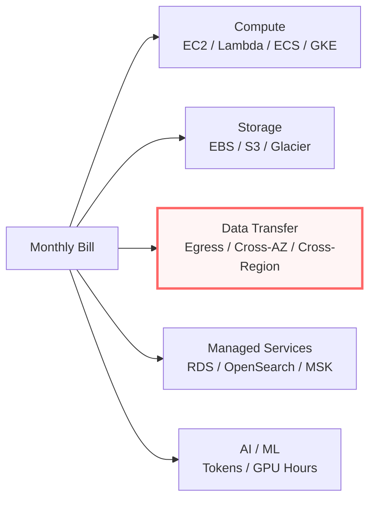

# Cloud Cost Management & FinOps

> The surprise cloud bill is a feature, not a bug. FinOps is the discipline that keeps it survivable.

## The hook

Most cloud horror stories aren't outages. They're bills.

The $50K Sunday morning surprise after a runaway job. The startup that got slammed with a six-figure Lambda bill from one recursive function that called itself a few million times. The data warehouse that quietly egress'd a couple hundred grand in cross-region transfer over a single quarter. The dev environment somebody spun up for a demo and forgot about for nine months.

Cloud's elasticity is a double-edged sword. It scales costs as easily as it scales capacity. The same API that lets you go from one server to a thousand in five minutes will cheerfully bill you for all thousand if you forget to scale back down.

**FinOps** — financial operations — is the discipline that keeps the bill survivable. It's not a tool you buy. It's a practice that combines visibility, optimization, and accountability so that cost stops being a quarterly surprise and starts being a metric your engineers actually own.

## The concept

Cloud cost management has three pillars. Skip any one and the other two leak.

**1. Visibility** — you can't manage what you can't see. Tagging strategy, cost allocation, dashboards. Every resource tagged with team, project, environment. Cost Explorer / Cost Management / Cloud Billing dashboards filtered by those tags. Anomaly detection flagging spikes within hours, not at the end of the month.

**2. Optimization** — once you can see the spend, you can attack it. Right-sizing oversized instances. Reserved Instances and Savings Plans on the baseline. Spot instances for batch and CI. S3 lifecycle policies moving cold data to Glacier. VPC endpoints to dodge NAT Gateway charges. The architectural decisions that pick a cheaper price model entirely.

**3. Accountability** — engineers see their own bill. Cost shows up in the same dashboard as latency and error rate. Every team has a budget. New features come with a cost estimate. Cost stops being "finance's problem" and becomes a feature gate alongside reliability and performance.

The big three clouds all ship the basic plumbing — AWS Cost Explorer + Budgets, Azure Cost Management, GCP Cloud Billing — but the practice is the part you have to build yourself.

## Diagram

Compute and storage are the lines everyone watches. The surprise line — the one highlighted above — is almost always **data transfer**. Egress to the internet, cross-AZ chatter between services, cross-region replication, NAT Gateway, VPC peering. It's invisible in code reviews and architecture diagrams, and it's where bills explode.

## Example — the "what just happened?" incident

A typical scenario. A growing startup's AWS bill jumps from roughly $5K/month to $40K/month over a single billing cycle. User traffic is up, but only modestly. Engineering gets pulled into a war room.

The investigation breaks down like this:

**~60% of the increase is data egress.** They added a CDN to speed up image delivery. The CDN origin points at an S3 bucket. The bucket is in `us-east-1`. The CDN edge nodes are pulling content into other regions on cache miss — every miss is cross-region transfer at the inter-region rate. Then it goes out to the user, which is internet egress. Two charges per cache miss.

**~20% is RDS.** They migrated their database to Aurora three months ago. The old RDS instance was supposed to be deleted post-migration. It wasn't. It's been running idle, fully provisioned, billing every hour for ninety days.

**~15% is NAT Gateway.** Their Lambda functions sit in a private VPC and reach AWS services (S3, DynamoDB, Secrets Manager) by routing through a NAT Gateway. NAT Gateway charges per hour *and* per GB processed. At their scale, the per-GB charge alone is meaningful.

**~5% is everything else** — small EBS volumes left behind from terminated instances, CloudWatch log retention set to "forever," a forgotten OpenSearch domain.

The fix:

1. Move the CDN origin to a same-region bucket and add CloudFront at the edge → roughly $24K/year saved.
2. Delete the orphaned RDS instance → roughly $14K/year saved.
3. Add VPC endpoints (Gateway endpoints for S3/DynamoDB are free; Interface endpoints for the rest) so AWS service traffic skips the NAT → roughly $9K/year saved.

The point isn't the dollar figures — those are illustrative. The point is the pattern. **Most cloud cost wins aren't "use cheaper instances." They're "find the thing you forgot you were paying for."** Idle resources, orphaned snapshots, traffic taking the long way around, log retention set to infinity. The savings live in the corners of the bill.

## Mechanics — the FinOps tactical menu

| Tactic | What it does | When to reach for it |
|---|---|---|
| **Right-sizing** | Compute Optimizer / Advisor recommendations; downsize idle EC2, RDS, OpenSearch | Always — quarterly review minimum |
| **Reserved Instances / Savings Plans** | 1-3 year commits for 30-70% off list price | Stable baseline workloads only; never spiky |
| **Spot Instances** | 60-90% discount on interruptible compute | Batch jobs, CI runners, fault-tolerant workers |
| **S3 lifecycle / Intelligent-Tiering** | Auto-archive cold data to Glacier or Deep Archive | Any bucket where access patterns vary over time |
| **Egress reduction** | VPC endpoints, same-region origins, CloudFront for global delivery | The moment you see inter-region or NAT charges climbing |
| **Tagging strategy** | Every resource tagged with team / project / env / cost-center | Day one — retrofitting tags is painful |
| **Budget alerts** | Threshold-based notifications at 50%/80%/100% of budget | Every account, every team — nobody should be surprised |
| **Architecture choices** | Serverless vs always-on; managed vs self-hosted; sync vs async | The biggest lever — made at design time, hard to undo later |

Most teams start with right-sizing and tagging because they're easy. The savings ladder up: tactical fixes save 10-30%, commitment plans save another 20-40% on top, architectural rethinks can move the bill by a factor of two or more.

## Related concepts

| Concept | What it is | How it relates to FinOps |
|---|---|---|
| **Cloud Storage Services** | Block, file, object storage tiers | Egress is *the* surprise line item; storage tiering is one of the easiest wins |
| **Multi-Cloud / Hybrid** | Running workloads across multiple cloud vendors | Multi-cloud usually *blows up* costs — extra egress, duplicate tooling, no volume discounts |
| **Cloud Migration** | Moving workloads from on-prem to cloud | The bill almost always grows post-migration before optimization kicks in; budget for the rebound |
| **Serverless** | Pay-per-invocation compute (Lambda, Cloud Run) | Different price model — sometimes much cheaper, sometimes catastrophically more expensive at high constant load |
| **Observability** | Metrics, logs, traces for system health | Cost is a metric. Treat it like latency or error rate — alert on anomalies |
| **Auto-scaling** | Dynamic capacity based on load | Saves money when configured right; burns money when min/max bounds are wrong |
| **Spot / Preemptible Instances** | Discounted, interruptible compute capacity | The biggest single-line discount available — if your workload can tolerate interruption |
| **Resource Tagging** | Metadata labels on cloud resources | The foundation. No tags, no cost allocation, no accountability |

Each of these is a topic on its own. FinOps is the practice that ties them together through the lens of "what does this cost, and is it worth it?"

## When (and when not) to invest deeply in FinOps

**Invest in FinOps when:**

- **Monthly bill is north of ~$5K** and growing — the absolute savings start to justify the program time
- **Multiple teams share a cloud account** — without allocation, every cost conversation is a finger-pointing exercise
- **Spend is growing faster than revenue** — a leading indicator that something is structurally off
- **There's enough stable baseline** to make Reserved Instances or Savings Plans a real lever
- **Leadership treats cost as an engineering metric** — without that buy-in, FinOps stays a finance side-project

**Skip the heavy machinery when:**

- **Small project, single team, predictable spend** — a basic budget alert and quarterly check-in is enough
- **Pre-revenue prototype** — your time is worth more than the bill; ship the thing first, optimize when it matters
- **Bill is dominated by one vendor-managed service** with little room to tune — focus elsewhere

The default for any growing company past seed stage with cloud bills in the five-figures-per-month range: yes, do this. The default for a side project: no, just set a budget alert and move on.

## Key takeaway

- **Egress is usually the surprise.** Compute and storage are visible. Data transfer hides in the corners — chase it first.
- **Tagging is usually the foundation.** No tags, no allocation, no accountability. Start here even if nothing else changes.
- **Architecture is usually the biggest lever.** Right-sizing saves 20%. Picking serverless over always-on (or vice versa) can move the bill by 2-5x.
- **Commit the floor, burst on-demand.** Reserved Instances and Savings Plans on the stable baseline; on-demand or spot for everything above it.
- **Cost is a metric, not a quarterly surprise.** Put it on the same dashboard as latency and error rate. Engineers fix what they can see.

---

*Quiz available in the SLAM OG app — three questions on egress detection, when commitment plans pay off, and why tagging is the foundation.*
