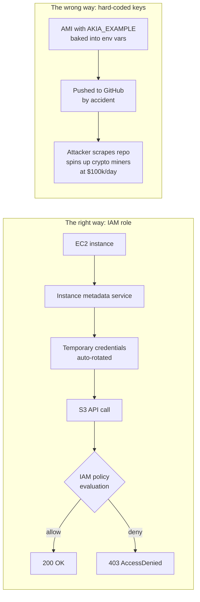

# Identity & Access Management (IAM)

> Most cloud breaches aren't zero-days. They're a wide-open IAM policy.

## The hook

Pull up any of the last five years' biggest cloud breaches. Capital One. The Twitch leak. Uber. Pick one.

You won't find a sophisticated zero-day in a hypervisor. You'll find *"this S3 bucket was world-readable"* or *"this IAM role had `Action: *` on `Resource: *`."*

IAM — Identity and Access Management — is the policy layer that decides who (or what) can do what to which resource in your cloud account. It's the lock on every door. Get it wrong and the rest of your security stack — your firewalls, your encryption, your fancy SIEM — doesn't matter. The attacker just walks in with the right credentials.

## The concept

Cloud IAM is fine-grained access control over cloud resources. The same three building blocks show up across AWS, Azure, and GCP, just with different names:

- **Identity (Principal)** — who's making the request. A human user, a service account, or a role being assumed by a workload (AWS IAM User, Azure AD User, GCP Service Account).
- **Policy** — a JSON document that grants or denies specific actions on specific resources. Example: *"allow `s3:GetObject` on `arn:aws:s3:::my-bucket/*`."*
- **Role** — a bundle of permissions an identity can *assume* temporarily. The cloud-native replacement for shared credentials. No keys to rotate. No secrets to leak.

The principle that runs through all of it: **least privilege**. Give an identity the minimum permissions it needs, nothing more. A read-only reporting job gets `Get*` and `List*` — not `*`. A backup service writing to one bucket gets `s3:PutObject` on that one bucket — not the whole account.

Every IAM mistake you've ever read about is a violation of this rule.

## Diagram



The role path leaves nothing to leak. The hard-coded path is one careless commit away from a six-figure AWS bill — or worse, an exfiltrated customer database.

## Example — a Node.js app on EC2 that needs S3 + DynamoDB

Real scenario. Your app reads user uploads from `app-data-bucket` and writes events to a DynamoDB table called `user-events`.

**The right approach:**

1. Create an IAM role: `app-runtime-role`.
2. Attach a policy that grants only what the app needs:

   ```json
   {
     "Version": "2012-10-17",
     "Statement": [
       {
         "Effect": "Allow",
         "Action": "s3:GetObject",
         "Resource": "arn:aws:s3:::app-data-bucket/*"
       },
       {
         "Effect": "Allow",
         "Action": "dynamodb:PutItem",
         "Resource": "arn:aws:dynamodb:us-east-1:your-account-id:table/user-events"
       }
     ]
   }
   ```

3. Attach the role to the EC2 instance. No keys. No secrets file. No rotation cron job.
4. The AWS SDK auto-discovers credentials via the instance metadata service. Your code looks like:

   ```js
   const s3 = new S3Client({ region: "us-east-1" });
   // SDK pulls temporary creds from IMDS. You never see them.
   ```

That's it. The credentials live for an hour, rotate themselves, and are scoped to *exactly* two API calls on *exactly* two resources.

**The wrong approach (still seen in production):**

```bash
# .env
AWS_ACCESS_KEY_ID=AKIA_EXAMPLE
AWS_SECRET_ACCESS_KEY=EXAMPLE_SECRET
```

The user attaches a policy of `s3:*` and `dynamodb:*` on `Resource: *` because *"we'll lock it down later."* Later never comes. Six months in, a junior dev commits the `.env` to git. GitHub bots scrape it within minutes. The attacker spins up p4d.24xlarge instances mining crypto in every region. The bill is $80k by Monday.

This isn't a hypothetical. It happens every week. The role-based version makes it impossible.

## Mechanics — IAM core constructs across the big 3

| Construct | AWS | Azure | GCP |
|---|---|---|---|
| **Human identity** | IAM User | Azure AD User | Google Account |
| **Workload identity** | IAM Role | Managed Identity | Service Account |
| **Permissions doc** | IAM Policy (managed or inline) | Role Definition (built-in or custom) | Role (primitive, predefined, custom) |
| **Grant** | Policy attachment | Role Assignment (scope: subscription / RG / resource) | IAM Binding (member + role + resource) |
| **Org-wide guardrails** | Service Control Policies (SCPs) | Azure Policy + Management Groups | Organization Policies |
| **Conditional logic** | Policy `Condition` block | Conditional Access | IAM Conditions |

Different vocabulary, same shape: *who* (identity) gets *what* permission (policy/role) on *which* resource (scope).

**Best practices that hold across all three clouds:**

- **Roles over users.** Workloads should never have long-lived keys. EC2 → instance role. Lambda → execution role. GKE pod → workload identity.
- **MFA on every human account.** Especially the root/owner account. Most account takeovers start with a leaked password and no second factor.
- **Never use the root account.** Create an admin user, lock the root credentials in a vault, walk away.
- **Manage IAM in code (Terraform, CDK, Pulumi).** Click-ops policies drift, get forgotten, and accumulate permissions nobody can explain. IaC means every change is reviewed, diffed, and revertible.
- **Audit unused permissions.** AWS IAM Access Analyzer, Azure PIM, GCP Recommender all flag permissions an identity hasn't used in 90 days. Trim them.
- **Permission boundaries / SCPs at the org level.** Even if a developer attaches `*:*` to a role, an SCP saying *"deny everything outside us-east-1"* still saves you.

## Related concepts

| Concept | What it is | How it relates to IAM |
|---|---|---|
| **Shared Responsibility Model** | The contract that says the cloud provider secures the platform; you secure what you put on it | IAM is squarely *your* responsibility. AWS won't catch your `*:*` policy. |
| **Cloud Networking (Security Groups, NSGs, VPC Firewall)** | Layer-3/4 packet filtering between cloud resources | Security groups gate network traffic. IAM gates API actions. You need both — they protect different layers. |
| **OAuth 2.0 / JWT** | Application-layer auth for users and third-party apps | Different problem. OAuth authorizes a *user* to a *web app*. IAM authorizes a *cloud identity* to a *cloud API*. |
| **Cookies, Sessions, Tokens** | Browser-side auth state for web apps | App-level. IAM sits below the app, gating which cloud resources the app itself can touch. |
| **Secrets Management (AWS Secrets Manager, Azure Key Vault, GCP Secret Manager)** | Stores app-level secrets (DB passwords, API keys) | Adjacent layer. IAM gates *who can read* the secret. The secret store gates *what the secret unlocks*. |
| **Audit Logging (CloudTrail, Activity Log, Cloud Audit Logs)** | Records every IAM-authorized API call | The audit trail for IAM. If something gets compromised, this is how you reconstruct what happened. |
| **Service Mesh (Istio, Linkerd)** | mTLS-based identity and policy between microservices | In-cluster IAM. Different identity system (SPIFFE / cert-based), same idea: principal → policy → resource. |
| **Workload Identity Federation** | Lets a workload outside your cloud (GitHub Actions, on-prem) assume a role without long-lived keys | The modern answer to *"how do I let CI deploy without storing AWS keys in GitHub?"* |

## When (and when not) to invest deeply

**Invest in IAM design when:**

- Any **production workload** — non-negotiable.
- Any **multi-engineer team** — you need scoped permissions or someone *will* delete the wrong thing.
- **Compliance requirements** — SOC 2, HIPAA, PCI all require documented least-privilege access.
- **Shared accounts** across multiple apps or environments — you need policy boundaries between them.
- Any time **secrets, customer data, or money** are involved.

**You can keep it light when:**

- **Hobby project in your own personal account** with no real data — just don't leak the root key.
- **Single-user, single-app, single-environment** — least-privilege is still smart, but you don't need SCPs and permission boundaries.
- **Throwaway sandbox** that auto-expires — risk is bounded.

The trap is treating *production* like the throwaway case. The five minutes saved by writing `*:*` is the five minutes the breach postmortem will be written about.

## Key takeaway

- **Least privilege isn't a slogan — it's the difference between a small mistake and a Capital One breach.**
- **Roles, not keys.** Workloads should never carry long-lived credentials. Instance roles, managed identities, service accounts, workload identity federation.
- **MFA on every human, no root account use, ever.**
- **Manage IAM as code.** Click-ops drifts; Terraform diffs.
- **Security groups gate packets, IAM gates API calls.** Different layers — you need both.
- **The next breach you read about will be an IAM misconfiguration.** Make sure it isn't yours.

---

*Quiz available in the SLAM OG app — three questions on least privilege, why roles beat hard-coded keys, and the building blocks shared across AWS, Azure, and GCP.*
