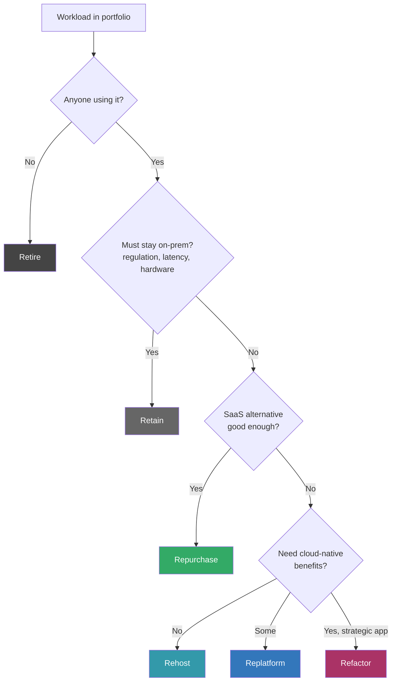

# Cloud Migration Patterns (the 6 R's)

> Lift-and-shift is one of six options — pick the wrong R and you'll waste years.

## The hook

"Migrate to the cloud" sounds like one project. It's not. It's six different decisions made workload by workload — **rehost, replatform, refactor, repurchase, retire, retain**.

Pick the wrong R and you'll either spend three years rewriting an app that should have just moved as-is, or you'll lift-and-shift a system that should have been replaced. The 6 R's are AWS's vocabulary. Gartner has 5 R's. Some frameworks add a 7th. Same idea everywhere — *don't treat the portfolio as one decision*.

## The concept

Here are the six. Memorize them in this order — they roughly run from "least work" to "most work."

- **Retire** — turn it off. Half your portfolio has apps nobody uses. Confirm, decommission, move on. The cheapest migration is the one you don't have to do.
- **Retain** — keep on-prem. Mainframe, regulated workload, latency-bound system, special hardware. Acknowledge it, document why, and stop trying to move it.
- **Repurchase** — replace with a SaaS. Legacy CRM becomes Salesforce. On-prem email becomes Microsoft 365. You're not migrating the app; you're swapping the product.
- **Rehost** ("lift and shift") — move VMs as-is to cloud IaaS. Fastest migration. Cheapest to execute. You don't unlock cloud-native benefits — you just rent your old architecture by the hour.
- **Replatform** ("lift and tinker") — minor changes during the move. Self-managed Postgres becomes RDS. Self-managed Redis becomes ElastiCache. Modest effort, modest benefit, often the right middle ground.
- **Refactor** — re-architect for cloud-native. Microservices, serverless, managed services, event-driven. Maximum benefit, maximum effort, maximum risk.

Most large migrations end up using **all six** across different workloads. The skill is matching workloads to R's, not picking one R for everything.

## Diagram

Run every workload through this tree. The answers are usually obvious — the work is being honest about which apps are actually strategic.

## Example — Netflix vs. GE Capital

Two famous migrations. Both took the right call. Both look completely different.

**Netflix — full refactor, ~7 years (2008–2015)**

Netflix's data center had a catastrophic database corruption in August 2008. Three days of degraded service. That was the trigger. They didn't rehost. They didn't migrate gradually-but-still-mostly-the-same. They committed to refactoring everything onto AWS over years.

The result is the architecture every system design book references: hundreds of microservices, full AWS-native (S3, DynamoDB, Kinesis, EC2 fleets), chaos engineering as a discipline, multi-region active-active. The migration *was* the modernization. They came out the other side as a different engineering org.

This took years and consumed enormous engineering effort. They could afford it because streaming was the whole business and the old data center had failed them.

**GE Capital — mass rehost, ~2 years**

Different problem. GE Capital had thousands of VMs running thousands of business apps across many on-prem data centers. They needed out — fast — for cost and consolidation reasons, not for architecture reasons.

They lift-and-shifted the bulk of it. Faster. Cheaper to execute. They kept the same patterns, the same scaling limits, the same operational habits — just on AWS instead of their own racks. Most of the cloud-native goodness didn't show up immediately. That was fine. The goal was "get out of the data centers," not "become Netflix."

**The honest framing**

Enterprises that try to refactor *everything* take 5–10 years and burn engineering hours that could've shipped product. Enterprises that rehost *everything* see modest cost savings and never unlock the cloud's actual value. The art is portfolio thinking. Most workloads rehost. The strategic ones refactor. The dead ones retire. The regulated ones retain.

## Mechanics — the 6 R's table

| R | Definition | Effort | Benefit captured | Example |
|---|---|---|---|---|
| **Retire** | Turn it off | S | High (cost goes to zero) | 20-year-old internal reporting tool nobody opens |
| **Retain** | Keep on-prem | S | None (intentional) | Mainframe batch jobs; latency-bound trading system |
| **Repurchase** | Switch to SaaS | M | High (offload ops entirely) | Legacy CRM → Salesforce; on-prem ticketing → Zendesk |
| **Rehost** | Lift and shift VMs | S–M | Low–Medium | EC2-ify a Windows app server with no code changes |
| **Replatform** | Lift and tinker | M | Medium | Self-managed Postgres → RDS; self-hosted Redis → ElastiCache |
| **Refactor** | Re-architect cloud-native | L–XL | High | Monolith → microservices on EKS or serverless |

**Migration tools that actually carry weight**

- **AWS Migration Hub** / **Azure Migrate** / **Google Migrate to Containers** — discovery and tracking. These are bookkeeping plus some VM replication. Use them; don't expect magic.
- **AWS DMS** / **Azure Database Migration Service** — database migration with continuous replication. The hard part of any rehost is "how do we cut over without downtime." DMS makes it possible, not painless.
- **Landing zones** — AWS Control Tower, Azure Landing Zones, GCP organization setup. These set up the account/subscription structure, networking, IAM baselines, and guardrails *before* you start moving workloads. Skipping the landing zone is the most common preventable mistake.

**The 7th R — Relocate**

Some frameworks (and AWS later) added **Relocate**: move VMware-style virtualization wholesale to a cloud-hosted equivalent like VMware Cloud on AWS or Azure VMware Solution. It's a special case of rehost — you don't even repackage the VMs, you just move the entire virtualization layer. Useful if you're VMware-heavy and want speed over modernization.

## Related concepts

| Concept | What it is | How it relates |
|---|---|---|
| **Cloud Cost Management** | Discipline of tracking and optimizing cloud spend | Post-migration costs almost always *grow* before they shrink. Rehost without rightsizing = sticker shock. |
| **Multi-cloud / Hybrid** | Running across multiple providers or cloud + on-prem | Migration sometimes lands you here by accident — half-migrated state can last for years. |
| **Cloud-Native** | Apps designed for cloud (microservices, serverless, managed services) | Refactor is the path here. Rehost gets you to the cloud but not to cloud-native. |
| **Shared Responsibility Model** | Split of security duties between you and the provider | The security model changes mid-migration. This is when most breaches happen — patching ownership shifts and nobody confirms who has it now. |
| **Case: Netflix** | The canonical full-refactor cloud migration | The story everyone references. Read it, then notice your context probably doesn't match theirs. |
| **Cloud IAM** | Identity and access in the cloud | Landing zones bake IAM baselines in *before* migration. Migrating with on-prem AD habits intact creates years of cleanup. |
| **Managed Databases** | RDS, Cloud SQL, Azure SQL, etc. | The single highest-leverage replatform move. Most rehosts should at least replatform the database. |
| **Serverless** | Run code without managing servers | A common refactor target for event-driven and bursty workloads. Often *too* tempting — not every refactor should land on Lambda. |

## When (and when not) to migrate

**Migrate when:**

- **Data center contract is ending** — the most common real trigger. The clock is what forces the decision.
- **You've outgrown the physical footprint** — scale, geography, or both. Building more racks is no longer cheaper than renting them.
- **M&A pressure** — two companies, two data centers, one is going away. Cloud is the neutral ground.
- **Modernization mandate** — leadership wants cloud-native architecture and the only way to get there is to start.

**Skip the migration (or limit it) when:**

- **Regulatory or sovereignty blockers** — some workloads legitimately can't leave certain jurisdictions or hardware classes.
- **The system genuinely fits on-prem better** — steady predictable load on owned hardware over many years can beat cloud on cost. Don't move it just for fashion.
- **Migration cost exceeds 3–5 year savings** — run the actual numbers. If the payback is past five years, the business case is shaky.
- **You don't have the operational maturity yet** — moving without IAM, observability, cost controls, and a landing zone in place creates a mess that takes longer to clean up than the migration itself.

The honest version of "should we migrate?" is rarely yes/no. It's "which workloads, which R, in what order, on what timeline."

## Key takeaway

- **Migration is portfolio management, not a project.** Most workloads rehost. The strategic ones refactor. Dead ones retire. Regulated ones retain.
- **One R for everything is always wrong.** Refactor-everything burns years. Rehost-everything captures none of the cloud's value.
- **Retire first.** Half the savings on most migrations come from turning things off, not moving them.
- **Build the landing zone before you move workloads.** Skipping this is the single most expensive shortcut in cloud migration.
- **Costs go up before they go down.** Plan for it, monitor for it, rightsize after the cutover — not before.
- **Most "cloud migrations" end as half-finished refactors.** Pick the right R per workload, finish what you start, and stop pretending it's one decision.

---

*Quiz available in the SLAM OG app — three questions on Retire vs. the other R's, Replatform vs. Refactor, and when "rehost everything" stops working.*
