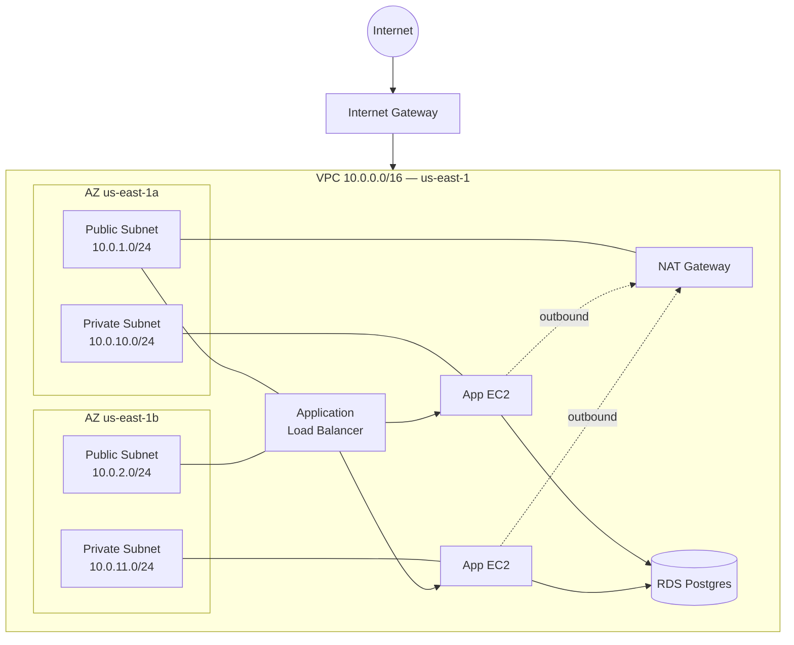

# Cloud Networking — VPC, Subnets, Security Groups

> Your cloud workload lives in a VPC. Understanding that is non-negotiable.

## The hook

Every cloud workload — every EC2 instance, every Lambda, every container — runs inside a Virtual Private Cloud. Get the networking wrong and your services can't talk to each other. Get it *really* wrong and they can talk to the entire internet.

The networking concepts you skipped in your CCNA class come back as VPCs, subnets, and security groups. CIDR blocks, route tables, firewall rules — same fundamentals, new wrappers. The good news: cloud networking is software-defined, so you build it with config, not cables.

## The concept

A VPC is your isolated slice of the cloud provider's network. You pick the IP range. You decide what's reachable from the internet and what isn't. Five primitives do most of the work.

| Primitive | What it is |
|---|---|
| **VPC** | An isolated network in one region. You assign a CIDR block (e.g., `10.0.0.0/16` = 65,536 addresses). |
| **Subnet** | A chunk of the VPC tied to **one** Availability Zone. Public subnets route to an internet gateway; private don't. |
| **Route Table** | Rules that say "traffic for *this destination* goes *that way*" (e.g., `0.0.0.0/0` → IGW). |
| **Security Group** | A stateful firewall at the instance level. Default-deny inbound, allow what you list. |
| **NACL** | A stateless firewall at the subnet level. You'll rarely customize these — start with security groups. |

The mental model: the VPC is the building, subnets are the floors, the route table is the elevator system, security groups are the keycards on each office door.

## Diagram



Public subnets host the load balancer and NAT gateway — anything that needs to face the internet. Private subnets host the app servers and the database. Outbound calls (package updates, third-party APIs) hop through the NAT gateway. Nothing on the internet can dial the app or DB directly.

## Example — a production web app on AWS

This is the layout you'll see in 90% of production AWS accounts. Walk through it once, and you've seen most VPCs you'll meet.

**VPC:** `10.0.0.0/16` in `us-east-1`. Plenty of room (~65K IPs) without colliding with the typical office network.

**Subnets across two AZs:**

| Subnet | CIDR | AZ | Type | Hosts |
|---|---|---|---|---|
| `public-a` | `10.0.1.0/24` | us-east-1a | Public | ALB, NAT Gateway |
| `public-b` | `10.0.2.0/24` | us-east-1b | Public | ALB |
| `app-a` | `10.0.10.0/24` | us-east-1a | Private | EC2 app servers |
| `app-b` | `10.0.11.0/24` | us-east-1b | Private | EC2 app servers |
| `db-a` | `10.0.20.0/24` | us-east-1a | Private | RDS Postgres (primary) |
| `db-b` | `10.0.21.0/24` | us-east-1b | Private | RDS Postgres (standby) |

Two AZs because if `us-east-1a` goes down (it has, more than once), traffic shifts to `us-east-1b` automatically.

**Security groups — the firewall layer:**

```
sg-alb        inbound:  443  from  0.0.0.0/0
sg-app        inbound:  80   from  sg-alb
sg-db         inbound:  5432 from  sg-app
```

Read those rules out loud. The internet talks to the ALB on 443. The ALB talks to the app servers on 80. The app servers talk to the database on 5432. Nothing else is allowed inbound, anywhere. If an attacker gets a shell on an app server, they still can't reach the database from their laptop — the DB security group doesn't trust their IP.

**Route tables:**

- Public subnets: `0.0.0.0/0` → Internet Gateway
- Private subnets: `0.0.0.0/0` → NAT Gateway (in `public-a`)
- All subnets: `10.0.0.0/16` → local (so subnets can talk to each other)

**The result:**

- Users hit `https://app.example.com` → DNS resolves to the ALB → ALB load-balances to a healthy app server in either AZ → app server queries RDS → response flows back.
- App servers can `apt update` and call third-party APIs because the NAT Gateway gives them outbound internet — but inbound from the internet is blocked.
- The database has no public IP. Period. The only way in is through the chain of security groups.

That's the standard production layout: **public subnets host things the internet talks to; private subnets host what shouldn't be reachable from outside; security groups are the in-between firewall.**

## Mechanics — VPC building blocks reference

| Block | What it does | When to use | Common gotcha |
|---|---|---|---|
| **VPC** | Isolated network in one region with a CIDR block | Every workload — even Lambdas live in one if they need to reach private resources | CIDRs can't overlap with on-prem or other VPCs you'll peer with later. Pick wisely day one. |
| **Subnet** | A CIDR slice of the VPC bound to one AZ | Two per AZ minimum (public + private), across at least two AZs | A subnet lives in **one** AZ. "Multi-AZ" means multiple subnets, not one big subnet. |
| **Route Table** | Tells subnets where to send traffic | Customize when you add an IGW, NAT, peering, or VPN | Forgetting to attach the route table to the subnet — a classic "why doesn't this work" moment. |
| **Internet Gateway (IGW)** | Lets a VPC reach the internet | One per VPC for public-facing workloads | A subnet isn't public until its route table points `0.0.0.0/0` at the IGW. |
| **NAT Gateway** | Outbound-only internet for private subnets | When private resources need to call out (updates, APIs) but shouldn't be reachable | Costs ~$32/month plus data charges per AZ. NAT instances are cheaper but you maintain them. |
| **Security Group** | Stateful firewall at the instance level | Always — this is your default firewall | Stateful means **return traffic is automatically allowed**. You don't add an outbound rule for the response. |
| **NACL** | Stateless firewall at the subnet level | Compliance scenarios, blocking specific IPs broadly | Stateless = you must allow both directions. Easy to misconfigure. Leave defaults unless you have a reason. |
| **VPC Endpoint** | Private connection to AWS services (S3, DynamoDB, etc.) | When you don't want traffic to S3 leaving the VPC | Saves NAT data charges and keeps traffic off the public internet. |
| **VPC Peering** | Connects two VPCs so they can route to each other | Joining two accounts/regions without going over the internet | No transitive routing. A↔B and B↔C does **not** mean A↔C. Use Transit Gateway for that. |
| **Transit Gateway** | A hub for connecting many VPCs and on-prem networks | Three or more VPCs, hybrid setups, multi-account orgs | Costs add up fast. Worth it past ~3 VPCs; overkill for two. |

A few rules worth memorizing:

- Security groups are **allow-only**. There's no "deny" rule. If it's not allowed, it's denied.
- A security group can reference **another security group** as the source. That's how you say "the app servers can talk to the DB" without hardcoding IPs.
- The default VPC every AWS account ships with is fine for prototypes, sketchy for production. It has public subnets in every AZ by default.

## Related concepts

| Concept | What it is | How it relates |
|---|---|---|
| **Cloud IAM** | Identity and access for cloud APIs | Controls who can change networking. A bad IAM policy lets a junior engineer delete your VPC. |
| **Load Balancers** | Traffic routing across backends | Live in public subnets, gate traffic into private. ALB is the most common front door for a VPC. |
| **DNS & Routing (Route 53)** | Public DNS plus VPC-internal name resolution | Route 53 maps `app.example.com` to your ALB; the VPC's internal DNS resolves private hostnames between services. |
| **Cloud Security — Shared Responsibility** | Provider secures the network fabric; you secure how you wire it up | Misconfigured security groups are *your* fault. AWS gives you the tools, not the policy. |
| **Networking Fundamentals (System Design course)** | OSI / TCP-IP / how packets actually move | The layer below the cloud abstractions. Knowing the basics makes VPC behavior less mysterious — see [Networking Fundamentals](../system-design/networking-fundamentals.md). |
| **VPN & Direct Connect** | Private links from on-prem networks into your VPC | Hybrid cloud connectivity. Site-to-site VPN over the internet, or Direct Connect for a dedicated line. |
| **mTLS / Service Mesh** | Mutual TLS between services | Application-layer trust on top of network-layer isolation. Belt-and-suspenders for sensitive workloads. |
| **PrivateLink** | Expose a service into another VPC without peering | How SaaS vendors deliver "private" endpoints into your VPC without giving you their network. |

## When (and when not) to design VPCs deeply

**Design it carefully when:**

- You're building a **production workload** that will outlive your patience for redesigns.
- You have **compliance requirements** — HIPAA, PCI, SOC 2 — that demand network isolation and audit trails.
- You need **hybrid connectivity** to on-prem (VPN, Direct Connect). Bad CIDR choices early bite you forever.
- You're running **multi-region failover** and need consistent network design across regions.
- You have **multiple accounts** and need a hub-and-spoke topology with Transit Gateway.

**Skip the deep design when:**

- You're **prototyping**. The default VPC is fine. Ship the feature, refactor the network later.
- Your **platform abstracts networking** — Vercel, Cloudflare Workers, Render, AWS App Runner. They handle the VPC; you ship code.
- You **don't need custom routing**. If "public load balancer in front, private app and DB behind it" covers you, the standard layout is the answer. Don't invent a new one.
- You're a **solo developer on a side project**. A custom three-tier VPC for your weekend app is overkill that you'll regret maintaining.

The honest take: most teams should copy the standard two-AZ public/private layout, parameterize it in Terraform, and move on. Network design is the wrong place to be clever.

## Key takeaway

- **Public subnets host things the internet talks to (load balancers, NATs); private subnets host what they shouldn't (app servers, databases); security groups are the in-between firewall.**
- **Pick CIDRs carefully on day one** — they're hard to change and they collide with peering, VPNs, and on-prem networks later.
- **Security groups are stateful and allow-only.** Reference other security groups as sources instead of hardcoding IPs.
- **Two AZs minimum** for anything you'd be paged about at 3 AM. One AZ is one outage from a bad night.
- **Default VPC is fine for prototypes, not production.** Custom VPC, public/private split, locked-down security groups — that's the bar.

---

*Quiz available in the SLAM OG app — three questions on public vs private subnets, security group debugging, and when to skip custom VPC design.*
