# Cloud Security & The Shared Responsibility Model

> AWS protects the cloud. You protect what's in it.

## The hook

"We're on AWS, so we're secure" is the most expensive misconception in cloud computing.

AWS, Azure, and GCP secure their physical data centers, hypervisors, and the underlying machinery of every managed service. That part is genuinely world-class — vaulted facilities, biometric access, hardware attestation, the whole spy-novel kit.

Everything *inside* your account — your data, your IAM policies, your security groups, your patching cadence, your encryption keys — is on you. The shared responsibility model is the contract that draws the line. Most breaches happen because someone forgot which side they were on.

## The concept

The **shared responsibility model** splits security into two columns.

**Provider's column — "security *of* the cloud"**

- Physical security of data centers
- Hypervisor and host OS patches
- Hardware lifecycle
- The network backbone
- Uptime of managed services themselves

**Your column — "security *in* the cloud"**

- Your data (always)
- Your access controls (IAM users, roles, policies)
- Your network configuration (security groups, NACLs, public IPs)
- OS patches on IaaS (EC2, GCE, Azure VMs)
- Your application code and dependencies
- Your secrets and encryption keys
- Your compliance posture

The line moves with abstraction level. **IaaS** (raw VMs) gives you the most rope — and the most responsibility. **PaaS** (managed databases, app runtimes) takes the OS and runtime off your plate. **SaaS** narrows your job to data and identity. **FaaS** (Lambda, Cloud Functions) sits in the middle — you own code and config, the provider owns everything else.

Three disciplines every customer owns regardless of abstraction:

1. **Encryption at rest and in transit** — KMS-managed keys for storage, TLS for every connection
2. **Secrets management** — Secrets Manager, Key Vault, Secret Manager, or HashiCorp Vault. Never plaintext env vars
3. **Audit logging** — CloudTrail, Activity Log, Cloud Audit Logs. Record who did what, when, from where

If those three are in place, you're ahead of most production systems on the internet.

## Diagram

```mermaid
flowchart TB
    subgraph Provider["Provider's job — security OF the cloud"]
        P1[Physical data centers]
        P2[Hypervisor & host OS]
        P3[Network backbone]
        P4[Managed service uptime]
    end
    subgraph Customer["Your job — security IN the cloud"]
        C1[Data & encryption keys]
        C2[IAM policies & identities]
        C3[Network config: SGs, NACLs]
        C4[OS patches — IaaS only]
        C5[App code & secrets]
        C6[Compliance posture]
    end
    Provider -.line shifts with abstraction.-> Customer
    style Provider fill:#1f3a5f,stroke:#4a90d9
    style Customer fill:#5f1f1f,stroke:#d94a4a
```

The dotted line is the shared responsibility boundary. On IaaS it sits low (you own OS up). On SaaS it sits high (you only own data and identity). Knowing where it lives for each service you use is the entire game.

## Example — a properly secured AWS production setup

Let's walk a typical web app on AWS, with the security layers wired in correctly.

**1. Data layer**

RDS Postgres with encryption-at-rest enabled (AES-256, KMS-managed key). Automated daily backups. Snapshots are encrypted by default. The DB master password isn't a password we picked — it was generated and stored in Secrets Manager at provisioning time, with rotation every 30 days.

**2. Network**

The DB lives in a private subnet only. No public IP, no internet gateway route. The security group on the DB allows port 5432 from exactly one source: the security group attached to the app tier. Not a CIDR block. Not 0.0.0.0/0. The app SG itself.

**3. App layer**

EC2 instances assume an IAM role — no static access keys baked into AMIs or env vars. Secrets are fetched from Secrets Manager at startup using the role. Outbound traffic for OS patches goes through a NAT gateway, never directly. The role has the smallest possible policy: read this one secret, write to this one S3 prefix, nothing else.

**4. TLS everywhere**

The Application Load Balancer terminates HTTPS using a cert from ACM (free, auto-renewing). Internal service-to-service calls use mTLS where the framework supports it. Nothing — *nothing* — is plaintext on the wire. (For the TLS mechanics themselves, see [`https-ssl-encryption`](../system-design/https-ssl-encryption.md) in System Design.)

**5. Audit & detection**

CloudTrail logs every API call to a dedicated logging account with write-only permissions — even root in the main account can't delete the trail. GuardDuty runs anomaly detection on VPC flow logs and API patterns. Security Hub aggregates findings from GuardDuty, Config, Inspector, and Macie into one queue.

**The breach pattern.** Real-world breaches almost always trace back to one of these five being missing or misconfigured.

- **Capital One (2019)** — an SSRF vulnerability in a misconfigured WAF + an IAM role with too much S3 access. Result: 100+ million records exfiltrated. Both failures were on the customer side of the line.
- **Code Spaces (2014)** — root credentials on the AWS account, no MFA, no separate logging account. Attacker logged in, deleted everything, the company shut down within 12 hours.

The cloud didn't fail in either case. The shared responsibility model worked exactly as written.

## Mechanics — the cloud security toolkit

| Category | What it does | AWS | Azure | GCP |
|---|---|---|---|---|
| **Identity** | Users, roles, MFA, SSO/SAML, federation | IAM, IAM Identity Center | Entra ID | Cloud IAM, Identity Platform |
| **Encryption** | Manage keys, customer-managed vs provider-managed | KMS | Key Vault | Cloud KMS |
| **Secrets** | Store and rotate passwords, API keys, certs | Secrets Manager | Key Vault | Secret Manager |
| **Network** | Filter traffic, block DDoS, private connectivity | Security Groups, NACLs, WAF, Shield, PrivateLink | NSGs, App Gateway WAF, DDoS Protection, Private Link | VPC Firewall, Cloud Armor, Private Service Connect |
| **Audit** | Record API calls, detect anomalies, aggregate findings | CloudTrail, Config, GuardDuty, Security Hub | Activity Log, Defender for Cloud, Sentinel | Cloud Audit Logs, Security Command Center |
| **Compliance** | Pre-built attestations + customer evidence | SOC2, HIPAA, PCI, FedRAMP, GDPR | Same set | Same set |

Two practical notes on keys: **customer-managed keys (CMK)** mean you control rotation and revocation; the provider can't decrypt your data even under court order. Provider-managed keys are simpler but give the provider technical access. For regulated workloads, use CMK. For everything else, provider-managed is fine and one less thing to break.

For secrets, every cloud now has a native answer. Reach for HashiCorp Vault when you're multi-cloud or need features like dynamic database credentials that the native services don't do well.

## Related concepts

| Concept | What it is | How it relates |
|---|---|---|
| **Cloud IAM** | Users, roles, policies, federation | The foundation. Everything else assumes you got identity right. See `cloud-iam`. |
| **Cloud Networking** | VPCs, subnets, security groups, NACLs | Security groups are the gate that controls what can talk to what. See `cloud-networking`. |
| **HTTPS / TLS** | Certificate-based encryption in transit | The "in transit" half of encryption. Cross-link to System Design's `https-ssl-encryption`. |
| **OAuth / JWT** | Application-level auth and authorization | Complements cloud IAM — IAM secures the platform, OAuth secures your app's users. See System Design's `oauth-jwt`. |
| **Observability** | Logs, metrics, traces | Audit logs are observability for security. CloudTrail is to security what Datadog is to performance. See `observability`. |
| **Zero Trust** | "Never trust, always verify" — no implicit network trust | The architectural endpoint of taking shared responsibility seriously. Every request authenticates, every connection is encrypted, every action is logged. |
| **Secrets Management** | Centralized store with rotation and audit | The discipline that keeps API keys out of git history and crash dumps. |

Each is a topic on its own. Cloud security is the connective tissue that ties them together inside a cloud account.

## When (and when not) to invest deeply

**Invest in the full stack when:**

- It's a **production workload with real users** — even an internal tool with employee data counts
- You handle **regulated data** — PCI (cards), HIPAA (health), GDPR (EU personal data), SOC2 (B2B trust)
- You have a **compliance audit** in your future, even a year out
- The system is **customer-facing** — your reputation is on the line if it leaks

**Skip the deep architecture when:**

- It's a **personal hobby project** with no real data
- It's a **throwaway dev/test environment** with no production data
- You're prototyping for a week and tearing it down

**The honest take.** 80% of cloud security comes from doing the basics consistently: IAM least-privilege, MFA on every human account, encryption everywhere, no public S3 buckets, audit logging on. The fancy stuff (TEEs, confidential computing, FHE) matters for specific high-stakes workloads. The basics matter for everything.

If you're starting from zero on a real system, the order is: MFA on root → IAM least-privilege roles → no public buckets → CloudTrail on → encryption at rest on storage → secrets out of env vars. Then breathe.

## Key takeaway

- **The cloud isn't insecure by default. It's misconfigured by customers.** The shared responsibility model is the contract that explains why.
- **AWS, Azure, GCP secure the cloud. You secure what's in it.** Memorize which side of the line each service sits on.
- **Three disciplines you always own:** encryption (rest + transit), secrets management, audit logging. Get those right before anything fancy.
- **Most breaches are basics failures** — over-privileged IAM, public buckets, plaintext secrets, no MFA. Capital One and Code Spaces both fit this pattern.
- **Use managed services for security primitives.** KMS, Secrets Manager, GuardDuty exist because rolling your own is how mistakes happen.

---

*Quiz available in the SLAM OG app — three questions on the shared responsibility line, the Capital One breach pattern, and where secrets actually belong.*
