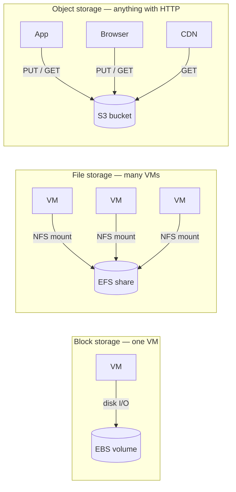

# Cloud Storage Services (Block, File, Object)

> Three storage families, three jobs — pick by access pattern, not by default.

## The hook

"Where do I store this?" is one of the first questions in any cloud architecture, and most engineers default to S3 for everything. That works until it doesn't.

Cloud storage actually splits into three families — block, file, object — each optimized for a specific access pattern. Pick the wrong one and you'll pay 10x for half the performance, or worse, ship something that won't work at all (you can't run Postgres on S3).

The good news: the rules for picking are simple once you know the families.

## The concept

Cloud providers offer three storage families that map to three access patterns.

- **Block storage** — raw disks attached to a VM. The VM's filesystem reads and writes blocks. Single-host, low-latency. AWS EBS, Azure Managed Disks, GCP Persistent Disk.
- **File storage** — networked filesystem with POSIX semantics, mounted by multiple VMs over NFS or SMB. AWS EFS, Azure Files, GCP Filestore.
- **Object storage** — HTTP API for blobs. Infinite scale, key-value access, no filesystem semantics. AWS S3, Azure Blob Storage, GCP Cloud Storage.

Two more tiers sit alongside the big three:

- **Archive storage** for cold data measured in cents per terabyte per month, with retrieval times in minutes to hours. S3 Glacier, Azure Archive, GCP Coldline / Archive.
- **Instance / ephemeral storage** — local SSD on the VM itself. Fastest possible I/O, but the data dies when the VM stops. Good for scratch space, bad for anything you need to keep.

The conceptual deep-dive on object storage lives in the System Design course's [Object Storage](../system-design/object-storage.md) page. This page is about choosing between the three families.

## Diagram



Three patterns: one VM owns a disk, many VMs share a filesystem, anything on the internet talks to a bucket.

## Example — a SaaS app picking storage for three different jobs

A typical SaaS app ends up using all three families in the same architecture. Here's what that looks like for an imaginary photo-sharing platform.

**Database files — block storage (EBS)**

The Postgres data directory sits on an EBS gp3 volume attached to the DB instance. Why block:

- Postgres needs low-latency random I/O. A single millisecond per read matters.
- Only one host writes to the disk at a time — block storage's single-attach model is fine.
- Snapshots are a one-line API call, and they're incremental.

You wouldn't put this on S3 (wrong API, no filesystem) or EFS (NFS adds latency Postgres hates).

**User uploads — object storage (S3)**

User-uploaded photos go to a bucket — call it `my-app-uploads`. The app stores a row in Postgres pointing at the S3 key:

```
photos
-------
id        | uuid
owner_id  | uuid
s3_key    | text   -- e.g. "uploads/abc123.jpg"
created   | timestamp
```

CloudFront sits in front of the bucket so users stream from an edge node, not from S3 directly. Storage is a few cents per GB per month. Bytes scale to petabytes without thinking about it.

You wouldn't put this on EBS (single-attach, capped size) or EFS (10x the cost, no built-in CDN integration).

**Shared CMS content — file storage (EFS)**

The marketing site runs on five web servers behind a load balancer, all running WordPress. The `wp-content/uploads` folder needs to be readable and writable by every server. EFS mounts on all five hosts as a normal NFS filesystem. WordPress doesn't know it's not local disk.

You wouldn't put this on S3 (would require rewriting WordPress to use the S3 API) or EBS (single-attach — only one server could see the files).

**The lesson:** each job has a natural storage type. "Use S3 for everything" looks fine until you try to host a database on it (you can't) or share a directory across VMs (it's painful and slow).

## Mechanics — storage tier comparison

The three big clouds offer the same three families under different names. Here's the cheat sheet.

| Family | AWS | Azure | GCP | Typical latency | Max scale | Pick when |
|---|---|---|---|---|---|---|
| **Block** | EBS | Managed Disks | Persistent Disk | <1 ms | ~64 TB / volume | One VM owns the disk; need low-latency I/O |
| **File** | EFS | Azure Files | Filestore | 1–10 ms | Petabytes | Multiple VMs share a POSIX filesystem |
| **Object** | S3 | Blob Storage | Cloud Storage | 10–100 ms first byte | Effectively unlimited | Blobs accessed by key, served at scale |
| **Archive** | S3 Glacier / Deep Archive | Archive tier | Coldline / Archive | Minutes to hours | Effectively unlimited | Compliance, long-term backup |
| **Ephemeral** | Instance Store | Temp Disk | Local SSD | <0.1 ms | Tied to VM | Scratch space, caches, anything disposable |

All three providers advertise eleven nines of durability on object storage — losing a file is a write-a-postmortem event, not a routine risk.

**Storage classes within object storage**

Object storage isn't one price. Each provider has tiers based on how often you read the data:

| Class (AWS naming) | Use for | Trade-off |
|---|---|---|
| S3 Standard | Hot data, served constantly | Highest storage cost, lowest retrieval cost |
| S3 Standard-IA (Infrequent Access) | Backups read once a quarter | Cheaper at rest, retrieval fee per GB |
| S3 Glacier Instant / Flexible | Compliance archives, rare retrieval | Cheap at rest, minutes-to-hours to retrieve |
| S3 Glacier Deep Archive | "Never read but legally required" | Pennies per TB, hours to retrieve |

Lifecycle policies move objects between classes automatically — uploaded today goes to Standard, after 30 days drops to IA, after 180 days drops to Glacier. This single setting cuts storage bills 80–90% on cold data.

## Related concepts

| Concept | What it is | How it relates |
|---|---|---|
| **Object Storage** (System Design) | Conceptual deep-dive on blob storage, immutability, and the database/CDN pairing | The "why" behind the object storage column on this page. Read it for the mental model. |
| **Cloud Cost Management** | The discipline of tracking and trimming cloud spend | Storage looks cheap per GB but egress and cross-region replication are the surprise lines on the bill. |
| **Database Types** | Relational, document, key-value, graph | Some databases run on block storage (Postgres, MySQL). Some are managed services that hide their storage entirely (DynamoDB, BigQuery). |
| **Cloud Networking** | VPCs, subnets, security groups | Mounting EFS or Azure Files requires VPC + security group setup so VMs can reach the filesystem. Object storage is reachable over the public API endpoint by default. |
| **Backups & Snapshots** | Point-in-time copies of disks or databases | Block storage takes incremental snapshots into object storage automatically. Object storage is the natural archive destination for everything else. |
| **CDN** | Geographic cache of static assets at edge nodes | Pairs with object storage. Bytes live in S3, get cached at the edge, never round-trip to the bucket on a hot read. |
| **Pre-signed URLs** | Time-limited URLs for direct browser uploads to a bucket | How you let users upload straight to S3 without proxying through your app servers. |
| **Encryption at rest** | All three providers encrypt by default | Free, on, no excuse to skip it. Bring-your-own-key (KMS, Key Vault) is one toggle further. |

The recurring theme: storage is one piece of a system. Pair it with networking, databases, and a CDN.

## When (and when not) to use each

The decision tree is short.

**Pick block storage when:**

- One VM owns the disk and you need low-latency I/O — databases, OS root volumes, anything filesystem-heavy on a single host.
- You want fast snapshots and easy restore.

**Pick file storage when:**

- Multiple VMs need a shared POSIX filesystem — legacy apps that expect a local directory, content sharing across a fleet, build artifacts.
- You don't want to rewrite the app to talk to an HTTP API.

**Pick object storage when:**

- You're storing blobs accessed by key — user uploads, backups, logs, ML datasets, static assets.
- You need durability, scale, and cheap-per-GB more than you need filesystem semantics.

**The anti-patterns:**

- **Don't use block for "shared storage."** A single EBS volume can't be mounted by two VMs (with rare multi-attach exceptions for clustering). Use file storage.
- **Don't use file for "I just need to dump some data."** EFS is roughly 10x more expensive than S3 per GB. If the access pattern is "write once, read by key," use object.
- **Don't use object for "I need a database."** No transactions, no queries, immutable on write. Use a database. Use object storage to hold the bytes the database points at.
- **Don't ignore egress.** Storing data is cheap. Moving it out — to users, to another region, to another cloud — is where the bill bites. Plan egress before you commit.

## Key takeaway

- **Block for one VM, file for many VMs, object for the internet** — match storage to access pattern, not to defaults.
- **S3 isn't a database.** Pair it with one. Database holds the metadata, object storage holds the bytes.
- **Lifecycle policies are free money.** Move cold data to the archive tier and watch the bill drop.
- **Egress is the surprise line.** Storage at rest is pennies; getting bytes out costs real money.
- **Pick your VM disk type with the workload in mind.** Block storage has multiple performance tiers (gp3, io2, premium SSD) — defaults are rarely optimal for databases.

---

*Quiz available in the SLAM OG app — three questions on which family fits which job, multi-attach vs. single-attach, and where the bill actually goes.*
