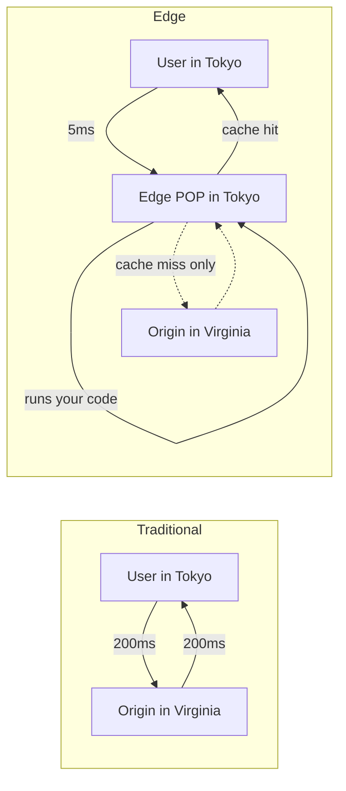

# Edge Computing

> Push the code closer to the user, not just the content.

## The hook

CDNs cache static files near users. That's a solved problem — your logo loads in 20ms because it's sitting on a server in your city.

But what about the *dynamic* stuff? Auth checks, A/B tests, header rewrites, personalization, even AI inference? Traditionally those round-trip to one origin region. A user in Tokyo hits a server in Virginia. 200ms gone before your code even starts.

Edge computing fixes that. Instead of just caching content at hundreds of locations, you push *the code itself* there. Your function runs 50ms from anyone on the planet. Same model, different payload.

Edge computing is what happens when CDN nodes get a brain.

## The concept

An edge compute platform runs your code at hundreds of distributed points-of-presence (POPs) instead of a single region. Same function, deployed everywhere, executed at whichever POP the user's request lands on.

Three things you give up to get there:

1. **Bundle size** — most platforms cap workers at 1–10 MB. No giant dependency trees.
2. **Runtime APIs** — no filesystem, no long-running processes, often no native modules.
3. **Execution time** — CPU budgets are tight (5–50ms is common). Long jobs go elsewhere.

In exchange you get:

- **Geographic latency** — code runs at the POP closest to the user
- **Effectively infinite horizontal scale** — every POP is a worker pool
- **No cold starts** (on V8-isolate platforms) — the runtime is always warm

The biggest players: **Cloudflare Workers**, **AWS Lambda@Edge** and **CloudFront Functions**, **Vercel Edge Runtime**, **Fastly Compute@Edge**, **Deno Deploy**. Each picks a different point on the trade-off curve.

## Diagram

Top path: every request crosses the ocean twice. Bottom path: the edge handles it locally and only talks to the origin when it has to.

## Example — Cloudflare Workers as a global auth layer

A common production pattern: put a Worker in front of every request to validate the user's session before anything else runs.

**The flow:**

1. Request from a user in Berlin hits Cloudflare's anycast IP
2. BGP routes it to the nearest of 300+ Cloudflare POPs (probably Frankfurt — ~10ms)
3. The Worker runs: parses the JWT, verifies the signature against a public key cached in Workers KV, checks expiry
4. If valid, either:
   - Serves cached content directly from edge KV/R2, or
   - Proxies the request to your origin with the user ID added as a header
5. If invalid, returns 401 immediately — no origin hit at all

**The numbers:**

- JWT validation at the edge: ~3–5ms
- Same check from a regional origin in us-east-1 (for a Berlin user): ~150–200ms
- Cloudflare's network: ~50M requests/sec aggregate

That's not a marketing number — it's "every unauthenticated request is rejected before it ever touches your infrastructure." Bots and credential-stuffing attacks die at the edge for $0.50 per million requests.

**Other production examples:**

- **Discord** uses Cloudflare Workers for parts of their edge routing — billions of requests through Workers daily
- **Shopify** uses Fastly Compute@Edge to personalize storefronts (currency, language, A/B variants) without round-tripping to Shopify's core
- **Vercel** runs Next.js middleware on Cloudflare under the hood — auth and redirects happen at the edge before your React app even loads

The pattern is always the same: cheap work that benefits from being close to the user, run before the expensive origin call.

## Mechanics — edge platforms compared

| Platform | Runtime | Cold start | Sweet spot | Watch out for |
|---|---|---|---|---|
| **Cloudflare Workers** | V8 isolates | ~0ms | Auth, routing, A/B, KV/R2/D1 storage, AI inference (Workers AI) | 50ms CPU limit per request, no native Node APIs |
| **AWS Lambda@Edge** | Full Lambda (Node.js, Python) | 100–500ms | Heavy logic that still needs to live near users | Slower cold starts, fewer POPs than Cloudflare |
| **CloudFront Functions** | JS-only, lightweight | ~1ms | Header rewrites, URL normalization, simple redirects | No network calls, no `fetch`, very limited APIs |
| **Vercel Edge Runtime** | V8 isolates (Cloudflare under the hood) | ~0ms | Next.js middleware, edge API routes | Locked to Vercel's deploy model |
| **Fastly Compute@Edge** | WebAssembly | ~50µs | Rust/Go/AssemblyScript, language flexibility, high throughput | Steeper learning curve, smaller ecosystem |
| **Deno Deploy** | V8 isolates with Deno APIs | ~0ms | TypeScript-first apps, web standards APIs | Newer ecosystem, fewer regions than Cloudflare |

How to pick:

- Default for new projects: **Cloudflare Workers**. Biggest network, no cold starts, full storage stack (KV, R2, D1, Queues, Durable Objects).
- Already on AWS and need full Node compat: **Lambda@Edge**.
- Just need to rewrite headers or paths: **CloudFront Functions** — cheapest by far.
- Need Rust or Go at the edge: **Fastly Compute@Edge**.
- Building Next.js: **Vercel Edge** — least friction.

## Related concepts

| Concept | What it is | How it relates |
|---|---|---|
| **Serverless** | Functions-as-a-service in regional data centers | Edge compute is serverless at the geo level — same FaaS model, distributed globally |
| **CDN** | Geographic cache of static assets | The compose: CDN handles the cache hit, edge function handles the miss |
| **Latency numbers** | The cross-continent reality (~150ms+) | Why edge wins in the first place — physics doesn't care about your stack |
| **Cloud AI services** | Hosted ML inference (Bedrock, Vertex AI) | Edge inference is the next frontier — Cloudflare Workers AI, small models running at the POP |
| **DNS routing** | Anycast and latency-based DNS | How requests find the nearest edge POP — the routing layer underneath every edge platform |
| **API Gateway** | Centralized entry for backend APIs | Edge functions often replace or augment API gateways for cross-cutting concerns (auth, rate limiting) |
| **WebAssembly** | Portable, sandboxed bytecode | Powers Fastly Compute and increasingly the rest — language flexibility without container overhead |

Edge compute is the layer where serverless, CDN, and DNS routing all meet — that's why it shows up everywhere in modern architecture.

## When (and when not) to use edge

**Use edge compute when:**

- **Auth, headers, redirects** — cheap per-request work that should never round-trip
- **A/B testing and personalization** — pick the variant at the POP, not the origin
- **Cache-miss handling** — generate the missing piece at the edge, cache it, serve it
- **Global users, light per-request logic** — the latency win is biggest when users are spread out
- **Bot defense and rate limiting** — reject bad traffic before it hits your origin
- **Light AI inference** — small models on Workers AI / Vercel AI for recommendations, embeddings, classification

**Skip the edge when:**

- **Heavy compute or long execution** — exceeds CPU/timeout limits. Use a regional Lambda or container.
- **Tight database coupling** — if every request reads/writes a primary DB in one region, the edge POP is now 200ms from your data. Latency win gone.
- **Niche language requirements** — most edge platforms support a narrow set (JS/TS, Rust, Go via WASM). If you need Python ML libs, run regional.
- **Stateful long-lived connections** — though Cloudflare Durable Objects and Deno Deploy are starting to fix this

The tell: if your function takes a request, does some quick logic, and either responds or proxies — edge wins. If it does a lot of work or talks to a faraway database, run it regional.

## Key takeaway

- **Edge compute = code near user. CDN = content near user. Both compose.**
- **Default to Cloudflare Workers** for new edge work — biggest network, no cold starts, real storage.
- **Watch the data layer.** An edge function that round-trips to a single-region DB has thrown away the latency win.
- **V8 isolates beat containers** at the edge. That's why Workers feel instant and Lambda@Edge doesn't.
- **The real pattern is layered:** cache at the CDN, transform at the edge, compute regionally, store globally.

---

*Quiz available in the SLAM OG app — three questions on CDN vs edge compute, why Workers cold-start faster than Lambda@Edge, and when not to push work to the edge.*
