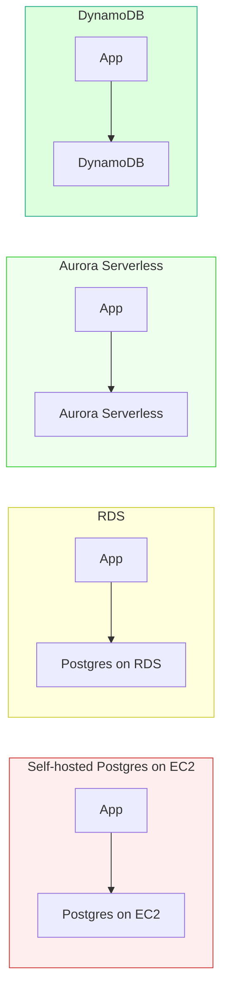

# Managed Database Services

> Let the cloud run your database. Here's when that's worth it.

## The hook

Running Postgres yourself on a VM means owning the whole stack: patching the OS, patching the DB, taking backups, testing restores, configuring replication, building failover, wiring up monitoring, paging someone at 3 a.m. when disk fills up.

That's not a side quest. That's a full-time job for someone — usually a person you don't have.

Managed services (RDS, Aurora, Cloud SQL, DynamoDB, Cosmos DB) hand all of that to the provider in exchange for a markup. The interesting question isn't *"should I use managed?"* — it's *"is the markup smaller than my engineering time plus the cost of getting reliability wrong?"*

For most teams, most of the time, yes.

## The concept

A managed database service runs the database engine for you. The provider handles:

- **Provisioning** — spin up an instance with one API call
- **Patching** — minor versions get applied during a maintenance window
- **Backups** — point-in-time recovery, usually with retention you set
- **Replication** — read replicas and multi-AZ standbys with a checkbox
- **Failover** — automatic promotion when the primary dies
- **Monitoring** — CPU, IOPS, slow queries, replication lag, all in the console

You're left with the parts only you can do: schema design, query tuning, choosing the right engine, and writing application code.

Managed databases come in two flavors:

**Managed traditional DBs** — the same Postgres / MySQL / Redis / SQL Server you'd run yourself, just on someone else's infrastructure. Examples: AWS RDS, Aurora, Google Cloud SQL, Azure Database for PostgreSQL, ElastiCache. Portability is decent — the engine is open-source or standard, so a migration to another cloud or back to self-hosted is mostly an export/import.

**Cloud-native DBs** — purpose-built engines, often serverless, that only run on one provider. Examples: DynamoDB (AWS), Cosmos DB (Azure), Spanner / BigQuery / Firestore (GCP). They typically have better elasticity (scale to zero, or to massive throughput, automatically) but more vendor lock-in. Migrating off DynamoDB to anything else is a rewrite.

The taxonomy of database *families* (relational, key-value, document, column-family, graph, time-series, search) is covered on the [database-types](../system-design/database-types.md) page. This page is about the cloud-services layer on top of those families: which one to pick, on which cloud, when to pay for managed.

## Diagram

What you own shrinks at every step:

| Layer | EC2 Postgres | RDS | Aurora Serverless | DynamoDB |
|---|---|---|---|---|
| OS patches | You | Provider | Provider | Provider |
| DB patches | You | Provider (windowed) | Provider | Provider |
| Backups & PITR | You | Provider | Provider | Provider |
| Replication / failover | You | Provider | Provider | Provider |
| Capacity sizing | You | You | Auto | Auto |
| Schema & queries | You | You | You | You |

By the time you're on DynamoDB, you're basically just writing application code against an API. That's the spectrum.

## Example — a typical SaaS company's DB stack

Imagine a 30-person B2B SaaS on AWS. Their database choices, by use case:

**Primary OLTP — Aurora Postgres (managed)**

The customer-facing app: users, orgs, projects, invoices, audit logs. Relational, transactional, ACID-required.

They pick **Aurora Postgres** over self-hosted Postgres on EC2. The Aurora instance runs about $200/month; an equivalent EC2 box would be $80/month. The $120 markup buys: automated multi-AZ failover (under a minute), continuous backups to S3, storage that auto-grows up to 128 TB, and replicas that lag by milliseconds. Self-hosting that combo properly takes a real DBA, and DBAs cost much more than $120/month.

**Hot key-value lookups — DynamoDB**

Session store, rate-limit counters, per-user feature flags. Pure `get(key) → value` traffic, hundreds of millions of operations per month, p99 latency under 10ms.

**DynamoDB** with on-demand billing. Autoscales without ops work, single-digit-ms reads at any volume, no instance to size. The alternative — running Cassandra or Redis Cluster yourself — would consume an engineer for the rest of time. The lock-in is real, but the use case (cache-shaped workload) is exactly DynamoDB's home turf.

**Analytics — BigQuery (or Snowflake)**

Product analytics, billing reports, ad-hoc data science. Hundreds of GB to a few TB.

They lift the data into **BigQuery** nightly via a Fivetran-style pipe. Analysts run SQL against petabyte-capable infrastructure without sizing a cluster. Pay per query scanned. A self-hosted Spark or Presto cluster for this would be a quarter-time job and cost more in EC2 than BigQuery costs in queries.

**Cache — ElastiCache Redis**

Session cache, hot product lookups, queue for background jobs.

Same Redis they'd run themselves, but with replication, automatic failover, and patch management handled. Markup is tolerable; the alternative is babysitting a Redis cluster, and nobody wants that.

The pattern: pick the right *family* per use case (that's the [database-types](../system-design/database-types.md) job), then default to the **managed** offering for that family unless you have a specific reason not to. "Specific reason" is a short list — covered in the last section.

## Mechanics — managed DB picks across the big 3

| Family | AWS | Azure | GCP | When it shines | Lock-in |
|---|---|---|---|---|---|
| **Relational (OLTP)** | RDS (Postgres/MySQL/MariaDB/SQL Server/Oracle), Aurora | Azure SQL Database, Azure Database for PostgreSQL/MySQL | Cloud SQL (Postgres/MySQL/SQL Server), Spanner | Standard transactional workloads. Aurora and Spanner extend with cloud-scale storage / global consistency. | RDS/Cloud SQL: low. Aurora: medium. Spanner: high. |
| **Key-value / wide-column** | DynamoDB | Cosmos DB (Table / Cassandra API) | Firestore, Bigtable | Massive scale, predictable access patterns, serverless billing. | High — these APIs don't exist anywhere else. |
| **Cache (in-memory)** | ElastiCache (Redis / Memcached), MemoryDB | Azure Cache for Redis | Memorystore (Redis / Memcached) | Drop-in for self-hosted Redis with HA and patching handled. | Low — it's just Redis. |
| **Search** | OpenSearch Service | Azure AI Search | No first-party — use Elastic Cloud on GCP | Full-text, log analytics, faceted search. | Low to medium — Lucene-based engines are mostly portable. |
| **Time-series** | Timestream | Azure Data Explorer | No first-party — TimescaleDB on Cloud SQL or InfluxDB Cloud | IoT, observability, anything indexed by time. | Medium — APIs differ across providers. |
| **Analytics / Warehouse** | Redshift | Synapse Analytics | BigQuery | Petabyte-scale SQL analytics; separate from your OLTP DB. | High — SQL portable, performance characteristics and pricing models are not. |
| **Graph** | Neptune | Cosmos DB (Gremlin API) | No first-party | Relationship-first queries — fraud, recommendations, social. | Medium to high. |

A few patterns to notice:

- **Open-source engines have low lock-in.** Postgres on RDS, Cloud SQL, and Azure all speak the same SQL. You can leave.
- **Cloud-native DBs have high lock-in but better elasticity.** DynamoDB, Spanner, BigQuery scale and price in ways the open-source equivalents can't match.
- **Some families have a clear leader.** BigQuery is the warehouse standard. DynamoDB is the cloud-native KV standard. Spanner is unique for global-strong-consistency relational.
- **GCP has gaps.** No first-party search, no first-party time-series. You bring Elastic / InfluxDB / TimescaleDB.

## Related concepts

| Concept | What it is | Why it matters here |
|---|---|---|
| **[Database types](../system-design/database-types.md)** | The conceptual taxonomy of DB families | Pick the family first; *then* pick the managed service in that family |
| **[SQL fundamentals](../system-design/sql-fundamentals.md)** | The query language and relational model | Most managed DBs you'll touch are still SQL — Aurora, Cloud SQL, Azure SQL all run it |
| **[Cloud storage services](cloud-storage-services.md)** | Object, block, and file storage on the big clouds | Managed DBs sit on top of cloud storage; backups land in object storage |
| **Database sharding** | Splitting data across machines by partition key | Cloud-native DBs (DynamoDB, Spanner, BigQuery) handle sharding for you — that's a big chunk of what you're paying for |
| **[Cloud cost management](cloud-cost-management.md)** | Tracking and controlling cloud spend | Databases are usually the biggest line item on a cloud bill — managed markup makes this even more true |
| **ACID / CAP / BASE** | Consistency models for transactions and distributed systems | Managed services pick a model for you. RDS Postgres = ACID. DynamoDB = eventual by default, strong on request. Spanner = global strong. Know what you're getting. |
| **Polyglot persistence** | Using multiple DB types in one system on purpose | Real systems mix Aurora + DynamoDB + ElastiCache + BigQuery. Managed services make this practical for small teams. |

## When (and when not) to use managed

**Use a managed DB when:**

- **You're a small or medium team without a dedicated DBA.** This is most teams. The markup is cheaper than the headcount.
- **Time-to-market matters more than $/GB.** You'd rather ship features than tune `postgresql.conf`.
- **You want cloud-native superpowers** — autoscaling, multi-region replication, serverless billing, point-in-time recovery — without building them.
- **Reliability matters and you don't want to be the on-call.** Failover, backups, patching are exactly the things small teams forget until they bite.
- **You're already on a cloud and the DB lives next to your app.** Network latency and IAM integration are tighter with the cloud's own services.

**Skip managed (or push back) when:**

- **Extreme scale where the markup is real money.** At Netflix / Discord / Stripe scale, "managed Postgres" can cost millions in markup that funds a real DB team self-hosting on raw infrastructure.
- **You need niche tuning the provider doesn't expose.** Some kernel parameters, custom extensions, or replication topologies aren't possible on RDS / Cloud SQL.
- **Regulatory or sovereignty requirements** that block a specific provider, or require data to stay on hardware you control.
- **You're running an open-source DB the provider doesn't manage well.** Some specialized engines (newer vector DBs, certain graph DBs) only have weak managed offerings — self-hosting on Kubernetes can beat a half-baked managed product.

For most teams, the default answer is **yes, use managed**. Self-hosting Postgres is not character-building. Pay the markup, focus on your product.

## Key takeaway

- **Managed services trade money for time** — and at most company sizes that's the right trade.
- **Two flavors:** managed traditional (RDS, Cloud SQL, ElastiCache — low lock-in) and cloud-native (DynamoDB, Spanner, BigQuery — high lock-in, high elasticity).
- **Pick the family first** ([database-types](../system-design/database-types.md)), then pick the managed offering in that family.
- **Lock-in is real but priced in.** DynamoDB and BigQuery are great enough that the lock-in is often a fair trade.
- **You usually outgrow your team before you outgrow managed.** The "we need to self-host for cost" moment arrives much later than engineers think.

---

*Quiz available in the SLAM OG app — three questions on when the markup is worth it, when it stops being worth it, and the lock-in trade-off between managed-traditional and cloud-native DBs.*
