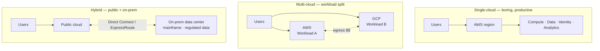

# Multi-cloud & Hybrid Cloud Strategies

> Multi-cloud is what you say in board meetings. Single-cloud is what you ship in production. Know the difference.

## The hook

Vendors love multi-cloud. CIOs love multi-cloud. Engineers — when they're being honest — usually don't.

The pitch sounds great: avoid lock-in, increase resilience, get the best of every platform. The reality on the ground is usually double the operational burden, half the leverage on either provider, and an integration tax landing on every team that has to ship across the line.

Hybrid cloud — public cloud plus on-prem — has narrower legitimate use cases, but the real ones are real. The trick is knowing which bucket your situation actually falls in. This page is the framework for telling when multi-cloud or hybrid is the right call versus when it's the expensive option dressed up as strategy.

## The concept

Three patterns get conflated in the same conversation. They have different drivers, different costs, and different right answers.

**Multi-cloud** — running on two or more public clouds (AWS + Azure, AWS + GCP, etc.). Sometimes the same workload is replicated across both. More often, different workloads live on different clouds.

**Hybrid cloud** — combining public cloud with your own on-prem data centers or colo. Connected via a dedicated link (AWS Direct Connect, Azure ExpressRoute, GCP Interconnect) so the two halves can talk like one network.

**Cloud-agnostic** — designing your applications so they *could* run on any cloud, even if today they only run on one. This is an architecture posture, not a deployment choice. Usually achieved through Kubernetes plus discipline about which managed services you use.

The first job in any "we should go multi-cloud" conversation is figuring out which of these three the stakeholder actually wants. They're not the same thing, and the costs aren't comparable.

## Diagram

In single-cloud the integration cost is near zero — everything talks over the provider's backbone. In multi-cloud, the integration cost lives on the dotted line between providers (egress fees, identity translation, latency, two security models). In hybrid, the cost lives on the connection plus the on-prem ops team you still have to staff.

## Example — three reasons companies actually go multi-cloud

Here are the three drivers that hold up under scrutiny, plus the one that usually doesn't.

**1. Regulatory and data locality — necessary, not chosen**

A European fintech serving EU and US customers can end up multi-cloud whether they want it or not. EU user data may need to live on a sovereign cloud (OVHcloud, Outscale) under European jurisdiction, while US data sits on AWS for proximity and feature parity. This isn't a strategy choice. It's a compliance fact. The cost of a second cloud is just the cost of doing business in that market.

**2. Vendor leverage at extreme scale**

Spotify ran Google Cloud and AWS in parallel for years, partly because keeping a credible alternative kept negotiating leverage real. When your annual cloud spend has eight zeros on it, a 5% discount funds an entire team. Below roughly $50M/year of committed spend, this math collapses — you're not big enough for either provider to fight for, and the operational overhead of running two clouds eats whatever discount you do extract.

**3. Acquisitions — multi-cloud by inheritance**

Company A is on AWS. Company A buys Company B. Company B was on Azure. Now Company A is multi-cloud, congratulations. The honest plan here is usually a migration timeline — pick a cloud, sunset the other over 18 to 36 months — but during that window you're operating both, hiring expertise on both, and writing integration glue between them.

**The cautionary case — "best of breed"**

Here's the one that almost never holds up: "We'll use AWS for compute because it has the most options, GCP for data and analytics because BigQuery is great, and Azure for identity because we're a Microsoft shop."

What actually happens:

- **Egress fees** between clouds for every join or copy
- **Three sets of expertise** to hire for and keep current
- **Three security models** to learn, audit, and harden
- **Three identity systems** that don't natively trust each other
- **No volume discounts** on any of them because spend is split three ways
- **Slower team velocity** because every cross-cloud feature is a small distributed-systems problem

The "best of breed" cloud usually turns out to be whichever one your team actually knows.

## Mechanics — the multi-cloud reality table

| Dimension | What companies say | What actually shows up |
|---|---|---|
| **Drivers** | Avoid lock-in, resilience, best of breed | Regulatory, acquisition, extreme-scale leverage |
| **Operational cost** | "We'll abstract it away" | 2-3x expertise · 2-3x runbooks · 2-3x on-call |
| **Network cost** | "Negligible" | Cross-cloud egress is the silent line item |
| **Security cost** | "We'll standardize" | Three IAM models · three audit logs · three answers to every compliance question |
| **Vendor leverage** | "More negotiating power" | Diluted spend = no volume tier on any cloud |
| **Velocity** | "Teams pick the best tool" | Every cross-cloud integration is a small project |

**Tools that take the edge off — none of them eliminate the cost:**

- **Terraform / Pulumi** — IaC across clouds. Provisioning syntax travels; the underlying resources still don't.
- **Kubernetes** — the most realistic workload-portability story. Compute moves; data and identity don't.
- **Service mesh (Istio, Linkerd)** — cross-cloud service-to-service networking and policy.
- **Centralized observability (Datadog, New Relic, Grafana Cloud)** — one pane of glass over many clouds. Costs money. Worth it.
- **Identity federation (Okta, Azure AD as the SSO layer)** — one identity provider feeding all three clouds.

**Honest take:** most "multi-cloud strategies" in production are really "we run primarily on one cloud and we use one or two managed services from another." That's fine. That's not a strategy — that's just sensible procurement. The strategy lie starts when leadership pretends the architecture is portable when it isn't.

Hybrid is a different conversation. Hybrid usually exists because something on-prem genuinely can't move: a mainframe with 30 years of COBOL, a regulated dataset that legal won't let leave the building, a piece of factory hardware that needs sub-millisecond latency to a controller. Those are real constraints. The cloud half handles everything that *can* move; the on-prem half stays where it is. Direct Connect or ExpressRoute glues them together.

## Related concepts

| Concept | What it is | How it relates |
|---|---|---|
| **Cloud cost management** | Tracking and optimizing cloud spend | Multi-cloud almost always raises total cost. Egress fees, lost volume discounts, duplicated tooling. Budget for it. |
| **Cloud migration** | Moving workloads between environments | Multi-cloud often starts as a half-finished migration. Acquisitions are the classic case. |
| **Shared responsibility** | Who's accountable for what across the provider line | Three clouds = three lines to learn. Each one is drawn slightly differently. |
| **Cloud IAM** | Identity and access management in the cloud | Three IAM systems means three definitions of "who can do what." Federation through one IdP (Okta, Azure AD) is the saving grace. |
| **Kubernetes** | Container orchestration | The realistic workload-portability story. K8s on EKS, AKS, and GKE is *similar* — not identical. |
| **Cloud-native** | Apps designed for cloud-managed services | Cloud-native and cloud-agnostic pull in opposite directions. Native means productive on one cloud; agnostic means portable across many. Pick one. |
| **Service mesh** | Sidecar-based service networking | Closest thing to a working multi-cloud control plane for east-west traffic. |
| **CDN** | Edge content distribution | One layer that's genuinely multi-cloud by default — and rarely controversial. |

## When (and when not) to go multi-cloud or hybrid

**Go multi-cloud when:**

- **A regulator says you have to.** Data sovereignty, residency, or sector-specific rules (FedRAMP, BaFin, Gaia-X). The driver is external and binding.
- **You inherited it.** Post-acquisition, you're multi-cloud whether you planned to be or not. Treat it as a migration project with a deadline.
- **You're at extreme scale with real leverage.** $50M+/year of committed spend, with the org maturity to actually use a credible alternative as a negotiating lever.
- **A specific managed service is genuinely irreplaceable.** BigQuery for analytics on top of an AWS-primary stack is a defensible pattern. One service from a second cloud is not the same thing as a multi-cloud strategy.

**Go hybrid when:**

- **On-prem is genuinely bound there.** Mainframes. Sensitive data legal won't let leave. Hardware with latency requirements public cloud can't meet. Regulatory air-gaps.
- **You're mid-migration with a long tail.** Some workloads will move to cloud; some never will. Hybrid is the steady state, not a transition.

**Skip multi-cloud when:**

- The driver is **"best of breed"** with no real external forcing function
- The team is small and **the integration cost will dwarf the benefit**
- It's **lock-in anxiety** without a concrete migration scenario
- It's **a slide in a board deck** that nobody actually has to operate

The default for a small or mid-sized engineering org: pick one cloud, learn it deeply, use the managed services, ship the product. Revisit in three years.

## Key takeaway

- **Multi-cloud is rarely a strategy — it's usually a circumstance.** Regulation, acquisition, or extreme-scale leverage are the only durable reasons.
- **Pick one cloud and commit unless you have a real reason not to.** "Best of breed" usually isn't one.
- **Hybrid is for what genuinely can't move.** Mainframes, regulated data, latency-bound hardware. The cloud half does the rest.
- **Kubernetes is the realistic portability story.** Terraform handles syntax; data and identity still don't travel.
- **Cross-cloud egress is the silent line item.** Always model it before the architecture review, not after.
- **Three clouds means three of everything.** Three IAM models, three security postures, three on-call rotations, three discount tiers diluted to none.

---

*Quiz available in the SLAM OG app — three questions on the "best of breed" anti-pattern, legitimate multi-cloud drivers, and the realistic portability story.*
