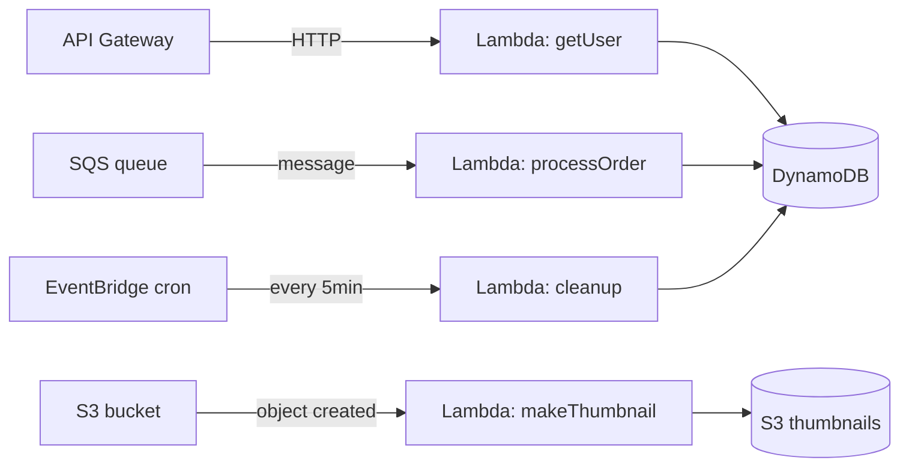

# Serverless & FaaS

> Stop running servers. Bring code, leave operations.

## The hook

You write a function. You upload it. You never log into a server again.

When a request comes in, the platform runs your code. When no requests come in, it runs nothing — and charges you nothing. Auto-scaling, patching, OS updates, capacity planning: all the provider's problem.

That's the pitch behind AWS Lambda, Google Cloud Functions, Azure Functions, and Cloudflare Workers. Serverless flipped the operating model — you pay per millisecond of execution instead of per hour of idle VM. The catch: cold starts, vendor lock-in, and a hard ceiling on how long any single invocation can run.

## The concept

**Function-as-a-Service (FaaS)** is the purest form of serverless. You write a single function with a defined input and output, deploy it, and the provider runs it on demand.

Three things matter:

1. **Trigger** — what causes the function to run (HTTP request, queue message, file upload, cron schedule)
2. **Code** — your function, usually <100 lines, stateless, single-purpose
3. **Output** — return value, side effect (DB write, message published), or both

The runtime, the OS, the scaling decisions, the patching, the monitoring agents — none of that is yours. Auto-scales from 0 to 10,000+ concurrent instances. Bills in 1ms increments. When traffic dies, instances die with it.

The mental shift: you're not running a server that handles requests. You're handing the platform a piece of logic and a list of triggers, and saying *run this when those happen*.

## Diagram

Same function shape every time. The trigger source is what changes — HTTP, object event, queue message, schedule. The platform handles the plumbing.

## Example — a real serverless web app

A modern startup builds their backend without provisioning a single server.

**The stack:**

- **CloudFront CDN** — caches static assets globally
- **S3** — hosts the React frontend (HTML, JS, CSS)
- **API Gateway** — routes `/api/*` requests to Lambda functions
- **Lambda** — one function per endpoint: `getUser`, `createOrder`, `listProducts`
- **DynamoDB** — serverless NoSQL for app data
- **Cognito** — managed auth (also serverless)

**What the bill looks like at 1M requests/month:**

| Service | Free tier | Cost beyond free tier |
|---|---|---|
| Lambda | 1M requests + 400K GB-sec | ~$0 (covered) |
| API Gateway | 1M REST calls | ~$3.50 |
| DynamoDB | 25 GB + on-demand reads/writes | ~$1–5 |
| S3 + CloudFront | 5 GB + 50 GB egress | ~$1 |

You're paying **single-digit dollars per month** for an app that can absorb a 100x traffic spike without you touching anything.

**The trade-offs that bite:**

- **Cold start latency** — first invocation after idle takes 100–1000ms while the runtime boots. Bad for user-facing APIs that get sparse traffic.
- **15-minute hard timeout** — Lambda kills any invocation past 15 minutes. Long jobs need Fargate, Batch, or Step Functions.
- **Vendor lock-in** — your handler signature, the SDK quirks, the IAM model — all AWS-specific. Porting to GCP isn't a recompile, it's a rewrite.
- **Cost inversion at scale** — at 100M+ steady requests/month, an always-on container fleet beats Lambda on raw compute price.

**Who actually runs this way:** most modern startups for backend APIs (the "serverless-first" cohort), IFTTT for cross-service integrations, A Cloud Guru for their entire learning platform. Cloudflare powers serverless at the edge for millions of sites — including this kind of architecture moved closer to the user.

## Mechanics — picking a serverless platform

The big four, plus the frontend-friendly wrappers.

| Platform | Cold start | Max execution | Languages | Pick when |
|---|---|---|---|---|
| **AWS Lambda** | 100–1000ms (10s+ for Java/.NET) | 15 min | Node, Python, Java, Go, Ruby, .NET, custom runtimes | You're already on AWS, want the biggest ecosystem |
| **Google Cloud Functions** | 100–500ms | 60 min (gen2) | Node, Python, Go, Java, .NET, Ruby, PHP | You're on GCP, integrating with BigQuery/Pub/Sub |
| **Azure Functions** | 200–2000ms | 10 min (consumption) / unlimited (premium) | C#, JS, Python, Java, PowerShell | Enterprise .NET shops, deep AD integration |
| **Cloudflare Workers** | <5ms | 50ms CPU (paid: 30s) | JS/TS, Rust/WASM | Edge latency matters, request → response is fast |
| **Vercel / Netlify Functions** | 100–500ms | 10–60s | Node, Python, Go (mostly Lambda underneath) | Frontend-first, Next.js/Nuxt apps |

**Lambda** is the default if you're not sure. Most mature, biggest community, most triggers, most language support. The downside: cold starts hurt for user-facing APIs in less popular runtimes.

**Cloudflare Workers** is the outlier. Workers run on V8 isolates — same engine that runs Chrome — instead of containers. One V8 process, many isolated JS contexts. No container boot, no language VM init. Result: cold starts measured in milliseconds, not seconds. Trade-off: tighter CPU limits and a smaller runtime API (no full Node.js, no native binaries).

### The cold start problem

A cold start happens when the platform has no warm instance ready. It has to:

1. Pull your container image
2. Start the language runtime (JVM, .NET CLR, Python interpreter)
3. Load your dependencies
4. Run your initialization code
5. Then finally invoke your handler

That's where the 100ms–10s tail comes from. Three workarounds:

- **Provisioned concurrency** (Lambda) / **Minimum instances** (Cloud Functions) — pay to keep N instances warm. Defeats the "pay only when running" pitch, but kills cold starts.
- **SnapStart** (Lambda for Java) — snapshot a pre-initialized JVM and restore it instead of booting from scratch. Cuts Java cold starts ~10x.
- **Pick a faster runtime** — Node and Python cold-start in ~100ms; Java and .NET can hit seconds. Switch language for the latency-critical paths.

If your function is on a hot path with strict latency, FaaS may be the wrong tool. Reach for Workers (edge isolates), Fargate (always-on container), or just a regular service.

## Related concepts

| Concept | What it is | How it relates |
|---|---|---|
| **Edge computing** | Running code at CDN POPs near users | Workers and Lambda@Edge are FaaS at the edge — covered next page |
| **Cloud AI services** | Managed AI APIs (Bedrock, Vertex, OpenAI) | Lambda is the glue — function triggers an AI call, formats the response, stores the result |
| **Cloud cost management** | Tracking and controlling cloud spend | Serverless can be cheaper at low/spiky scale and *more* expensive at steady high scale — the cost model isn't intuitive |
| **Event sourcing** | Storing state as a log of immutable events | Serverless is the natural compute layer for event-driven systems — events trigger functions, functions emit events |
| **Microservices** | Decomposing apps into small services | FaaS pushes microservices to the limit: every function *is* a microservice. Cross-link to System Design's microservices page. |
| **API Gateway** | The front door for HTTP/REST APIs | The most common Lambda trigger — routes URLs to functions, handles auth, rate limiting, throttling |
| **Step Functions / Workflows** | Orchestration for multi-step serverless jobs | What you reach for when one function isn't enough and you need state machines, retries, and >15min execution |
| **Queues (SQS, Pub/Sub)** | Async messaging between services | The decoupling layer — queue absorbs bursts, Lambda drains it at its own pace |

## When (and when not) to use serverless

**Use serverless when:**

- **Spiky or unpredictable traffic** — auto-scale-to-zero means you don't pay for idle capacity at 3am
- **Event-driven workloads** — file uploads, queue messages, cron jobs, webhooks. The trigger model is the whole point.
- **Glue code between services** — "when X happens, call Y, write to Z" — write 30 lines instead of provisioning a service
- **Prototyping speed matters** — get a functioning backend in an afternoon without thinking about infra
- **Background jobs** — image processing, log aggregation, async ETL

**Skip serverless when:**

- **Steady high traffic** — at 100M+ requests/month with stable load, an always-on Fargate or EKS fleet is cheaper. Lambda's per-invocation pricing stops being a deal.
- **Long-running compute** — anything past 15 minutes (Lambda) or 60 minutes (Cloud Functions). Use Batch, Fargate, or VMs.
- **Tight latency requirements** — cold starts can hit 1s+. If your SLO is p99 < 200ms and traffic is bursty, you'll either pay for provisioned concurrency or pick a different platform.
- **Heavy local state or large in-memory caches** — functions are stateless and short-lived. Loading a 2GB model on every cold start is a non-starter. Use a long-running service.
- **Strict portability requirements** — every FaaS platform has its own handler shape, trigger model, and SDK. Multi-cloud abstraction is hard.

The honest take: **serverless isn't free, isn't latency-free, isn't lock-in-free.** It's the right tool for spiky, event-driven, glue work — and the wrong tool for everything else.

## Key takeaway

- **Serverless wins on spiky workloads + dev speed.** It loses on steady high traffic + tight latency.
- **Cold starts are the price of scale-to-zero.** Provisioned concurrency, SnapStart, or Workers if you can't tolerate them.
- **15-minute timeout is a hard ceiling.** Long jobs go to Batch, Fargate, or Step Functions.
- **Lock-in is real.** Handler signatures, IAM, triggers — all platform-specific. Pick the cloud you're already on.
- **The cost crossover bites.** Cheap at low scale and burst. Watch the bill once traffic goes steady and high.

---

*Quiz available in the SLAM OG app — three questions on cold starts, Lambda's hard limits, and why Workers are different.*
