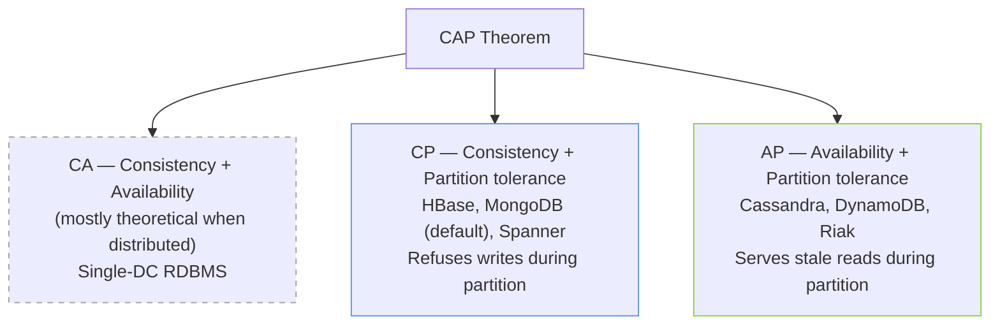

# ACID, CAP, and BASE

> Three acronyms decide what your database can actually promise.

## The hook

On a single machine, your database hides the hard problems. Postgres on one box gives you transactions, rollbacks, and a clean mental model. You write `BEGIN`, you write `COMMIT`, you sleep fine.

Then your app grows. One node becomes three, three becomes thirty, and the network between them starts dropping packets. Suddenly the database can't promise everything anymore. It has to choose.

ACID is the gold standard a single DB hands you. CAP is the impossibility theorem that says you can't keep all of it across machines. BASE is what most cloud systems settle for so they can stay up at scale.

Three acronyms doing the work of a whole semester of CS.

## The concept

Three frameworks, three different questions about your data.

**ACID — what one database promises about a transaction.**

Atomicity, Consistency, Isolation, Durability. It's the classic relational guarantee. A transaction either commits fully or rolls back fully. Concurrent writers don't trample each other. Once committed, your data survives a crash. This is what Postgres, MySQL, and SQL Server give you on a single node.

**CAP — what a distributed system can't all promise at once.**

Brewer's theorem. Three properties: Consistency (every read sees the latest write), Availability (every request gets an answer), Partition tolerance (the system keeps working when the network splits). The honest reading: in a real distributed system, partitions *will* happen. P is non-negotiable. The actual choice is between C and A *during a partition*. The "pick 2 of 3" framing you'll see online is the misquote that won't die.

**BASE — the pragmatic alternative for systems that prioritize uptime.**

Basically Available, Soft state, Eventual consistency. Built for NoSQL and cloud-scale systems where being up everywhere matters more than every read being perfectly fresh. Writes propagate. Reads might be stale for a moment. The system converges. You trade strict correctness for the ability to keep serving traffic when nodes fail.

The progression maps to scale: ACID works on one box. CAP shows up when you spread across boxes. BASE is the philosophy you adopt when staying up is the priority.

## Diagram

The CA corner is mostly a thought experiment in distributed contexts. If you can't tolerate partitions, you don't have a distributed system — you have a single node with extra steps. Real choices live on the CP/AP edge.

## Example — two systems, two choices

The acronyms are abstract. Look at two real systems making the call in opposite directions.

**Stripe's payment ledger — CP**

Stripe handles billions of dollars of transactions. The ledger has one job: never be wrong. If a network partition splits their database cluster, the system *refuses writes* on the side that can't confirm consistency. A merchant might see "try again in a moment." That's the cost.

What it buys: no double charges, no phantom balances, no reconciliation nightmares. A brief outage is recoverable in minutes. An inconsistent ledger is recoverable in months of forensic accounting and customer complaints. Money is the canonical CP use case.

**Twitter timelines and DynamoDB-backed services — AP**

When you tweet, the write hits one region first and replicates outward. If a partition happens between regions, the system keeps serving reads — they just might be slightly behind. You might refresh and not see your friend's reply for a few seconds. Annoying, not catastrophic.

What it buys: the timeline never goes down. Twitter at peak Super Bowl traffic, Black Friday on Amazon's product catalog, a viral moment on Instagram — these systems stay up because they tolerate stale reads instead of demanding perfect consistency. A "service unavailable" page during a viral moment is worse than a 3-second-old like count.

**The pattern:**

The choice isn't a personal preference or an engineering taste. It's downstream of *what your data is*.

| Data type | Right default |
|---|---|
| Money, inventory, identity, votes | **CP** — wrong is worse than down |
| Feeds, catalogs, recommendations, view counts | **AP** — down is worse than slightly stale |

If you can't decide which one your data is, ask: "What does it cost me when a user sees the wrong answer for 30 seconds?" If the answer is "we get sued" — CP. If the answer is "they refresh" — AP.

## Mechanics

**ACID, property by property:**

| Property | One-line definition | Concrete example |
|---|---|---|
| **Atomicity** | All writes in a transaction commit, or none do | Transferring $100: debit and credit both succeed, or both roll back. No money vanishes. |
| **Consistency** | Every transaction leaves the DB in a valid state per its rules | A `NOT NULL` column never gets a null. A foreign key never points at nothing. Constraints hold. |
| **Isolation** | Concurrent transactions don't see each other's half-done work | Two users buying the last seat: one wins cleanly, the other gets "sold out." No phantom double-booking. |
| **Durability** | Committed data survives crashes, power loss, kernel panics | The transaction returns success → it's on disk (or replicated). A reboot doesn't lose it. |

**CAP combinations, when each applies:**

| Combo | What it means | Real systems | Pick when |
|---|---|---|---|
| **CA** | Consistent + available, assuming no partitions | Single-node Postgres, single-DC RDBMS | You're not actually distributed. Most apps live here and that's fine. |
| **CP** | Consistent under partitions, may refuse requests | HBase, MongoDB (default), Spanner, Zookeeper, etcd | Wrong data is worse than no data — money, identity, configuration, leader election. |
| **AP** | Available under partitions, may serve stale data | Cassandra, DynamoDB, Riak, CouchDB | Down is worse than stale — feeds, catalogs, sessions, analytics, view counts. |

The "default" labels above are simplifications. Most modern databases let you tune consistency per query (DynamoDB has strongly-consistent reads; Cassandra has tunable quorums). The CP/AP label is the *default behavior under partition*, not a permanent identity.

## Related concepts

| Concept | What it is | How it relates |
|---|---|---|
| **Database types** | SQL vs NoSQL vs key-value vs document vs columnar | NoSQL is mostly AP-flavored — built for horizontal scale and availability over strict consistency. |
| **Database sharding** | Splitting one logical DB across many physical nodes by key | Introduces partition risk by design. The moment you shard, CAP applies. |
| **Event sourcing** | Storing state as an append-only log of events instead of current values | Naturally AP-friendly. Events replicate cleanly; consistency emerges from replaying the log. |
| **Distributed locks** | Cross-node coordination primitive (Redlock, etcd, Zookeeper) | A CP-flavored tool you use *inside* an AP system to enforce consistency where it matters. |
| **Two-phase commit (2PC)** | Coordinator-driven protocol for atomic commits across nodes | A consistency mechanism. Strong guarantees, but it blocks on coordinator failure — pure CP. |
| **Idempotency** | Operation-can-be-retried-safely property | The survival skill for AP systems. If retries are safe, eventual consistency stops biting you. |
| **Quorum reads/writes** | Requiring N-of-M nodes to agree before a read or write succeeds | The dial that lets a database move along the CP/AP axis per operation. |
| **Consensus protocols (Raft, Paxos)** | Algorithms for distributed agreement on a single value | The plumbing inside CP systems. How etcd, Spanner, and CockroachDB stay consistent. |

## When (and when not) to think about this

**Think hard about it when:**

- You're **designing a distributed system** from scratch — the CP/AP call shapes everything downstream.
- You're **picking a database** and the marketing materials all sound the same. Look for the partition behavior.
- You're **debugging consistency bugs** at scale — "why does this user see two different totals from two tabs?" usually traces back to AP semantics.
- You're in a **system design interview** — being able to say "this is CP because money, this is AP because feed" is table stakes.

**Skip the deep philosophy when:**

- **Single-machine Postgres handles your load.** Most apps under a million users never need to leave ACID. Don't pre-optimize for problems you don't have.
- **Your "distributed system" is one DB with read replicas.** Replication lag is real, but it's a smaller conversation than CAP.
- **You're building a prototype.** Get it working on one box. Worry about partition behavior when you have actual partitions to worry about.

The honest take: a lot of teams reach for AP databases because they sound web-scale, then spend two years rebuilding ACID semantics on top. If one Postgres box fits, use one Postgres box.

## Key takeaway

- **ACID is per-DB. CAP is the impossibility theorem. BASE is the cloud-native compromise.**
- **P is not optional.** When partitions happen — and they will — you choose C or A. The "pick 2 of 3" framing is the misquote.
- **Match the trade-off to the data.** Money is CP. Feeds are AP. The data tells you which one.
- **Don't go distributed until you have to.** Single-node ACID solves more problems than people give it credit for.
- **Tunable consistency is the modern reality.** Most real databases let you pick CP or AP per query — the labels are defaults, not identities.

---

*Quiz available in the SLAM OG app — three questions on what's non-negotiable in CAP, why Stripe is CP, and when BASE is the right default.*
