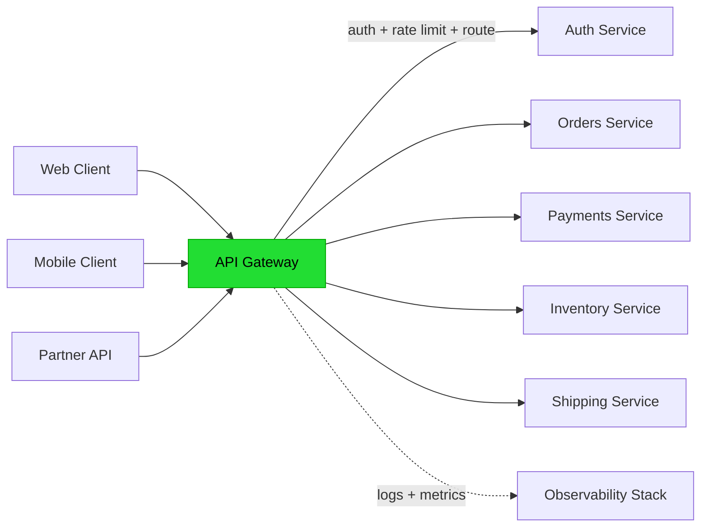

# API Gateway

> One front door. Many backends. Cross-cutting concerns handled once.

## The hook

You've got 50 microservices. Each one needs auth. Each one needs rate limiting. Each one needs logging, request transformation, versioning, CORS.

You can re-implement that in 50 places — 50 chances to get it wrong, 50 places to update when the auth library has a CVE. Or you can put one box in front of them all that handles the cross-cutting concerns.

That box is an API gateway. It's the bouncer at the door. Auth, rate limit, routing — done once at the entrance, not 50 times inside.

## The concept

An API gateway is a reverse proxy with cross-cutting features baked in. It sits at the edge between clients and your service fleet. Every request flows through it.

Standard responsibilities:

- **Authentication** — validate JWT, API key, OAuth token before anything reaches your services
- **Authorization** — check scopes and roles ("does this token have `orders:write`?")
- **Rate limiting** — per-client and per-endpoint quotas, so one bad actor can't take you down
- **Routing** — path-to-service mapping, blue/green deploys, canary traffic splitting
- **Transformation** — REST to gRPC, version translation (v1 clients hitting v2 services)
- **Observability** — centralized logging, metrics, distributed tracing headers
- **Caching** — cache responses for hot read endpoints, take pressure off the backend

The pattern: anything that *every* service would otherwise have to do, the gateway does once.

## Diagram

The gateway is the single front door. Clients never know about internal service topology. Services can move, split, merge, get renamed — clients keep hitting the same gateway URL.

## Example — Netflix Zuul

Netflix runs **Zuul** as their API gateway. We already met it in [Load Balancers](load-balancers.md) — this is the canonical example. Zuul handles roughly **125 billion requests per day** across 1,000+ microservices behind it.

**Why Netflix built Zuul instead of using a generic LB**

A plain L7 load balancer routes by URL. Netflix needed more:

- **Dynamic routing rules** — push a config change and traffic reroutes in seconds, no redeploy
- **A/B test traffic splitting** — send 5% of users to the new recommendations service
- **Request authentication** — check device tokens before any internal service sees the request
- **Resilience patterns** — retries, timeouts, circuit breakers when a backend gets sick

A generic LB doesn't do any of that. Zuul does all of it as filters that run on every request.

**What the gateway does on a typical request**

1. Request hits Zuul from the public internet (after the edge LB)
2. **Auth filter** — validate the device/user token, reject if invalid
3. **Rate limit filter** — check this client's quota for this endpoint
4. **Route lookup** — URL path → service ID via the routing table (e.g., `/api/playback/*` → `playback-service`)
5. **Forward** — proxy the request to a healthy instance of that service
6. **Attach observability headers** — trace ID, request ID, so logs from every downstream service stitch together
7. **Return response** — possibly transformed (e.g., strip internal headers)

**The trade-off**

The gateway is itself a single point of failure. Every request flows through it. If Zuul goes down, Netflix is down — even if every backing service is healthy.

Netflix mitigates with multi-AZ deployment, auto-scaling, and aggressive health checks. The gateway tier runs hot — over-provisioned by design — because the alternative is the whole product going dark.

**Other gateways worth knowing**

| Tool | What it is | When you'd reach for it |
|---|---|---|
| **Kong** | Open-source gateway built on NGINX, plugin ecosystem | Self-hosted, on-prem, or you want to own the layer |
| **AWS API Gateway** | Managed gateway, integrates with Lambda and IAM | You're on AWS and don't want to run your own |
| **Cloudflare Workers** | Edge gateway, runs at 300+ POPs worldwide | You want auth and routing at the network edge, not in your region |
| **Zuul / Spring Cloud Gateway** | JVM-based, Netflix-style | Java shop, want fine-grained filter control |

## Mechanics — what the gateway actually does

| Concern | What the gateway does | Why centralize it |
|---|---|---|
| **Authentication** | Validates JWT/API key/OAuth token, rejects unsigned requests | One library, one rotation cadence, one CVE patch — not 50 |
| **Authorization** | Checks scopes/roles against the route's policy | Policy lives next to the route, not buried in service code |
| **Rate limiting** | Counts requests per client/endpoint, returns 429 over limit | A single counter is consistent; per-service counters drift |
| **Routing** | Maps URL paths to service IDs, supports canary and blue/green | Change traffic flow without redeploying services |
| **Transformation** | Translates protocols (REST ↔ gRPC), rewrites headers, strips internals | Public contract stays stable while internals churn |
| **Observability** | Injects trace IDs, emits unified access logs and metrics | One source of truth for "what hit our system today" |
| **Caching** | Caches responses for hot read endpoints | Backend stays cool; cache hit rate is visible in one place |
| **Gateway vs service mesh** | Gateway = north-south traffic (client → service). Mesh = east-west (service → service) | Different problems, different tools. Most large systems run both. |

The gateway-vs-mesh row is the one most people get wrong. They're not competitors. The gateway is your perimeter. The mesh is your interior. Same idea (push cross-cutting concerns into infrastructure), different blast radius.

## Related concepts

| Concept | What it is | How it relates |
|---|---|---|
| **[Load Balancer](load-balancers.md)** | Distributes traffic across backend servers | A gateway sits behind one (or has one built in). Gateway adds smarts a plain LB doesn't have. |
| **Reverse Proxy** | Server that forwards client requests to backends | A gateway *is* a reverse proxy with cross-cutting features layered on. NGINX is the line between the two. |
| **Service Mesh** | Sidecar-based traffic management between services (Istio, Linkerd) | Handles internal east-west traffic. Complementary to the gateway, not competing. |
| **[OAuth / JWT](oauth-jwt.md)** | Token-based auth standards | Gateway typically validates the token so services don't have to. |
| **Rate Limiting** | Cap on how often a client can call an endpoint | One of the most common gateway features. Token bucket or sliding window counters live in the gateway. |
| **BFF (Backend for Frontend)** | A gateway-like layer dedicated to one client type (web, iOS, Android) | When the generic gateway isn't shaped right for each client, you build a BFF per client. Gateway is shared; BFF is purpose-built. |
| **CORS** | Browser policy controlling cross-origin requests | Gateway is where you set CORS headers consistently across every endpoint. |
| **[Microservices](microservices.md)** | Architecture of small, independently deployed services | The architecture that makes a gateway worth building. Monoliths don't need one. |

## When (and when not) to use it

**Use an API gateway when:**

- You have **5+ microservices** and want one place for cross-cutting concerns
- You expose **public APIs** and need a stable contract while internals churn
- **Auth, rate limit, or routing logic is being duplicated** across services — that's the smell
- You need **canary or blue/green deploys** and want to shift traffic without redeploying services
- You're running **multiple client types** (web, mobile, partner) and they need different shapes of the same data

**Skip it when:**

- **Monolith or 1–2 services** — the gateway is overhead with no payoff. Add it when you split.
- You're on a **managed platform that already gives you the features** — Vercel, Cloudflare, AWS App Runner, Fly.io often handle auth, rate limiting, and TLS at the edge. Don't add a second layer.
- **Internal-only tools** with trusted clients and no rate-limit needs — direct calls are fine.
- You haven't actually felt the pain yet. Adding a gateway "just in case" buys complexity you'll pay for in latency and ops.

The default answer for any system with serious microservices is *yes, run a gateway*. The interesting question is which one — managed (AWS, Cloudflare) for speed, self-hosted (Kong, Zuul) for control.

## Key takeaway

- **API gateway centralizes cross-cutting concerns.** Auth, rate limit, routing, observability — done once at the door.
- **Service mesh handles east-west.** Gateway and mesh complement, not compete.
- **The gateway is a single point of failure.** Run it multi-AZ with auto-scaling, or you've traded service outages for one big outage.
- **Skip it for monoliths or 1–2 services on a managed platform.** Add it when you feel the duplication pain — usually around 5 services in.
- **Public APIs benefit most.** Stable external contract while internals are free to change.

---

*Quiz available in the SLAM OG app — three questions on what a gateway centralizes, gateway vs mesh, and when not to bother.*
