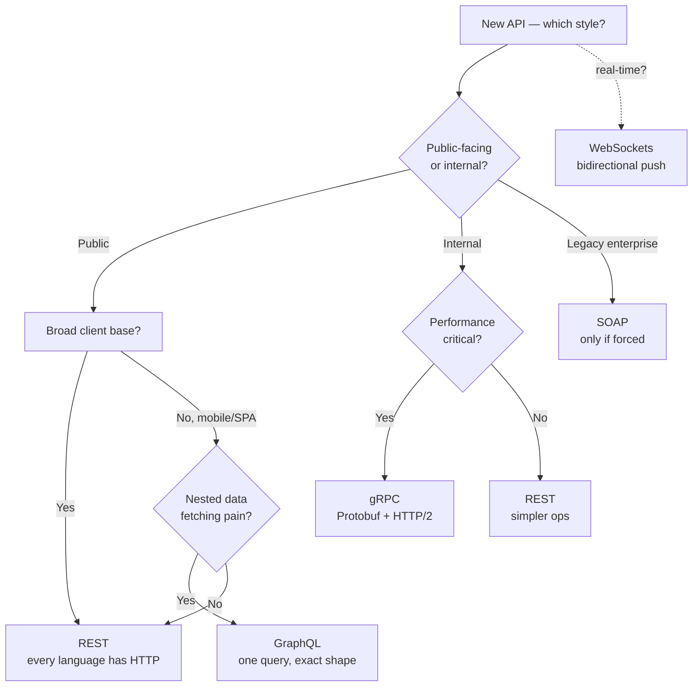

# API Styles Compared (REST, GraphQL, gRPC, SOAP, RPC)

> Different tools for different conversations. Match the style to the call pattern, not the hype.

## The hook

REST won the 2010s. GraphQL hit the mainstream when mobile teams got tired of stitching five endpoints into one screen. gRPC quietly took over internal microservices at every company that cares about throughput. SOAP refuses to die in banking and government. And RPC, in some form, underpins half the systems you'd never associate with the term.

Each style is a different answer to one question: *how should clients and servers talk?* Each has a sweet spot. None wins everywhere.

## The concept

API styles vary across four axes:

| Axis | What it controls |
|---|---|
| **Transport** | HTTP/1.1 (REST, SOAP), HTTP/2 (gRPC), raw TCP (WebSockets) |
| **Schema** | JSON (REST, default), strongly-typed schema (gRPC, GraphQL), XML (SOAP) |
| **Query model** | Server-defined endpoints (REST), client-shaped queries (GraphQL), procedure calls (RPC/gRPC) |
| **Tooling** | OpenAPI specs, GraphQL introspection, Protobuf codegen, WSDL contracts |

The right style depends on three things:

1. **Who's calling?** Unknown public clients vs. your own services
2. **How nested is the data?** Flat resources vs. graphs of related entities
3. **How much does performance matter?** Human-speed vs. machine-speed

REST is the default. The other styles earn their place by solving a problem REST handles poorly.

## Diagram

The decision usually collapses to: REST unless you have a specific reason. The reasons are real, but they're specific.

## Example — three real picks side-by-side

The same question — "what API style should we use?" — gets three different correct answers depending on the call pattern.

**Stripe — REST**

Stripe is a public payments API used by millions of developers in every language imaginable. The call pattern is *lots of unknown clients hitting well-defined resources*: charges, customers, refunds, subscriptions. Resources map cleanly to URLs (`/v1/charges/ch_123`). Caching, retries, and rate limiting all work because they're standard HTTP. Every language has an HTTP client — no Stripe-specific runtime needed. REST is the right call. The bet: ubiquity beats raw efficiency when your clients are everyone.

**Facebook / GitHub — GraphQL**

Facebook built GraphQL in 2012 to fix a mobile problem. Their iOS app was making 5+ REST calls to render a single screen — user info from `/users/123`, posts from `/users/123/posts`, comments and likes for each post. Each call was a round trip. On a mobile network, this killed performance. GraphQL flips it: the client sends one query describing exactly the shape it wants ("user with their last 10 posts, with the first 5 comments on each, with the like counts"), and the server resolves it in one response. GitHub adopted the same model for their public API in 2017 — for the same reason. The bet: when clients fetch nested, related data, letting them shape the query in one round trip beats making them stitch five together.

**Google internal services — gRPC**

Google's internal services run on Stubby (the predecessor to gRPC) and now gRPC. The call pattern is *service-to-service at massive scale*: trillions of internal RPCs per day, polyglot codebases (C++, Go, Java, Python), and every microsecond matters. Protobuf-encoded payloads are roughly 5-10x smaller than equivalent JSON, parse 20-100x faster, and ship over HTTP/2 with multiplexing — many requests share one connection. The schema is the contract; both ends generate strongly-typed clients automatically from a `.proto` file. The bet: when you control both ends and you're shipping billions of calls a day, the throughput and codegen wins more than pay for the tooling cost.

Three different shapes of conversation. Three different right answers.

## Mechanics — the 5-style comparison

| Style | Transport | Payload | Schema | Browser-friendly | Typical use | Performance | Tooling maturity |
|---|---|---|---|---|---|---|---|
| **REST** | HTTP/1.1 | JSON (mostly) | Optional (OpenAPI) | Yes | Public APIs, web/mobile clients | Good | Excellent |
| **GraphQL** | HTTP/1.1 | JSON | Required (SDL) | Yes | Aggregating nested data, mobile/SPA | Good | Strong |
| **gRPC** | HTTP/2 | Protobuf (binary) | Required (.proto) | No (needs gRPC-Web proxy) | Internal microservices | Excellent | Strong (polyglot codegen) |
| **SOAP** | HTTP/SMTP/etc | XML | Required (WSDL) | Yes | Enterprise/legacy systems | Slow | Mature but aging |
| **WebSockets** | TCP (upgraded HTTP) | Anything (often JSON) | None by default | Yes | Real-time bidirectional (chat, live data, games) | Excellent for streams | Solid |

Two patterns to notice. First, **schema strictness rises with performance demand** — REST is loosest and most universal, gRPC is strictest and fastest. Second, **browser support is its own axis** — gRPC is the odd one out because raw HTTP/2 binary frames don't work from a browser without a proxy layer.

## Related concepts

| Concept | What it is | How it relates |
|---|---|---|
| **REST API design** | Resource modeling, HTTP verbs, status codes, versioning | The default style. Master this before reaching for the others. |
| **HTTP fundamentals** | Methods, status codes, headers, caching | Every style except raw gRPC and WebSockets sits on top of HTTP. |
| **API gateway** | Single entry point that routes, authenticates, and rate-limits | Often translates between styles — REST out, gRPC in. Kong, Apollo, Zuul. |
| **GraphQL** | Query language and runtime for client-shaped data fetching | Next topic. Deep dive on the resolver model and N+1 traps. |
| **gRPC** | RPC framework using Protobuf and HTTP/2 | Next topic. Deep dive on Protobuf, streaming, and codegen. |
| **Webhooks** | Server-to-server callbacks pushed on events | The inverse of polling — Stripe sends *you* a request when a payment completes. |
| **WebSockets / Server-Sent Events** | Long-lived connections for push-based updates | Real-time channel that REST and GraphQL can't natively do — you upgrade out of HTTP. |
| **OpenAPI / Swagger** | Schema language for describing REST APIs | The closest REST gets to gRPC's `.proto` — codegen, docs, and validation in one. |

Each link is a topic on its own. The goal here is to know the shape of each conversation so you can pick the right one.

## When (and when not) to use each

**REST**

- *Use when*: building a public API, broad client base, anything HTTP-native (caching, CDN, browser tooling), you want maximum compatibility.
- *Skip when*: you're stitching 5 endpoints to render one screen and the round trips hurt — that's a GraphQL problem.

**GraphQL**

- *Use when*: client over-fetching or under-fetching is a real, measured pain point. Mobile apps. Dashboards with deeply nested data. Aggregating multiple back-ends behind one endpoint.
- *Skip when*: your clients are simple and resources are flat. GraphQL adds a server runtime, query depth/complexity limits, and N+1 watchfulness — overhead you don't need if REST already works.

**gRPC**

- *Use when*: internal service-to-service, you control both ends, performance matters, polyglot teams want strongly-typed clients without writing them by hand.
- *Skip when*: the caller is a browser (without a gRPC-Web proxy), the audience is third-party developers (the learning curve and binary debugging hurt), or simplicity matters more than throughput.

**SOAP**

- *Use when*: integrating with an existing SOAP system you can't change — banking, healthcare, older enterprise. The WSDL contract is sometimes a hard requirement.
- *Skip when*: you have a choice. New SOAP services in 2026 are almost always a mistake.

**WebSockets**

- *Use when*: real-time bidirectional traffic — chat, multiplayer games, live dashboards, collaborative editing.
- *Skip when*: you only need server-to-client push and you don't need bidirectional. Server-Sent Events (SSE) is simpler and survives proxies better.

## Key takeaway

- **No API style wins everywhere — match the style to the call pattern, not the hype.**
- **REST is the default.** Every other style has to justify itself by solving a specific REST weakness.
- **GraphQL solves the nested-data round-trip problem** for mobile and rich clients. It is not "REST but better."
- **gRPC wins inside the data center** when you control both ends and care about throughput. Protobuf is 5-10x smaller than JSON.
- **SOAP is integration-only** — never a green-field choice.
- **WebSockets** are a transport answer, not a request/response answer — pick them when you need a persistent two-way channel.
- The best architects often **mix styles**: REST at the edge, gRPC between services, WebSockets for real-time.

---

*Quiz available in the SLAM OG app — three questions on picking the right style for the call pattern.*
