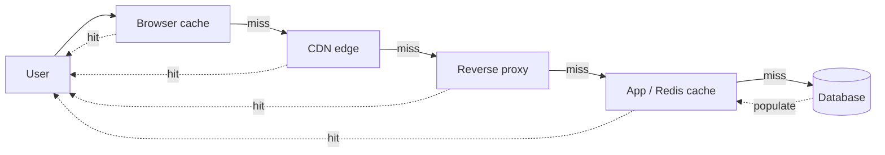

# Caching Strategies

> Why ask twice? Caching is the laziness that makes systems fast.

## The hook

Your endpoint is slow. You profile it. The query is slow. The query is slow because it scans 10M rows to build the same response 4,000 times an hour.

The fix is almost always the same: cache the result.

But caching isn't free. Phil Karlton put it best — *"There are only two hard things in computer science: cache invalidation and naming things."* He was half-joking. The "cache invalidation" half is dead serious. Adding a cache is a one-line config change. Keeping it correct is the rest of your career.

## The concept

A cache stores results closer to where they're needed so you don't redo expensive work.

That's it. Every cache decision boils down to two questions:

1. **Where do you put it?** Browser, CDN, reverse proxy, app memory, distributed cache (Redis/Memcached), database buffer pool. Each layer is closer to the user and faster than the one behind it.
2. **When do you invalidate it?** This is where the five strategies live. They're really just five different answers to "how does fresh data get in, and how does stale data get out?"

The latency math is what makes this worth doing. A cold DB query: ~100ms. The same answer from Redis: ~1ms. A typical web app caches well enough to hit the cache 70–90% of the time. Multiply that across millions of requests and the cache isn't an optimization — it's the system.

## Diagram

A hit at any layer skips every layer behind it. The browser cache is free; the CDN is cheap; the database is expensive. Every layer you skip is latency you don't pay for.

## Example — GitHub's user profile page

Open `github.com/torvalds`. That single page view touches several caches before it ever reaches a database.

**Layer 1 — browser cache.** The avatar, CSS, and JS bundles ship with `Cache-Control` headers. Second visit, your browser doesn't even ask the network.

**Layer 2 — CDN (Fastly).** GitHub fronts assets and many anonymous responses through Fastly. Your browser request for static content terminates at an edge node ~20ms from you, never reaching GitHub's origin.

**Layer 3 — application cache (Redis / Memcached).** The profile data — repos, follower counts, contribution graph — is the kind of thing that's expensive to compute and changes slowly. GitHub caches the rendered fragments and aggregates in Memcached. A miss here is the only path that reaches a database.

**Layer 4 — database (MySQL with its own buffer pool).** If we miss everything above, the query hits MySQL. MySQL has its own cache (the InnoDB buffer pool) holding hot pages in memory, so even "the database" usually answers from RAM.

The win compounds. A 5ms response from Redis instead of a 150ms join across three tables means you can serve 30x the traffic on the same hardware. Cache hit rates of 95%+ on read-heavy pages are normal at GitHub's scale. The 5% that miss is what your DB capacity needs to handle — not the 100%.

## Mechanics — the 5 caching strategies

Each strategy is a different answer to *"how do reads and writes flow through the cache?"*

| Strategy | Read path | Write path | Use when | Trade-off |
|---|---|---|---|---|
| **Cache-aside** (lazy load) | App checks cache → miss → reads DB → writes to cache | App writes to DB; cache entry invalidated or left to expire | Read-heavy, default choice | App owns the logic. First read after a write is always a miss. |
| **Read-through** | App asks cache; cache fetches from DB on miss | App writes to DB; cache library handles refresh | You want clean app code; cache library handles I/O | Less control over exactly when DB gets hit. Cache library becomes critical infrastructure. |
| **Write-through** | Same as cache-aside | App writes to cache **and** DB synchronously before returning | You need the cache to never be stale (financial dashboards, configs) | Writes are slower — you pay both round-trips. |
| **Write-back** (write-behind) | Read from cache | App writes to cache only; cache flushes to DB asynchronously | Write-heavy paths where speed matters more than durability (counters, metrics) | Cache crash = lost writes. Real durability risk. |
| **Write-around** | Same as cache-aside | App writes directly to DB, skipping the cache | Write-once-read-rarely data (audit logs, large blobs) | First read after a write is a miss. Keeps the cache from filling with cold data. |

In practice, most systems combine two: **cache-aside for reads + write-around for writes** is the most common pattern in production. Reads are lazy and bounded by what's actually requested; writes don't pollute the cache with data nobody's reading.

## Related concepts

| Concept | What it is | Why it matters here |
|---|---|---|
| **Redis / Memcached** | In-memory key-value stores used as distributed caches | The default tools for the application-cache layer. Redis adds data structures and persistence; Memcached is leaner and pure-cache. |
| **CDN** | Geographic cache of static and cacheable dynamic content at edge nodes | Caching at the edge — the layer that exists before your servers do. Cloudflare, Fastly, CloudFront. |
| **Eviction policies** | Rules for which entries to drop when the cache is full | LRU (least recently used) is the default. LFU and TTL-based exist for specific access patterns. |
| **TTL** (time-to-live) | Expiration timestamp on a cache entry | The simplest invalidation strategy: set it and forget it. Stale data is bounded by the TTL. |
| **Cache stampede** (thundering herd) | Many requests miss simultaneously on a hot key and all hit the DB at once | Mitigate with request coalescing, lock-on-miss, or probabilistic early refresh. |
| **Database query plans** | The execution strategy the DB picks for a query | If the query already hits an index and runs in 2ms, caching it adds complexity without latency wins. Measure first. |
| **Stale-while-revalidate** | Serve the stale value, refresh in the background | A caching pattern (HTTP and app-level) that hides refresh latency from users. |
| **Write durability** | Guarantee that an acknowledged write survives a crash | The thing write-back trades away for speed. Know whether your data needs it. |

Each of these is a topic on its own — caching is the umbrella that pulls them together.

## When (and when not) to use it

**Cache when:**

- The workload is **read-heavy** — same data fetched many times between writes
- The computation is **expensive** — joins across many tables, aggregations, ML inference, encoding
- The downstream call is **slow or rate-limited** — third-party APIs, geocoding, payment lookups
- You can **tolerate some staleness** — cached data is, by definition, slightly behind the source

**Skip the cache when:**

- The data is **personalized per request** — there's nothing to share between users, so the cache hit rate will be near zero
- **Writes outnumber reads** — you'll spend more time invalidating than serving
- **Memory pressure** outweighs the latency win — small fleet, large dataset, low hit rate
- **You haven't measured** — premature caching is a real bug. Profile, find the actual slow path, then cache it

The honest rule: a cache adds a moving part. If you can't say what your hit rate will be and what happens when the cache is wrong, you're not ready to add one.

## Key takeaway

- **Two questions only**: where to put the cache, and when to invalidate it. The five strategies are five answers to the second question.
- **Cache-aside + write-around** is the safe default for most read-heavy web apps.
- **Write-back is fast and dangerous.** Use it for counters and metrics, not orders and payments.
- **Hit rate is the metric that matters.** Below 70%, ask whether the cache is helping or just adding latency.
- **Invalidation is the hard part.** Plan it before you ship the cache, not after the bug report.

---

*Quiz available in the SLAM OG app — three questions on picking the right strategy, the trade-offs of write-back, and diagnosing a sudden cache hit-rate drop.*
