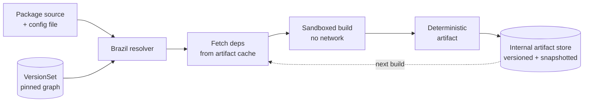

# Case Study: Amazon's Brazil Build System

> Monorepo without the monorepo — how Amazon builds 10,000 services owned by 100,000 engineers.

## The hook

Amazon ships a deployment roughly every 11.7 seconds at peak. Tens of thousands of services, each owned by a different two-pizza team, each on its own release cadence, each pulling in dozens of internal libraries that other teams keep changing.

Most engineering orgs would collapse under that. The reason Amazon doesn't is a piece of internal tooling almost no one outside the company sees: **Brazil**, the build system that turns "thousands of independent repos" into something that builds reproducibly the same way today, tomorrow, and in 2031.

Most companies' build pain comes from not having something like this.

## The concept

Brazil is a **hermetic, version-pinned, reproducible** build system. Three words, each loaded.

- **Hermetic.** Builds run in a sandbox. No network. No ambient tools. Every input is declared.
- **Version-pinned.** Every dependency — including transitive ones — has an explicit version. Nothing drifts.
- **Reproducible.** Same inputs, same outputs. Bit-for-bit. On any machine, any time.

The deal Brazil makes with you: give up "always latest" convenience, and in return, your build never breaks because some upstream library silently shipped a new minor version overnight. When you upgrade, you upgrade *on purpose*, and you see exactly what broke.

That's the whole philosophy. Convenience traded for control, at a scale where loss of control would be fatal.

## Diagram

The cache loop is the trick. Once a dependency is built, every downstream consumer pulls the same bytes — no rebuild, no surprise.

## Example — upgrading a shared library, the Brazil way

Picture a service called `order-router-cpp` that depends on `auth-client` v3.4.7. The team that owns `auth-client` ships v3.5.0 with a bug fix.

**In a typical npm/pip/Maven shop**, your next CI run silently picks up v3.5.0 because your range was `^3.4.7`. The build that worked yesterday breaks today, and you spend an hour figuring out which transitive dep moved. Multiply across 50 services, and you have a full-time job called "dependency archaeology."

**In Brazil**, nothing happens until you say so. Your VersionSet still pins v3.4.7. Your build is identical to last week's.

When you decide to upgrade, the flow is:

1. Edit your config — pin `auth-client = 3.5.0`.
2. Brazil **merges** the new version into your private VersionSet, recomputes the dependency graph, and flags any conflicts (e.g. `auth-client 3.5.0` requires `crypto-utils 2.1+`, but you had `2.0` pinned).
3. You run a build. It either succeeds, or it fails *for a reason you can name*.
4. If something downstream breaks, you fix it now or roll the pin back. You did not surprise yourself.

The "live" VersionSet is the public space — anyone at Amazon can publish anything there. Your private VersionSet is the firewall: nothing enters until you let it in.

That's the difference between dependency management and dependency *control*.

## Mechanics — the design choices that make Brazil work

| Choice | What it buys | What it costs |
|---|---|---|
| **Hermetic builds** | No "works on my machine" — sandboxed, no network during build | Every tool the build needs has to be declared as a dep |
| **Explicit version pinning** | Same inputs → same outputs, indefinitely | No automatic security patches; you upgrade on purpose |
| **VersionSets (private spaces)** | Each team controls its own dep graph; "live" is the shared pool | More config per package; you have to merge upgrades in |
| **DAG-based resolution** | Brazil computes the full dependency graph before building anything | Dep cycles fail loudly instead of silently producing weird builds |
| **Per-team package ownership** | Clear blast radius — a broken package only affects teams that pinned it | Cross-team coordination needed for ecosystem-wide upgrades |
| **Snapshotted, versioned artifacts** | Every build is reproducible years later — useful for audits, rollbacks, security review | Storage cost is real; Amazon pays it because the alternative is worse |
| **Internal-only** | Tightly fits Amazon's tooling, hardware (Linux x86/x64/ARM), and ownership model | You can't adopt it. Closest open-source cousins below. |

**The OSS comparables.** Brazil isn't open source, but the pattern shows up in:

- **[Bazel](https://bazel.build/)** — Google's open-source build system. Same hermetic, reproducible philosophy. The most realistic "Brazil for everyone else."
- **[Buck2](https://buck2.build/)** — Meta's rewrite of Buck in Rust. Similar shape, faster.
- **[Pants](https://www.pantsbuild.org/)** — Twitter/Toolchain-originated. Aimed at polyglot monorepos.
- **[Nix](https://nixos.org/)** — Reproducibility at the OS / package level, not just builds. Complementary, sometimes overlapping.

If you've used any of these, Brazil will feel familiar. Amazon just happened to build theirs in-house in 2003-ish, before the OSS options matured.

## Related concepts

| Concept | How it connects to Brazil |
|---|---|
| **[CI/CD](ci-cd.md)** | Brazil is the substrate Amazon's CI runs on. Pipelines (Amazon's deploy tool) trigger Brazil builds; reproducibility is what makes "deploy every 11.7 seconds" safe. |
| **[Microservices](microservices.md)** | Each Amazon service is a Brazil package. Per-team ownership, independent release cadence, explicit versioned contracts between services — all enforced at the build layer. |
| **[Distributed Patterns](distributed-patterns.md)** | Reliable rollouts (canary, blue/green) need build determinism. If you can't reproduce the artifact, you can't safely roll back to it. |
| **[Case Study: Netflix](case-netflix.md)** | Different problem space (runtime resilience vs. build determinism), same scale-driven philosophy: invest in platform tooling so application teams don't have to. |
| **Bazel / Buck2 / Nix** | Open-source siblings of Brazil. The realistic adoption path if you have Amazon-shaped problems but not Amazon-shaped engineering org. |
| **Monorepo strategies** | Brazil is "monorepo without the monorepo" — you get the cross-team coherence of one giant repo without forcing everyone into one. VersionSets do the work the monorepo would. |
| **Artifact stores** | The cache layer (versioned, immutable, snapshotted) is what most teams underbuild. Brazil treats it as a first-class system; tools like Artifactory, Nexus, and Sonatype play that role outside Amazon. |
| **Reproducible builds movement** | Same goals — same source produces same binary, verifiable by third parties. Brazil predates the public movement but lands in the same place. |

## When (and when not) to copy this pattern

**Copy it (or adopt Bazel/Nix) when:**

- You have **50+ services** and "which version of the shared lib did this build pick up?" is a question someone asks weekly.
- Your **release velocity is dropping** because every upgrade causes a stampede of downstream breakage.
- You operate in a **regulated industry** where reproducible, auditable builds are a compliance requirement, not a nice-to-have.
- You have a **platform team** that can own the build infrastructure as a product, not a side project.

**Skip it when:**

- You have **one app**. Pip + a lockfile is fine. Brazil-class tooling solves a coordination problem you don't have yet.
- You have **fewer than ~20 engineers**. The configuration overhead per package will eat any productivity gain.
- You have **no platform team**. Bazel without an owner becomes a haunted toolchain that everyone resents.

The honest path for most mid-sized companies: don't build a Brazil — adopt Bazel or Nix when the pain becomes real, hire one person to own it, and treat your build system the same way you'd treat your database. It's infrastructure, not a script.

## Key takeaway

- **Build determinism is the foundation under everything** — Amazon couldn't ship every 11.7 seconds without it.
- **Brazil's deal**: trade "always latest" convenience for total reproducibility. Same inputs, same outputs, every time.
- **VersionSets are the killer feature** — private dep graphs per team, with a public "live" pool to draw from.
- **You don't need to build Brazil.** Bazel, Buck2, Nix, and Pants give you the same philosophy with a community behind them.
- **The architecture lesson generalizes**: when scale makes coordination expensive, push the contract into tooling instead of meetings.

---

*Quiz available in the SLAM OG app — three questions on Brazil's trade-off vs. npm, what "hermetic" means, and when this pattern is worth copying.*
