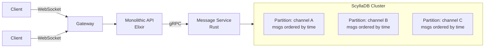

# Case Study: Discord — Trillions of Messages

> Trillions of messages. They picked the right database family — eventually.

## The hook

Discord stores **trillions** of chat messages and serves them with single-digit-millisecond reads. They didn't get there in one shot.

They started on MongoDB. Hit a wall around 100 million messages. Moved to Cassandra. That worked for years — until the operational cost of running Cassandra at 177 nodes started eating the team. Then they rebuilt on ScyllaDB.

Three databases in roughly seven years. Each move was painful. Each move taught the same lesson: **the database family has to match the access pattern, and switching after the fact costs you years.**

## The concept

Chat is a specific access pattern. Strip it down:

- **Write-heavy.** Every keystroke that sends ends up as a row. Reads are bursty (open a channel, scroll history) but writes never stop.
- **Time-ordered within a key.** A channel's messages are a timeline. You almost never query "all messages across all channels" — you query "the last N messages in channel X."
- **One natural shard key.** `channel_id` (or DM-pair-id) is the partition. Everything one user wants to see lives under one key.

That shape — write-heavy, append-only, single-key range scans by time — is the textbook fit for a **wide-column store**. Partition by `channel_id`. Cluster by `message_id` (a Snowflake ID, so sortable by time). Reads become "give me the last 50 rows in this partition," which is a single seek and a sequential scan.

Discord's three-database arc maps cleanly onto this:

| Era | Store | Why it fit / didn't |
|---|---|---|
| 2015 | MongoDB (single replica) | Easy to start. Document model didn't match time-ordered partitions; lock contention + RAM blowup at ~100M messages |
| 2017–2022 | Cassandra (12 → 177 nodes) | Right data model. JVM GC pauses + compaction overhead made p99 unpredictable at scale |
| 2022 → | ScyllaDB | Cassandra-compatible wire/data model. C++ shard-per-core runtime. p99 reads dropped from 40–125ms to ~5ms |

The lesson isn't "MongoDB is bad" or "Cassandra is bad." Both are good at what they're good at. Chat is a wide-column workload, and Discord eventually picked the cleanest implementation of that family.

## Diagram

Each channel is a partition. Inside it, messages are clustered by Snowflake ID — which is roughly time-ordered, so "last 50 messages" is one seek plus a sequential read. New messages append to the end of the partition.

## Example — why each migration happened

**MongoDB → Cassandra (late 2015)**

By November 2015, Discord had ~100M messages on a single MongoDB replica. Two things broke at once:

- The working set (hot index + recent messages) stopped fitting in RAM. Every read started touching disk.
- Document-level locking under heavy concurrent writes caused tail-latency spikes. p99 went from "fine" to "unpredictable."

MongoDB isn't bad — it's a poor fit for "append messages to a channel forever and read them back in order." There's no natural way to express the partition. They migrated to Cassandra and modeled messages as `(channel_id, message_id) → message_body`. Suddenly the access pattern matched the storage engine.

**Cassandra → ScyllaDB (2022)**

Cassandra worked. For five years it scaled from 12 nodes to 177. Trillions of messages. Billions of writes per day. The data model was right.

What broke wasn't the model — it was the runtime:

- **JVM GC pauses.** Cassandra is Java. A long GC pause on a coordinator node shows up as a multi-hundred-millisecond spike in p99. At Discord's read volume, those spikes were constant.
- **Compaction storms.** Cassandra's LSM-tree storage rewrites SSTables in the background. At 177 nodes, compaction was always happening somewhere, eating IO that production traffic also needed.
- **Hot partitions.** A huge channel (think a popular server's #general) generates more reads per partition than the cluster can comfortably balance. Combined with GC pauses on the unlucky replicas, those channels had visibly worse latency.

ScyllaDB is a Cassandra-compatible rewrite in C++ with a shard-per-core architecture and no garbage collector. Wire protocol identical. Data model identical. The migration was a runtime swap, not a re-modeling exercise.

The numbers Discord published after the move:

| Metric | Cassandra | ScyllaDB |
|---|---|---|
| p99 read latency | 40–125 ms | ~15 ms (often <5ms on hot paths) |
| p99 write latency | 5–70 ms | ~5 ms |
| Operational toil | "Constant" | Dramatically lower |

They also rewrote the data layer in front of ScyllaDB in **Rust**, so coalescing reads, hedging requests, and batching could happen in a service that itself didn't have GC pauses.

## Mechanics — Discord's stack

| Layer | Tech | Why |
|---|---|---|
| Client transport | WebSockets | Persistent connections for real-time push (presence, typing, new messages) |
| API / gateway | **Elixir** (BEAM VM) | BEAM's lightweight processes handle millions of concurrent connections cheaply |
| Hot-path services | **Rust** | No GC, predictable latency, fits in front of ScyllaDB for request coalescing |
| Service-to-service | **gRPC** | Typed contracts, bidirectional streaming, fast binary protocol |
| Message store | **ScyllaDB** | Wide-column, Cassandra-compatible, C++ shard-per-core, no GC |
| Sharding key | `channel_id` | One channel = one partition = one timeline |

Two patterns worth calling out:

- **Elixir for connection-heavy work, Rust for latency-critical work.** Different runtimes for different problems. Don't try to do both with one language.
- **Cassandra-compatible was a feature, not a coincidence.** It meant they could swap the engine without rewriting the data model. If you ever bet on a database, betting on the *protocol* (CQL, Postgres wire, Redis RESP) is safer than betting on a specific vendor.

## Related concepts

| Concept | What it is | How it relates here |
|---|---|---|
| **[Database types](database-types.md)** | The taxonomy: relational, document, key-value, wide-column, graph, search, time-series | This is the canonical "why wide-column" story — chat is the workload that picked the family |
| **[Database sharding](database-sharding.md)** | Splitting a logical table across many physical nodes by a key | Discord shards by `channel_id`. The shard key choice is the architecture |
| **[Case study: Slack](case-slack.md)** | Different chat product, different scale, different DB choices | Useful contrast — Slack leaned harder on relational + search; Discord went all-in on wide-column |
| **[Message queues](message-queues.md)** | Async pipes between services | Discord uses queues for fan-out (notifications, indexing) but the message store itself is the source of truth |
| **[Distributed patterns](distributed-patterns.md)** | Replication, consensus, hedging, request coalescing | All of these show up in the data layer in front of ScyllaDB |
| **[Observability](observability.md)** | How you find out p99 just spiked | Discord publicly debugged GC pauses and hot partitions — only possible because the metrics were there |
| **[Caching strategies](caching-strategies.md)** | What to cache, where, and how to invalidate | Recent-messages caches sit in front of ScyllaDB on hot channels |

## When (and when not) to copy this

**Copy this pattern when:**

- Your access pattern is **write-heavy, append-mostly, time-ordered**, and queried by a single natural key — chat, feed timelines, IoT telemetry, event logs, audit trails
- You can pick a **shard key that distributes load** without creating massive hot partitions
- You're at scale where a single relational box hurts and read replicas only delay the pain
- You're willing to give up cross-key joins and ad-hoc queries to get write throughput and predictable latency

**Skip it when:**

- Your queries are **multi-key joins or ad-hoc analytics** — Postgres will outlive your startup
- You don't yet have **real evidence** that the relational ceiling is hit. "Discord uses ScyllaDB" is not a reason to use ScyllaDB. *Your access pattern* is the reason
- Your team has **zero operational experience** with wide-column stores. Cassandra-family operations are not free, even on managed services
- You can solve the same problem with **Postgres + a partition strategy** (`PARTITION BY` on time) for another two orders of magnitude

The honest default for most apps: start on Postgres. If your access pattern starts to look like Discord's — single-key time-ordered append-mostly at volume — *then* reach for a wide-column store.

## Key takeaway

- **Match the database family to the access pattern.** Wide-column for write-heavy time-ordered single-key reads. Switching the family later costs years.
- **Three databases in seven years** is what getting it wrong looks like — even at a top-tier engineering org.
- **Cassandra-compatible was the escape hatch** that let Discord swap engines without remodeling. Bet on protocols, not vendors.
- **The runtime matters as much as the model.** Same data layout, JVM vs C++ → 10x p99 improvement.
- **Elixir for connections, Rust for hot paths, ScyllaDB for storage.** Specialized tools beat one generalist at scale.
- **Don't copy this until your access pattern demands it.** Postgres + good schema design covers more cases than the case-study crowd will admit.

---

*Quiz available in the SLAM OG app — three questions on why each migration happened and what the access pattern actually was.*
