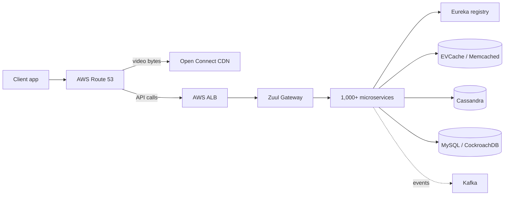

# Case Study: Netflix Architecture

> The company that taught the cloud how to fail well.

## The hook

August 2008. A database corruption event takes down Netflix's shipping system. DVDs don't go out for three days. The team realizes they cannot keep running their own data center — a single broken machine just stopped the whole company.

That week they decided to move to AWS. The migration took roughly seven years. The cultural shift took longer: every engineer had to internalize that **failure is not an exception, it's the normal operating condition**. Servers will die. Networks will partition. Regions will go dark. Build for it, or it will eat you.

That mindset is what most people are pointing at when they say "Netflix architecture." The boxes and arrows are downstream.

## The concept

Netflix is the reference implementation of cloud-native at scale. Not because they have the prettiest diagrams, but because they hit every problem first and open-sourced the answer.

Four ideas hold the whole thing together:

1. **AWS for everything but video.** Compute, databases, queues, storage — all on AWS across multiple regions, active-active. They don't run a data center.
2. **Microservices, ~1,000 of them.** Each service owns its data, deploys independently, and talks over the network.
3. **Chaos engineering.** Tools like Chaos Monkey kill production instances on purpose so engineers cannot ignore failure modes.
4. **Open Connect.** The video bytes themselves don't go through AWS — Netflix ships its own CDN appliances into ISPs around the world, putting the movie on a box inside your provider's network.

The combination is the point. You can run microservices without chaos engineering, but at Netflix's scale you'll find out about every failure mode in production at 2 a.m. anyway.

## Diagram

Two distinct paths. Video bytes go through Open Connect — Netflix-owned hardware sitting inside your ISP. API calls (home screen, recommendations, playback session setup) go through AWS, hit Zuul, fan out across microservices.

## Example — opening Netflix in Tokyo

Walk through one request. You unlock your phone in Tokyo and tap the Netflix icon.

**1. DNS routing.** The app does a DNS lookup. **Route 53** answers with the closest healthy AWS region — for you, `ap-northeast-1` (Tokyo). Latency-based routing shaves ~150 ms vs. a US region. ([See: dns-routing](dns-routing.md))

**2. Edge load balancer.** The HTTPS request hits an **AWS ALB** in Tokyo. ALB picks a healthy Zuul instance.

**3. Zuul (API gateway).** Zuul authenticates the JWT, applies rate limits, picks the right backend route, and forwards. It also handles A/B test traffic splitting — your account might be in a test bucket that gets a different recommendation algorithm.

**4. Fan-out across microservices.** The home screen needs roughly a dozen things at once: the catalog, your viewing history, personalized rows, billboard art for each title, language metadata. Zuul (or a backend-for-frontend service) calls each of these in parallel. Each call uses **Ribbon** — a client-side load balancer that asks **Eureka** "who's healthy right now for the recommendation service?" and picks one.

**5. Reads hit caches first.** The recommendation service reads from **EVCache** (Memcached cluster). If it misses, it falls back to **Cassandra**. EVCache holds your home page rows pre-computed — it's why the screen paints fast.

**6. Something fails.** The personalization service is having a bad afternoon — maybe a deploy went sideways, maybe an AZ flickered. **Hystrix** (the circuit breaker library) notices the error rate cross a threshold and *opens the circuit*. Instead of waiting on broken calls, every subsequent request returns a fallback immediately: a generic "popular in Japan" row. You see a slightly less personalized home screen. You don't see a spinner or an error. ([See: distributed-patterns](distributed-patterns.md))

**7. Response.** Zuul collects the responses, assembles the JSON, and sends it back. End-to-end you've waited maybe 200 ms.

When you hit play, Step 1 repeats — but DNS sends the video stream to an Open Connect appliance inside your ISP, not to AWS. The metadata (subtitles, watch position, billing) keeps using AWS. The bytes themselves take a shorter path.

## Mechanics — the Netflix OSS stack

Most of the building blocks are open-source. You don't need to use them — but knowing what each one does is half the vocabulary of cloud-native.

| Component | Job | Notes |
|---|---|---|
| **Zuul** | API gateway | L7 routing, auth, A/B traffic splitting, request shaping. Sits at the edge of the internal network. |
| **Eureka** | Service discovery | A registry. Every service registers itself; clients ask Eureka "who's alive?" |
| **Ribbon** | Client-side load balancer | Library inside each service. Picks a backend from Eureka's list. Removes the central LB chokepoint. |
| **Hystrix** | Circuit breaker | Wraps every external call. Opens on errors, returns fallback fast. Now in maintenance — modern stacks use Resilience4j. |
| **Spinnaker** | CI/CD | Multi-cloud deploy tool. Runs canary rollouts to a small slice of traffic before going wide. ([See: ci-cd](ci-cd.md)) |
| **Chaos Monkey** | Resilience testing | Kills production instances at random during business hours. Forces engineers to design for instance death. |
| **Open Connect** | CDN appliances | Netflix-built boxes deployed inside ISPs. Hold a copy of the catalog. Where the video bytes actually live. ([See: cdn](cdn.md)) |
| **EVCache** | In-memory cache | Distributed Memcached, multi-region replicated. Sits in front of almost everything. ([See: redis-in-memory-stores](redis-in-memory-stores.md)) |
| **Cassandra** | Primary store | Wide-column, multi-region active-active. User data, viewing history, device info, catalog metadata. |
| **Atlas** | Metrics / time-series DB | In-memory, built for ingest at Netflix scale. Pairs with Kayenta for canary analysis. ([See: observability](observability.md)) |
| **Kafka** | Event streaming | Glue between services for async work and analytics pipelines. ([See: message-queues](message-queues.md)) |

Plus the boring stuff: Java + Spring Boot for most services, Gradle for builds, AMIs for deploy artifacts, JIRA + Confluence + PagerDuty for the human side.

## Related concepts

| Concept | Why it shows up here |
|---|---|
| **[Load Balancers](load-balancers.md)** | Netflix runs three tiers — ALB at the edge, Zuul in the middle, Ribbon for service-to-service. The whole pattern is in their diagram. |
| **[Microservices](microservices.md)** | ~1,000 of them. Netflix is the canonical case study for "this is what microservices look like at the limit." |
| **[Distributed Patterns](distributed-patterns.md)** | Hystrix (circuit breaker) and bulkhead were popularized here. Read this page if you want to understand why. |
| **[Cloud-Native](cloud-native.md)** | Netflix is *the* example. AWS-native, immutable infrastructure, regional active-active, designed for failure. |
| **[CDN](cdn.md)** | Open Connect — they built their own because public CDNs couldn't handle their traffic share economically. ~95% of Netflix traffic now serves from Open Connect. |
| **[Observability](observability.md)** | Atlas + Kayenta. Every deploy is automatically scored against metrics — bad canaries get rolled back without human intervention. |
| **[Message Queues](message-queues.md)** | Kafka is how services talk asynchronously and how analytics pipelines get fed without coupling to live request paths. |
| **[API Gateway](api-gateway.md)** | Zuul is the gateway. The evolution went monolith → direct access → gateway aggregation → federated gateway (GraphQL). |

## When (and when not) to copy this pattern

**Copy it when:**

- You have **video-grade reliability needs** — every minute of downtime costs real money and real users.
- You're at **multi-region, multi-million-user scale** where a single AWS region can't hold the load and a regional outage can't take you down.
- You have the **engineering org to operate it** — Netflix has thousands of engineers and dedicated platform teams. The Netflix OSS stack is their *internal platform*, not a starter kit.
- You're already feeling the pain of a monolith and your **service boundaries are real** (not invented to seem modern).

**Don't copy it when:**

- You have **a few thousand users and one product**. A Rails monolith on three EC2 boxes will smoke a 30-microservice setup on every metric that matters — latency, dev velocity, on-call pages, AWS bill.
- Your team is **under ~30 engineers**. Microservices have a fixed operational tax. Below a certain headcount, the tax eats more time than the architecture saves.
- You **don't have an SRE / platform team**. Someone has to own Eureka, Spinnaker, the deploy pipeline, the dashboards. If that someone is "everyone," it's no one.
- You're **early-stage and still finding product-market fit**. Microservices freeze your design. Find the product first, then split the system.

The honest version: the most expensive mistake in this industry is engineers reading Netflix blog posts at a 50-person startup and architecting like they're at a 5,000-person streaming company. Cargo-cult Netflix and you'll inherit all the complexity with none of the scale that justifies it.

Use Netflix as a reference for *what good looks like at the limit*. Match the patterns to your actual scale, not your aspirational one.

## Key takeaway

- **Netflix's real lesson is cultural** — design for failure, automate everything, run chaos drills in production.
- **Three load-balancing tiers**: Route 53 + ALB at the edge, Zuul as the gateway, Ribbon + Eureka for service-to-service.
- **Two data planes**: AWS for control + metadata, Open Connect for the video bytes themselves.
- **Hystrix patterns matter even at small scale** — circuit breakers and timeouts pay for themselves at any size.
- **Don't copy the org chart with the architecture.** The patterns are public. The scale and headcount are not.

---

*Quiz available in the SLAM OG app — three questions on the 2008 inflection, why Ribbon replaces a central LB, and when copying Netflix is the wrong move.*
