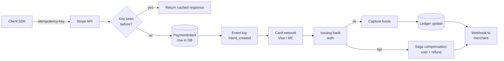

# Case Study: Payment Systems Architecture (Stripe, FedNow, Shopify)

> Money plus distributed systems is the hardest problem in tech. ACID is non-negotiable.

## The hook

Payments are the canonical CP system. A charge has two acceptable end states: fully completed, or fully rolled back. Never both. Never neither. Networks will partition, services will die, banks will time out — and the ledger still has to balance at midnight.

Stripe runs hundreds of billions of dollars a year on a system that takes ACID dead seriously. Shopify designs for Black Friday peaks where a five-second timeout hits 80,000 carts. The Federal Reserve launched FedNow in 2023 to settle directly between bank accounts in seconds, 24x7. Three different scales, same hard problem: every dollar has to be accounted for, and "we'll figure it out later" is not a strategy.

If you only learn one architecture in this course end-to-end, make it this one. The patterns survive everywhere money moves.

## The concept

Payment systems are built from a small set of patterns that show up together because the problem demands them.

1. **Idempotency keys on every write.** The client sends a unique key with each charge. The server stores it. Same key on retry returns the original response, not a second charge.
2. **Saga pattern for multi-step workflows.** A payment touches your DB, the card network, the issuing bank, your ledger, and the merchant's webhook. You can't hold a 2PC lock across companies. You commit each step locally and define compensations (refund, void, reverse) when a later step fails.
3. **Event sourcing for the ledger.** The source of truth is an append-only log of state transitions: `intent_created`, `auth_succeeded`, `captured`, `refunded`. The current row is a projection. Every dollar is auditable backwards.
4. **Circuit breakers around external dependencies.** Banks have transient errors. Card networks have bad afternoons. You wrap every external call so a slow downstream cannot eat your thread pool.
5. **Reconciliation, not just code.** Every night you compare your ledger against bank statements. Mismatches become tickets. The code is the optimist; reconciliation is the audit.

ACID at the row level keeps individual records honest. Sagas at the workflow level keep cross-system flows honest. Both are required.

## Diagram

The compensation arrow is the saga in one picture. Any step downstream of `intent_created` can fail; each failure has a defined rollback that puts the system back into a balanced state. The webhook fires either way — the merchant gets told the truth.

## Example — tracing one Stripe charge

A customer taps "Pay" on a Shopify checkout. Walk it from client to settled funds.

**1. Client SDK call.** The merchant's server calls `stripe.paymentIntents.create()` with an `Idempotency-Key` header set to a ULID generated for this checkout attempt. Header looks like `Idempotency-Key: your-idempotency-key-here`. The Stripe SDK retries on network errors, reusing the same key.

**2. Idempotency check.** Stripe's API gateway hashes the key, looks it up in a fast key-value store. Hit means "we processed this already" — return the original JSON response and stop. Miss means "first time" — proceed and store the key.

**3. Persist the intent.** A `PaymentIntent` row is written in a transactional DB (Postgres, sharded by account). Status: `requires_confirmation`. This commit is the durable promise that something happened. ([See: acid-cap-base](acid-cap-base.md))

**4. Publish the event.** An `intent_created` event lands in Kafka. Downstream services — fraud scoring, risk, analytics — consume independently. The event log is the auditable timeline. ([See: event-sourcing](event-sourcing.md))

**5. Talk to the card network.** Stripe calls Visa or Mastercard with the card details. The network forwards to the issuing bank for authorization. This call is wrapped in a circuit breaker — if the network is degraded, opens the breaker and fails fast instead of piling up requests. Read timeout around 5 seconds, write timeout around 1 second per Shopify's playbook.

**6. Bank decisions.** The issuing bank approves, declines, or asks for 3D Secure. Approval returns an `auth_code`. Stripe writes `auth_succeeded` to the event log and updates the row.

**7. Capture (often async).** For most flows, capture happens immediately and money moves into Stripe's settlement account. Some flows (auth-then-capture for marketplaces) hold authorization for hours or days and capture later.

**8. Settlement.** The actual interbank movement takes 1–2 business days through ACH or card-network settlement. Stripe fronts the merchant during that window — they're carrying the credit risk.

**9. Webhook to merchant.** Stripe POSTs `payment_intent.succeeded` to the merchant's URL. The webhook is signed, retried with exponential backoff, and replayable from the event log if the merchant's endpoint was down. ([See: webhooks](webhooks.md))

**10. Saga rollback (if step 5 or 6 fails).** Bank declines after the row is written? Mark `requires_payment_method`, fire `payment_intent.payment_failed`, no money moved. Network call succeeded but capture failed? Issue a `void` to the network and unwind. Every failure mode has a defined compensating action.

End-to-end: roughly ten services, multiple cross-company hops, every step idempotent and recorded. The customer waits around 1–3 seconds. The ledger balances by morning.

## Mechanics — the payments pattern table

| Pattern | What it does | Where it shows up |
|---|---|---|
| **Idempotency keys** | Client-supplied unique ID; server replays original response on retry | Every write API. Stripe requires it; well-designed APIs expose it. Use ULID over UUIDv4 — sortable, paginatable. |
| **Saga** | Sequence of local commits with defined compensations on failure | Multi-step flows: charge → auth → capture → settle. Replaces 2PC across systems you don't own. ([See: distributed-patterns](distributed-patterns.md)) |
| **Event sourcing** | Append-only log of state changes; current state is a projection | The ledger. Lets you audit any row backwards and replay history into a new system. |
| **At-least-once retries** | Repeat failed external calls until success or final failure | Banks and card networks have transient errors. Combined with idempotency, repeats are safe. |
| **Circuit breakers** | Stop calling a failing dependency after error rate crosses threshold | Wrap every external call. Shopify's Semian library does this for HTTP, MySQL, Redis, gRPC. |
| **Reconciliation** | Nightly compare your ledger against bank statements; flag mismatches | The audit layer. Code is optimistic; recon catches what code missed. Store breaks in a DB and chase them down. |
| **Webhooks** | Push state changes to merchants over HTTPS, signed and retried | How merchants find out a charge succeeded. Built on the same event log. |
| **Pull payments** | Merchant pulls money from cardholder's account on approval | Standard card swipe. Sender authorizes; receiver initiates. Settlement is delayed (1–2 days for cards, 1–3 for ACH). |
| **Push payments** | Sender's bank pushes money in real time, often instantly | FedNow, RTP, Visa Direct, Mastercard Send. Settlement is final in seconds. Different fraud profile — irreversible. |

The pull-vs-push distinction matters. Cards and ACH are pull: the receiver initiates, money settles later, and chargebacks are possible for weeks. FedNow and RTP are push: the sender initiates, settlement is final in seconds, and there is no chargeback. Architectures look similar; risk models do not.

## Related concepts

| Concept | Why it shows up here |
|---|---|
| **[ACID & CAP/BASE](acid-cap-base.md)** | Payments are the textbook CP example. You give up availability before you give up consistency — better to fail a charge than to double-charge. |
| **[Distributed Patterns](distributed-patterns.md)** | Saga, idempotency, circuit breakers, retries with backoff. The whole pattern set is on display in one product. |
| **[Event Sourcing](event-sourcing.md)** | The ledger is an event log. Every state change is a fact you can replay. Auditors and engineers both need this. |
| **[Webhooks](webhooks.md)** | The standard way payment processors notify merchants. Signed, retried, idempotent on the receiving side. |
| **[Observability](observability.md)** | Four golden signals (latency, traffic, errors, saturation) plus structured logs plus reconciliation. You cannot run a payment system you cannot see. |
| **[Message Queues](message-queues.md)** | Kafka or equivalent under the event log. Decouples downstream consumers (fraud, analytics) from the request path. |
| **[API Gateway](api-gateway.md)** | Where idempotency lookup, auth, and rate limiting live before the request reaches business logic. |
| **Case Study: Stack Overflow** | The opposite story — a high-traffic system that chose simpler consistency because the cost of a duplicated upvote is zero. Useful contrast. |

## When (and when not) to copy this pattern

**Copy it when:**

- You are **moving money or any irreversible value** — payouts, refunds, transfers, crypto, gift cards, points with cash equivalence.
- **Double-execution is unacceptable** — the operation cannot be safely repeated. Charging a card twice, sending an email is fine; sending a wire twice is a Tuesday-night incident.
- You have **external systems you don't control** in the critical path — banks, networks, partners. 2PC is off the table; sagas and idempotency are mandatory.
- You have **regulatory or audit obligations** — the event log isn't optional, it's evidence.

**Skip it (or simplify) when:**

- The operation is **safely retryable without state**. A read API, a search, a cache update. Idempotency keys add overhead with no payoff.
- Your "transactions" are **inside one database**. A regular DB transaction beats a hand-rolled saga every day. Reach for sagas only when the transaction crosses systems.
- You're **early-stage and not handling money yet**. Adding event sourcing and reconciliation infrastructure to a CRUD app is a tax you don't owe. Pay it when the product earns it.
- You have **at-most-once semantics from a higher layer** — exactly-once messaging via Kafka transactions, for instance — and don't need application-level idempotency.

The honest version: most apps don't need the full payments stack. But the moment you touch money or anything irreversible, every shortcut comes back as a 2 a.m. ledger break.

## Key takeaway

- **Money systems make trade-offs cheap apps don't have to think about** — and the patterns that survive at Stripe's scale (idempotency + saga + event log + reconciliation) are the templates the rest of us copy when the stakes climb.
- **Idempotency keys on every write.** The client owns the key, the server enforces dedup. ULID over UUIDv4 — sortable beats random.
- **Saga, not 2PC.** You don't own the bank's locks. Local commits with explicit compensations are the only realistic shape across companies.
- **Event log is the ledger.** Append-only, auditable, replayable. Current state is a projection of the log, not a competing source of truth.
- **Reconcile every night.** Code lies; the bank statement doesn't. Mismatches become tickets, not silence.
- **Pull vs push changes the risk model.** Cards = chargebacks for weeks. FedNow/RTP = final in seconds, no take-backs.

---

*Quiz available in the SLAM OG app — three questions on idempotency keys, why sagas beat 2PC across companies, and when the full payments stack is overkill.*
