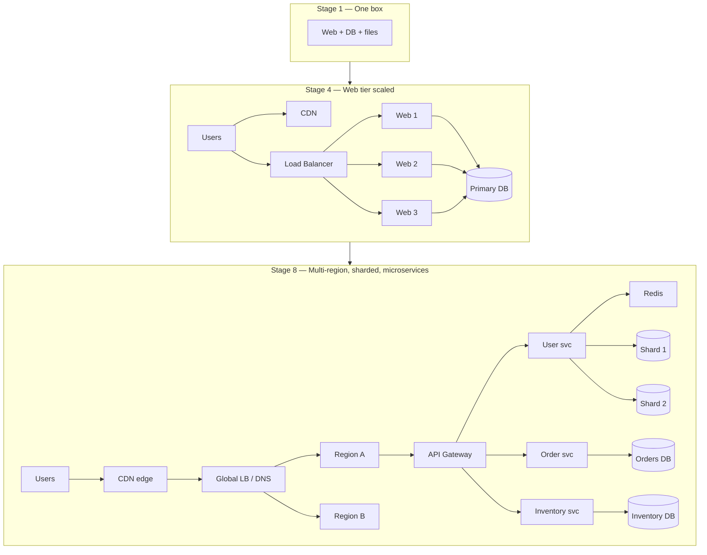

# Case Study: Scaling a Web App to Millions of Users

> From one box to a million users, in seven steps.

## The hook

When you launch, one server runs everything. The web app, the database, the background jobs, the static files — all on the same box. It's beautiful. It fits in your head.

Then growth happens. And the bottlenecks reveal themselves in a predictable order: the web server first (split it from the DB), then the DB (replicate the reads), then static assets (push them to a CDN), then sessions (move them into a cache), then writes (shard, eventually).

This is the canonical scaling progression. Every architecture interview asks it because every real growth story walks it. The trick isn't memorizing the stages — it's knowing which one *you're* in and resisting the next one until the data forces your hand.

## The concept

Scaling isn't a destination, it's a sequence of forced moves. Each stage is triggered by a specific bottleneck and unlocks the next horizon of growth.

**Stage 1 — One box.** Web server, database, files, cron jobs all together. Cheapest possible setup. Works fine up to roughly 10K monthly users for most CRUD apps.

**Stage 2 — Split web tier from DB.** Two boxes. The web server and the database stop fighting each other for RAM and CPU. Same code, double the headroom.

**Stage 3 — Load balancer + replicated web tier.** Web servers go horizontal. A load balancer fronts them. Now a deploy doesn't take the site down, and a single dead box doesn't either.

**Stage 4 — CDN for static assets.** Images, CSS, JS, video — push them to the edge. Your origin servers stop serving bytes they shouldn't be serving.

**Stage 5 — Cache layer (Redis).** Hot reads stop hammering the DB. Sessions move out of the web servers so any box can handle any request.

**Stage 6 — Database read replicas.** Reads fan out to replicas. The primary handles writes only. Read-heavy workloads (most of them) get a 5-10x boost.

**Stage 7 — Sharding.** When the write primary itself can't keep up, the data gets split across multiple primaries by some key — user ID, tenant ID, region. Joins get awkward. You earned this.

**Stage 8 — Microservices and multi-region.** The monolith breaks into services owned by different teams. Traffic gets routed across regions for latency and failover. You now have an infra team.

Each stage is forced by a bottleneck the previous stage exposes. Skipping ahead is how startups burn runway.

## Diagram

The arrows between subgraphs aren't network paths — they're the timeline. You don't deploy stage 8 on day one. You arrive there one forced move at a time.

## The startup at each milestone

**1K users — one Heroku dyno fits fine.**

You're shipping features, not infra. Postgres add-on, one web dyno, maybe a worker. The whole thing costs $50/month. The bottleneck at this stage is *you*, not the architecture. Every minute spent on Kubernetes is a minute not spent on the product.

*What broke first:* nothing yet. *What fixed it:* shipping more.

**100K users — web tier split, Postgres read replicas.**

Page loads got sluggish during peak hours. The database was eating all the CPU on the shared box, leaving the Rails workers swapping. You moved the DB to its own host, then added a read replica because dashboards and feed reads were dominating traffic. The app code learned the difference between `Model.read` and `Model.write`.

*What broke first:* DB and web fighting for the same CPU. *What fixed it:* separation, then a read replica.

**1M users — CDN for assets, Redis cache, sharding decisions loom.**

Marketing put a 4MB hero image on the homepage. Origin bandwidth bill spiked. You moved static assets to CloudFront. Then session lookups started hitting the DB hard, so sessions and hot user data moved into Redis. Your team started arguing about sharding — you held the line and added more replicas instead. Sharding was still a year out.

*What broke first:* origin bandwidth, then session DB load. *What fixed it:* a CDN and a cache, in that order.

**10M+ users — microservices, regional failover, full infra team.**

The monolith got too big for any one team to own. Deploys were scary. The checkout team wanted to ship independently of the search team. You broke out services along team lines — not theoretical bounded contexts, *team* boundaries. You added a second region for failover after a single AZ outage cost you four hours of revenue. You hired an infra team because someone has to be on call for the shared platform now.

*What broke first:* deploy coordination across teams, then single-region risk. *What fixed it:* service boundaries that match team boundaries, plus multi-region.

## Mechanics: the stages, side by side

| Stage | Trigger (signal) | What you add | What you don't add yet | Common over-engineering |
|---|---|---|---|---|
| 1. One box | Launch day | App + DB on one host | Anything else | "Microservices from day one" |
| 2. Split tiers | DB and web fighting for RAM/CPU | DB on its own host | Replicas, cache, LB | Adding Redis before the split helps |
| 3. LB + web cluster | One web box can't take peak load; deploys cause downtime | Load balancer, 2-3 web servers | Read replicas, sharding | Kubernetes for two web servers |
| 4. CDN | Bandwidth bill from origin, slow asset loads for distant users | CloudFront/Fastly/Cloudflare | Multi-region origin | Edge compute before edge caching works |
| 5. Cache (Redis) | Repeated hot reads, session lookup latency | Redis for sessions + hot data | Sharded Redis, write-through | Caching everything; cache invalidation hell |
| 6. Read replicas | Read load saturates DB primary; reports kill production | 1-3 read replicas, read/write split in app | Sharding | Six replicas when two would do |
| 7. Sharding | Write primary saturated even with cache; storage limit looming | Shard key, shard router, rebalancing tooling | Cross-shard joins | Sharding before you've maxed vertical Postgres |
| 8. Microservices + multi-region | Team coordination cost > infra cost; single-region risk is unacceptable | Service boundaries, API gateway, regional failover | Service mesh, fancy choreography | 30 services for 30 engineers |

The pattern: each stage adds *one thing* and only when the previous stage stops working. The over-engineering column is what kills startups.

## Related concepts

| Concept | Why it matters here |
|---|---|
| **load-balancers** | Stage 3. The first piece of infra most teams add when one box stops being enough. |
| **caching-strategies** | Stage 5. Redis (or Memcached) is the workhorse of this transition. Write-through, write-back, cache-aside — pick deliberately. |
| **database-sharding** | Stage 7. The hard one. Most apps never need it; the ones that do regret waiting. |
| **cdn** | Stage 4. Cheapest scaling win in the entire progression. Should arguably move earlier on bandwidth-heavy apps. |
| **case-netflix** | What stage 8+ looks like at planet scale. The microservices + multi-region pattern, fully expressed. |
| **case-stack-overflow** | The counter-example. Stack Overflow famously stayed on a small number of beefy servers. Vertical scaling, fewer moving parts. |
| **microservices** | The architectural shift in stage 8. Worth it when team coordination > service coordination. Not before. |
| **distributed-patterns** | Circuit breakers, retries, idempotency keys — the survival kit you need once you're past stage 6. |

## When (and when not) to scale ahead

**Scale ahead when:**

- You have **real evidence** — load tests with realistic traffic shape, a measured growth curve, a known marketing event that will 10x demand
- A **specific bottleneck is days away** — your current p99 is 1.8s and trending up; you'll hit timeout territory before next quarter
- The **cost of being late is concrete** — losing the front page of Hacker News at the wrong moment, or a contracted SLA you'll breach

**Don't scale ahead when:**

- You're **guessing** — "we might need to handle 10M users someday" is not evidence
- You're **copying someone else's architecture** — Netflix's stack is right for Netflix, not for your 5K-user SaaS
- The **product hasn't found its shape yet** — premature infrastructure freezes a design you should still be free to change
- You're **bored** — the most expensive scaling work in the industry is engineers solving problems they haven't earned

Premature scaling kills startups by burning the runway you need to actually find the customers who would have created the scaling problem. Walk the stages. Let bottlenecks force the moves.

## Key takeaway

- **Scale when bottlenecks force you, not when blog posts suggest you should.**
- **Order matters.** Split tiers, then LB, then CDN, then cache, then replicas, then shard. Skipping creates rework.
- **Each stage adds one thing.** The over-engineering at every stage is doing two stages at once.
- **Vertical scaling is underrated.** A bigger box buys you a year. Use that year to ship product, not infra.
- **Microservices are a team-size problem, not a scale problem.** Break out services when team coordination hurts more than service coordination would.

---

*Quiz available in the SLAM OG app — three questions on first moves, when to shard, and the most common startup scaling mistake.*
