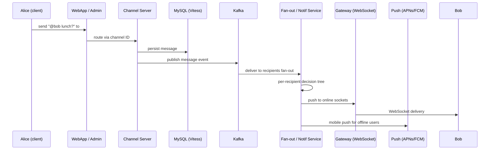

# Case Study: Slack Architecture

> Real-time messaging is the easy part. Deciding whether to ping you is the product.

## The hook

Slack feels simple. You type, your team sees it, the right people get a buzz. That's the whole job, right?

Not really. The hard part isn't moving the bytes — it's the question that runs every time a message lands: *do we interrupt this human?* Channel preferences, mute status, presence, mention type, keyword rules, do-not-disturb hours, mobile vs desktop. Each one is a branch. Get it wrong and you either spam everyone or hide the message that mattered.

The message bus is plumbing. The notification decision tree is the product.

## The concept

Slack runs on a few moving parts that each do one thing well:

- **Persistent WebSockets** for every online client. The pipe stays open so the server can push instantly — no polling.
- **Sharded MySQL** as the source of truth, partitioned by team (workspace) so one company's traffic doesn't drag another's.
- **Vitess** in front of MySQL for sharding logic — the YouTube-built layer that makes a fleet of MySQL shards look like one database.
- **Kafka** as the event spine. Messages, edits, reactions, and presence events all flow through it.
- **Channel Servers** that own a slice of channels via consistent hashing — each channel has one authoritative server.
- **Gateway Servers** in each region to terminate WebSockets close to users.
- **Job Queue** (Slack's own build) for async work — push delivery, search indexing, integrations.
- **Redis** for presence and hot caches.
- **The notification decision tree** — the per-recipient logic that decides "ping, badge, push, or silent."

Everything else exists to feed the last bullet.

## Diagram

The decision tree sits inside the fan-out step. Same message, different outcome per recipient.

## Example — tracing one message

Alice types `@bob lunch?` in `#general`. Three teammates are in the channel. Here's what happens to each one.

**Step 1 — write and publish.** WebApp authenticates Alice, hands the message to the Admin Server, which uses the channel ID to look up the right Channel Server. That CS appends the message to the channel history (MySQL via Vitess) and publishes a `message_posted` event to Kafka.

**Step 2 — fan-out per recipient.** The notification service consumes the event and walks the recipient list. For each person, the same decision tree runs:

| Recipient | Channel pref | Muted? | Presence | Mentioned? | Result |
|---|---|---|---|---|---|
| **Bob** | All activity | No | Online (desktop) | Yes | Desktop ping + badge |
| **Carol** | All activity | Yes (channel muted) | Online | No | Silent — mute wins when not mentioned |
| **Dave** | Mentions only | No | Offline (mobile) | No | Silent on desktop, no push (not mentioned) |
| **Erin** | Mentions only | No | Offline (mobile) | Yes | Mobile push via APNs/FCM |

Same payload, four outcomes. The "did the message arrive" question got resolved in milliseconds. The "should this human notice" question is what the system spent its cycles on.

**Step 3 — delivery paths.** Online clients get the message over their WebSocket through the regional Gateway Server. Offline mobile clients get a push via APNs (iOS) or FCM (Android), routed through Slack's mobile push service. Desktop badges and unread counts update via the same WebSocket frame.

The decision tree isn't a config file — it's a service. It reads channel settings, user prefs, DND windows, presence state, mention parsing, and keyword rules, and outputs a delivery plan per recipient.

## Mechanics — Slack's stack

| Layer | Tech | What it does |
|---|---|---|
| **Storage** | Sharded MySQL + Vitess | Source of truth. Sharded by team so workspaces are isolated. Vitess hides the sharding from app code. |
| **Event bus** | Kafka | Every message, edit, reaction, presence change goes here. Decouples producers from the dozens of consumers. |
| **Channel ownership** | Channel Servers + consistent hashing | Each channel pinned to one CS. CS owns ordering and history. Hash ring rebalances on failure with minimal churn. |
| **Real-time pipe** | Gateway Servers + Envoy + WebSockets | Long-lived connections terminated regionally. Envoy handles proxying and TLS. |
| **Async work** | Slack Job Queue (Kafka-backed) | Push notifications, search indexing, integrations, webhooks. |
| **Cache / presence** | Redis | Who's online, hot channel metadata, rate-limit counters. |
| **Mobile push** | Robyn (internal router) → APNs / FCM | Per-device routing, batching, retry, delivery feedback. |
| **Notification logic** | Notification decision service | The tree. Reads prefs + state, emits a per-recipient plan. |

The notification matrix in plain terms:

1. Is the recipient mentioned (`@user`, `@here`, `@channel`) or did a keyword match? If yes, the message is "important."
2. What's the channel preference? `All activity`, `Mentions only`, or `Nothing`.
3. Is the channel muted? Mute beats `All activity` but loses to a direct mention.
4. Is the user in DND? DND silences interruptive notifications but still updates the badge.
5. Where is the user? Online → WebSocket frame + desktop ping. Offline → mobile push.
6. Which device(s)? Push goes to active devices only; desktop pings respect focus state.

Every "obvious" notification is the output of this whole tree.

## Related concepts

| Concept | What it is | How it relates to Slack |
|---|---|---|
| **Message Queues & Brokers** | Async event delivery between services | Kafka is Slack's spine. Every message becomes events that fan out to many consumers. |
| **Microservices** | Independent services owning bounded responsibilities | WebApp, Admin, Channel Server, Gateway, Push, Notif — each is its own service with its own scaling story. |
| **WebSockets / Push** | Long-lived bidirectional pipes vs OS-level push | Online users get WebSockets; offline mobile gets APNs/FCM. The notification service picks. |
| **Observability** | Metrics, traces, logs across distributed services | At Slack scale, "did the notification fire?" is only answerable with end-to-end tracing across CS → Kafka → Notif → Gateway. |
| **Distributed Patterns** | Consistent hashing, sharding, fan-out | Channel Servers via consistent hashing, MySQL sharded by team, fan-out per recipient. |
| **Case Study: Discord** | Different chat platform at different scale | Discord optimizes for huge public servers and voice; Slack optimizes for workplace channels and notification fidelity. Same problem, different trade-offs. |
| **Sharded SQL / Vitess** | Horizontal MySQL partitioning | Vitess lets Slack treat a fleet of MySQL boxes as one logical store, sharded by team. |
| **Event-driven Architecture** | Services react to published events | The Kafka event log is what makes search indexing, integrations, and notifications possible without coupling them to the write path. |

## When (and when not) to copy

**Copy this when:**

- Real-time, bidirectional messaging is the core product (chat apps, collaboration tools, live co-editing).
- Recipients have rich, per-conversation preferences and you need to honor them precisely.
- You expect long-lived sessions where users stay connected for hours.
- Workspace-style multi-tenancy where one customer's traffic must not leak into another's.

**Skip it when:**

- "Messaging" in your app really means "send a transactional notification." A queue plus an email/push provider beats a WebSocket fleet every time.
- You have intermittent activity (alerts, status updates) — polling or server-sent events are simpler.
- Team is small and you don't need cross-region presence. Don't run Gateway Servers in three regions for an MVP.
- Your fan-out is small (one-to-one or one-to-handful). The whole channel-server-and-decision-tree architecture is overkill until you're broadcasting to hundreds of recipients per message.

Most "we need chat in our app" requirements are solved by a hosted service (Stream, PubNub, Pusher) or a thin custom layer over Postgres + WebSockets. You graduate to Slack-shaped architecture when chat *is* the company.

## Key takeaway

- **The notification decision tree is the product, not the message delivery.** Anyone can move bytes; the value is in deciding when to interrupt a human.
- **Consistent hashing pins each channel to one server** — that's how Slack gets ordering and minimal-churn rebalancing in the same design.
- **Kafka decouples writes from everything downstream** — search, push, integrations, analytics all consume the same event stream.
- **Vitess + sharded MySQL** is a credible alternative to NoSQL for chat-scale data when you want SQL semantics.
- **WebSockets for online, push for offline.** The notification service picks the lane per recipient, per device.
- **Don't copy this for "we send the occasional alert."** WebSocket fleets are for products where chat is the experience.

---

*Quiz available in the SLAM OG app — three questions on consistent hashing, the mute-vs-mention rule, and when this architecture is overkill.*
