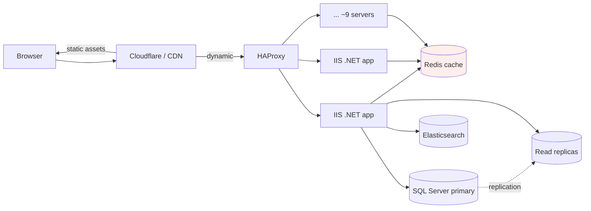

# Case Study: Stack Overflow Architecture

> Scale on a monolith and 9 servers — the system that broke everyone's microservices assumptions.

## The hook

Stack Overflow serves **1.3+ billion pageviews a month** across 200+ sites. The stack: a monolithic .NET application, SQL Server, Redis, and roughly 9 web servers in a data center they own.

No microservices. No Kubernetes. No NoSQL. No event-sourced CQRS pipeline. No "platform team" of 40 engineers keeping the orchestrator alive.

Walk into a system design interview and propose this and you'll probably be asked to try again. But it's been running like this, profitably, for over a decade. The architecture is a deliberate rebuke of the "you must microservice" orthodoxy — and it's worth understanding why it works before deciding what to copy from it.

## The concept

Call it **boring but fast.** Every choice points the same direction: minimize moving parts, push hardware harder, make the common path cheap.

Four pillars:

1. **Monolith over microservices** — one .NET application, one deployable, one set of logs to read when something breaks.
2. **Vertical scale on the database** — instead of sharding SQL Server across 50 boxes, run a few enormous ones with enough RAM to hold the working set in memory.
3. **Aggressive caching with Redis** — hot pages, fragments, user sessions. The database only sees what the cache misses.
4. **Hand-tuned SQL** — no ORM doing N+1 queries behind your back. Engineers read query plans.

The wins come from competence, not architecture. A team that profiles their slow queries and tunes the cache will beat a team distributing the same problem across a dozen services.

## Diagram

Count the boxes. There aren't many. Static assets fan out through Cloudflare; everything else lands on a small fleet of app servers that lean on Redis first, SQL Server second, Elasticsearch only when you actually search.

## Example — tracing a question page load

You click a Stack Overflow question link. Here's what happens.

1. **Browser → Cloudflare.** Static assets (JS, CSS, avatars, images) come straight from the CDN edge. Most page weight never reaches the origin.
2. **Cloudflare → HAProxy.** The HTML request hits HAProxy, which picks one of the app servers.
3. **App server → Redis.** Before touching the database, the server looks for cached fragments — the question header, the rendered answer list, user reputation. Cache hit means no SQL at all.
4. **App server → SQL Server.** On a miss, a hand-written, indexed query pulls the question and answers. Reads can go to a replica; writes go to the primary.
5. **Render and return.** A Razor view stitches the fragments together. The response heads back through HAProxy and Cloudflare to your browser.

The published numbers say most pages render in **under 25 ms at p95** at the app layer. That's not an accident — it's what you get when the working set lives in RAM and the queries don't do anything stupid.

## Mechanics — the actual stack

| Layer | Tool | Notes |
|---|---|---|
| Edge | Cloudflare | Static assets, DDoS, TLS at the edge |
| Load balancer | HAProxy | L7 routing in front of the app fleet |
| App servers | ~9 IIS boxes running .NET | Roughly 5,000+ requests/second at peak |
| Cache | Redis | Page fragments, sessions, hot keys |
| Primary DB | SQL Server | Reportedly 1.5 TB of RAM at one configuration |
| Read replicas | SQL Server | Offload read traffic from the primary |
| Search | Elasticsearch | Full-text question/answer search |
| Monitoring | Bosun | Open-sourced by Stack Overflow |
| Dashboards | Opserver | Also open-sourced internally |

The team has written publicly about chasing query plans, fixing index bloat, and tuning Redis eviction. The interesting work isn't "how do we add another service" — it's "why is this query reading 200 MB to return one row."

## Related concepts

| Concept | What it is | How it relates |
|---|---|---|
| **Caching strategies** | Patterns for layering a fast store in front of a slow one | Redis is doing serious work here — it's the difference between a busy database and a melting one. |
| **SQL fundamentals** | Relational schemas, indexes, query plans | Stack Overflow is the strongest argument that hand-tuned SQL beats an ORM at scale. |
| **Microservices** | Splitting an app into independently deployed services | The counter-example. Stack Overflow proves you can postpone — or skip — microservices longer than people think. |
| **Case: Netflix** | Hundreds of microservices, AWS, layered load balancers | Opposite philosophy, also working. The lesson is that "right" depends on the workload. |
| **Database types** | Choosing relational vs. document vs. key-value | Q&A maps cleanly onto relational tables. The boring choice was the right one. |
| **Redis & in-memory stores** | RAM-speed key-value cache | The hot path lives here, not in SQL. |
| **Database sharding** | Splitting one logical DB across many physical ones | What Stack Overflow chose *not* to do. Vertical scale + replicas got them further. |

## When (and when not) to copy this

**Copy the pattern when:**

- The workload is **read-heavy** — far more pageviews than writes. Caching pays off enormously.
- The data is **single-tenant or simply shaped** — Q&A, e-commerce catalogs, internal tools. CRUD with relations.
- Your team is **small enough** that one codebase is a feature, not a constraint.
- You can **buy bigger hardware** before you need to split horizontally.

**Skip it when:**

- You genuinely need **horizontal write scale** that one SQL Server can't deliver — multi-region writes, planet-scale social graphs, real-time event firehoses.
- The product is a **platform of independent products** with separate teams who need to ship without coordinating deploys.
- Compliance or tenancy demands **strict isolation** between customers at the infrastructure level.
- You're **already paying** the microservices tax — splitting back is a bigger project than not splitting in the first place.

The honest read: most teams that adopted microservices early didn't have a Stack Overflow workload, and didn't have a Netflix workload either. They had a CRUD app and an architecture diagram their staff engineer liked. Don't microservice until you have an organizational reason — independent teams, independent release cadences, independent failure domains — not just a scale story you read on a blog.

## Key takeaway

- **One fast box plus caching beats 50 slow services** for read-heavy CRUD workloads.
- **Vertical scale is undervalued.** A SQL Server with enough RAM to hold the working set is a different animal than the one in the demo.
- **Boring is a feature.** Fewer moving parts means fewer pages at 3 a.m.
- **The architecture is downstream of the workload.** Stack Overflow's stack is wrong for Netflix and right for Stack Overflow. Pick based on your traffic shape, not the conference talk you liked.
- **Earn your complexity.** Microservices, sharding, and event sourcing are tools — pull them out when you have a problem they solve, not before.

---

*Quiz available in the SLAM OG app — three questions on Stack Overflow's server count, why one primary SQL Server is enough, and the load-bearing lesson of the architecture.*
