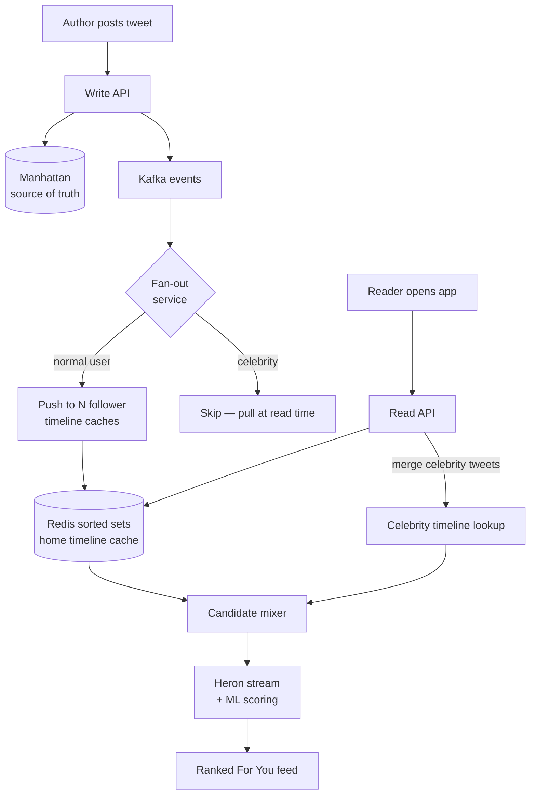

# Case Study: Twitter Architecture

> Fan-out is the hardest problem in social. Twitter solves it with a hybrid.

## The hook

@taylorswift13 hits "Tweet."

She has ~100 million followers. Within seconds, every one of those people might open the app and expect to see the post near the top of their feed. How does that tweet get there?

Two obvious answers, both broken at scale:

- **Push** — when she posts, write the tweet into 100 million home timeline caches. Now a single tweet costs 100 million writes. One Beyoncé reply later, the whole cluster is on fire.
- **Pull** — don't precompute anything. When a user opens the app, query "all tweets by everyone I follow, in the last day, sorted." For someone following 5,000 accounts, that's a 5,000-way fan-in on every refresh.

Pure push melts on celebrities. Pure pull melts on power users. Twitter does both — push for the long tail, pull for the celebrities — and merges the two streams when you open the app. That's the whole trick.

## The concept

Twitter started as a Rails monolith. The "Fail Whale" was its mascot for a reason — the architecture couldn't keep up with traffic spikes, and the site went down often enough to make it a meme. The rebuild moved the system onto the JVM (Scala, Java) and split it into hundreds of services around three big ideas:

1. **Hybrid fan-out** — most users push their tweets into follower timeline caches at write time. Celebrity tweets are pulled at read time and merged in.
2. **Cache-first reads** — the home timeline lives in Redis as a sorted set, keyed by user. The hot path never touches the source of truth on a normal scroll.
3. **ML re-ranks the result** — once you have candidate tweets, a scoring model decides the order. The chronological feed is the floor; "For You" is the product.

Trade-offs to name up front:

- Hybrid fan-out is *complex* — two write paths, two read paths, and a merge step. You only earn the complexity if you have a celebrity problem.
- Timeline cache is fast but eventually consistent. A tweet may take a beat to appear in every follower's feed.
- ML ranking adds latency on the read path. Twitter's budget is roughly 1.5 seconds end-to-end for "For You." That's not free — it requires Heron, feature stores, and aggressive caching of model inputs.

## Diagram

Push path on the left, pull path on the right, mixer in the middle. The dashed line in your head is the boundary between "precomputed at write time" and "computed at read time" — that's the hybrid.

## Example — tracing a "For You" timeline in 1.5 seconds

You unlock your phone and tap the Twitter icon. From that moment to a rendered feed, here's what happens:

**1. Cached feed lookup (~50 ms).** The client requests your home timeline. The read service hits Redis with your user ID and pulls a few hundred candidate tweet IDs out of a sorted set. These came from the push path — every non-celebrity you follow has already been written here.

**2. Celebrity merge (~100 ms).** In parallel, the service fans out short queries to the timelines of celebrities you follow. Their tweets weren't pushed; they live in their own author timeline and get pulled in now. Merge by timestamp.

**3. Candidate sourcing (~200 ms).** "For You" doesn't just want people you follow. The candidate generator pulls in roughly 500 million tweets across the network and filters down to about 1,500 that might interest you — based on graph signals, embeddings, and recency.

**4. Feature hydration + ML scoring (~800 ms).** Heron streams hundreds of features per candidate tweet (engagement counts, author signals, your recent interactions, embedding similarity). A neural network — open-sourced at ~48M parameters — scores each candidate. Higher score, higher rank.

**5. Filter and mix (~200 ms).** Drop near-duplicates, enforce author diversity (you don't want one account taking ten slots), splice in ads and "Who to Follow." Return the top ~50.

**6. Render (~150 ms).** The client paints the feed.

Total budget: ~1.5 seconds, p99. Miss that and the perceived experience drops fast — users scroll away from a blank screen in well under two seconds.

## Mechanics — the Twitter stack

Twitter has been unusually generous about open-sourcing the pieces. A non-exhaustive tour:

| Layer | Tool | What it does |
|---|---|---|
| **Source-of-truth DB** | Manhattan | In-house distributed key-value store. Holds tweets, users, the durable record. |
| **Graph DB** | FlockDB | Stores follower / following edges. Optimized for "give me everyone X follows" at scale. |
| **Hot-path cache** | Redis (sorted sets), Pelikan | Home timelines, fan-out targets. The hot read path lives here. |
| **Event bus** | Kafka, Kestrel | Tweet events flow through Kafka into fan-out, search indexing, analytics. |
| **Stream processing** | Heron *(OSS)* | Real-time feature computation for ranking. Successor to Storm. |
| **RPC framework** | Finagle *(OSS)* | Service-to-service calls across the JVM fleet. Handles retries, timeouts, load shedding. |
| **Orchestration** | Aurora on Mesos | Long-running services and batch jobs across the data center. |
| **Web UI** | Bootstrap *(OSS)*, React | Bootstrap originated at Twitter. The web client is a React/Redux app. |

The lesson is less "use Manhattan" and more **the shape**: a durable store, a graph store, a hot cache, an event bus, a stream processor, and an RPC layer. Most large social or feed-driven systems converge on this rough split, even if the specific tools change.

## Related concepts

| Concept | Why it shows up here |
|---|---|
| [Caching Strategies](caching-strategies.md) | The Redis timeline cache *is* the system. Fan-out is "warm the cache asynchronously." |
| [Message Queues](message-queues.md) | Kafka decouples the write path from fan-out. Without it, every post would block on N follower writes. |
| [Microservices](microservices.md) | Twitter's move off the Rails monolith is the canonical example of why and how to split a system. |
| [Distributed Patterns](distributed-patterns.md) | Hybrid fan-out is a precompute-vs-compute trade-off — the same shape as materialized views, CQRS, and read replicas. |
| [Observability](observability.md) | At 1.5s budgets across a chain of services, you don't survive without distributed tracing and tail-latency dashboards. |
| [Case: Netflix](case-netflix.md) | Same era, same JVM-microservices playbook, different load shape (video streaming vs feed fan-out). |
| [API Gateway](api-gateway.md) | The read path sits behind a gateway that does auth, rate limiting, and routing into the timeline service. |

## When (and when not) to copy this

**Copy hybrid fan-out when:**

- You have a **real social graph** with a long tail of normal users *and* a small set of celebrity-scale accounts.
- Your **read volume dwarfs write volume** — feeds are read constantly and posts happen occasionally. Precomputation pays.
- A **stale-by-seconds feed is acceptable**. Most social products tolerate it; banking, ticketing, and trading do not.
- You can afford the ops surface: a cache tier, an event bus, a stream processor, and the discipline to keep them healthy.

**Skip it when:**

- Your **read volume is low** — pull-on-read is simpler and cheaper. Don't precompute what nobody asks for.
- Your **graph is small or flat** — without celebrity-scale outliers, pure push is fine.
- You **need strong consistency** — fan-out is eventually consistent by design.
- You're **under 100k DAU**. The architecture is a tax until you have the traffic to justify it. Ship a simpler version, measure where it hurts, then upgrade the hot path.

The principle: don't import Twitter's architecture before you have Twitter's problem. Import the *shape of thinking* — "where does precompute beat compute, and where does it break?" — long before you import the tools.

## Key takeaway

- **Hybrid push/pull is what makes celebrity-scale fan-out work.** Push for the long tail, pull for the outliers, merge at read time.
- **The home timeline cache is the product.** When Redis is hot, Twitter is fast. When it isn't, nothing else helps.
- **ML ranking sits on top of a chronological substrate.** Get the candidates first, then re-rank — don't try to do both in one pass.
- **The stack converges on a pattern:** durable store + graph store + hot cache + event bus + stream processor + RPC. Specific tools vary; the split is stable.
- **Complexity is earned, not chosen.** Hybrid fan-out is the right answer at 100M followers and the wrong answer at 100.

---

*Quiz available in the SLAM OG app — three questions on why hybrid fan-out exists, what Heron does in the read path, and when this architecture is worth copying.*
