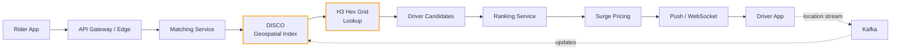

# Case Study: Uber Architecture

> Real-time matching at planet scale — and the cost of getting there.

## The hook

A rider in Manhattan opens the app. A driver three blocks away is idling at a red light. They have maybe four seconds before the rider gets bored, taps away, and tries Lyft.

Now multiply that by a few million simultaneous matches across hundreds of cities, with drivers moving every second, prices shifting with demand, and every step needing to feel instant.

That's the problem Uber's architecture exists to solve. It's not "build a website." It's "match two moving points on a map, profitably, before the human gives up."

## The concept

Uber is a study in three things at once.

**Real-time geospatial matching.** Most apps query a database. Uber queries a live index of where every driver in a city *is, right now*. The data shape is different. The latency budget is different. The failure mode (sending a driver to the wrong block) is different.

**Service explosion.** Uber runs around **3,000 microservices**. That number is the strength and the warning. It let thousands of engineers ship in parallel. It also produced a debugging nightmare so severe that Uber's own engineers have written postmortems about it. More on that below — it's the most quoted lesson from this stack.

**Custom infrastructure for the hot path.** Generic tools (Postgres, Kafka) get them most of the way. The pieces that touch a live ride — Schemaless, DISCO, H3, Ringpop, Cadence — they built. When your workload is genuinely unusual, off-the-shelf eventually breaks, and you write your own.

## Diagram

The orange boxes are the geospatial hot path. Drivers stream their locations into Kafka, DISCO keeps a live index keyed by H3 hex cell, and the matching service queries that index instead of a row store.

## Example — one ride, end to end

You tap "Request" in Brooklyn. Here's what happens.

**1. Rider request hits the gateway.** Uber's edge runs on top of NGINX with their own dynamic config layer. The request gets authenticated, rate-limited, and routed to the matching service. gRPC over the wire, Apache Thrift for the schema.

**2. The matching service asks DISCO "who's nearby?"** DISCO is Uber's dispatch system. Internally, it doesn't store drivers in rows — it stores them by **H3 hex cell**. H3 is Uber's open-source geospatial index: it tiles the earth in hexagons at multiple resolutions. Your request resolves to a hex, DISCO grabs that hex plus its six neighbors, and you get a candidate list of available drivers in milliseconds.

**3. Driver locations stream in continuously via Kafka.** Every active driver pings their GPS every few seconds. Those updates flow through Kafka, get applied to DISCO's in-memory index, and partition across the cluster using **Ringpop** — Uber's library for consistent-hash sharding. A driver moving from one hex to another is a routine update; a hex going hot (lots of demand) gets more shard capacity.

**4. The ranking service scores the candidates.** Distance is the obvious signal, but it's not the only one. ETA given current traffic, driver acceptance rate, vehicle type, rider preference — all weighted together. The top candidate wins.

**5. Surge pricing checks in.** A separate service decides whether this hex is in surge based on supply-vs-demand signals from the last few minutes. The fare gets quoted before the driver is offered the trip — so the rider sees a price they can accept or reject.

**6. The driver gets pinged.** Mobile push for the wake-up; an open WebSocket carries the actual offer payload because push delivery is best-effort and not fast enough alone. The driver has ~15 seconds to accept. If they decline, the matching service walks down the candidate list.

**7. The whole workflow is orchestrated by Cadence.** Cadence is Uber's open-source workflow engine — think durable, replayable functions that survive restarts and retries. The "ride" is a Cadence workflow with checkpoints: requested, matched, en-route, arrived, completed. If a service crashes mid-trip, Cadence resumes from the last checkpoint instead of losing the ride.

End to end, from tap to driver-ping, the budget is roughly two seconds. Most of that is map tiles and UI; the matching itself is a few hundred milliseconds.

## Mechanics — Uber's stack

The pieces worth knowing by name:

| Component | What it does | Notes |
|---|---|---|
| **DISCO** | Real-time geospatial dispatch / matching | The heart of the platform. In-memory, sharded by hex. |
| **H3** | Hexagonal hierarchical geospatial index | Open-sourced. Used outside Uber for logistics and analytics. |
| **Schemaless** | Custom key-value layer on top of MySQL/Postgres | Append-only, sharded, designed before DocStore took over. |
| **DocStore** | Strongly-consistent OLTP store on MySQL/Postgres + RocksDB | Newer than Schemaless; the current default for transactional data. |
| **Cadence** | Durable workflow orchestration | Open-sourced. Used for ride state machines, payouts, anything multi-step. |
| **Kafka** | Event streams (driver locations, trip events, telemetry) | Standard Kafka, Uber-scale clusters. |
| **Ringpop** | Consistent-hash sharding library | How DISCO and friends partition state across nodes. |
| **uMonitor / M3 / Jaeger** | Metrics, time-series storage, distributed tracing | Tracing matters when one ride touches dozens of services. |
| **Spinnaker + uBuild + Bazel** | CI/CD on a monorepo | Buildkite under uBuild; Netflix Spinnaker for deploy. |

The pattern: open-source where the problem is generic (Kafka, Spinnaker, MySQL), custom where the problem is *theirs* (DISCO, H3, Schemaless, Cadence). When the custom thing turned out to be useful elsewhere, they open-sourced it. H3 and Cadence are both running in companies that have nothing to do with rideshare.

## Related concepts

| Concept | Why it shows up here |
|---|---|
| **Microservices** | Uber is the canonical "we went too far" example. ~3,000 services. Read their internal blog posts about the resulting complexity before you split your monolith into 200 services. |
| **Message queues** | Kafka is the spine. Driver locations, trip events, surge signals — all flow as events, not synchronous calls. |
| **Distributed patterns** | A ride is a saga: many services touch it, partial failures are normal, compensating actions exist (refunds, re-matches). Cadence is how Uber expresses that saga durably. |
| **Case: Netflix** | Different scale problem entirely. Netflix optimizes a global cache for video delivery; Uber optimizes a real-time geospatial index. Compare the two stacks side by side. |
| **Event sourcing** | The trip log is effectively an event stream — every state change emits an event, and the trip's current state is a fold over those events. |
| **Observability** | Tracing one ride across 30+ services is the actual day-to-day problem. Jaeger plus uMonitor plus M3 exist because you cannot reason about this system without them. |
| **CI/CD** | Monorepo + Bazel + Spinnaker — how you ship safely when 3,000 services need updates and rollbacks. |

## When (and when not) to copy this

**Copy it when:**

- You really do have **real-time geospatial matching** — rideshare, delivery, dispatch, field service. The H3 + DISCO-style pattern is the right tool when your queries are "what's near this point, right now."
- You operate at **city or country scale per market**, with millions of state changes per minute.
- You have an engineering org large enough to maintain custom infrastructure without it becoming an albatross.

**Don't copy it when:**

- You're an **"Uber for X" startup** with 200 customers. You do not need 3,000 services. You probably don't need 30. Build a Rails/Django/Spring monolith with PostGIS and ship.
- Your matching can run **in batches** (overnight delivery routing, weekly schedules). H3 still helps; DISCO-style real-time dispatch is overkill.
- You're tempted by Cadence/Kafka because they're cool. Cool is a tax. Adopt them when a synchronous call has *actually* failed you.

The honest read on Uber's architecture is that most of it exists because the business model demanded it. The matching has to be real-time. The data has to be geospatial. The volume is enormous. Without those three constraints, the same stack is a museum of over-engineering.

## Key takeaway

- **Real-time geospatial is its own discipline.** H3, hex-cell sharding, in-memory indexes, location streaming over Kafka — these aren't generic backend skills, they're the price of doing rideshare-shaped work.
- **3,000 microservices is a warning, not a goal.** Uber's own engineers describe the operational cost. Split services for clear ownership boundaries; don't split them because the org chart grew.
- **Build custom only on the hot path.** Uber uses MySQL, Postgres, Kafka, Spinnaker like everyone else. The custom stuff (DISCO, H3, Schemaless, Cadence) lives where generic tools genuinely couldn't keep up.
- **Workflows beat ad-hoc orchestration.** A ride is a multi-step state machine that has to survive restarts. Cadence (or Temporal, its OSS sibling) is how you express that without writing your own retry and recovery logic in every service.
- **Observability is non-optional at this shape.** If a single user action touches dozens of services, tracing isn't a nice-to-have — it's how you debug at all.

---

*Quiz available in the SLAM OG app — three questions on hex grids, the microservices warning, and what fires first when a rider taps "request."*
