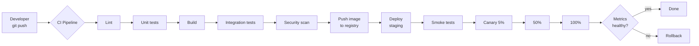

# CI/CD Pipelines

> Small changes, automated safety, ship daily. The big-batch release is dead for a reason.

## The hook

Shipping once a quarter is risky. Big batches mean every release is a bet, every rollback is a crisis, and every bug found in prod has months of code to dig through.

Shipping daily flips that. Small changes, small blast radius, easy rollbacks. When something breaks, you know which 50-line PR did it — not which of 500.

The thing that makes daily shipping safe is automation. CI catches what humans miss. CD takes the human out of the deploy. Together, they turn "scary release night" into "Tuesday afternoon."

## The concept

CI/CD is two halves with overlapping names. Get the names straight and the rest falls into place.

**CI — Continuous Integration.** Every push runs an automated build and test suite. The goal: catch breakage in minutes, not after merge. The practice: small PRs, fast pipelines, main branch always green. If a test fails, the build fails, the merge is blocked.

**CD — Continuous Delivery.** Every green build is *ready* to ship. A human still presses the button to release. You're release-ready every commit; you choose when to actually go.

**CD — Continuous Deployment.** Every green build *automatically* ships to production. No human approval. This requires real test confidence, real observability, and a fast rollback path — otherwise you're automating your own outages.

The progression matters. Most teams should ladder up:

1. **CI first** — get tests on every push, ship safely.
2. **Continuous Delivery** — automate the staging deploy, keep humans on the prod button.
3. **Continuous Deployment** — when the team is mature enough, take the human out of the prod step too.

Skipping straight to full CD without the foundation is how teams ship outages on autopilot.

## Diagram



Push triggers CI. CI gates on lint, tests, build, integration, security. Green build pushes an image, deploys to staging, runs smoke tests, then progressively rolls out to prod. Metrics decide whether to widen the rollout or roll back.

## Example — GitHub Actions on a Node.js service

The stripped-down version of a workflow that ships in production at thousands of teams:

```yaml
on: [push]

jobs:
  test:
    runs-on: ubuntu-latest
    steps:
      - uses: actions/checkout@v4
      - uses: actions/setup-node@v4
        with:
          node-version: '20'
      - run: npm ci
      - run: npm test
      - run: npm run build

  deploy:
    needs: test
    if: github.ref == 'refs/heads/main'
    runs-on: ubuntu-latest
    steps:
      - uses: actions/checkout@v4
      - run: ./deploy.sh
        env:
          DEPLOY_TOKEN: ${{ secrets.DEPLOY_TOKEN }}
```

What this earns you:

- **Every push runs tests in 3–5 minutes.** Branches, PRs, main — all of them. If your test suite breaks, the PR can't merge.
- **Merge to main triggers deploy.** The `if:` guard ensures only the main branch deploys. Feature branches test but don't ship.
- **Failed tests mean no deploy.** The `needs: test` line makes deploy depend on tests passing. Red build, no production.
- **Secrets stay in GitHub.** `${{ secrets.DEPLOY_TOKEN }}` is never written to the repo — managed in GitHub's secret store, injected at runtime.

Real production picks: **Stripe** ships hundreds of times per day on the back of extensive automated testing. **Etsy** famously runs 50+ deploys daily, instrumented through ChatOps and graphed dashboards. **Spotify** uses Spinnaker (open-sourced from Netflix) for advanced deployment workflows — multi-region, gated rollouts, automated rollback on metric regression.

The exact tool matters less than the shape. Build, test, gate, deploy.

## Mechanics

**Pipeline stages** — what each one catches

| Stage | What it catches |
|---|---|
| **Lint** | Style violations, dead code, obvious bugs (unused vars, missing awaits) |
| **Unit tests** | Function-level logic regressions — fastest signal, runs in seconds |
| **Build** | Compile errors, missing dependencies, broken type signatures |
| **Integration tests** | Service-to-service, DB queries, real HTTP — slower but catches what units can't |
| **Security scan** | Known CVEs in dependencies, leaked secrets, IaC misconfigurations |
| **Push image** | Tag the artifact and store it once — the same image flows to every environment |
| **Deploy to staging** | Catches environment-specific config bugs before they hit prod |
| **Smoke tests** | "Did the thing actually start and serve traffic?" — minimum viable prod check |
| **Deploy to prod** | The release itself, ideally with a progressive rollout strategy |

**Deployment strategies** — trade-offs

| Strategy | How it works | Trade-off |
|---|---|---|
| **Recreate** | Stop old, start new | Simplest. Has downtime. Only fine for internal tools. |
| **Rolling** | Replace instances one batch at a time | Default for Kubernetes. Zero downtime, but old and new run side by side mid-deploy. |
| **Blue/green** | Two full environments, flip traffic at the LB | Instant cutover, easy rollback. Doubles your infra cost during the window. |
| **Canary** | Ship to 5% → 50% → 100%, watch metrics | Catches bad releases before they hit everyone. Needs real observability to drive the gates. |
| **Feature flags** | Deploy code dark, enable per-user/segment | Decouples deploy from release. The most surgical option — and the most operational overhead. |

Default to rolling deploys (Kubernetes does this for free). Add canary when you have the metrics to drive it. Reach for feature flags when you need to test in prod with a controlled audience.

## Related concepts

| Concept | What it is | How it relates |
|---|---|---|
| **Containers (Docker)** | Packaged app + environment as a portable image | The artifact your CI builds and your CD deploys. Same image, every environment. |
| **Kubernetes** | Container orchestrator | Rolling deploys, health checks, and rollbacks are native. CD on Kubernetes mostly means generating the right YAML. |
| **Observability** | Metrics, logs, traces | Without it, you can't drive canaries, can't detect bad releases, can't safely automate prod deploys. |
| **Distributed patterns** | Circuit breakers, retries, sagas | Patterns that contain the blast radius of a bad deploy — a circuit breaker can save you while CD rolls back. |
| **GitOps** (Flux, ArgoCD) | Deploy by merging YAML to a config repo | The deployment pipeline is git itself. Cluster state is whatever's in the repo. Audit log built in. |
| **Feature flags** (LaunchDarkly, Unleash) | Runtime toggles for code paths | Lets you deploy and release independently. Ship the code Tuesday, enable for 1% of users Wednesday. |
| **Image registry** (ECR, GHCR, Docker Hub) | Storage for built images | The handoff point between CI and CD. Build pushes; deploy pulls. |
| **Secrets management** | Vault, AWS Secrets Manager, GitHub secrets | The pipeline needs credentials to deploy. They never live in the repo. |

## When (and when not) to invest deeply

**Invest in real CI/CD when:**

- **Team of 5+ engineers** — without automation, integration becomes a full-time coordination job
- **Daily releases or aspirations of one** — manual deploy doesn't scale past a few releases per week
- **Real customer impact when things break** — payment systems, healthcare, anything regulated
- **You've ever rolled back a bad deploy at 2 AM** — that pain is the lesson; automate it away

**Skip the heavy CD piece when:**

- **Solo project or weekend hack** — tests on push are still worth it; full CD is overhead
- **Prototype phase** — you're learning what to build, not optimizing how to ship it
- **Risk doesn't justify it** — a game studio shipping to consoles literally can't continuously deploy. Some industries ship in batches because they have to.
- **You don't have the observability to back it** — automated deploys without metrics is automated outages

The honest progression: **tests on every push** (table stakes for any team) → **automated staging deploy** → **controlled prod rollout with canary** → **full automation when the team is ready**. Don't skip steps. Each one builds the muscle for the next.

## Key takeaway

- **Small changes ship safer than big ones.** Tiny PRs reveal bugs in minutes; quarterly batches hide them for months.
- **CI catches what humans miss.** Lint, tests, security scans on every push — the bar is non-negotiable.
- **Continuous Delivery vs Deployment is about trust.** Delivery keeps a human on the button; Deployment removes them.
- **Canary + rollback is what makes CD survivable.** Ship to 5%, watch the metrics, widen or revert.
- **Don't fake CD.** Without real test coverage and observability, you're automating outages, not deploys.

---

*Quiz available in the SLAM OG app — three questions on CI vs CD, deployment strategies, and when full automation is the wrong choice.*
