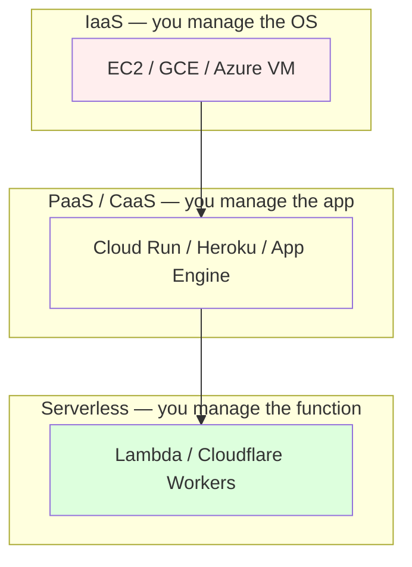

# Cloud-Native Architecture

> Design for the cloud, not in spite of it.

## The hook

"Lift and shift" to the cloud means running your old monolith on EC2 instead of a server in your closet. It works. The lights stay on. The bill arrives.

And the bill is bigger than your closet was.

You're paying cloud prices for on-prem architecture. Static instances, manual deploys, a database you SSH into when something breaks. Nothing about *how* you built the system changed — only *where* it runs.

Cloud-native means designing for what the cloud actually does well: elastic scale, managed services, ephemeral compute, declarative infrastructure. Different posture, different wins.

## The concept

Cloud-native is a set of architecture principles, not a stack. You can be cloud-native on AWS, GCP, Azure, or a private Kubernetes cluster. Five core ideas:

1. **Microservices** — small services, independent deploys. One team can ship without merging into a monorepo of doom.
2. **Containers** — packaged, portable workloads. Same image runs on your laptop, in CI, and in prod.
3. **Declarative infrastructure** — describe the desired state in code (Terraform, k8s manifests), let tools converge to it. No more clicking around the AWS console.
4. **Immutable infrastructure** — never SSH into a box to patch it. Rebuild the image, redeploy, throw away the old one.
5. **Managed services > self-hosted** — use the cloud's databases, queues, and caches. Don't run Postgres on an EC2 you forgot about.

The thread tying these together is **failure tolerance**. Cloud-native assumes hardware fails, networks partition, and services go down. The system heals because it was designed to.

## Diagram

Going up the ladder: less control, less ops, more vendor coupling. EC2 hands you a Linux box and walks away — you patch it, scale it, monitor it. Cloud Run takes a container and runs it for you. Lambda takes a function and runs it on demand. Pick the highest level you can tolerate the lock-in for.

## Example — Netflix's cloud-native journey

Netflix is the canonical case, and the story isn't "they moved to AWS." It's *why* they moved and what they built once they got there.

**2008 — the breaking point**

A database corruption took Netflix offline for days. They were running their own data center. The decision afterward was blunt: leave the data center entirely. Not because the cloud was magic, but because their own infra had become a liability they couldn't engineer around.

**2010–2015 — the rewrite**

Netflix rebuilt as microservices on AWS. They open-sourced the stack as they went:

- **Hystrix** — circuit breakers, so one slow service doesn't cascade
- **Eureka** — service discovery, so services find each other dynamically
- **Zuul** — API gateway at the edge
- **Ribbon** — client-side load balancing for internal calls

Each tool exists because Netflix hit a problem at scale and built the answer.

**Today**

1,000+ microservices. Multi-region active-active. A culture of **chaos engineering** — they run **Chaos Monkey**, which kills random production instances during business hours. On purpose. Because if you can't survive a node dying, you'll find out the hard way eventually; they prefer to find out at 2pm on a Tuesday with engineers watching.

**The real lesson**

The shift wasn't "we use AWS now." It was *designing for failure as the default*. Hardware fails. Networks partition. Services go down. Cloud-native assumes this and builds accordingly. Netflix calls instances **cattle, not pets** — any node can die without notice, and the system heals. That mindset is the actual win, and you can apply it whether you're running on AWS, k8s, or a Raspberry Pi cluster.

## Mechanics

### IaaS / PaaS / Serverless

| Level | You manage | Cloud manages | Examples | Cost model | Lock-in |
|---|---|---|---|---|---|
| **IaaS** | OS, runtime, app, scaling rules | Hardware, network, hypervisor | EC2, GCE, Azure VM | Per-hour, per-instance | Low — VMs are portable |
| **PaaS / CaaS** | App code, container image | OS, runtime, scaling | Cloud Run, Heroku, App Engine, Fargate | Per-request or per-container-second | Medium — config is provider-shaped |
| **Serverless** | Function code | Everything else | Lambda, Cloudflare Workers, Vercel Functions | Per-invocation, sub-second billing | High — code shape ties to the platform |

Default rule: **start at the highest level you can tolerate the lock-in for**, and drop down only when you hit a hard ceiling (cold starts, runtime limits, niche dependencies).

### Anti-patterns and hidden costs

| Trap | What it looks like | Why it hurts |
|---|---|---|
| **Lift-and-shift on EC2** | Old monolith running on a big VM | Paying cloud prices for on-prem patterns. No elasticity, no managed services. |
| **Egress fees** | "Why is our bill $40k this month?" | Data *leaving* the cloud is expensive. Cross-region, cross-AZ, and to-internet transfers add up fast. The surprise bill. |
| **N+1 cloud services** | Three different queue products in one architecture | Pick one queue, one cache, one DB pattern. Diversity for its own sake means more SDKs, more IAM, more bills. |
| **Snowflake servers** | "Don't restart that one — we manually fixed something on it in 2022" | Defeats immutability. Nothing is reproducible, nothing is in code, deploys are scary. |
| **Mutable infrastructure** | SSH-ing into prod to patch a config | Configuration drift. The instance you have in staging is no longer the one running in prod. |
| **Stateful pets** | Single Postgres instance no one is allowed to touch | Single point of failure that the cloud was supposed to remove. Use a managed DB. |

The honest summary: cloud bills get big because of *patterns*, not raw compute. Egress and idle resources eat more than your CPU.

## Related concepts

| Concept | What it is | How it relates |
|---|---|---|
| **Microservices** | Small, independently deployed services | One of the five core cloud-native principles. Hard to do right — easy to over-fragment. |
| **Containers (Docker)** | Packaged, portable runtime images | The unit of deploy in most cloud-native systems. Same image, every environment. |
| **Kubernetes** | Container orchestrator | The default for declarative, self-healing container deployment at scale. |
| **Observability** | Logs, metrics, traces, tied together | Cloud-native systems are *much* harder to debug without it. Distributed traces are non-optional once you have 20+ services. |
| **CI/CD** | Automated build, test, deploy pipelines | Immutable infra only works if rebuilds are cheap and automatic. CI/CD is the engine. |
| **Infrastructure as Code (IaC)** | Terraform, Pulumi, CDK | Declarative infrastructure in practice. Your cloud, in a Git repo. |
| **Serverless** | Functions/containers that scale to zero | The far end of the abstraction ladder. Great for spiky workloads, weird for steady ones. |
| **Multi-region** | Active-active or active-passive across regions | The pattern that justifies the cloud's price tag — survive entire region outages. |

## When (and when not) to go cloud-native

**Go cloud-native when:**

- **Traffic is variable** — peaks and valleys justify elastic compute. You don't want to pay for peak capacity 24/7.
- **You'd benefit from managed services** — managed Postgres, managed Redis, managed queues. The undifferentiated heavy lifting goes away.
- **Your team is comfortable with the abstraction** — managed services are simpler to *use* and harder to *debug*. Skill matters.
- **You need multi-region or fast geographic scaling** — the cloud makes this a config change instead of a procurement project.

**Skip it when:**

- **The workload is steady** and you can run it cheaper on dedicated hardware. Bare-metal still beats the cloud on raw cost-per-CPU when usage is flat.
- **Compliance or data-locality** forces on-prem — some regulated workloads (certain healthcare, government, finance) can't leave specific data centers.
- **You have niche requirements** that don't fit cloud abstractions — specialized hardware, kernel-level customizations, deterministic latency.

The honest answer: most modern apps benefit from cloud-native, but **lift-and-shift is the wrong way to do it**. If you're going to pay cloud prices, design for cloud wins. Otherwise, stay where you are until the architecture is ready.

## Key takeaway

- **Cloud-native is a posture, not a stack** — design for failure, embrace managed services, treat infrastructure as code.
- **Lift-and-shift is the trap.** You'll pay more and get less than the on-prem version.
- **Cattle, not pets.** Any instance can die. The system heals because you designed it to.
- **Pick the highest abstraction you can stomach.** Serverless > managed containers > VMs, in that order, until lock-in or limits push you down.
- **Egress fees are the surprise bill.** Architect to minimize cross-region and out-of-cloud data transfer.

---

*Quiz available in the SLAM OG app — three questions on cloud-native vs lift-and-shift, anti-patterns, and the IaaS/PaaS/serverless ladder.*
