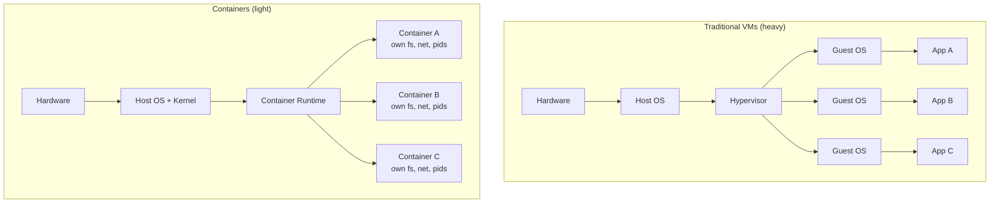

# Containers & Docker

> Package the app and its world. Same image, anywhere.

## The hook

"Works on my machine" used to be a real shipping blocker. The dev's laptop had Python 3.9 and OpenSSL 1.1. Staging had Python 3.7 and OpenSSL 3. Prod had whatever the last sysadmin installed. Same code, three different bugs.

VMs solved the isolation problem — but heavy. Gigabytes per app. Minutes to boot. You don't run 50 microservices in 50 VMs.

Containers split the difference. Package your app *and* its world — libs, deps, configs — into one tiny image. Run identical copies anywhere. Same machine, same image, same behavior.

## The concept

A container is a process. That's it. A normal Linux process running in isolated namespaces (its own filesystem, network, PID space) with cgroup-based resource limits, sharing the host kernel.

An image is the recipe. A layered, read-only filesystem snapshot you build once and run anywhere. The container is what happens when you run the image.

Docker is the most popular runtime and image format — but the format is now an open standard (OCI), and runtimes like containerd and Podman speak it too.

The wins:

- **Start in under a second.** No OS boot. The kernel's already running.
- **MB instead of GB.** A trim image is 20–50 MB. A VM image is 1–10 GB.
- **Same image, laptop to prod.** Build once. Push to a registry. Pull anywhere.

## Diagram



VMs stack a full guest OS per app. Containers share one kernel and isolate everything above it. Same isolation goal, fraction of the weight.

## Example — a real Node.js production Dockerfile

Here's the pattern that ships in production at most companies running Node:

```dockerfile
# Stage 1: build
FROM node:20-alpine AS build
WORKDIR /app
COPY package*.json ./
RUN npm ci
COPY . .
RUN npm run build

# Stage 2: runtime
FROM node:20-alpine
WORKDIR /app
COPY --from=build /app/dist ./dist
COPY --from=build /app/node_modules ./node_modules
EXPOSE 3000
CMD ["node", "dist/server.js"]
```

Three things this gets you:

**Multi-stage build.** Stage 1 has the full toolchain — compiler, dev dependencies, source code. Stage 2 copies only the built `dist/` and `node_modules`. Build tools never ship to prod. Smaller image, less attack surface.

**Alpine base.** `node:20-alpine` is around 50 MB. The Ubuntu-based `node:20` is closer to 900 MB. Same Node, fraction of the weight.

**Layer caching.** Docker caches each instruction as a layer. `COPY package*.json` then `npm ci` runs on its own layer — so unless your `package.json` changes, the dependency install is cached. Your CI builds drop from 4 minutes to 20 seconds.

Real prod example: Stripe ships hundreds of containerized services this way — every backend service, every internal tool. Cloudflare Workers go a step further with V8 isolates (containers' lighter, faster cousin) for sub-millisecond startup.

## Mechanics

**Container vs VM**

| | Container | VM |
|---|---|---|
| **Boot time** | <1 second | 30s–2 min |
| **Image size** | 20–500 MB | 1–10 GB |
| **Isolation** | Process-level (namespaces, cgroups) | Hardware-level (hypervisor) |
| **Kernel** | Shared with host | Own guest kernel |
| **Use case** | Microservices, CI/CD, dev parity | Full OS environments, strong isolation |

**Dockerfile best practices**

| Practice | What it buys you |
|---|---|
| **Small base image** (Alpine, distroless) | Smaller surface, faster pulls, fewer CVEs |
| **Multi-stage builds** | Build tools stay out of the runtime image |
| **`.dockerignore`** | Don't copy `node_modules`, `.git`, secrets into your build context |
| **Layer caching strategy** | Put rarely-changing layers (deps) before frequently-changing ones (source) |
| **Non-root user** (`USER node`) | A compromised container can't trivially escalate |
| **Signal handling** (`tini` or proper PID 1) | Graceful shutdown on SIGTERM, no zombie processes |

## Related concepts

| Concept | What it is | How it relates |
|---|---|---|
| **Kubernetes** | Container orchestrator for clusters | Once you have more than a handful of containers across machines, you need an orchestrator. K8s schedules, restarts, scales, and networks them. |
| **Microservices** | App split into small, independently deployed services | Containers are the natural unit. One service, one image, one container. |
| **CI/CD** | Automated build → test → deploy pipeline | Build the image in CI, push to the registry, pull in prod. The image is the artifact. |
| **Cloud-native** | Apps designed for elastic, distributed cloud platforms | Containers are the substrate. Cloud-native without containers is rare. |
| **Service mesh** | Sidecar-based traffic management between services | Sidecar containers (Envoy, Linkerd-proxy) ride alongside your app container in the same pod. |
| **Docker Compose** | YAML to run multiple containers locally | The dev-loop tool: `docker compose up` brings up your app, db, and Redis on a laptop. |
| **OCI / containerd** | Open standards and runtimes underneath Docker | Docker isn't the only game anymore — Kubernetes uses containerd directly. The image format is portable. |
| **Image registry** | Storage for built images (Docker Hub, ECR, GHCR) | Where CI pushes and prod pulls. Private registries hold your proprietary images. |

## When (and when not) to use Docker

**Use Docker when:**

- You're **shipping to multiple environments** — laptop, CI, staging, prod. Same image everywhere kills entire categories of bugs.
- You're running **microservices** — each service gets its own image, deployed independently.
- You have a **CI/CD pipeline** — build in CI, push to registry, deploy with confidence.
- You've ever shouted **"but it works on my machine!"** — the whole point of containers is making that sentence impossible.
- You want **dev parity** — `docker compose up` and your team has the exact same Postgres, Redis, and app config on day one.

**Skip Docker when:**

- **Single static binary on a single VM.** A Go or Rust binary that runs on one box doesn't need a container — it's already a self-contained artifact. Docker is overhead with no payoff.
- **You can't justify the operational complexity.** Containers come with friends: a registry, image storage, vulnerability scanning, monitoring. If you're a one-person shop, that's a real cost.
- **Your platform abstracts it away.** Vercel, Cloudflare Workers, AWS Lambda — these run your code without you ever writing a Dockerfile. If the platform fits, don't add a layer.

The default for any backend service shipping to more than one environment is *yes, containerize it*. The interesting questions come when you scale far enough to need orchestration.

## Key takeaway

- **Containers package the app + its environment.** Code, runtime, libs, configs — all in one image.
- **Layered images cache aggressively.** Order your Dockerfile so cheap-to-rebuild layers sit at the bottom.
- **The same image runs anywhere.** Laptop, CI, staging, prod — identical bytes, identical behavior.
- **Containers share the host kernel.** That's why they start in under a second and ship as MB instead of GB.
- **Docker isn't always the answer.** Single binary on a single VM? Skip it. Platform handles it for you? Skip it.

---

*Quiz available in the SLAM OG app — three questions on container vs VM, image layering, and when Docker is overkill.*
