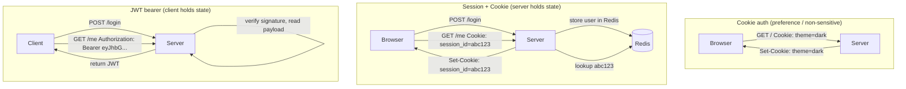

# Cookies, Sessions, and Tokens

> Three ways to remember who you are. Pick by who holds the state.

## The hook

HTTP is stateless. Every request is a stranger.

You log in. The server says "cool, you're verified." You click a link. The next request arrives — and the server has no idea it's still you. No memory. No context. Just bytes on a wire.

So how does the server know it's still me on the next click? Three answers, each with a different trade-off.

## The concept

Three mechanisms, often used together but solving different problems:

**Cookies** — small key-value blobs the browser stores and sends with every same-origin request. Just storage. Not auth on their own. A cookie can hold a session ID, a JWT, a theme preference, or your last cart item. The browser handles the plumbing automatically.

**Sessions** — the server keeps the state, hands the client a session ID (usually in a cookie). On every request, the server looks up the ID in Redis or a database to find out who you are. State lives on the server.

**Tokens (JWT)** — self-contained signed credentials the client carries. The token *is* the user data, signed so it can't be tampered with. No server-side lookup needed — verify the signature, trust the payload. State lives on the client.

The split that matters:

| Mechanism | What it is | Where state lives |
|---|---|---|
| **Cookie** | Storage primitive | Browser |
| **Session** | Server-held state, ID in a cookie | Server (Redis/DB) |
| **JWT** | Signed payload the client carries | Client (the token itself) |

Cookies aren't competing with sessions or JWTs — they're the *carrier*. Sessions and JWTs are the actual auth strategies, and they sit on opposite ends of the "where does state live" spectrum.

## Diagram



Same goal — proving identity on every request — three places to put the work.

## Example — sessions vs. JWTs in the wild

**Express/PHP-style sessions (server-held state)**

User submits the login form. Server checks the password, then stores `{user_id: 42, expires: <timestamp>}` in Redis under the key `abc123`. Server responds with:

```
Set-Cookie: session_id=abc123; HttpOnly; Secure; SameSite=Lax
```

On every subsequent request, the browser sends back `Cookie: session_id=abc123`. The server hits Redis, gets `user_id: 42`, and proceeds. One Redis lookup per request — fast, but it's a lookup.

User logs out (or you ban them)? Delete the key in Redis. Next request, the lookup fails, they're out. **Instant revocation.**

**Stripe/Auth0-style JWTs (client-held state)**

User logs in. Server checks the password, then builds a JWT — three base64 chunks separated by dots:

```
eyJhbG... (header).eyJ... (payload).abc123 (sig)
```

The header says how it's signed. The payload contains `{user_id: 42, exp: <timestamp>, role: "admin"}`. The signature is HMAC-of-(header + payload) using a server secret — so the payload can't be tampered with without breaking the signature.

Server returns the token. Client stores it (localStorage, secure cookie, mobile keychain) and sends it on every request:

```
Authorization: Bearer <JWT_HERE>
```

Server verifies the signature with the same secret, reads `user_id: 42` from the payload, proceeds. **No database lookup.** This scales beautifully across microservices — any service with the secret can verify any token.

The catch: revocation. User reports their laptop stolen at 2pm. Their JWT expires at 5pm. Between 2 and 5, that token is valid and there's nothing the server can do — unless you build a denylist (which is just a session table with extra steps). The standard fix: short-lived access tokens (15 minutes) + long-lived refresh tokens that *are* tracked server-side.

The trade-off is real: **sessions optimize for control, JWTs optimize for scale.**

## Mechanics — comparison table

| Dimension | Cookies (alone) | Sessions | JWT |
|---|---|---|---|
| **Where state lives** | Browser only | Server (Redis/DB), ID in cookie | Inside the token, on the client |
| **Server lookup per request** | None | Yes — by session ID | None — verify signature |
| **Revocation** | N/A (not auth) | Instant — delete the row | Hard — wait for expiry, or maintain denylist |
| **Scaling across servers** | Trivial | Needs shared session store (Redis) | Trivial — any server with the secret can verify |
| **Mobile / SPA fit** | Works in browsers, awkward elsewhere | Cookie-based — clunky for native apps | Native fit — pass in `Authorization` header |
| **Size** | ~4KB limit | Tiny ID in cookie, real data on server | 500B–2KB on every request |
| **Main attack to defend** | XSS (reading via JS), CSRF | CSRF — sent automatically on same-origin | XSS — if stored in localStorage, JS can steal |
| **Defense levers** | `HttpOnly`, `Secure`, `SameSite` flags | Same as cookies + server-side timeout | Short expiry, refresh tokens, store in HttpOnly cookie |

The honest framing: sessions and JWTs solve the *same* problem with opposite trade-offs. Cookies are the delivery mechanism for either.

## Related concepts

| Concept | What it is | How it relates |
|---|---|---|
| **OAuth 2.0 / JWT** | Standard for delegated authorization, often using JWTs | The next layer up — how third parties (Google, GitHub) hand you a token without sharing passwords |
| **HTTPS / TLS** | Encrypted transport | Without it, any of these can be sniffed off the wire. Always set the `Secure` flag |
| **CSRF** (Cross-Site Request Forgery) | Attacker tricks browser into sending a victim's cookie on a malicious request | Cookie-specific. Defended by `SameSite=Lax` (default modern browsers) and CSRF tokens |
| **XSS** (Cross-Site Scripting) | Attacker injects JS that runs in your origin | Reads cookies (unless `HttpOnly`) or steals JWTs from `localStorage`. Why JWTs in localStorage are controversial |
| **Refresh tokens** | Long-lived token used to mint new short-lived access tokens | The fix for JWT revocation pain — keep access tokens at 15 minutes, refresh tokens server-tracked and revocable |
| **SameSite cookies** | Cookie attribute — `Strict`, `Lax`, or `None` | Modern CSRF defense. `Lax` is the default; `None` requires `Secure` |
| **HttpOnly / Secure flags** | Cookie attributes that block JS access and require HTTPS | The minimum hardening. Set both unless you have a reason not to |
| **SSO** (Single Sign-On) | One login grants access to many apps | Built on top of sessions or tokens — Google login, SAML, OIDC |

Each of these gets its own page. Cookies, sessions, and tokens are the substrate the rest of web auth is built on.

## When (and when not) to use each

**Use sessions when:**

- You're building a **traditional server-rendered web app** (Rails, Django, PHP, Express + EJS) where the cookie-by-default flow is natural
- **Revocation matters** — banking, healthcare, anything where "log them out *now*" needs to actually mean now
- You **control the server** and a shared session store (Redis) is reasonable
- You want **simpler mental model** — store user data server-side, look it up by ID

**Use JWTs when:**

- You're building a **stateless API** consumed by mobile apps, SPAs, or other services
- You're running **microservices** where avoiding a shared session store is worth the revocation pain
- You need **cross-domain auth** — JWTs travel cleanly in `Authorization` headers across origins
- You're integrating with **OAuth providers** (Google, GitHub) where JWTs are the lingua franca

**Use cookies as the carrier when:**

- The client is a **browser**. Same-origin requests automatically include them — no JS plumbing required
- You want **HttpOnly protection** against XSS — JS can't read the cookie, so an injected script can't steal it
- You're storing a **session ID** (always) or a **JWT** (often a better choice than localStorage for browser apps)

**Skip the debate when:**

- It's a **side project with one server**. Use whatever your framework picks by default. The difference doesn't matter at your scale yet.

The default for a server-rendered app: **session + HttpOnly cookie**. The default for an API consumed by SPAs and mobile: **JWT in an HttpOnly cookie or Authorization header, with refresh tokens.** Pick the trade-off, then commit.

## Key takeaway

- **Cookies are dumb storage.** Sessions live on the server. JWTs are signed receipts the client carries. Pick based on revocation needs.
- **Sessions = control.** Instant revocation, easy mental model, requires a shared store at scale.
- **JWTs = scale.** No lookup per request, hard to revoke. Mitigate with short expiry + refresh tokens.
- **Cookies are the carrier, not the strategy.** Always set `HttpOnly`, `Secure`, `SameSite=Lax` (or `Strict`).
- **Don't store JWTs in `localStorage` if you can avoid it.** XSS turns it into a credential dump. HttpOnly cookie is safer.
- **Revocation is the question that picks the answer.** If "log them out *now*" must work, sessions. If statelessness matters more, JWTs with short expiry.

---

*Quiz available in the SLAM OG app — three questions on why HTTP statelessness matters, the JWT revocation trade-off, and where state actually lives in each approach.*
