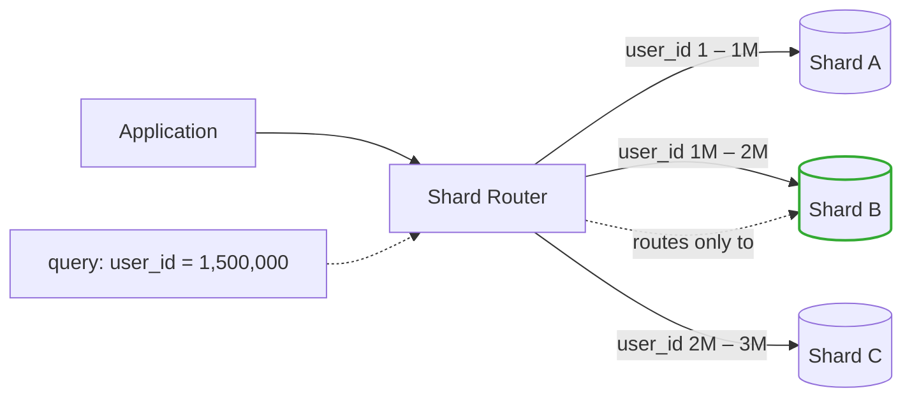

# Database Sharding

> When one DB isn't enough, split it — carefully. You don't get to undo this.

## The hook

Your database hits 5TB. Queries that used to return in 20ms now take 2 seconds. You added indexes. You tuned the slow queries. You bought the biggest instance your cloud provider sells. Read replicas helped reads — but writes still funnel into one primary, and that primary is on fire.

You've maxed out vertical scaling. There is no bigger box.

Now you shard. You split the data across multiple database instances by some key — user_id, tenant_id, region, whatever fits — and each instance holds a slice of the whole. It's the last move before you change architecture entirely, and it's the one most teams put off too long, then do under pressure.

## The concept

Sharding is **horizontal partitioning** of a single logical database into multiple physical instances. Each shard holds a subset of the rows. Together, the shards represent the whole dataset.

The app (or a proxy in front of it) looks at each query, extracts the **shard key**, and routes the query to the shard that owns that key's data.

Three things you get:

1. **Write throughput scales** — N shards means roughly N times the write capacity
2. **Working set fits in RAM again** — each shard only holds 1/N of the data
3. **Blast radius shrinks** — one shard going down takes out 1/N of users, not all of them

Three things you give up:

1. **Cross-shard queries get painful** — joins and aggregations that used to be a single SQL statement become application-side fan-out-and-merge
2. **Transactions across shards** are now distributed transactions (slow, complex, often avoided entirely)
3. **Rebalancing is hard** — picking the wrong shard key, or a hot one, means moving terabytes of live data later

Sharding is what you do when scaling up runs out. Once you've done it, you're stuck with the consequences for years.

## Diagram

The query for `user_id = 1,500,000` hits shard B and only shard B. The router does the math; the app doesn't care which physical instance answered. That's the whole magic — and the whole risk, because the router has to be right every time.

## Example — Discord, sharded by guild_id

Discord runs 1B+ users and trillions of messages. They sit on Cassandra (and now ScyllaDB) sharded by **guild_id** — Discord's word for a server. Here's why it works.

**Why they sharded.** Single-DB write volume was the wall. Hundreds of thousands of messages per second across millions of active servers can't funnel through one primary, no matter how big the box. Reads were already cached and replicated; writes were the constraint.

**Why guild_id is the right shard key.** Almost every read on Discord is "give me messages in this channel in this server." That query touches one guild. If you shard by guild_id, the query goes to one shard. If you'd sharded by **user_id** instead, loading a single channel would mean fanning out to every shard that holds a member of that server — a cross-shard query on every chat load. The shard key follows the query pattern.

**The pain points, in order of how often they bit:**

- **Hot shards.** A handful of mega-servers (think a popular game launch, a celebrity Discord) generate orders of magnitude more traffic than a normal guild. They sharded by guild_id with consistent hashing, so traffic is mostly even — but a single guild that goes viral lands all its load on one shard. Discord wrote about this publicly; the fix involved special-casing the hottest guilds.
- **Rebalancing.** Adding capacity means moving data. Cassandra's token-range model handles this better than a naive hash-mod scheme would, but it's still slow and bandwidth-heavy. They schedule it carefully.
- **Cross-shard queries.** "Show me all messages this user sent across all their servers" touches every shard. Discord doesn't expose that as a hot path for a reason — it'd cost an order of magnitude more than a per-guild read.

The pattern shows up everywhere sharding shows up: pick the key that matches your dominant query, and the rare cross-shard queries become the price you pay.

## Mechanics — four sharding strategies

| Strategy | How it routes | Strengths | Weaknesses |
|---|---|---|---|
| **Range-based** | IDs 1–1M on shard A, 1M–2M on shard B, etc. | Simple. Range scans are efficient (data is co-located). | Hot spots. If new IDs always land on the latest shard (auto-incrementing IDs + recency-biased traffic), one shard takes most of the load. |
| **Hash-based** | `hash(key) % N` picks the shard. | Even distribution by default. No hot ranges. | Adding or removing a shard rehashes almost everything. Mitigate with **consistent hashing** so only ~1/N of keys move. |
| **Geographic** | By user region — EU users on EU shard, US on US. | Lower latency. Compliance with data residency (GDPR, etc.). | Users move. Cross-region queries are expensive. Skewed populations make some shards overloaded. |
| **Directory-based** | Lookup table maps key → shard. | Maximum flexibility. You can rebalance individual keys without touching others. | The directory is a single point of failure and a hot read path. Has to be cached, replicated, and faster than the DB it routes to. |

Most production systems combine these — a hash-based scheme inside each region (geographic), or a directory layer in front of range shards for the hot keys. Pick the simplest one that survives your dominant query pattern, and graduate to a hybrid only when you have to.

## Related concepts

| Concept | What it is | How it relates to sharding |
|---|---|---|
| **Replication** | Copies of the same data across multiple nodes | Replication scales **reads** and adds redundancy. Sharding scales **writes**. Different problems — most production systems use both (each shard is itself replicated). |
| **Consistent hashing** | A hash scheme where adding/removing a node only moves ~1/N of keys | The mechanism that makes hash-based sharding survivable in production. Without it, rebalancing is catastrophic. |
| **CAP theorem** | A partitioned system must trade consistency for availability (or vice versa) | Once you shard, you have a partitioned system. CAP isn't theoretical anymore — you're picking sides every time the network blips between shards. |
| **Auto-sharding databases** | Cassandra, DynamoDB, MongoDB, ScyllaDB, CockroachDB | These shard for you. You pick a partition key; the DB handles routing, rebalancing, and replication. The cost is buying into their data model and consistency guarantees. |
| **Federation** | Splitting databases by **feature** — users DB, products DB, orders DB | Vertical split, not horizontal. Often used before sharding. Run out of headroom on one feature's DB? *Then* shard that one. |
| **Cross-shard joins** | Joining data that lives on different shards | The application or a query layer (Vitess, Citus) has to fan out, collect, and merge in code. Slower and more fragile than a single-DB join. Avoid in your hot paths. |
| **Vertical scaling** | Bigger box: more CPU, more RAM, more disk | The thing you do **before** sharding. Cheaper, simpler, reversible. Sharding is what you reach for after vertical hits its ceiling. |
| **Read replicas** | Copies of the primary that serve read traffic | If reads are the bottleneck, replicas fix it without sharding. Always try this first. |

## When (and when not) to shard

**Shard when:**

- **Single-DB write throughput is the constraint** — replicas don't help, and you've already vertically scaled
- **Working set exceeds RAM** on the biggest box your cloud provider sells, and queries are now disk-bound
- **Query patterns naturally partition** — there's an obvious shard key (tenant_id, user_id, guild_id) and 95%+ of queries fit inside one shard
- **You need failure isolation** — one bad query on one tenant shouldn't take everyone down

**Skip it (try these first) when:**

- You haven't tuned indexes — most "slow database" problems are missing indexes, not capacity
- You haven't optimized queries — a single N+1 in a hot path can mimic an overloaded DB
- You haven't added read replicas — reads are usually the first bottleneck, and replicas are reversible
- You haven't vertically scaled — bigger instances are cheap compared to the engineering cost of sharding
- You haven't added a cache — Redis or Memcached in front of the DB often buys years of headroom
- Your queries don't partition cleanly — if every query is "join across all users," sharding will make things worse, not better

Sharding adds operational complexity that's hard to undo. Schema migrations now happen on N instances. Backups are N times the work. Cross-shard reporting needs a separate analytics pipeline. New engineers have to learn the routing rules. You don't go back from this — so go in only when you have to, and only after the cheaper options are exhausted.

## Key takeaway

- **Sharding scales writes.** Replicas scale reads. Don't confuse the two.
- **Pick the shard key by query pattern**, not by what's convenient. The wrong key is the worst kind of mistake — it's invisible until you scale, and expensive to undo.
- **Hash-based sharding needs consistent hashing.** Plain `mod N` is a trap.
- **Hot shards are inevitable** at scale. Plan for them: identify hot keys, special-case them, or split them further.
- **Auto-sharding databases (Cassandra, DynamoDB) hand you the playbook.** If you're greenfield and know you'll need scale, starting there beats retrofitting sharding onto Postgres.
- **Shard last.** Defer the operational pain as long as possible. Indexes, queries, replicas, vertical scaling, caching — all of those come first.

---

*Quiz available in the SLAM OG app — three questions on writes vs reads, shard key choice, and why consistent hashing matters.*
