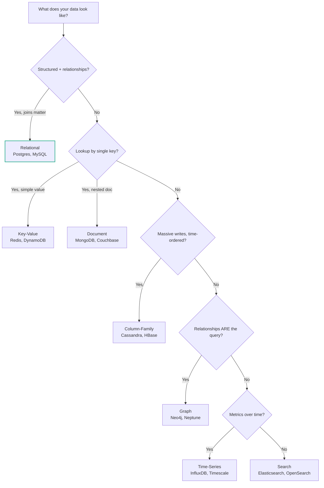

# Database Types (SQL, NoSQL, and Beyond)

> Fit, not religion. Pick the database that matches how you read and write.

## The hook

Every backend interview eventually asks: "SQL or NoSQL?"

It's a trap question. The right answer isn't a side — it's *"depends on what you're storing and how you're querying."* SQL versus NoSQL is the wrong frame. The real question is: **what's your access pattern?**

This page is the framework. Seven database families, when each one wins, and how to stop arguing about religion.

## The concept

Databases are optimized for **access patterns**. Each type bakes assumptions about how data will be read and written — and those assumptions decide the index structures, the storage layout, the consistency guarantees, and the trade-offs you're stuck with.

Six main families plus one honorable mention:

1. **Relational** — rows, columns, joins, transactions
2. **Key-value** — `get(key) → value`, nothing fancier
3. **Document** — JSON-shaped records, flexible schema
4. **Column-family (wide-column)** — write-optimized, partition-by-key
5. **Graph** — nodes and edges, relationship-first queries
6. **Time-series** — append-only, time-indexed
7. **Search** *(honorable mention)* — full-text, ranking, aggregations

A document store isn't "better" than relational. It's *different*. It assumes you'll fetch a whole record by id and rarely join across records. If your access pattern matches that, you win. If it doesn't, you fight the database every day.

## Diagram

The green node is your default. You only branch off when the pattern genuinely fights the relational model.

## Example — three real systems, three different picks

**Discord — Cassandra for messages**

Discord stores trillions of messages. The access pattern is brutal but narrow: `INSERT` constantly, `SELECT` by `(channel_id, timestamp)`, almost never update or join. That's column-family written on the box.

Cassandra partitions by channel, sorts by time inside the partition, and absorbs writes at insane volume. Postgres could *technically* do it, but it would buckle past a certain scale because relational engines aren't tuned for this shape of write traffic. Discord still uses relational DBs elsewhere — just not for the firehose.

**Stack Overflow — SQL Server (relational, all the way down)**

Stack Overflow runs one of the most-trafficked sites on the internet on a small fleet of SQL Server boxes. Why? Their data *is* relational — questions join to answers join to users join to tags join to votes. Every page render is a graph of joins.

A document store would force them to denormalize and re-denormalize forever. A graph DB is overkill. Postgres or SQL Server with thoughtful indexes is exactly right. The lesson: huge scale doesn't automatically mean NoSQL.

**Stripe — Postgres (with JSONB where it helps)**

Stripe moves money. Money requires **ACID**: charges, refunds, and ledger entries must be atomic and durable, full stop. Postgres gives that out of the box. For semi-structured payloads (webhook bodies, gateway responses), they lean on `JSONB` columns — schema flexibility *inside* a relational engine, no second database needed.

Most teams that think they need NoSQL actually want JSONB.

**Bonus — Uber's Schemaless**

Uber built **Schemaless**, a key-value layer on top of MySQL. They wanted Dynamo-style horizontal scaling but trusted MySQL's storage engine more than any NoSQL option at the time. The pattern: use a battle-tested relational engine as the storage substrate, expose a NoSQL API on top. Polyglot persistence in one box.

## Mechanics — the seven families

| Family | Examples | When it wins | Trade-off |
|---|---|---|---|
| **Relational** | Postgres, MySQL, SQL Server | Structured data, joins, transactions, anything money-adjacent | Vertical scale ceiling; rigid schema (until JSONB) |
| **Key-value** | Redis, DynamoDB, Memcached | O(1) lookup by key, sessions, caches, feature flags | Can't query by anything but the key |
| **Document** | MongoDB, Couchbase, Firestore | Nested data per record, fast iteration on schema, content/CMS | Joins are awkward; consistency varies by product |
| **Column-family** | Cassandra, HBase, ScyllaDB | Write-heavy, time-ordered, partition-by-key at huge scale | Query patterns must be designed up front; no ad-hoc joins |
| **Graph** | Neo4j, Amazon Neptune, ArangoDB | Relationship traversals — friends-of-friends, fraud rings, recommendations | Smaller ecosystem; harder ops |
| **Time-series** | InfluxDB, TimescaleDB, Prometheus | Metrics, IoT, observability, anything with `(timestamp, value)` | Not a general-purpose store |
| **Search** | Elasticsearch, OpenSearch, Meilisearch | Full-text, fuzzy match, aggregations, log analytics | Eventual consistency; *not* a system of record |

**Postgres deserves a callout.** With `JSONB`, PostGIS, TimescaleDB, full-text search, and foreign data wrappers, one Postgres instance can cover relational + document + geospatial + time-series + light search for a long time. Most apps outgrow their team before they outgrow Postgres.

## Related concepts

| Concept | What it is | Why it matters here |
|---|---|---|
| **SQL fundamentals** | The query language and relational model | The baseline you compare every NoSQL option against |
| **ACID / CAP / BASE** | Consistency models for transactions and distributed systems | Tells you what guarantees each family actually provides |
| **Sharding** | Splitting data across machines by a partition key | The moment a single DB stops scaling vertically, sharding decides your access patterns |
| **Indexing** | Pre-built data structures that speed up lookups | The reason "the same DB" can be fast or slow depending on schema design |
| **Caching** | A separate fast layer (Redis, Memcached) in front of the DB | Often the right answer when "Postgres is too slow" — before changing databases |
| **ORMs** | Code-level abstractions over SQL (Prisma, SQLAlchemy, ActiveRecord) | They paper over relational; they leak when you reach for NoSQL features |
| **Polyglot persistence** | Using multiple database types in one system on purpose | Discord uses Cassandra + Postgres + Redis. The norm at scale, not the exception. |
| **OLTP vs OLAP** | Transactional workloads vs analytical workloads | Different access patterns → different engines (Postgres vs Snowflake/BigQuery) |

Each one is its own page. Database choice doesn't sit alone — it pulls in caching, sharding, and consistency the moment you go past one box.

## When (and when not) to use each

**Default to relational (Postgres) unless one of these signals shows up:**

- **Reach for key-value** when you only ever look up by a single key, latency matters more than features, and the value is small. Sessions, rate-limit counters, leaderboards, hot-path caches.
- **Reach for document** when records are self-contained, schemas vary per record, and you almost never join. Product catalogs, CMS content, per-user config blobs. Try `JSONB` in Postgres first.
- **Reach for column-family** when write volume is genuinely massive, access is `(partition_key, time)`, and you can design queries up front. Chat at Discord scale, IoT firehoses, event logs. Most teams *think* they're here and aren't.
- **Reach for graph** when your queries are about relationship traversal — "friends of friends who bought X" — and a SQL recursive CTE is getting ugly. Fraud detection, social graphs, knowledge graphs.
- **Reach for time-series** when the primary key is time and you ingest millions of points. Metrics, monitoring, sensor data. TimescaleDB lets you stay inside Postgres.
- **Reach for search** when users type free text and expect relevance ranking, typo tolerance, and faceted filters. Pair it with your system of record — never replace the SOR with Elasticsearch.

**Skip NoSQL when:**

- Your team is small and you're optimizing for an imagined scale that hasn't arrived
- Your data has obvious relationships and joins (most business apps)
- You need transactions across multiple records
- "Postgres can't handle this" hasn't actually been measured

The honest default for most apps is **Postgres + Redis**. You add a third database when an access pattern fights the first two — not before.

## Key takeaway

- **SQL vs NoSQL is the wrong question.** The right one is "what's the access pattern?"
- **Default to Postgres.** It covers more ground than any other engine, especially with JSONB and extensions.
- **NoSQL isn't an upgrade — it's a specialization.** You give up flexibility to win on one specific shape of workload.
- **Polyglot persistence is normal at scale.** Discord uses Cassandra *and* Postgres *and* Redis, each for what it's best at.
- **Choose the database your queries want, not the one your résumé wants.**

---

*Quiz available in the SLAM OG app — three questions on fit-to-pattern thinking, why Discord picked Cassandra, and the signals that actually push you off relational.*
