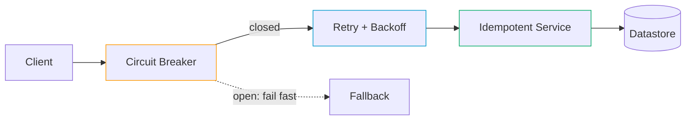

# Distributed System Patterns

> Survival tools for the chaos. Distributed systems lie — these patterns are how you survive the lies.

## The hook

Single-machine code assumes things that aren't true once you cross a network.

Calls return. Messages arrive once. Clocks agree. Nodes either work or crash cleanly. None of this is true in a distributed system. Network calls fail halfway. Messages arrive twice. Clocks disagree. Nodes vanish without warning and come back like nothing happened.

Distributed system patterns are the proven recipes that survive this chaos. You don't reinvent them — you reach for them.

## The concept

The patterns that keep showing up across distributed systems aren't optional folklore. They're survival tools. Every backend engineer should be able to recognize these six on sight:

1. **Circuit Breaker** — stop calling a failing service so it can recover (and so you don't pile up dead requests on your side)
2. **Retry with Exponential Backoff** — retry transient failures, but space the retries out so you don't DDoS the thing that's already struggling
3. **Idempotency** — same operation twice = same result. Survives retries, duplicates, and network weirdness.
4. **Saga** — coordinate distributed transactions through compensating actions instead of two-phase commit
5. **Leader Election** — one node coordinates among many. When it crashes, the rest pick a new one. Raft and Paxos are the algorithms.
6. **Unique ID Generation** — UUIDs, Snowflake IDs, ULIDs. Generate globally unique IDs without phoning home to a central counter.

You don't have to use all six in every system. But you should know which one applies when something goes sideways.

## Diagram

Read it as a chain. The circuit breaker is the first gate — if the downstream is dead, fail fast. If it's healthy, the retry layer handles transient blips with backoff. The service itself is idempotent, so a retry that *did* land twice doesn't double-charge anyone. One resilient call, three patterns composed.

## Example — Stripe payment processing

Stripe is the cleanest composite example out there. A single charge can fail in a dozen ways: card pre-auth succeeds but the capture step times out, the customer's bank gateway hangs, an internal service restarts mid-request. Stripe processes billions of dollars without two-phase commit. Here's how the patterns line up.

**Idempotency keys on every charge.** The client generates a key per logical charge attempt and sends it as a header. Stripe records the key with the result. Any retry with the same key returns the original outcome — even if the original request *did* succeed and just dropped the response on the way back. The customer is charged exactly once.

**Saga pattern for multi-step charges.** Pre-auth and capture are two separate steps. If capture fails downstream, Stripe issues a compensating refund instead of locking everything in a distributed transaction. Each step is a local commit; the saga orchestrates the rollback path when something downstream breaks.

**Circuit breakers in front of every external bank API.** Banks vary wildly in reliability. When a specific gateway gets flaky, the breaker for that gateway trips and requests fail fast for a cooldown window. Other banks keep working. One bad partner doesn't take down the rest of the payment graph.

**Snowflake-style IDs for every charge.** Every charge gets a globally unique ID generated locally — no central ID server, no coordination round-trip. The ID is sortable by time, which makes log scans and audit trails dramatically easier. At Stripe's volume, a central ID generator would be a bottleneck and a single point of failure.

The result: a payment system that handles billions of dollars without two-phase commit, without a central coordinator, and without losing money when the network blinks. The patterns aren't decoration — they're the only reason it works.

## Mechanics: pattern → problem → tools

| Pattern | Problem it solves | Real-world tools |
|---|---|---|
| **Circuit Breaker** | Stop hammering a service that's already down. Fail fast instead of piling up requests. | Hystrix (legacy, Netflix), Resilience4j, Istio, Polly |
| **Retry + Exponential Backoff** | Handle transient failures gracefully without amplifying load on a struggling service | AWS SDK built-in retries, Polly (.NET), Tenacity (Python), `retry` annotations in Spring |
| **Idempotency** | Tolerate duplicates from retries, network glitches, and at-least-once delivery | Stripe-style idempotency keys, application-level dedup on a unique request ID, idempotent receivers in queues |
| **Saga** | Distributed transactions across services without 2PC. Roll back via compensating actions. | Temporal, Cadence, AWS Step Functions, custom orchestrators on Kafka |
| **Leader Election** | One node makes coordinated decisions; failover when it dies | ZooKeeper, etcd, Consul, Raft libraries (Hashicorp Raft, etcd's raft) |
| **Unique ID Generation** | Generate globally unique IDs at scale without central coordination | UUID v4 (random), UUID v7 (time-ordered), Snowflake (Twitter), KSUID, ULID, Sonyflake |

Two notes on this table. First, the right tool for retries is usually whatever your SDK already ships — don't roll your own. Second, the gap between "I'll just write a quick saga orchestrator" and "we now run Temporal" is bigger than it looks. Saga state is a distributed system in itself.

## Related concepts

| Concept | What it is | How it relates |
|---|---|---|
| **Message Queues** | Durable buffers between producers and consumers (Kafka, SQS, RabbitMQ) | Sagas are usually built on top of queues — each step publishes an event, the next consumer picks it up. Queues also push you toward idempotent consumers (at-least-once delivery is the norm). |
| **Event Sourcing** | Store the sequence of events instead of just current state | Makes sagas natural — every step is already an event. Compensating actions become "publish a corrective event." |
| **CAP / ACID / BASE** | The trade-off space these patterns operate in: consistency, availability, partition tolerance | These patterns assume the BASE world — partitions happen, eventual consistency is the goal. Two-phase commit is the ACID alternative; the patterns above are the BASE answer. |
| **Observability** | Metrics, logs, distributed tracing | You cannot debug a saga or a tripped circuit breaker without traces. Observability is the prerequisite for running these patterns in production, not a nice-to-have. |
| **Microservices** | Architecture style where independent services communicate over the network | Where these patterns earn their keep. A monolith with one DB barely needs them; a 50-service mesh needs all six. |
| **Two-Phase Commit (2PC)** | Distributed transaction protocol with prepare/commit phases | The thing saga replaces. 2PC is correct but blocks on coordinator failure and doesn't scale well across services. |
| **At-least-once Delivery** | Message delivery guarantee where duplicates are possible | The reason idempotency isn't optional. Most queues default to at-least-once because exactly-once is expensive (or a lie). |
| **Service Mesh** | Sidecar proxies that handle traffic between services (Istio, Linkerd) | Modern meshes implement circuit breakers, retries, and timeouts at the infrastructure layer — so your application code stays simpler. |

Each of these is its own topic. Distributed patterns are the connective tissue that makes the rest of the architecture survivable.

## When (and when not) to use these

**Use them when:**

- You have **any real distributed system** — services calling services across a network
- You're running a **multi-service architecture** where partial failure is the norm, not the exception
- You're shipping a **public API** — idempotency keys are table stakes for anything that takes money or mutates state
- You're building **payments, ordering, or other critical workflows** — saga + circuit breaker + idempotency, every time
- You're operating at **scale where central coordinators become bottlenecks** — Snowflake-style IDs, leader election, client-side load balancing

**Skip them when:**

- **You have a monolith with a single database and reliable internal function calls.** ACID transactions cover what saga does. Most patterns are overkill until you hit a real network boundary.
- **Internal tools with one user and no SLA.** A retry loop with a fixed delay is fine. Don't over-engineer.
- **You can't observe the system.** Running sagas blind is worse than running 2PC blind. Add tracing first, patterns second.

The honest take: **idempotency is universal**. Any service that mutates state should support idempotent retries — it costs almost nothing and saves you the day a client retries on a 504. The other five patterns you reach for as needed. Don't bolt on a circuit breaker library because a blog said you should. Add it the day a flaky downstream takes you down.

## Key takeaway

- **Distributed systems fail in ways single-machine code never does** — these patterns are the proven survivors.
- **Idempotency is the one you should default to.** Universal, cheap, saves you constantly.
- **Circuit breaker + retry + backoff** are the trio for surviving flaky downstreams. Compose them; don't pick one.
- **Saga replaces 2PC** when you need distributed transactions without a coordinator-shaped single point of failure.
- **Leader election and unique ID generation** show up the moment you have more than one instance of a thing that needs to coordinate (or not coordinate).
- **Observability is the prerequisite.** You cannot run these patterns in production if you can't see what they're doing.

---

*Quiz available in the SLAM OG app — three questions on which pattern fixes which failure, when idempotency matters, and what's worth skipping in a monolith.*
