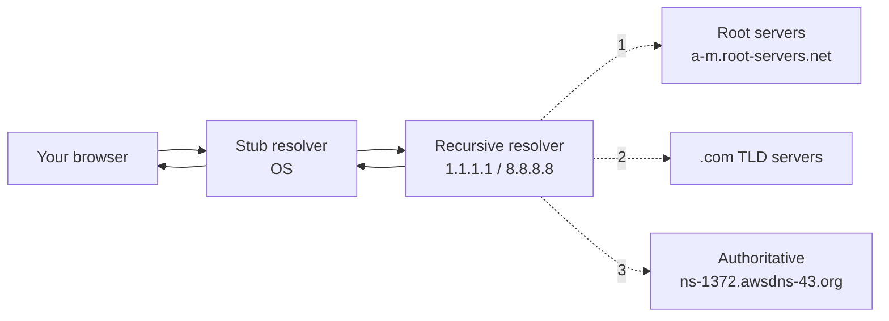

# DNS & Internet Traffic Routing

> DNS is the phonebook for the internet — except no one's in charge, and somehow it still works.

## The hook

You type `netflix.com` and hit enter. Before any TCP handshake, before any TLS, before a single byte of video — your machine has roughly 50 milliseconds to figure out *what IP address that name even points to*.

It checks the browser's cache. Miss. The OS cache. Miss. It fires a UDP packet at a recursive resolver (probably your ISP's, or `1.1.1.1`, or `8.8.8.8`). That resolver may already have the answer — or it walks a hierarchy of servers it's never met to find one.

That whole dance happens before "the internet" even starts. DNS is the first step on every request, and when it breaks, *nothing else matters*.

## The concept

DNS (Domain Name System) translates human-readable names (`netflix.com`) into IP addresses (`54.230.87.40`) machines can actually route to. It's hierarchical, distributed, and held together by aggressive caching.

Three things to know:

1. **It's a tree.** The root is `.` (yes, the trailing dot is real). Below that: TLDs (`.com`, `.org`, `.io`). Below that: domains (`netflix.com`). Below that: subdomains (`api.netflix.com`).
2. **No single server has the whole map.** Each level only knows where to send you next. Resolution happens by walking the tree.
3. **Caching is everywhere.** Browser, OS, recursive resolver, even your home router. Without it, the root servers would melt under load within seconds.

Common record types you'll actually touch:

| Record | What it stores | Example |
|---|---|---|
| **A** | IPv4 address | `netflix.com → 54.230.87.40` |
| **AAAA** | IPv6 address | `netflix.com → 2600:9000:...` |
| **CNAME** | Alias to another name | `www.netflix.com → netflix.com` |
| **MX** | Mail server | `netflix.com → mail.netflix.com` |
| **TXT** | Arbitrary text (SPF, DKIM, domain verification) | `"v=spf1 include:_spf.google.com ~all"` |
| **NS** | Which servers are authoritative for this zone | `netflix.com → ns-1372.awsdns-43.org` |

Every record has a **TTL** (time-to-live) — how long resolvers should cache it. Common values: 300s for things you might change soon, 86400s (a day) for stable records. TTLs are *advisory*. Some resolvers ignore them. This is why DNS changes feel slow and unpredictable.

## Diagram

The stub resolver in your OS asks a recursive resolver. The recursive resolver does the walking — root, then TLD, then authoritative — and returns the final answer. Caching short-circuits most of this on subsequent queries.

## Example — a cold-cache lookup of `netflix.com`

Let's say no one in your network has resolved `netflix.com` recently. You're using Cloudflare's resolver (`1.1.1.1`). Here's the actual chain:

1. **Your OS** asks `1.1.1.1`: "What's the A record for `netflix.com`?"
2. **`1.1.1.1` has nothing cached.** It asks a root server — say, `a.root-servers.net`: "Who handles `.com`?"
3. **The root replies with NS records** for the `.com` TLD servers (e.g., `a.gtld-servers.net`).
4. **`1.1.1.1` asks `a.gtld-servers.net`:** "Who's authoritative for `netflix.com`?"
5. **The TLD replies** with Netflix's authoritative nameservers (Netflix uses AWS Route 53, so something like `ns-1372.awsdns-43.org`).
6. **`1.1.1.1` asks the authoritative server:** "What's the A record for `netflix.com`?"
7. **The authoritative server returns an IP** — and here's where it gets interesting. *Which* IP it returns depends on **traffic routing policies**.

Route 53 (and Cloudflare DNS, and Google Cloud DNS) don't just return a static answer. They run logic at query time. The same hostname can return different IPs depending on who's asking and from where. Five common policies:

- **Simple** — one answer, always the same. The default.
- **Weighted** — split traffic by percentage. 90% to v1, 10% to v2 for canary deploys.
- **Latency-based** — measure round-trip time and route to the fastest region.
- **Geolocation** — route by where the user is (country, continent). Often used for compliance ("EU users stay in EU").
- **Failover** — primary endpoint, with a secondary that takes over when health checks fail.

So the IP `1.1.1.1` got back for *you* may differ from the one a user in Tokyo got back, even though you both asked for the same name. That's not a bug — that's how the modern internet routes traffic at global scale.

## Mechanics — DNS routing policies

| Policy | What it does | When to use |
|---|---|---|
| **Simple** | Returns the same record(s) for everyone | Single-region apps, dev environments |
| **Weighted** | Splits traffic by configured weights | Canary releases, A/B tests, gradual migrations |
| **Latency-based** | Routes to the endpoint with lowest measured RTT | Multi-region apps where speed wins |
| **Geolocation** | Routes by user's country/region | Localization, data residency, compliance (GDPR) |
| **Geoproximity** | Routes by physical distance, with bias weights | Like geolocation but with finer control |
| **Failover** | Primary endpoint, secondary on health check fail | DR setups, active-passive across regions |
| **Multivalue** | Returns multiple IPs; client picks one | Cheap pseudo-load-balancing — *not* a real LB |

Multivalue is the one to watch out for. It looks like load balancing, but the client picks the IP and there's no real-time health awareness beyond DNS-level checks. Use a real load balancer if you need real load balancing.

## Related concepts

| Concept | What it is | How it relates to DNS |
|---|---|---|
| **CDN** | Geographic cache of static assets at edge nodes | DNS is often the routing primitive — the CDN's hostname resolves to the nearest edge via latency-based or anycast DNS. |
| **Load Balancer** | Distributes requests across backend servers | DNS-level load balancing (GSLB) routes between regions; in-region load balancers route between servers. Different layers, same idea. |
| **Anycast** | One IP advertised from many physical locations via BGP | How root servers and `1.1.1.1` scale. DNS uses anycast under the hood; you can also route HTTP traffic this way. |
| **TLS / HTTPS** | Encrypts traffic between client and server | DNS itself is unencrypted by default — your ISP can see every name you look up. **DoH** (DNS over HTTPS) and **DoT** (DNS over TLS) fix this. |
| **Caching** | Storing answers to avoid recomputation | DNS *is* a caching system. Browser, OS, resolver, and authoritative caches all stack. |
| **HTTP** | The protocol for the actual page request | DNS resolves the hostname; HTTP delivers the page. DNS happens before HTTP can start. |
| **GSLB** (Global Server Load Balancing) | Multi-region traffic routing using DNS | The product name for DNS-based routing policies in enterprise gear (F5, Citrix, AWS Route 53). |
| **Service Discovery** | How services find each other inside a cluster | Internal DNS (`my-service.svc.cluster.local`) is the most common implementation in Kubernetes. |

DNS sits at the intersection of networking, caching, and routing. It's the layer everyone depends on and almost no one thinks about — until it breaks.

## When (and when not) to think about DNS

**You should care about DNS when:**

- **You're going multi-region.** Latency-based or geolocation routing is the cheapest way to send users to the right data center.
- **You're debugging why a deploy didn't take effect.** Check TTLs. Check resolver caches. `dig +trace` is your friend.
- **You're designing failover.** Health-checked failover at the DNS layer is a common DR pattern.
- **You're rolling a canary.** Weighted DNS gives you 1%/10%/50%/100% rollout knobs without touching app code.
- **You care about privacy.** Default DNS is plaintext. Enable DoH/DoT if your threat model includes the network.

**You can mostly ignore DNS when:**

- **You're a single-region app on default settings.** Your registrar's defaults are fine. Don't overthink it.
- **You're not changing records often.** Set a sensible TTL, walk away.
- **You're behind a CDN.** Cloudflare, Fastly, and CloudFront handle the routing primitives for you. Point your CNAME at them and let them deal with the global routing.

The honest truth: most apps just need an A record pointing at a load balancer. The interesting stuff starts when you scale beyond one region — and then DNS becomes one of your most powerful traffic-shaping tools.

## Key takeaway

- **DNS is hierarchical and cached at every layer.** Root → TLD → authoritative, with caches everywhere in between.
- **TTLs are advisory.** Lower them *before* a change, not after. Plan for stale records to linger.
- **Routing policies turn DNS into a traffic-control plane.** Weighted, latency-based, geolocation, failover — these are real production tools.
- **DNS is plaintext by default.** Use DoH/DoT when privacy matters.
- **Debugging DNS is a rite of passage.** `dig`, `nslookup`, and a humble willingness to wait for caches to expire.

---

*Quiz available in the SLAM OG app — three questions on TTLs and caching, routing policies, and why root servers use anycast.*
