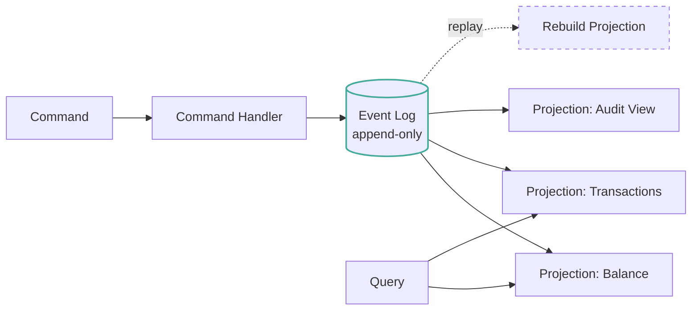

# Event Sourcing & Event-Driven Architecture

> Don't store what is. Store what happened. State becomes a function of history.

## The hook

Traditional CRUD stores **what is**. A row in a table. When the value changes, you overwrite it. The new value wins. The old value is gone.

That's fine — until someone asks "*what did this row look like last Tuesday at 3pm?*" or "*who changed it, and why?*" Now you're scrambling through audit tables, backups, and database logs trying to reconstruct a story your schema never recorded.

Event sourcing flips it. Don't store the current state. Store every change as an immutable event, and **derive** the current state by replaying those events. The history isn't a side effect — it's the only thing you keep. Audit log, debugging trace, time-travel — all free.

## The concept

There are three patterns that get tangled up because they're often used together. They're not the same thing.

**Event Sourcing (ES)** — events are the source of truth. State is computed, not stored. Want the current balance? Replay deposits and withdrawals from the start of time and add them up. Caching that result is allowed; trusting it as truth is not.

**CQRS (Command Query Responsibility Segregation)** — writes and reads use *different* models. Commands (writes) produce events. Queries (reads) hit pre-computed read models tuned for their access pattern. Often paired with ES because ES naturally produces a stream of changes you can project.

**Event-Driven Architecture (EDA)** — services communicate by publishing and subscribing to events instead of calling each other directly. Loosely coupled. Usually flows through a message broker (Kafka, SQS, RabbitMQ).

These travel together but don't have to. Plenty of "event-driven" systems aren't event-sourced — they pub/sub fire-and-forget messages but still store mutable state. Plenty of event-sourced systems aren't strict CQRS. Pick the ones that solve the problem you actually have.

## Diagram

Commands write to the event log. Projections subscribe to the log and maintain read models for different query shapes. Queries hit projections, never the log directly. Lose a projection? Replay the log from event zero and rebuild it.

## Example — banking ledgers, Stripe, and Git

**The canonical example: a banking ledger.**

You don't store "Account 42 has $1,200." You store every event that touched that account:

- `deposit($500)` at `t=1`
- `withdrawal($200)` at `t=2`
- `transfer_out($50, account=99)` at `t=3`
- `deposit($950)` at `t=4`

Current balance? Sum the events: $1,200. Audit trail? It's the storage format. Dispute resolution? Walk back to the moment in question and show what happened. Regulatory compliance? Already done — every change is recorded immutably with a timestamp and ordering.

Banks have used this pattern for centuries with paper ledgers. The software version is the same idea, append-only.

**Production pick: Stripe's payment events.**

Every interaction with Stripe is an event — `payment_intent.created`, `charge.succeeded`, `charge.refunded`, `dispute.created`. Stripe builds projections on top of that log: your account balance, your transaction list, the dispute view in the dashboard. Same events, multiple read models tuned for different questions.

The same event stream is also published as **webhooks** to your application. You subscribe to the events you care about and react to them in your own system. One event log, two consumers — Stripe's UI, and yours. That's the leverage.

**Bonus: Git is event-sourced.**

A Git repo doesn't store "the current state of the project." It stores every commit — an immutable, ordered, content-addressed event. The working tree you see in your editor is a **projection** built by walking the commit graph. Lose your working tree? `git checkout` rebuilds it from the log. Want to know what the code looked like three weeks ago? Replay the log up to that commit. You've been using event sourcing every day.

## Mechanics: ES vs CQRS vs EDA

Three patterns, often confused. Here's what each one actually is and when they overlap.

| Pattern | What it does | Independent of the others? |
|---|---|---|
| **Event Sourcing** | Events are the source of truth. State is replayed, not stored. | Yes — you can ES without CQRS or EDA. |
| **CQRS** | Different models for writes and reads. | Yes — you can split read/write models without ES. |
| **EDA** | Services publish/subscribe events to communicate. | Yes — pub/sub doesn't require event-sourcing your data. |
| **ES + CQRS** | Events written; projections built per query shape. | The famous pairing. Most "event-sourced systems" really mean this. |
| **ES + EDA** | Events in the log are also published downstream. | Common — Stripe webhooks, Kafka-fed analytics. |

**What an event looks like** — and what makes it different from a row update:

| Property | Why it matters |
|---|---|
| **Immutable** | Once written, never changed. Append-only. Edits are new events that supersede old ones. |
| **Ordered** | Sequenced (timestamp + monotonic ID). Order is the contract — replay must produce the same state. |
| **Past-tense names** | `payment_succeeded`, `order_shipped`, `quantity_updated`. Events describe what *happened*, not what to do. |
| **Schema-versioned** | Events live forever. Schemas evolve. Every event carries its version so old events still replay correctly. |
| **Self-describing** | Carries enough data to be replayed and understood without needing to look up other state. |

The past-tense naming sounds like nitpicking. It's not. `place_order` is a *command* — a request that may be rejected. `order_placed` is an *event* — a fact that already happened and can't be argued with. Mixing them is how teams trip themselves up early.

## Related concepts

| Concept | What it is | How it relates |
|---|---|---|
| **Message Queues** | Brokers that move events between producers and consumers | The transport layer for EDA. Kafka, SQS, RabbitMQ. The event log is often the queue. |
| **CQRS** | Separate models for commands and queries | Frequent companion to ES. Events feed projections; projections serve reads. |
| **Eventual Consistency** | Read models lag the event log by some window | The default cost of ES. Your projection is "almost right" — strong consistency requires extra work. |
| **Schema Evolution** | Versioning data structures as the system changes | ES makes this load-bearing. Events live forever. A v1 event from 2018 must still replay in 2026. |
| **Saga Pattern** | Coordinating multi-service transactions via events | Sagas are EDA glue. Each step publishes an event; the next step listens. Compensation is also an event. |
| **Observability** | Logs, metrics, traces for debugging production | ES is observability built into the data model. The audit log *is* the trace. Replay *is* the debugger. |
| **Snapshotting** | Periodic checkpoints so you don't replay from event zero | Optimization for ES at scale. Snapshot every N events; replay from the latest snapshot forward. |

Each one of these is a topic on its own. ES sits at the intersection of data modeling, messaging, and operational tooling — which is exactly why it has the learning curve it has.

## When (and when not) to use it

**Use event sourcing when:**

- **Audit trail is non-negotiable** — banking, healthcare, payments, anything regulated. The audit log is the database.
- **You need to debug historical state** — "what did the system look like at 2:14am when the bug fired?" Replay the log up to that point.
- **You want multiple read models** — same data, projected as a balance view, a transaction list, a fraud signal, a customer dashboard. ES makes this cheap.
- **Time-travel queries matter** — "what was the state at time T?" is a first-class operation, not a quarterly engineering project.
- **The business thinks in events** — orders, payments, shipments, claims. If your domain language is already event-shaped, ES fits the grain of the wood.

**Skip it when:**

- **Simple CRUD covers it.** Most internal admin tools, settings pages, and small SaaS apps don't need this. The complexity isn't free.
- **The team has no ES experience.** Schema versioning, replay tooling, projection rebuilds — these are real operational skills. The learning curve is shipped, not theoretical.
- **You need strict read-after-write consistency.** Read models lag the log. If "the user just saved this and must see the saved value on the next page load" is a hard requirement, you're fighting the grain.
- **Storage is precious.** ES grows forever by design. You'll need archiving, snapshotting, and cold-storage strategies eventually.

The honest take: ES is a real commitment. The wins (audit, replay, multi-projection) are huge when you need them. When you don't, you're paying tax for nothing.

## Key takeaway

- **Events are the source of truth. State is a projection.** That's the whole shift.
- **The price is eventual consistency.** Read models trail the log. Plan for it; don't pretend it isn't there.
- **Past-tense names matter.** `order_placed`, not `place_order`. Events are facts, not requests.
- **Schema versioning is forever.** Old events don't get rewritten. They get replayed by upgraded code.
- **ES, CQRS, and EDA are three patterns, not one.** Use the ones that fit. Skip the ones that don't.
- **Git is the proof of concept.** You already trust an event-sourced system with your code. The pattern works.

---

*Quiz available in the SLAM OG app — three questions on ES vs CQRS vs EDA, what a projection actually is, and when to skip the whole thing.*
