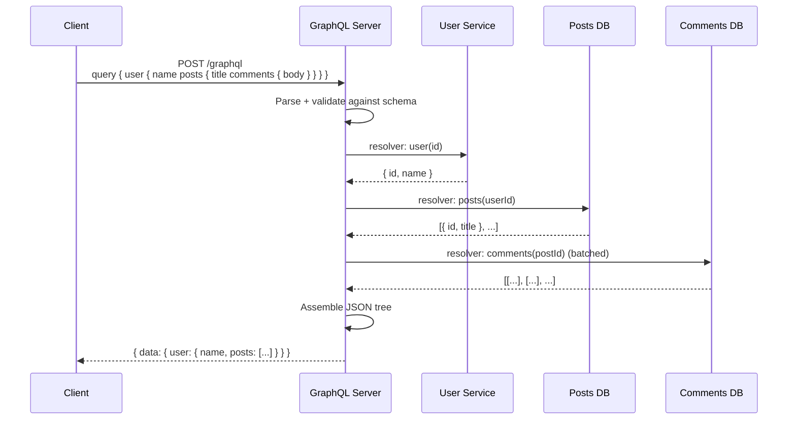

# GraphQL Deep Dive

> Ask for exactly what you need. Get exactly that. One round trip.

## The hook

REST makes you choose. Hit `/users/42` and you get back 50 fields you didn't ask for — name, email, avatar, bio, settings, two timestamps, and a payload you'll never read. Or you under-fetch: `/users/42` gives you the user, then `/users/42/posts`, then `/posts/99/comments`, then `/users/777` for the comment author. Five round trips for one screen.

GraphQL flips it. The client describes the exact shape it wants. The server returns exactly that. One request, one response, no waste.

## The concept

GraphQL is a schema-first API. You define your types and fields up front. The schema is the contract.

There's usually one endpoint — `POST /graphql`. Clients send a query in the body. The server parses it, validates it against the schema, and runs it.

Three operation types:

- **Query** — read data
- **Mutation** — write data
- **Subscription** — real-time push (usually over WebSocket)

The magic is how the server resolves the response. Every field in the schema has a **resolver function** — a small piece of code that knows how to fetch that field's value. The server walks your query field by field, calling each resolver. Resolvers can hit a SQL database, call another microservice, read from cache, or all three. The server stitches the results into one JSON object that mirrors the shape of the query.

You ask for a tree. The server walks the tree. You get back the tree.

## Diagram



One client request fans out to multiple data sources, then collapses back into a single response. The client never sees the fan-out — that's the server's problem.

## Example — GitHub API v4

The cleanest production example is **GitHub's GraphQL API (v4)**. GitHub built it because mobile clients and third-party integrations were drowning in over-fetching from REST v3 — and the company that built Atom and Octicons had thousands of consumers asking for slightly different shapes of the same data.

Say you want: *show me my five repos with their three open pull requests, and the author of each PR*. In REST v3, that's:

- 1 request for `/user/repos`
- 5 requests for `/repos/:owner/:repo/pulls?state=open`
- Up to 15 requests for the PR authors (depending on caching)

In GraphQL, it's one request:

```graphql
query {
  viewer {
    repositories(first: 5) {
      nodes {
        name
        pullRequests(states: OPEN, first: 3) {
          nodes {
            title
            author { login }
          }
        }
      }
    }
  }
}
```

You get back exactly that shape — repos, each with PRs, each with an author login. No extra fields. No round trips. The server is doing the same fan-out work behind the scenes, but it's doing it next to the database instead of over the public internet.

That's the whole pitch in one query.

## Mechanics

### Operation types

| Operation | What it does | Transport | When to use |
|---|---|---|---|
| **Query** | Read-only fetch — pulls data from the graph | HTTP POST | Any read. Pulling user profiles, lists, dashboards. |
| **Mutation** | Write — create, update, delete, or trigger a side effect | HTTP POST | Any state change. `createPost`, `likeComment`, `deleteAccount`. |
| **Subscription** | Push — server streams updates as they happen | WebSocket (usually) | Live data. Chat messages, score tickers, notifications. |

Queries and mutations look almost identical on the wire — the difference is convention plus a guarantee that mutations run sequentially. Subscriptions are a different beast: they need a long-lived connection and a pub/sub source on the server side.

### The N+1 problem and DataLoader

This is the trap every GraphQL team hits. You have a resolver for `User.posts`. You query 50 users, each with their posts. The naive resolver fires:

- **1 query** to fetch the 50 users
- **50 queries** — one per user — to fetch each user's posts

That's **51 DB round trips** for one GraphQL request. At 100 users it's 101. At 1,000 it's 1,001. Your "one round trip from the client" became a thundering herd at the database.

**DataLoader** is the standard fix. It's a small library (originally from Facebook) that:

1. **Batches** — collects every `posts(userId)` call inside a single tick of the event loop, then fires one query: `WHERE userId IN (...)`.
2. **Caches per request** — if the same userId is asked for twice in the same query, the second call is free.

| Problem | Naive resolvers | With DataLoader |
|---|---|---|
| 50 users, each with posts | 1 + 50 queries | 1 + 1 queries |
| Same author appears 10 times | 10 queries | 1 query, 9 cache hits |
| Scope of the cache | None | Lives for one request, then dies |

If you ship GraphQL without DataLoader (or an equivalent), you'll find out the hard way when your DB chokes on a popular query. Treat it as part of the GraphQL stack, not an optimization for later.

## Related concepts

| Concept | What it is | How it relates to GraphQL |
|---|---|---|
| **REST API** | The conventional alternative — fixed endpoints, server defines shape | What GraphQL is reacting to. REST wins on caching and simplicity; GraphQL wins on flexibility. |
| **API Styles Compared** | Side-by-side of REST, GraphQL, gRPC, WebSockets | The map. Read this first to see where GraphQL fits among its siblings. |
| **gRPC** | Binary RPC over HTTP/2 with strict contracts | Different niche — service-to-service at scale. Faster than GraphQL, but you don't expose it to a browser. |
| **API Gateway** | Front door for API traffic with auth, rate limiting, routing | Often sits in front of GraphQL. Handles cross-cutting concerns so the GraphQL server can focus on resolvers. |
| **Schema Stitching / Federation** | Compose multiple GraphQL services into one graph | Apollo Federation is the de facto answer. Each microservice owns its slice of the schema; a gateway merges them. |
| **Persisted Queries** | Client registers query by hash; only sends the hash at runtime | Defeats query depth attacks, enables CDN caching, shrinks request size. LinkedIn and GitHub use this in production. |
| **DataLoader** | Per-request batching and caching layer for resolvers | The N+1 fix. Treat it as required, not optional. |

## When (and when not) to use it

**Use GraphQL when:**

- **Mobile apps fetching deeply nested data.** One round trip beats five over a flaky LTE connection.
- **Dashboards where UIs vary widely.** Different screens want different fields off the same models. GraphQL lets the front-end ship without coordinating with the back-end every time.
- **Public APIs where consumers don't know all the fields they want.** GitHub v4, Shopify Storefront, Contentful — when your API has thousands of distinct callers, letting them shape their own responses scales better than minting endpoints.
- **You're consolidating data from many backends.** GraphQL aggregates well. The resolver layer is a natural place to fan out to REST services, gRPC services, and databases without exposing that mess to the client.

**Skip it when:**

- **HTTP caching is critical.** REST + ETag + CDN is one of the cleanest patterns in computing. GraphQL goes through `POST /graphql`, which CDNs don't cache by default. You can fix it with persisted queries, but that's effort.
- **Service-to-service traffic at scale.** gRPC is faster, has better tooling for streaming, and the strict contracts catch breakage at compile time.
- **You're a small team without time to learn it.** Schemas, resolvers, DataLoader, federation, query depth limits, persisted queries — there's a lot. REST is boring and that's a feature.
- **Your data isn't graph-shaped.** If your domain is action-oriented (charge a card, send an email, kick off a job), mutations work but feel forced. REST verbs map more naturally.

The honest summary: GraphQL solves over-fetching and under-fetching beautifully. It costs you caching simplicity, opens new attack surfaces (deep nested queries, introspection leaks), and adds real learning overhead. Worth it for the right workload. Overkill for the wrong one.

## Key takeaway

- **Client-defined shape.** The client writes the query, the server returns exactly that — nothing more, nothing less.
- **One endpoint, three operations.** `POST /graphql` for queries and mutations, WebSocket for subscriptions.
- **Resolvers do the work.** Every field has a resolver function. They fan out to databases and services and stitch the response back together.
- **N+1 is the trap. DataLoader is the answer.** Don't ship GraphQL without per-request batching.
- **GraphQL solves over-fetching at the cost of caching simplicity.** REST + ETag is still the simpler answer when caching matters more than flexibility.
- **Best fit:** mobile clients, varied dashboards, public APIs with diverse consumers. **Worst fit:** internal service-to-service, action-heavy domains, teams that don't have time for the full stack.

---

*Quiz available in the SLAM OG app — three questions on the N+1 problem, when GraphQL fits, and what resolvers actually do.*
