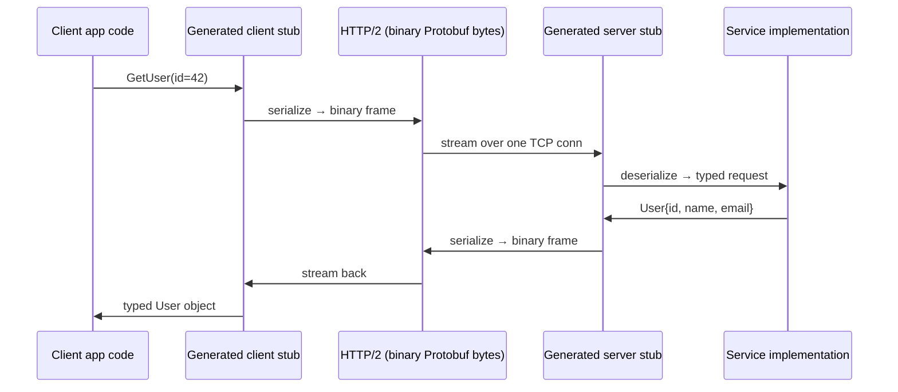

# gRPC Deep Dive

> HTTP/2 plus Protobuf plus codegen. The trifecta that owns the data center.

## The hook

REST with JSON is fine for public APIs. Every language has an HTTP client. Browsers speak it natively. You can `curl` it. That's why Stripe, GitHub, and Twilio ship REST.

But once you're inside the data center — service A calling service B calling service C, millions of times per second — the overhead starts to bite. JSON is verbose. HTTP/1.1 connections head-of-line block. Hand-rolling a client in every language is a tax you keep paying.

gRPC swaps all three. Protobuf instead of JSON — payloads 5-10x smaller, parsing faster. HTTP/2 instead of HTTP/1.1 — one connection multiplexes thousands of concurrent calls. Code-generated stubs instead of hand-rolled clients — every language, same contract, no drift. That's the trifecta that made gRPC the default for internal service-to-service traffic at Google, Netflix, Kubernetes, Lyft, and most of the cloud-native stack.

## The concept

gRPC is three things stacked on top of each other:

1. **Protobuf** — the schema and serialization format. You write a `.proto` file that defines your services, methods, and message types. It's the contract.
2. **HTTP/2** — the transport. Multiplexed streams on one TCP connection, binary framing, native support for streaming in both directions.
3. **Codegen** — the developer experience. The `protoc` compiler reads your `.proto` and emits typed clients and server interfaces in Go, Java, Python, C++, Rust, Node, C#, Ruby, and more. You import the generated code and call methods like local functions.

The pitch in one line: gRPC is what you use when REST is too slow, JSON is too big, and you control both ends of the call.

| Layer | gRPC | Classic REST |
|---|---|---|
| Wire format | Protobuf (binary) | JSON (text) |
| Transport | HTTP/2 (multiplexed) | HTTP/1.1 (one-at-a-time) |
| Schema | `.proto` file, enforced | OpenAPI, optional |
| Client | Codegen, every language | Hand-rolled or generated from OpenAPI |
| Streaming | Native, four flavors | SSE or WebSockets, bolted on |
| Browser support | Needs gRPC-Web proxy | Native |

## Diagram



Notice both stubs are generated from the **same `.proto` file**. That's the contract. The client can be Python, the server can be Go — they agree because they were both built from the same schema.

## Example — Kubernetes API and the etcd backend

Kubernetes is a good case study because it's open and the gRPC use is visible.

The Kubernetes control plane stores all cluster state (pods, services, secrets, deployments) in **etcd**. The API server talks to etcd over gRPC. Watches — the long-lived "tell me when this resource changes" calls that power every controller in the cluster — are gRPC server streams.

The `.proto` for the user lookup half of a similar service looks like this:

```protobuf
syntax = "proto3";
package user.v1;

service UserService {
  rpc GetUser(GetUserRequest) returns (User);
  rpc WatchUsers(WatchUsersRequest) returns (stream UserEvent);
}

message GetUserRequest {
  string user_id = 1;
}

message User {
  string user_id = 1;
  string name = 2;
  string email = 3;
}

message WatchUsersRequest {
  string filter = 1;
}

message UserEvent {
  enum Type { CREATED = 0; UPDATED = 1; DELETED = 2; }
  Type type = 1;
  User user = 2;
}
```

Run `protoc` against that file and you get a typed `UserServiceClient` in whichever language you target. In Go:

```go
client := userv1.NewUserServiceClient(conn)
u, err := client.GetUser(ctx, &userv1.GetUserRequest{UserId: "u-42"})
```

In Python, same shape, same method name, same fields. The contract is the `.proto`.

**Why JSON wouldn't work at this scale.** A Kubernetes cluster with 10,000 pods generates a constant firehose of watch events. JSON-encoded, each event is a few hundred bytes of strings. Protobuf-encoded, it's tens of bytes. Multiply by millions of events per minute across thousands of watchers and you're looking at orders of magnitude more network and CPU. JSON parsing alone — tokenizing strings, allocating maps — burns CPU that Protobuf's `memcpy`-and-pointer-arithmetic decode doesn't.

**The trade-off.** gRPC isn't browser-friendly out of the box. Browsers can't speak HTTP/2 trailers the way gRPC needs, so for a web client you need **gRPC-Web** plus a proxy (Envoy is the common pick) that translates between gRPC-Web and native gRPC. That's complexity. For Kubernetes it's fine — the API server also exposes a REST/JSON gateway for `kubectl` and human use. Internal control loops use gRPC; the human-facing surface uses REST.

## Mechanics — the four RPC types

HTTP/2 streaming gives gRPC four call patterns. Picking the right one matters.

| Type | Shape | Real use case | Pick when |
|---|---|---|---|
| **Unary** | one request → one response | `GetUser`, `CreatePayment`, normal CRUD | The default. Like a function call. |
| **Server streaming** | one request → many responses | Live log tails, stock tickers, Kubernetes watches, progress updates | Client subscribes once, server pushes events as they happen |
| **Client streaming** | many requests → one response | File upload in chunks, batch metric ingestion | Client trickles data in, server confirms once at the end |
| **Bidirectional streaming** | many requests ↔ many responses | Chat, collaborative editing, real-time games, voice | Both sides talk independently on the same long-lived stream |

Default to unary. Reach for server streaming the moment you'd otherwise be polling. Bidi is powerful but harder — flow control, ordering, and reconnect logic all become your problem.

## Related concepts

| Concept | What it is | How it relates to gRPC |
|---|---|---|
| **Protobuf** | Schema language and binary serialization format | The wire format and contract layer. gRPC without Protobuf is just HTTP/2. |
| **HTTP/2** | Multiplexed binary transport protocol | The transport gRPC rides on. Multiplexing and streaming come from here, not from gRPC itself. |
| **API Styles Compared** | Pattern overview of REST, GraphQL, gRPC, SOAP, RPC | Where gRPC fits among the options and when other styles win. |
| **REST API** | Resource-oriented HTTP/JSON style | The default for public APIs. gRPC's complement, not its replacement. |
| **GraphQL** | Query language for client-shaped responses | Different niche — flexible client queries, not raw service-to-service speed. |
| **Service Mesh** | Sidecar-based traffic management for microservices | Istio, Linkerd, and friends speak gRPC fluently. mTLS, retries, and load balancing for gRPC traffic happen at the mesh layer. |
| **API Gateway** | Public entry point that fronts internal services | A common pattern: REST or GraphQL at the edge, gRPC behind it. The gateway translates. |
| **gRPC-Web** | gRPC variant that works in browsers via a proxy | The escape hatch when you want the same `.proto` contract from a web client. Adds a proxy hop. |

## When (and when not) to use it

**Use gRPC when:**

- **Internal service-to-service calls at scale.** You control both ends, and the throughput-vs-readability trade-off swings to throughput.
- **Polyglot teams.** One service in Go, another in Python, another in Java — codegen gives you typed clients in all of them from one schema.
- **High throughput or low latency requirements.** Protobuf size plus HTTP/2 multiplexing is hard to beat with REST/JSON.
- **Streaming use cases.** Live feeds, watches, chat, collaborative editing. The four RPC types are first-class, not bolted on.
- **Strict contracts matter.** The `.proto` is enforced — drift between client and server fails at compile time, not in production.

**Skip gRPC when:**

- **Public-facing APIs with unknown clients.** Browsers don't speak it natively, third-party developers expect REST, and `curl` is part of the developer experience. Stick with REST or GraphQL.
- **Simple CRUD apps without performance pressure.** The Protobuf toolchain, codegen pipeline, and operational learning curve aren't worth it for a side project or a low-traffic admin tool.
- **Teams without Protobuf fluency.** If your team has never managed a `.proto` file, generated stubs in CI, or debugged a binary wire format, the adoption cost is real. Pilot it on one service before betting the whole stack.
- **Heavy human inspection of traffic.** You can't `tail -f` Protobuf bytes the way you can JSON. Tooling exists (grpcurl, Wireshark dissectors), but it's a workflow change.

The default rule of thumb: **REST at the edge, gRPC inside.** Public traffic hits a REST or GraphQL gateway. Internal traffic between services is gRPC. You get the developer-friendly external surface and the high-throughput internal one — without forcing either side to compromise.

## Key takeaway

- **Protobuf size + HTTP/2 multiplexing + codegen across languages — that's the gRPC win.** Each piece is useful alone. Stacked, they're the reason gRPC owns the data center.
- **The `.proto` file is the contract.** Schema-first design, enforced at build time, in every language.
- **Four RPC types, not one.** Unary is the default; streaming is first-class for the cases that need it.
- **Not for browsers, not for public APIs.** gRPC-Web exists but it's a workaround. REST stays at the edge.
- **Default architecture:** REST or GraphQL gateway at the public edge, gRPC between internal services.

---

*Quiz available in the SLAM OG app — three questions on why Protobuf, what HTTP/2 brings, and which RPC type fits a streaming use case.*
