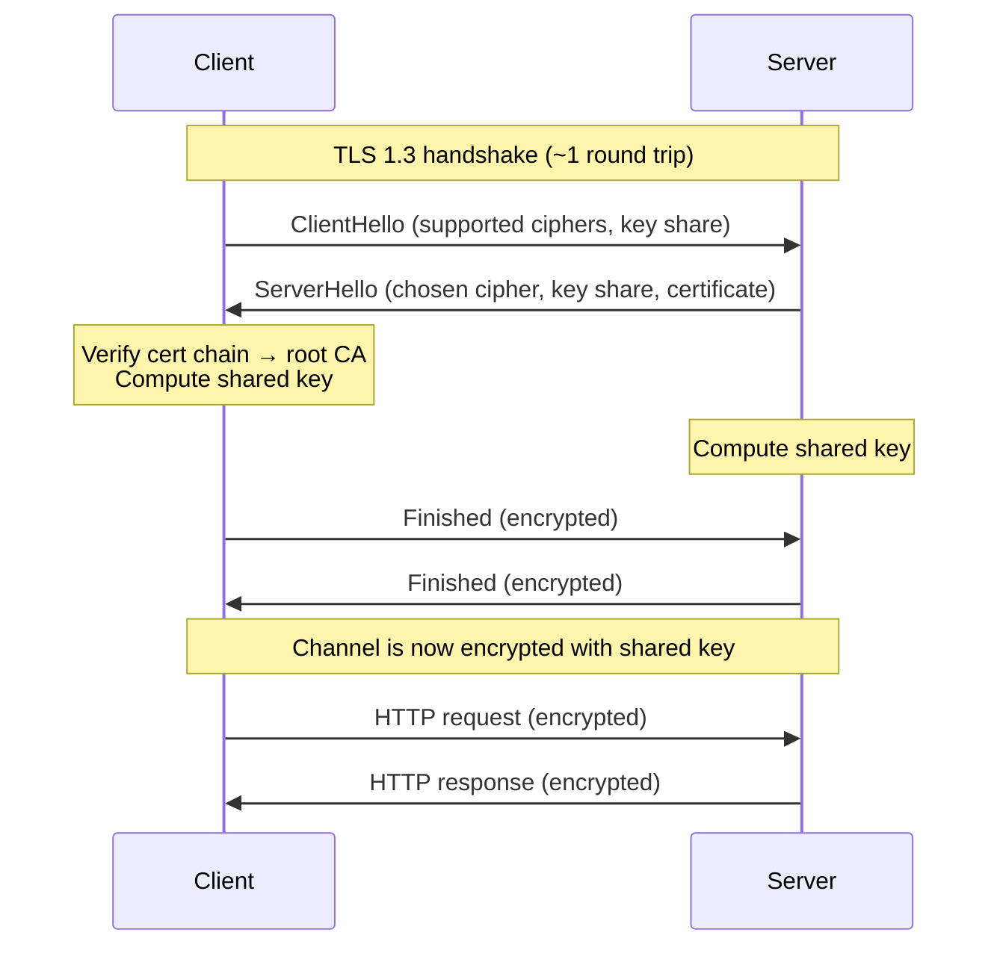

# HTTPS, SSL/TLS, and Encryption

> Identity and secrecy, agreed in one handshake.

## The hook

Every "https://" you see in your address bar hides a quick handshake — usually four round trips, often less than 50ms — that establishes who the server is, agrees on a shared key, and encrypts everything that follows.

That handshake is how the web stays private from your laptop to a server in another country. Cafe Wi-Fi, hotel network, sketchy ISP — none of them can read your traffic. Not because they're polite. Because TLS makes it mathematically impractical.

It's not magic. It's three steps, the same three every time.

## The concept

TLS (the modern name for SSL) does three things in order. Miss any one of them and the whole thing falls apart.

1. **Authentication** — the server proves it's who it claims to be. The proof is a certificate, signed by a Certificate Authority (CA) that your operating system already trusts.
2. **Key exchange** — client and server agree on a shared secret over an open channel, in a way that no observer in the middle can derive the secret even if they recorded every packet.
3. **Encryption** — once the shared key exists, both sides switch to symmetric encryption for the actual HTTP request and response.

The clever part is the mix of two kinds of crypto:

- **Asymmetric** (RSA, ECDSA) — uses a public/private key pair. Slow. Used only during the handshake to verify identity and bootstrap the shared key.
- **Symmetric** (AES-256) — single shared key. Fast — orders of magnitude faster. Used for everything after the handshake.

Asymmetric solves the "how do two strangers agree on a secret over the open internet" problem. Symmetric solves "how do we encrypt gigabytes of traffic without melting the CPU." TLS uses both because each one alone wouldn't work.

## Diagram

ClientHello says "here's what I support." ServerHello says "here's what we'll use, and here's my certificate." Both sides do the math, both arrive at the same shared key without ever sending it, and the channel goes encrypted from that point on.

## Example — what happens when you load `https://github.com`

You type the URL. Press Enter. A few hundred milliseconds later GitHub's homepage paints. Here's what actually happened:

**1. DNS lookup.** Your machine asks "what IP is `github.com`?" — gets back something like `140.82.x.x`.

**2. TCP connection.** Three packets — SYN, SYN-ACK, ACK — establish a transport-layer connection to that IP on port 443.

**3. TLS handshake.**

- Your browser sends a **ClientHello** — "I support these cipher suites (e.g., `TLS_AES_256_GCM_SHA384`), here's my random number, here's my key share for the exchange."
- GitHub's server replies with a **ServerHello** — "we'll use this cipher, here's my random, here's my key share, and here's my certificate."
- The certificate says: "the public key in this cert belongs to `github.com`, and DigiCert vouches for that — here's their signature."
- Your browser walks the chain: GitHub's cert was signed by a DigiCert intermediate, which was signed by a DigiCert root CA. That root is already in your OS trust store (Windows, macOS, iOS, Android all ship with ~150 trusted roots). Signature checks out.
- Both sides do the key-exchange math (typically ECDHE — elliptic curve Diffie-Hellman, ephemeral) and arrive at the same shared key. An eavesdropper who captured every packet still can't derive that key.

**4. Encrypted HTTP.** Your browser sends `GET / HTTP/2` over the now-encrypted channel. GitHub responds with HTML. Cafe Wi-Fi sees gibberish.

The whole TLS handshake is one round trip in TLS 1.3 — often under 50ms. Your eyes don't even register the wait.

**Worth noting:** Cloudflare's "Universal SSL" (2014) and Let's Encrypt (2015) made certificates free, automated, and ubiquitous. There's no excuse for plain HTTP in 2026. If a site you control still serves HTTP, fix it today — `certbot` does it in five minutes.

## Mechanics

**Symmetric vs asymmetric encryption — the division of labor:**

| | Symmetric (AES-256) | Asymmetric (RSA, ECDSA) |
|---|---|---|
| **Keys** | One shared key | Public key + private key pair |
| **Who has what** | Both sides hold the same secret | Public key is shareable; private key never leaves the owner |
| **Speed** | Very fast — hardware-accelerated on modern CPUs | Slow — orders of magnitude slower per byte |
| **Used for** | Bulk data after the handshake | Handshake: proving identity, exchanging the symmetric key |
| **Failure mode** | If the shared key leaks, the conversation is exposed | If the private key leaks, the server's identity is forgeable |

**The certificate chain — three layers of trust:**

| Cert | What it proves | Where it lives | Lifetime |
|---|---|---|---|
| **Server cert** (leaf) | "This public key belongs to `example.com`" — signed by an intermediate CA | On the web server | Typically 90 days (Let's Encrypt) or up to 13 months |
| **Intermediate cert** | "This intermediate is authorized to sign server certs" — signed by the root | Sent by the server alongside the leaf cert | Years |
| **Root CA cert** | "I am a root CA" — self-signed; trusted because it's already in the OS/browser trust store | Pre-installed in OS/browser trust store | 10–25 years |

The chain is what makes the whole thing work. Your browser doesn't trust `github.com` directly — it trusts DigiCert's root, which trusts DigiCert's intermediate, which signed GitHub's leaf cert. Break the chain anywhere and the connection fails with a cert error.

That's also why CA compromise is catastrophic. A rogue CA can mint a valid-looking cert for any domain. It's happened — DigiNotar (2011), Symantec (2017) — and the response is always the same: distrust the CA in every browser, mass cert reissuance.

## Related concepts

| Concept | What it is | How it relates |
|---|---|---|
| **TLS termination** | Decrypting TLS at the load balancer instead of the backend | The crypto cost stops at the LB. Backends speak plain HTTP on the internal network. Standard pattern for AWS ALB, NGINX, HAProxy. |
| **mTLS** (mutual TLS) | Both client and server present certificates and authenticate each other | Default for service mesh (Istio, Linkerd) — every internal call is authenticated, not just encrypted. |
| **HSTS** (HTTP Strict Transport Security) | Header that tells browsers "always use HTTPS for this domain, never downgrade" | Closes the gap where a user types `example.com` and gets a plain-HTTP first request. Browsers remember HSTS for the duration the header sets. |
| **Certificate pinning** | Hardcoding the expected cert (or its public key) in a mobile app | Stops attacks where a compromised CA mints a fake cert for your domain. Common in banking apps. Trade-off: rotating certs gets harder. |
| **Perfect forward secrecy** (PFS) | Each session uses an ephemeral key — past traffic stays secret even if the server's long-term private key leaks later | Standard in TLS 1.3 (ECDHE always). The reason "record now, decrypt later" attacks fail. |
| **Let's Encrypt** | Free, automated CA — issues 90-day certs via the ACME protocol | The reason TLS is now ubiquitous. `certbot` provisions and renews automatically. |
| **Certificate Transparency** (CT) | Public, append-only logs of every issued cert | Lets domain owners detect rogue certs minted for their domain. All major browsers now require CT log inclusion. |
| **TLS 1.3** | Current TLS version (2018) — simpler handshake, fewer round trips, all ciphers with PFS | One round trip instead of two. Removed legacy ciphers (RC4, 3DES). If you're still on TLS 1.2, plan the upgrade. |

## When (and when not) to think about TLS deeply

**Think about it when:**

- **Designing API gateways** — TLS termination, cert rotation, cipher suite policy all live here.
- **Internal service auth** — mTLS in a service mesh is its own topic; you need to understand the chain to design it.
- **Debugging cert errors** — "expired cert," "untrusted issuer," "hostname mismatch" all map to specific failures in the chain.
- **Anything customer-facing** — knowing what HSTS, CT logs, and pinning do is part of the security baseline.
- **Compliance audits** — PCI-DSS, HIPAA, SOC 2 all ask about TLS versions and cipher suites.

**Skip the deep dive when:**

- **Your platform handles it** — Vercel, Netlify, Cloudflare, AWS ALB, Fly.io all provision and rotate certs automatically. If you're not customizing, the defaults are fine.
- **You're prototyping internally** — local dev with a self-signed cert (or `mkcert`) is enough until you ship.
- **Someone else owns the edge** — if your service sits behind an API gateway managed by another team, your concern is the auth token, not the TLS version.

The pattern: the closer you are to the edge of a system (load balancer, API gateway, mobile client), the more TLS detail you need. Deep inside the system, mTLS auth and the trust model matter more than the handshake mechanics.

## Key takeaway

- **TLS does three things: authentication, key exchange, encryption.** Miss any one and the whole thing falls apart.
- **Asymmetric for the handshake, symmetric for the data.** The mix exists because each one alone would be too slow or too insecure.
- **Certificate trust is what makes the whole thing work.** Without a CA chain back to a trusted root, encryption is just gibberish to an unknown party.
- **TLS 1.3 + Let's Encrypt + automated renewal is the modern default.** No excuse for plain HTTP in 2026.
- **At the edge — terminate TLS once.** Inside the system — mTLS for service-to-service auth.

---

*Quiz available in the SLAM OG app — three questions on why TLS mixes symmetric and asymmetric crypto, what certificates actually prove, and when you can let your platform handle it.*
