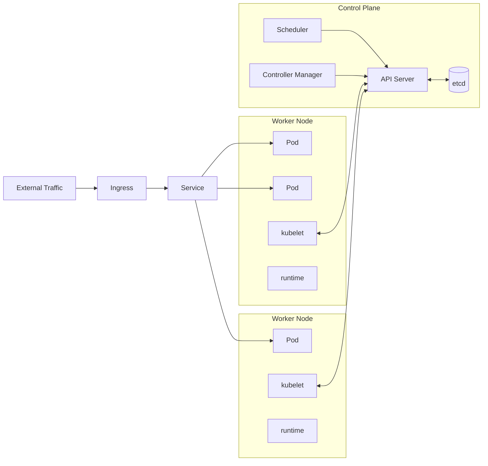

# Kubernetes

> Declarative orchestration. You describe the cluster you want; k8s makes it real.

## The hook

Running 5 containers on one box is easy. `docker compose up` and you're done.

Running 5,000 containers across 100 nodes is a different problem. Containers crash. Traffic spikes. New versions ship Friday afternoon. Some node's disk fills up at 3 AM. Without something watching, your system rots in a week.

Kubernetes is the conductor. You declare the desired state — *"3 replicas of my-app, exposed on port 80"* — and k8s makes reality match. A pod dies, it gets replaced. Traffic spikes, it scales. You push a new image, it rolls out and drains the old ones.

You don't tell k8s *how*. You tell it *what*. It figures out the rest.

## The concept

Kubernetes is a declarative container orchestration platform. You write YAML describing what you want; the control plane reconciles reality with that declaration on a loop, forever.

Five core concepts cover most of what you'll touch day-to-day:

- **Pod** — the smallest deploy unit. Usually one container, sometimes a few co-located that need to share a network and lifecycle (think: app + sidecar).
- **Deployment** — manages replicas of a pod. Handles rolling updates, rollbacks, scaling. This is what you actually write 90% of the time.
- **Service** — a stable virtual IP and DNS name for a set of pods. Pods come and go; the Service stays put so other things can find them.
- **Namespace** — logical grouping inside a cluster. Used for multi-tenancy, environment separation (`staging` vs `prod`), and quotas.
- **Ingress** — HTTP routing from outside the cluster to Services. Path and hostname rules live here.

A tiny example of a Deployment:

```yaml
apiVersion: apps/v1
kind: Deployment
metadata:
  name: my-app
spec:
  replicas: 3
  selector:
    matchLabels:
      app: my-app
  template:
    metadata:
      labels:
        app: my-app
    spec:
      containers:
        - name: web
          image: my-app:1.4.2
          ports:
            - containerPort: 80
```

That's the whole declaration. k8s handles the rest — placement, restarts, rolling updates when you change `1.4.2` to `1.4.3`.

## Diagram



The control plane is the brain — API server takes all reads and writes, etcd stores the cluster state, the scheduler decides which node a new pod runs on, the controller manager runs the loops that keep reality matching declaration. Worker nodes run a kubelet (the agent that talks to the API) and a container runtime (containerd, CRI-O) that actually starts the containers.

## Example — Spotify on k8s

Spotify runs everything on Kubernetes. They also built **Backstage** — an open-source developer portal — on top of it. The story is useful because it shows what k8s actually requires to work well.

**The platform team is the product team.**

Spotify has a dedicated platform group running multi-cluster k8s for 4,000+ engineers. Their job isn't to write the music app. Their job is to make sure every other engineer can deploy a service without becoming a k8s expert. Backstage is the front door — search for a service, see its dashboards, deploy it, page its owner.

**A typical deployment looks like this:**

1. Engineer pushes code to a Git repo.
2. CI builds a container image and pushes it to a registry.
3. CI updates the Deployment YAML in a separate config repo (image tag bumps from `1.4.2` to `1.4.3`).
4. **Argo CD** notices the change and applies it to the cluster — this is "GitOps." The Git repo is the source of truth; the cluster reconciles to it.
5. k8s rolls out new pods, drains old ones, traffic shifts via the Service.
6. If something breaks, revert the PR. Cluster reconciles back. No `kubectl` cowboying in production.

GitHub does the same thing. Airbnb moved from a Rails monolith to microservices on k8s and added Istio for service-mesh features. The pattern repeats: big org, real platform team, GitOps, managed clusters.

**The honest trade-off:**

This is real platform team investment. A two-person startup running their own k8s cluster is solving the wrong problem — they should be on a managed service (EKS, GKE, AKS) or a higher abstraction (Vercel, Fly.io, Cloud Run). k8s starts paying off when you have *many* services and *many* engineers and the operational overhead is amortized across both.

## Mechanics — the 4 Service types

A Service is how a stable address gets attached to a moving target (pods come and go). You pick the type based on who needs to reach it.

| Type | What you get | When to use | Gotcha |
|---|---|---|---|
| **ClusterIP** | Internal-only virtual IP + DNS name. Default. | Pod-to-pod inside the cluster. Service-to-service calls. | Not reachable from outside the cluster. That's the point. |
| **NodePort** | Static port (30000–32767) opened on every node. | Quick dev/test exposure, on-prem without a cloud LB. | Ugly URLs, every node opens the port, no TLS, no path routing. Don't ship to prod. |
| **LoadBalancer** | Cloud-provider LB (AWS ELB/NLB, GCP LB) provisioned automatically. | Production external traffic when you want a single service exposed. | One cloud LB per service gets expensive. Use Ingress to share one LB across many services. |
| **ExternalName** | DNS CNAME alias to an external hostname. | Bridging a non-k8s resource (managed RDS, third-party API) into cluster DNS. | No proxying, no port mapping — it's literally a DNS record. |

Default to **ClusterIP** for internal stuff, **Ingress + a single LoadBalancer** for external HTTP traffic, and **ExternalName** for "we want pods to call `db.internal` even though the DB lives outside the cluster."

## Related concepts

| Concept | What it is | How it relates to k8s |
|---|---|---|
| **Containers / Docker** | Packaged app + its dependencies running in an isolated process | The substrate. k8s schedules containers — Docker (or containerd) runs them. |
| **Microservices** | Small, independently deployable services | The typical workload. k8s shines when you've got many services to coordinate. |
| **Service Mesh** | Sidecar proxies for advanced traffic control between services | Istio, Linkerd. Adds mTLS, retries, traffic splitting on top of k8s networking. |
| **Cloud-Native** | Apps designed for elastic, distributed infrastructure | k8s is the de-facto cloud-native compute platform. The CNCF (Cloud Native Computing Foundation) shepherds it. |
| **CI/CD** | Pipelines that build, test, and deploy code | Modern pipelines deploy *to* k8s. GitOps tools (Argo CD, Flux) make Git the source of truth. |
| **Helm** | Package manager for k8s | Templates and versions Kubernetes manifests. `helm install postgres` instead of hand-rolling YAML. |
| **Operators** | Custom controllers that manage stateful apps | Encode operational knowledge (backups, failover, upgrades) into k8s itself. Used for databases, message brokers, ML pipelines. |
| **Managed k8s** | Cloud-hosted control plane | EKS (AWS), GKE (Google), AKS (Azure). You manage workloads; the cloud manages the master nodes and etcd. |

## When (and when not) to use Kubernetes

**Use k8s when:**

- You've got **many services** — 10, 50, 500 — and you need consistent deploy, scale, and networking primitives across all of them.
- You have a **real platform team** (or budget for one) — k8s isn't free to run.
- Your **scale justifies it** — high traffic, autoscaling needs, multi-region, complex networking.
- You want **multi-environment consistency** — the same cluster shape in dev, staging, and prod.
- You're committing to **cloud-native patterns** — service mesh, GitOps, operators, the whole stack.

**Skip it when:**

- **Small team, 1–2 services.** A managed PaaS (Vercel, Fly.io, Render, Cloud Run) will get you to production faster and cheaper.
- **No DevOps maturity yet.** k8s rewards teams that already know what they're doing with containers, observability, and CI/CD. It punishes teams that don't.
- **Tight budgets.** The ops cost is real — engineering time, control-plane fees, observability tooling, on-call rotation.
- **A simpler abstraction covers your needs.** If "push to Git, get a URL" is enough, that's the right answer. Reach for k8s when you've outgrown it.

The honest take: k8s is operationally heavy. It's the right tool when your container count outgrows what one box and a `docker-compose.yml` can handle — and when you have the people to run it. Until then, use a managed service.

## Key takeaway

- **k8s is declarative orchestration** — you describe the desired state, the control plane keeps reality matching.
- **Pod, Deployment, Service, Namespace, Ingress** — the five concepts you'll touch every day.
- **Four Service types**: ClusterIP (internal), NodePort (dev), LoadBalancer (prod external), ExternalName (DNS bridge).
- **Don't run your own cluster unless you have a platform team.** Managed k8s or a higher PaaS is the right default.
- **GitOps wins.** Git is the source of truth; tools like Argo CD reconcile the cluster to it.

---

*Quiz available in the SLAM OG app — three questions on the declarative model, Service types, and when k8s is overkill.*
