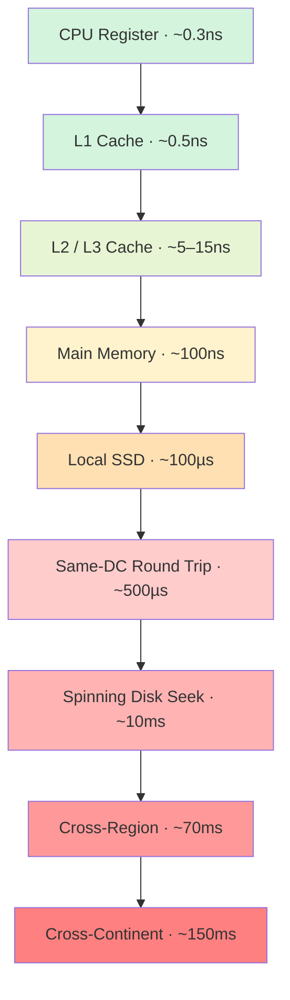

# Latency Numbers Every Engineer Should Know

> L1 cache: 0.5ns. Cross-continent: 150ms. Same factor that makes your code fast or slow.

## The hook

A senior engineer looks at your dashboard and asks, "Is this query slow?"

You stare at "47ms p99" and have no idea. Is that fast? Slow? Is the bottleneck the database, the network, the JSON parser? You don't know — because you don't have a feel for what 47ms *should* be.

This is the page that gives you that feel. Jeff Dean wrote the original "Latency Numbers Every Programmer Should Know" almost two decades ago, and the absolute numbers have shifted, but the *ratios* are exactly the same. Once those ratios live in your head, every system design decision gets easier.

## The concept

Computers do work at wildly different speeds depending on where the data lives. Eight tiers, each roughly 10–1000x slower than the one above it:

1. **CPU registers** — basically free
2. **L1 cache** — ~0.5ns
3. **L2 / L3 cache** — ~5–15ns
4. **Main memory (RAM)** — ~100ns
5. **Local SSD** — ~100µs (100,000ns)
6. **Same-datacenter network** — ~500µs
7. **Spinning disk seek** — ~10ms
8. **Cross-continent network** — ~150ms

The gaps between tiers are bigger than most people guess. RAM is 200x faster than SSD. SSD is 100x faster than spinning disk. A network call across the planet is 5x slower than a disk seek and roughly a million times slower than reading from L1.

Every architecture decision is downstream of these gaps. Cache exists because RAM is 1000x faster than disk. CDNs exist because the speed of light makes cross-continent calls unavoidable. Database indexes exist because random disk seek is brutal. You can't outsmart physics — you can only design around it.

## Diagram

Top of the stack: free. Bottom of the stack: human-perceptible delay. Each step down is one to three orders of magnitude.

## Example — three versions of the same web request

Same endpoint. `GET /user/profile`. Three different architectures, three very different stories.

**Version A — cache hit (Redis on same VPC)**

The request lands on your app server. Redis lookup — single-digit milliseconds. Serialize JSON. Send response.

| Step | Time |
|---|---|
| App server processes request | 0.2ms |
| Redis lookup (RAM, same DC) | 0.5ms |
| JSON serialize + response | 0.3ms |
| **Total** | **~1ms** |

**Version B — SSD hit (Postgres on local NVMe)**

Cache miss. Hit Postgres. The query plan uses an index, but the index pages aren't in shared buffers — they get pulled from SSD.

| Step | Time |
|---|---|
| App server processes request | 0.2ms |
| Network hop to DB (same DC) | 0.5ms |
| Postgres parse + plan | 0.5ms |
| Index page reads from SSD (3x ~100µs) | 0.3ms |
| Row reads from SSD | 0.5ms |
| Network back to app | 0.5ms |
| Serialize + respond | 0.5ms |
| **Total** | **~3ms** (call it 5ms with jitter) |

**Version C — cross-region (user in Tokyo, DB in Virginia)**

Same logical work. Different physics.

| Step | Time |
|---|---|
| User → app server (cross-Pacific) | 130ms |
| App → DB (same region) | 1ms |
| DB work | 2ms |
| App → user (cross-Pacific) | 130ms |
| **Total** | **~263ms** |

The work didn't change. The compute is identical. **One round trip across an ocean costs more than 200 cache hits stacked end to end.** This is why CDNs exist. This is why "deploy close to your users" is a strategy, not a bumper sticker.

## Mechanics — the full latency table

Numbers rounded for memorability. Real values vary by hardware, but the *ratios* hold.

| Operation | Latency | If 1ns = 1 second |
|---|---|---|
| CPU register access | ~0.3ns | 0.3 seconds |
| L1 cache reference | 0.5ns | 0.5 seconds |
| Branch mispredict | 5ns | 5 seconds |
| L2 cache reference | 7ns | 7 seconds |
| Mutex lock / unlock | 25ns | 25 seconds |
| L3 cache reference | 15–30ns | 15–30 seconds |
| Main memory reference | 100ns | 1.5 minutes |
| Compress 1KB with Snappy | 2µs | 33 minutes |
| Send 2KB over 1 Gbps network | 20µs | 5.5 hours |
| Read 1MB sequentially from RAM | 250µs | 3 days |
| SSD random read | 100µs | 1 day |
| Read 1MB sequentially from SSD | 1ms | 11 days |
| Round trip within same DC | 500µs | 5.5 days |
| Disk seek (spinning) | 10ms | 4 months |
| Read 1MB sequentially from disk | 30ms | 11 months |
| Round trip cross-region (US East ↔ US West) | 70ms | 2.2 years |
| Round trip cross-continent (US ↔ Europe) | 150ms | 4.7 years |
| Round trip US ↔ Asia | 200ms | 6.3 years |

The "1ns = 1 second" column is the trick that makes the numbers click. A register access is now. A memory reference is your lunch break. A disk seek is a season. A cross-continent round trip is the time between presidential elections. Every time your code makes a network call, it's stepping away for years on this scale — make it count.

## Related concepts

| Concept | What it is | Why these numbers matter |
|---|---|---|
| **Caching** | Keep frequently-accessed data in faster storage | The entire reason cache exists is the 1000x gap between RAM and disk. Every cache layer is an arbitrage on these numbers. |
| **CDN** (Content Delivery Network) | Geographic edge servers that cache static content | Cross-continent round trips are unfixable. CDNs solve the problem by moving the data closer to the user. |
| **Database Indexing** | Pre-sorted data structure for fast lookups | A full table scan reads megabytes from disk (~100ms+). An index lookup is 3–4 disk pages (~5ms). The latency table tells you why indexes are non-negotiable. |
| **Memory Hierarchy** | The CPU's cache stack — registers, L1, L2, L3, RAM | Why "cache-friendly" code matters. A program that thrashes L1 can run 100x slower than one that fits — same logic, same input. |
| **Async I/O** | Non-blocking I/O so the CPU does other work while waiting | When one disk seek takes 4 months on the human-time scale, blocking the thread is malpractice. |
| **Co-location** | Putting services geographically near each other (or each other's users) | If your DB is in Virginia and your app is in Tokyo, every query pays 130ms before it does any work. Co-location is free latency. |
| **Speed of Light** | Fundamental physical limit on signal propagation | ~67ms minimum for a round trip across the planet, no matter what you do. Some latency budgets cannot be optimized — only avoided. |

## When (and when not) to memorize these

**Memorize them when:**

- **Backend engineering** — you're constantly making cache-vs-DB, sync-vs-async, and where-to-deploy calls. These numbers are the foundation under all of them.
- **Performance work** — the only way to know if 200ms is reasonable is to know what the components *should* cost. Without calibration you're guessing.
- **System design interviews** — interviewers explicitly probe this. Saying "RAM is faster than disk" is C-tier. Saying "RAM is ~1000x faster than disk and ~100x faster than SSD" is the answer they want.
- **Distributed systems work** — every replication, consensus, and queue decision is a latency trade. You need to feel the cost of a quorum write before you design one.

**Skim them when:**

- **Front-end CRUD work** — the network round trip dominates everything else, and you can't change it from the client. Knowing "API calls are ~100ms-ish" is enough.
- **Scripting, data analysis, glue code** — wall-clock time is dominated by I/O and the script runs once. You're not optimizing here.

The split isn't about seniority — it's about whether the choices you make day-to-day are constrained by these numbers. If they are, internalize them. If they aren't, you can always come back.

## Key takeaway

- **The ratios matter more than the exact numbers.** Hardware gets faster every year. The gap between RAM and disk does not.
- **A round trip across continents (~150ms) is ~5x slower than a spinning disk seek (~10ms).** Design accordingly — cache at the edge, not just at the origin.
- **Network is almost always the bottleneck**, not compute. If your endpoint is slow, profile the call graph before optimizing code.
- **Memory is ~1000x faster than disk.** This is why Redis exists, why every fast system has a cache layer, and why "is it in RAM?" is the first question to ask.
- **Co-location is free latency.** Put your services near each other and near your users. The cheapest optimization is the round trip you don't make.

---

*Quiz available in the SLAM OG app — three questions on ranking operations, where time goes in a slow endpoint, and the cost of a cross-ocean round trip.*
