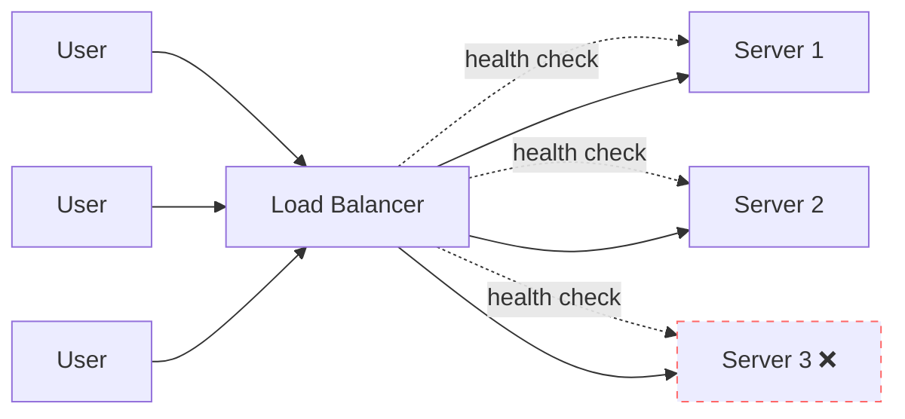

# Load Balancers

> Traffic cop for your servers. No load balancer, no scale.

## The hook

You launched. Your app got linked on Hacker News. 50,000 people hit it in the next hour. Your one server taps out.

You can't just spin up more servers — *how* do users get routed to them? Round-robin DNS is broken (no health checks). Telling users "click this URL on Tuesdays, that one on Thursdays" obviously doesn't work.

You need a load balancer. It's the box that sits in front of your servers and decides who gets which one.

## The concept

A load balancer accepts incoming traffic, picks a backend server, and forwards the request. The user never knows which server actually answered.

Three jobs:

1. **Distribution** — spread traffic across servers so none gets crushed
2. **Health checking** — stop sending traffic to dead servers
3. **Abstraction** — your servers can change (add, remove, upgrade) without users noticing

Two flavors based on what they inspect:

| Type | Layer | Routes by | Speed | Use when |
|---|---|---|---|---|
| **L4** | Transport (TCP/UDP) | IP, port | Fast — doesn't open the packet | Raw throughput beats smart routing |
| **L7** | Application (HTTP) | URL, headers, cookies | Slower — parses the request | You need `/api` to one fleet and `/admin` to another |

For most web apps, **L7**. The flexibility is worth the small latency cost.

## Diagram

The dashed lines are health checks. The crossed-out server is unhealthy — the LB stops routing to it until checks pass again.

## Example — Netflix in three tiers

Netflix doesn't use *a* load balancer. They use **three layers of load balancing**, and the architecture is the lesson.

**Tier 1 — Edge: AWS ALB + Route 53**

The first request from your couch hits Route 53 (DNS) and gets routed to the closest AWS region. Inside that region, an Application Load Balancer (ALB) picks an entry-point service. This is geographic routing — shaving ~50ms off every request just by sending you to the nearest data center.

**Tier 2 — Gateway: Zuul**

Once inside Netflix's network, every request hits **Zuul** — their open-source API gateway. Zuul is an L7 load balancer with extra brains: dynamic routing rules, A/B test traffic splitting, request authentication, and resilience patterns (retries, circuit breakers). Zuul handles roughly **125 billion requests per day** across 1,000+ microservices behind it.

**Tier 3 — Service-to-service: Ribbon (client-side)**

Here's the twist. For internal calls between microservices, Netflix doesn't use a central load balancer at all. Each service has a smart client (**Ribbon**) that picks a healthy backend itself. This eliminates the central LB as a bottleneck and a single point of failure — but it requires every service to know about every backend, which is what **Eureka** (their service registry) provides.

**Why three tiers?**

At Netflix's scale, a central load balancer for internal traffic would *itself* become the bottleneck. By pushing LB logic to the client, every service becomes its own load balancer. The trade-off: more complexity in every service. The benefit: no single chokepoint.

| Tier | Tool | Type | Who uses it |
|---|---|---|---|
| Edge | AWS ALB / Route 53 | Server-side L7 + DNS | Public traffic |
| Gateway | Zuul | Server-side L7 (smart) | Public → internal |
| Service mesh | Ribbon + Eureka | Client-side L4/L7 | Internal calls |

Most apps don't need this. But the pattern shows up at scale: load balancing stops being a single box and becomes a layered strategy. When you're sketching a system design, one of the questions is "*at which tiers do we balance traffic, and using what?*"

## Algorithms (how it picks a server)

| Algorithm | What it does | When to use |
|---|---|---|
| **Round-robin** | Server 1, 2, 3, 1, 2, 3... | Backends are roughly equal |
| **Least connections** | Server with fewest active requests | Long-lived connections (WebSockets, streaming) |
| **IP hash** | Same client → same server | Sticky sessions (avoid if you can) |
| **Weighted** | Some servers get more traffic | Mixed hardware (the big box gets 2x) |

Default to round-robin or least connections. Don't reach for IP hash unless you can't store session state in a shared cache (Redis) — and if you can't, fix that first.

## Related concepts

| Concept | What it is | How it relates to load balancers |
|---|---|---|
| **Reverse Proxy** | A server that forwards client requests to backend services | A load balancer is a specialized reverse proxy. NGINX and HAProxy can do both. |
| **CDN** (Content Delivery Network) | Geographic cache of static assets at edge nodes | Load balancing at network scale — routes you to the nearest copy of the content. Cloudflare, Fastly, CloudFront. |
| **API Gateway** | Entry point for API traffic that adds auth, rate limiting, and request transformation | An L7 load balancer with extra cross-cutting concerns. Examples: Kong, Zuul, AWS API Gateway. |
| **Service Mesh** | Sidecar-based traffic management between microservices | Distributed L7 load balancing for internal service-to-service calls. Examples: Istio, Linkerd. |
| **Health Check** | Periodic probe that verifies a backend is alive and responsive | The mechanism that makes a load balancer "intelligent" — without it, you have round-robin DNS. |
| **Sticky Session** | Pinning a user to a specific backend for the duration of their session | Sometimes necessary (legacy apps), but signals you should externalize session state instead. |
| **GSLB** (Global Server Load Balancing) | Multi-region traffic routing using DNS or anycast | Load balancing across data centers. AWS Route 53, Cloudflare DNS. |
| **Anycast Routing** | Network-level routing where one IP maps to many physical locations | Distributes traffic at the IP layer, not the application layer. How DNS root servers and large CDNs work. |

Each of these is a topic on its own — load balancers are the gateway concept that introduces the rest.

## When (and when not) to use it

**Use a load balancer when:**

- You have **two or more backend servers** — the moment you scale beyond one, you need it
- You need **automatic failover** when a server dies (health checks → reroute)
- You're running **microservices** and need to route different paths to different fleets
- You want to **drain traffic** from a server for deploys, maintenance, or autoscaling
- You want **TLS termination in one place** — handle certificates at the LB instead of every backend

**Skip it (or push it elsewhere) when:**

- **Single server, low traffic** — it's overhead with no benefit. Add it the day you scale to two boxes.
- **Latency-critical workloads** where the extra hop matters. Anycast routing or direct client connections may serve better.
- **Internal microservice calls at scale** — a central LB becomes a bottleneck. Use client-side load balancing (Ribbon-style) with a service registry.
- **Simple geographic distribution** — sometimes DNS-based routing (Route 53 latency-based, GeoDNS) is enough without a full LB tier.

The default answer for any web app with 2+ servers is *yes, use a load balancer*. The interesting questions come when you scale far enough that the LB itself becomes a constraint.

## Key takeaway

- **One server → no LB.** Two servers → you need one.
- **L7 by default** for web apps. L4 only when raw speed beats routing logic.
- **Health checks are non-negotiable** — automatic failover is the entire point.
- **The LB itself is a single point of failure.** Production runs two LBs in active-passive or active-active.

---

*Quiz available in the SLAM OG app — three questions on L4 vs L7, why round-robin DNS isn't enough, and when you don't need a load balancer.*
