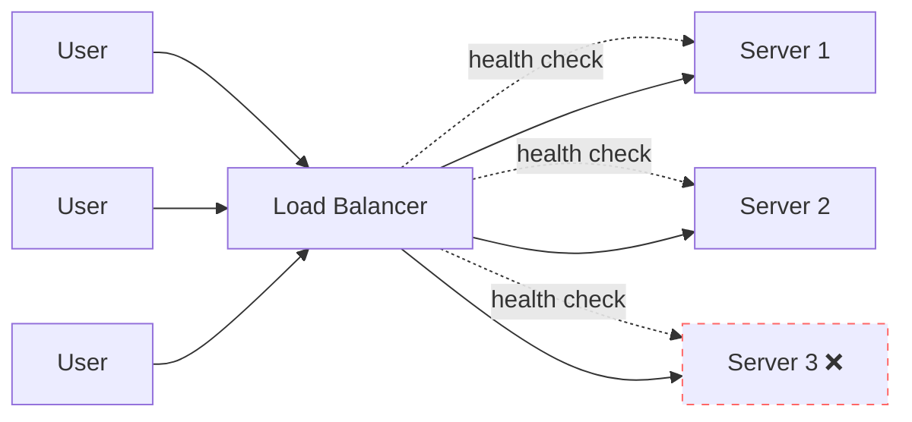

# Load Balancers

> Traffic cop for your servers. No load balancer, no scale.

## The hook

You launched. Your app got linked on Hacker News. 50,000 people hit it in the next hour. Your one server taps out.

You can't just spin up more servers — *how* do users get routed to them? Round-robin DNS is broken (no health checks). Telling users "click this URL on Tuesdays, that one on Thursdays" obviously doesn't work.

You need a load balancer. It's the box that sits in front of your servers and decides who gets which one.

## The concept

A load balancer accepts incoming traffic, picks a backend server, and forwards the request. The user never knows which server actually answered.

Three jobs:

1. **Distribution** — spread traffic across servers so none gets crushed
2. **Health checking** — stop sending traffic to dead servers
3. **Abstraction** — your servers can change (add, remove, upgrade) without users noticing

Two flavors based on what they inspect:

| Type | Layer | Routes by | Speed | Use when |
|---|---|---|---|---|
| **L4** | Transport (TCP/UDP) | IP, port | Fast — doesn't open the packet | Raw throughput beats smart routing |
| **L7** | Application (HTTP) | URL, headers, cookies | Slower — parses the request | You need `/api` to one fleet and `/admin` to another |

For most web apps, **L7**. The flexibility is worth the small latency cost.

## Diagram

The dashed lines are health checks. The crossed-out server is unhealthy — the LB stops routing to it until checks pass again.

## Example

**Netflix** uses L7 load balancers (their own + AWS ALB) to route by URL path:

- `/api/movies` → catalog service
- `/api/watch` → streaming service
- `/api/recommendations` → ML service

Each path hits a different fleet. One load balancer, many backend services. Users see one domain.

This pattern — one front door, many backends — is the foundation of microservices. The load balancer is what makes it work.

## Algorithms (how it picks a server)

| Algorithm | What it does | When to use |
|---|---|---|
| **Round-robin** | Server 1, 2, 3, 1, 2, 3... | Backends are roughly equal |
| **Least connections** | Server with fewest active requests | Long-lived connections (WebSockets, streaming) |
| **IP hash** | Same client → same server | Sticky sessions (avoid if you can) |
| **Weighted** | Some servers get more traffic | Mixed hardware (the big box gets 2x) |

Default to round-robin or least connections. Don't reach for IP hash unless you can't store session state in a shared cache (Redis) — and if you can't, fix that first.

## Key takeaway

- **One server → no LB.** Two servers → you need one.
- **L7 by default** for web apps. L4 only when raw speed beats routing logic.
- **Health checks are non-negotiable** — automatic failover is the entire point.
- **The LB itself is a single point of failure.** Production runs two LBs in active-passive or active-active.

---

*Quiz available in the SLAM OG app — three questions on L4 vs L7, why round-robin DNS isn't enough, and when you don't need a load balancer.*
