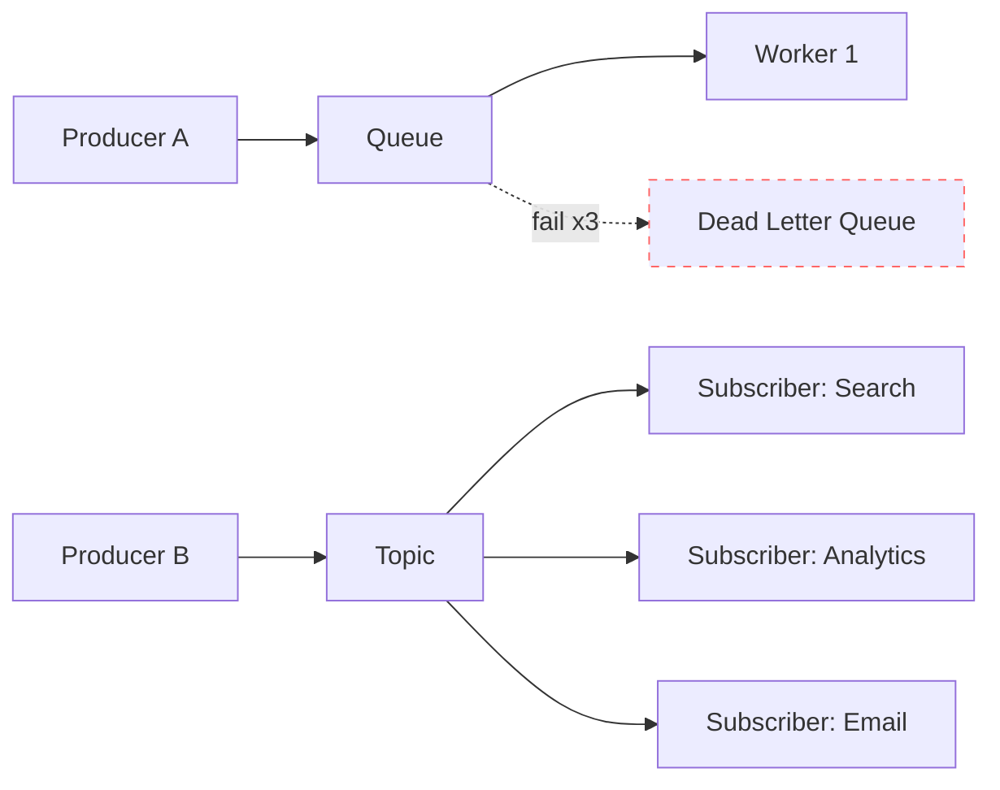

# Message Queues & Brokers

> Drop the message, walk away. The broker delivers — eventually.

## The hook

Service A calls Service B over HTTP. B is down for two minutes. Now A is down too — every request piling up, timing out, taking the user with it.

Synchronous calls couple uptime. If you call something, you depend on it being alive *right now*. That's fine for two services. It's a nightmare for fifty.

The fix is a queue between them. A drops a message. B picks it up when it's ready — five seconds later, five minutes later, doesn't matter. A doesn't wait. A doesn't care. The broker holds the message until B is ready.

That single move — replacing a synchronous call with a queue — unlocks reliability, throughput smoothing, and async work. It's the duct tape of distributed systems.

## The concept

A **message broker** is a server that accepts messages from producers, holds them, and delivers them to consumers. Producers and consumers don't know about each other. They only know the broker.

Two main patterns:

| Pattern | Who gets the message | Used for |
|---|---|---|
| **Queue (point-to-point)** | One consumer per message | Distributing work across workers |
| **Pub/Sub (topic-based)** | Every subscriber gets a copy | Broadcasting events to many listeners |

Queue example: 10,000 image-resize jobs land on a queue, 50 workers pull from it, each job runs exactly once.

Pub/sub example: a `user.signed_up` event lands on a topic, the email service sends a welcome, the analytics service counts it, the CRM service creates a record — all from the same message.

Brokers handle the boring-but-critical stuff so producers and consumers don't have to:

- **Persistence** — survive a broker restart without losing messages
- **Ordering** — within a partition or queue, messages stay in the order produced
- **Retries** — if a consumer fails, redeliver
- **Dead-letter queues (DLQ)** — after N failed attempts, park the message somewhere a human can look at it

## Diagram

Top half: queue. One message, one worker. Failed messages get retried, then parked in the DLQ.

Bottom half: pub/sub. One event, three independent subscribers, each on their own pace.

## Example — Kafka at LinkedIn

LinkedIn invented Kafka because they were drowning.

By 2010, they had hundreds of services, and every service knew about every other service it needed. The User Service called Search directly. Search called Analytics. Analytics called Email. Adding a new consumer meant editing every upstream service. Every outage cascaded. The integration graph looked like spaghetti dropped on a fan.

So they built Kafka as a **durable, ordered, replayable log**. Services *publish* events to a topic. Other services *subscribe* and consume at their own pace. Nobody calls anybody. Today Kafka handles **trillions of messages a day** across LinkedIn.

Concretely, here's what a profile update looks like now:

1. User edits their profile.
2. User Service publishes `user.profile.updated` to Kafka. Done. Returns to the user immediately.
3. Search Service consumes the event and re-indexes the profile.
4. Analytics consumes the event and increments a counter.
5. Email consumes the event and notifies recruiters who saved the profile.

The User Service doesn't know who's listening. New consumers can show up next quarter without a single change upstream. If Email is down for an hour, Email catches up later — Search and Analytics keep going.

**Why Kafka is fast** (the part everyone asks about):

- **Append-only log on disk.** Sequential writes are 100–1000x faster than random writes. Kafka never seeks; it just appends.
- **Zero-copy.** Data moves from disk to network card without a trip through the application — `sendfile()` does it in the kernel.
- **Partitions.** A topic is sharded across brokers. Consumers read partitions in parallel. Throughput scales horizontally.

A single Kafka cluster can push **millions of messages per second** on commodity hardware. The "secret" is mostly that it does less than other brokers.

## Mechanics — five brokers, five jobs

| Broker | Pattern | Delivery | Ordering | Throughput | Pick when |
|---|---|---|---|---|---|
| **Kafka** | Pub/sub on a log | At-least-once (exactly-once with care) | Per partition | Very high (millions/sec) | Event streaming, replay, large scale, audit log |
| **RabbitMQ** | Queue + flexible routing (direct, fanout, topic, headers) | At-least-once | Per queue | Moderate (tens of thousands/sec) | RPC-style work, complex routing rules, mature ops |
| **AWS SQS** | Queue (Standard or FIFO) | At-least-once (Standard) or exactly-once (FIFO) | None (Standard) / strict (FIFO) | High, auto-scales | Zero-ops async work on AWS, decoupling Lambda functions |
| **Redis Streams** | Lightweight log inside Redis | At-least-once | Yes | Moderate, very low latency | You already run Redis, modest scale, latency matters |
| **AWS SNS / Google Pub/Sub** | Pub/sub fanout | At-least-once | None (mostly) | High, managed | Broadcasting events across services or to mobile push |

**Quick reading guide:**

- **Need replay or a durable event log?** Kafka.
- **Need flexible routing rules and you're not at huge scale?** RabbitMQ.
- **On AWS and want to forget about ops?** SQS for queues, SNS for pub/sub.
- **Already running Redis and the workload is small?** Redis Streams. Don't add Kafka for 100 messages a minute.
- **Broadcasting to a fleet of mobile clients or services?** Managed pub/sub.

A real talk note on **delivery guarantees**: at-least-once is the realistic default for every broker on this list. "Exactly-once" exists, but it's narrow — usually scoped to a single transaction inside one cluster, with constraints. The professional move is to **make consumers idempotent** (running the same message twice produces the same result) and stop worrying about duplicates.

## Related concepts

| Concept | What it is | How it relates |
|---|---|---|
| **Event Sourcing** | Storing state as an ordered log of events | Same shape as Kafka — replay the log to rebuild state |
| **Event-Driven Architecture** | Services react to events instead of being called | Brokers are the substrate that makes EDA work |
| **Microservices** | Many small services with their own data | Queues decouple them — without a broker, microservices revert to spaghetti calls |
| **Idempotency** | Running an operation twice has the same effect as once | Required on consumers because at-least-once means duplicates |
| **Webhooks** | HTTP callbacks to external systems on events | The external-facing version of pub/sub — same pattern, different transport |
| **Distributed Patterns (Saga, Outbox)** | Multi-step workflows across services | Sagas use queues to coordinate steps; the outbox pattern is how you publish reliably from a database |
| **Backpressure** | Slowing producers when consumers can't keep up | Queues *are* backpressure — they buffer the surge so the consumer doesn't drown |
| **Dead Letter Queue** | Side queue for messages that keep failing | The "I give up, look at this manually" tray every broker should have |

## When (and when not) to use a queue

**Reach for a queue when:**

- **Async work that doesn't need an immediate answer** — send the welcome email, generate the thumbnail, run the export. The user doesn't wait; the worker picks it up.
- **Smoothing spikes** — 10,000 requests land in a second. The queue absorbs them; a steady pool of workers drains the queue at a sane rate. The downstream system never sees the spike.
- **Decoupling services** — when you don't want Service A's outage to take Service B with it, put a buffer between them.
- **Replay and audit** — Kafka's killer feature. Bug in your analytics pipeline last Tuesday? Reset the consumer offset, replay the week.
- **Broadcasting events** — one event, many independent listeners. Pub/sub.

**Skip the queue when:**

- **Low traffic and sync calls work fine.** A broker is real ops cost — another moving part to monitor, scale, and pay for. Don't add it for 50 requests a minute.
- **Strict global ordering across services.** Queues give you ordering *within a partition or queue* — coordinating order *across* services is a hard distributed-systems problem, not something a broker hands you.
- **Real-time bidirectional traffic.** Chat, gaming, live cursors. Use WebSockets or gRPC streaming. A broker adds latency and the wrong shape of communication.
- **You need a synchronous answer right now.** If the caller has to know whether the operation succeeded before returning to the user, a queue is the wrong tool — the operation is async by definition once you queue it.

The default question for any new service-to-service call is: *does the caller need the answer right now?* If no, a queue is probably the right shape.

## Key takeaway

- **Queues decouple producers from consumers, smooth spikes, and let services fail independently — the async backbone of distributed systems.**
- **Queue vs pub/sub:** one consumer per message vs one copy per subscriber. Pick based on whether you're distributing work or broadcasting events.
- **At-least-once is the realistic default.** Make your consumers idempotent and stop chasing exactly-once.
- **Pick the broker for the job:** Kafka for streaming and replay, RabbitMQ for routing, SQS/SNS for managed AWS, Redis Streams for small-scale low-latency, managed pub/sub for broadcasts.
- **Always wire up a dead-letter queue.** Messages that can't be processed shouldn't disappear — they should land somewhere a human can look at them.

---

*Quiz available in the SLAM OG app — three questions on queue vs pub/sub, delivery guarantees, and picking the right broker.*
