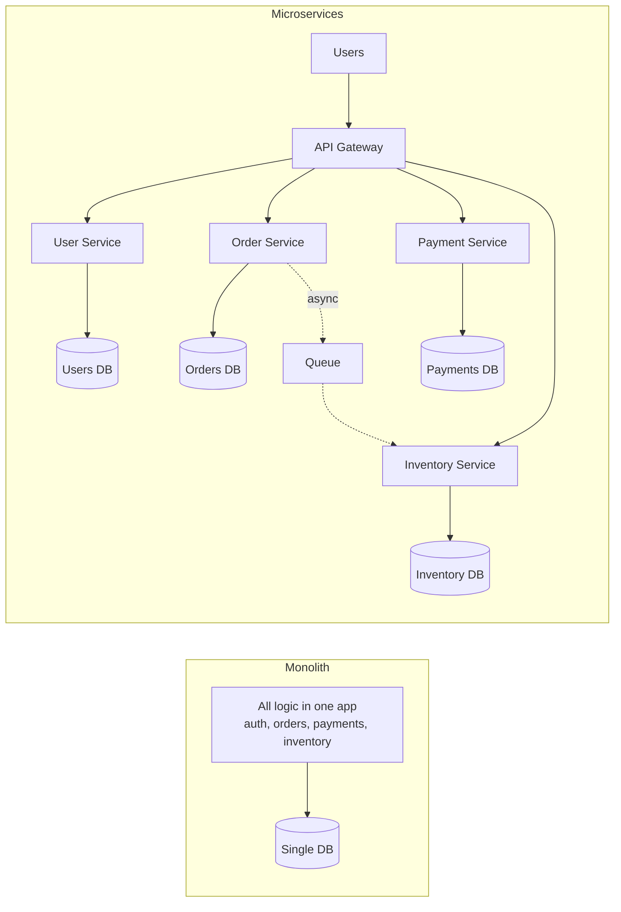

# Microservices Architecture

> An org problem, not a tech problem. Don't take the trade until you have the problem.

## The hook

A monolith is one codebase, one deploy pipeline, one database. One team can hold the whole thing in their head. Two teams can share it without too much pain. Five teams trying to merge into the same `main` branch every day? That's where it breaks.

Microservices split that monolith into many services — each owned by a team, each deployed independently, each with its own data store. The wild part: the win isn't technical. It's organizational.

Conway's Law: your architecture mirrors your org chart. Microservices let teams ship without waiting for each other. That's the whole pitch. Everything else is plumbing.

## The concept

A microservice is a service aligned to a **domain boundary** — billing, playback, search, inventory — that owns its code, its database, and its deploy. Services talk over the network: REST, gRPC, or a message queue.

The trade you're making:

- **You give up:** compile-time guarantees. One codebase, one type checker, one place to refactor. Atomic deploys. The ability to grep the whole system.
- **You buy:** organizational guarantees. Team A can ship without Team B's review. Team B can pick a different language. Team C can scale their service independently.

Distributed-system problems become *your* problems. Network calls fail. Clocks drift. Two services see different versions of "the truth." Debugging requires tracing a request across ten hops. None of this is hypothetical — it's Tuesday.

The boundaries matter more than the count. **Domain-Driven Design** (DDD) is the rulebook here: model your services around how the business actually works, not around technical layers. "Auth service, controller service, DAO service" is a monolith pretending to be microservices. "Billing, Playback, Catalog" is the real thing.

## Diagram

Left: one box, one DB, every team merging into the same repo. Right: each service owns its slice — its code, its database, its deploy schedule. The gateway is the front door; the queue is how services hand work off without blocking each other.

## Example — Netflix and the dark side at Uber

Netflix runs **1,000+ microservices**. Uber runs **~3,000**. Big numbers, but the lesson isn't "more services = better." It's "what problem were you actually solving?"

**What Netflix actually got out of it**

- **Independent deployment.** The playback team ships changes mid-afternoon without coordinating with billing, recommendations, or the website. Hundreds of deploys per day across the org. Nobody's blocked on a release train.
- **Failure isolation.** Recommendations service goes down? You still see your home row (cached fallback) and you can still hit play. Search is broken? Browse still works. Done right, one service dying does not equal the site dying. Done wrong, it cascades — which is why Netflix invented Hystrix and circuit breakers.
- **Team autonomy.** The playback team owns playback end-to-end. The billing team owns billing end-to-end. No fighting over a shared codebase. No "your refactor broke my tests."

That's the real prize. Three things, all organizational.

**The dark side: distributed monolith**

Uber's sprawl produced the textbook anti-pattern. Services were split, but the contracts between them were implicit — shared schemas, synchronous chains, undocumented assumptions about "well, of *course* the trip service expects this field." A deploy in one service breaks five others. You paid the full distributed-system tax (network failures, eventual consistency, distributed tracing) and got none of the autonomy. That's a distributed monolith, and it's worse than either pure option.

**The honest take**

Most companies should not start with microservices. Start with a **modular monolith** — clean internal boundaries, one repo, one deploy. When team boundaries start to hurt — when the merge queue is the bottleneck, when "wait for the Tuesday release" is normal — *then* split. Conway's Law works in reverse, too: split a service when there's a real team to own it.

## Mechanics — the typical stack

Pick once, use everywhere. The boring part of microservices is that you sign up to run all of this.

| Layer | What it does | Common picks |
|---|---|---|
| **API Gateway** | Front door for external traffic. Auth, rate limiting, routing. | Kong, Zuul, AWS API Gateway, Envoy |
| **Service mesh** | Service-to-service traffic — retries, mTLS, observability — without changing app code. | Istio, Linkerd, Consul Connect |
| **Communication** | How services talk. REST + JSON for public, gRPC + Protobuf for internal hot paths, queues for async. | HTTP/REST, gRPC, Kafka, RabbitMQ, SQS |
| **Service discovery** | "Where is the payment service right now?" Dynamic registry of healthy instances. | Consul, Eureka, Kubernetes DNS |
| **Observability** | You can no longer attach a debugger. Traces + structured logs + metrics, or you fly blind. | Datadog, Honeycomb, OpenTelemetry, Grafana |
| **Container orchestration** | Deploy, scale, restart, roll back. The thing that runs your services. | Kubernetes, AWS ECS, Nomad |
| **Per-service data store** | Each service owns its DB. Pick the right one per service. | Postgres, Cassandra, Redis, DynamoDB |

The "each service owns its database" rule is the one most teams cheat on. Don't. The moment two services share a schema, they're coupled at deploy time and you're back to monolith pain — just with extra network hops.

## Related concepts

| Concept | What it is | Why it matters here |
|---|---|---|
| **API Gateway** | The single front door for external traffic | The thing that turns "many services" into one URL for clients |
| **Service Mesh** | Sidecar-based traffic control between services | Where retries, mTLS, and traffic shifting live in production microservices |
| **Message Queues** | Async communication between services | The way services hand work off without coupling their uptime |
| **Observability** | Traces, logs, and metrics tied together | The only way to debug a request that crossed eight services |
| **Cloud-Native** | The deployment story — containers, orchestration, declarative infra | The runtime substrate that makes microservices operationally feasible |
| **Monolith** | One codebase, one deploy, one DB | The thing you should start with and split *out of* — not skip |
| **Conway's Law** | "Systems mirror the org that builds them" | Why microservices are really about team structure |
| **Domain-Driven Design (DDD)** | Modeling services around business domains | How you decide where the lines between services go |

## When (and when not) to use it

**Use microservices when:**

- **5+ teams** are stepping on each other in one repo. Merge queues, release trains, and "whose change broke main?" are daily problems.
- **Domain boundaries are clear and stable.** Billing, playback, catalog, search — each one has its own team, its own roadmap, its own data model.
- **Scale demands independent deployment.** One team needs to ship five times a day. Another ships once a week. They shouldn't be on the same cadence.
- **You have the operational muscle** — solid CI/CD, real observability, on-call that works, infra-as-code.

**Skip microservices when:**

- **You're a small team** (1–2 squads). Your bottleneck isn't team coordination. It's shipping features. Microservices will slow you down.
- **The domain is still being figured out.** Service boundaries are hard to move once they're real. If you don't know where the seams *should* be, you'll put them in the wrong places and pay forever.
- **DevOps maturity is missing.** Microservices need strong CI/CD, observability, and on-call discipline. Without those, you'll spend all your time fighting the platform instead of building product.
- **Latency-critical hot paths.** Network hops cost milliseconds. Sometimes the right answer is one service that does the whole thing in-process.

The honest default: **start monolith, split when org pain forces it.** "We might need it later" is not a reason. "Five teams can't ship without colliding" is.

## Key takeaway

- **Microservices solve org problems, not tech problems.** Start monolith unless you have a real org reason.
- **Each service owns its database.** Cheat on this one rule and you have a distributed monolith.
- **The boundaries are the hard part.** DDD is how you find them. Get them wrong and splits will haunt you for years.
- **You sign up for the full stack.** API gateway, service mesh, observability, container orchestration, per-service data stores. There's no half-doing it.
- **Distributed monolith is the failure mode** — services split, contracts leaked, deploys still coupled. Worse than either pure option.

---

*Quiz available in the SLAM OG app — three questions on what microservices actually solve, the distributed monolith trap, and when to start.*
