# Networking Fundamentals

> The internet is just envelopes inside envelopes. Learn the stack, see the system.

## The hook

You type `google.com` and hit enter. A page appears in maybe 200 milliseconds.

In that quarter-second, your laptop asked a DNS server for an IP address, opened a TCP connection across the planet, did a TLS handshake, sent an HTTP request, got a stream of bytes back, and rendered them into pixels. Your packets crossed at least a dozen routers, possibly an undersea cable, and definitely a load balancer or three.

None of that is magic. It's a stack of small jobs, each one only responsible for its piece. That stack is what we mean when we say "networking."

## The concept

A network model is a way to break "send data between two computers" into layers, where each layer only worries about one thing. The layer above doesn't care how it works. The layer below doesn't care what's inside.

It's the same trick as mailing a letter. You write the message. You don't care how the post office routes it. The post office doesn't care what the message says. Each layer has its job.

Two models matter:

**OSI — 7 layers, the textbook**

| # | Layer | Job | Example |
|---|---|---|---|
| 7 | Application | What the user's app speaks | HTTP, SMTP, DNS |
| 6 | Presentation | Encoding, encryption | TLS, JPEG |
| 5 | Session | Open/close conversations | NetBIOS, RPC |
| 4 | Transport | Reliable (or fast) delivery | TCP, UDP |
| 3 | Network | Routing between networks | IP, ICMP |
| 2 | Data Link | Same-network framing | Ethernet, Wi-Fi |
| 1 | Physical | Bits on a wire (or air) | Cables, radio |

**TCP/IP — 4 layers, the real internet**

| # | Layer | Maps to OSI |
|---|---|---|
| 4 | Application | 5, 6, 7 collapsed |
| 3 | Transport | 4 |
| 2 | Internet | 3 |
| 1 | Link | 1, 2 |

OSI is the teaching model — clean, conceptual, never fully implemented. TCP/IP is what shipped and won. You learn OSI to think clearly about *which layer owns a problem*. You debug TCP/IP because that's what's running.

The reason we have models at all: when something breaks, you need to know where to look. "The site is slow" could be DNS (layer 7), TCP retransmits (layer 4), a flaky router (layer 3), or a bad cable (layer 1). The stack tells you where to start.

## Diagram

```mermaid
flowchart TB
    subgraph OSI["OSI (7 layers)"]
        A7[7. Application — HTTP, DNS, SMTP]
        A6[6. Presentation — TLS, encoding]
        A5[5. Session — connection state]
        A4[4. Transport — TCP, UDP]
        A3[3. Network — IP, routing]
        A2[2. Data Link — Ethernet, Wi-Fi]
        A1[1. Physical — cables, radio]
        A7 --> A6 --> A5 --> A4 --> A3 --> A2 --> A1
    end
    subgraph TCPIP["TCP/IP (4 layers)"]
        B4[Application — HTTP, DNS, TLS]
        B3[Transport — TCP, UDP]
        B2[Internet — IP]
        B1[Link — Ethernet, Wi-Fi]
        B4 --> B3 --> B2 --> B1
    end
```

Same job, different granularity. Top of the stack is closest to the human; bottom is closest to the wire.

## Example — an HTTPS request from your laptop to a server

You type `https://api.stripe.com/v1/charges` and hit enter. Here's what each layer does, top to bottom on the way out, bottom to top on the way back.

**Layer 7 — Application: HTTP**

Your browser builds an HTTP request: `GET /v1/charges HTTP/2`, plus headers (auth token, user agent, accept-encoding). It's just text — a message your app wants to send.

But first it needs an IP address for `api.stripe.com`. Your machine asks **DNS** (also application layer): "what's the IP?" DNS replies with something like `54.187.205.235`.

**Layer 6 — Presentation: TLS**

Before any HTTP travels, the browser does a **TLS handshake** with the server: exchange certificates, agree on a cipher, derive a session key. From here on, every byte is encrypted. The `S` in HTTPS lives at this layer.

**Layer 4 — Transport: TCP**

TCP opens a connection with a three-way handshake — SYN, SYN-ACK, ACK. It assigns sequence numbers to your bytes, so if any get lost or arrive out of order, TCP can fix it. It also handles flow control — slowing down if the receiver can't keep up.

(If this were HTTP/3, the transport layer would be **QUIC** running over UDP instead. Same job, different machinery, faster handshake.)

**Layer 3 — Network: IP**

TCP hands its segments to IP, which wraps each one in an IP packet with source and destination addresses. Your packet now knows where it's going. Routers along the path read only the IP header — they don't open the TCP segment, they just forward.

Your packet probably crosses 10–20 routers between your couch and Stripe's data center. Each one looks at the destination IP, checks its routing table, and forwards to the next hop.

**Layer 2 — Data Link: Ethernet / Wi-Fi**

For each *single hop* — your laptop to your router, your router to your ISP, ISP to backbone — the packet gets wrapped in a frame with MAC addresses. The MAC addresses change at every hop. The IP addresses don't.

**Layer 1 — Physical: the wire**

Bits become electrical pulses on copper, light on fiber, or radio waves on Wi-Fi. Eventually they hit a server in Stripe's data center.

**Coming back up**

The server unwraps each layer in reverse: physical pulses become frames, frames become packets, packets become TCP segments, segments become an HTTPS message, decryption happens, and the application sees `GET /v1/charges`. It runs your charge, builds a response, and the whole stack runs in reverse back to you.

The whole round trip: maybe 80 milliseconds. Half a dozen layers, twenty-plus routers, two continents.

## Mechanics — TCP vs UDP

The transport layer is where you make a choice that shapes everything above it.

TCP is the reliable cousin. UDP is the fast cousin who forgets to RSVP.

| | **TCP** | **UDP** |
|---|---|---|
| Connection | Three-way handshake first | None — fire and forget |
| Reliability | Guaranteed delivery, ordered | Best effort, may drop or reorder |
| Speed | Slower (overhead, retransmits) | Faster (no overhead) |
| Use when | Correctness matters more than latency | Latency matters more than every packet |
| Built on it | HTTP/1, HTTP/2, SSH, FTP, SMTP | DNS, video calls, gaming, HTTP/3 (via QUIC) |

**Default to TCP.** Your web requests, your database queries, your API calls — all TCP, because you'd rather wait 50ms for a retransmit than have a corrupted response.

**Reach for UDP when** dropping a packet is better than waiting for it. Live video. Voice calls. Multiplayer games. DNS lookups (the request and reply are tiny — if it fails, just retry). HTTP/3 made the same bet: rebuild reliability inside QUIC instead of paying for TCP's setup cost.

## Related concepts

| Concept | What it is | How it relates |
|---|---|---|
| **DNS** | Translates human names to IP addresses | Application-layer protocol that runs *before* almost every request. No DNS, no `google.com`. |
| **HTTP / HTTPS** | The application protocol of the web | Sits on top of TCP (HTTP/1, /2) or QUIC (HTTP/3). HTTPS adds TLS for encryption. |
| **TLS** | Encryption and identity verification | Layer 6 in OSI. Wraps your transport so anyone sniffing only sees ciphertext. |
| **Load Balancers** | Distribute traffic across servers | L4 LBs work at the transport layer (IP/port); L7 at the application layer (URL/headers). |
| **Firewalls** | Filter traffic by rules | Operate at L3/L4 (block by IP/port) or L7 (block by request content). |
| **Routers vs. Switches** | Routers move packets between networks (L3); switches move frames inside one (L2) | Different layers, different jobs — useful to know which is which when something breaks. |
| **Ports** | Numeric addresses for services on a host | Transport-layer concept. Port 80 = HTTP, 443 = HTTPS, 22 = SSH, 53 = DNS. |
| **NAT** | Maps many private IPs to one public IP | Why your home network has 192.168.x.x but the world sees one address. |

Each is a deeper rabbit hole. Networking fundamentals are the map that shows you where they all sit.

## When (and when not) to know it deeply

**Skim it when:**

- You're a **front-end engineer** writing UI. You should know HTTP request/response, status codes, and that HTTPS exists. The lower layers rarely matter.
- You're a **product or data analyst** — networking is infrastructure, not your day job.

**Know it cold when:**

- You're a **backend engineer** debugging a 500ms latency spike. Is it DNS? TCP retransmits? A slow downstream service? You need the layers to triage.
- You're an **SRE or DevOps engineer**. Half your job is networking — load balancers, service meshes, firewalls, VPNs, BGP.
- You're doing **security work**. Every layer has its own attack surface — ARP poisoning (L2), IP spoofing (L3), TCP hijacking (L4), TLS misconfigs (L6), SQL injection (L7).
- You're studying for **system design interviews**. Expect to talk about TCP vs UDP, where TLS terminates, and how a request flows through a distributed system.

For everyone else: understand the stack well enough to read an error message ("connection refused" is L4, "DNS resolution failed" is L7). That's enough to ask the right person the right question.

## Key takeaway

- **The stack is a separation of concerns.** Each layer only knows its job — that's what makes the internet scale to billions of devices.
- **OSI to think, TCP/IP to ship.** Seven-layer model for clarity, four-layer model for what's actually running.
- **TCP for correctness, UDP for speed.** The choice cascades up to every protocol above it.
- **When something breaks, name the layer first.** "DNS issue" and "TCP timeout" point you to different tools and different humans.

---

*Quiz available in the SLAM OG app — three questions on UDP vs TCP, why we still teach OSI, and which layer owns routing.*
