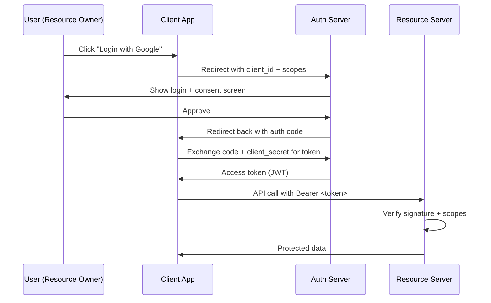

# OAuth 2.0 and JWT

> Delegation plus signed receipts. One app acting for a user, with proof.

## The hook

You click "Login with Google." A page flashes by. You're in.

Behind that one click, your app just talked to Google, asked permission to know your email, got a signed receipt back, and showed you a logged-in screen — without ever seeing your Google password.

That's OAuth 2.0 doing the delegation, and a JWT carrying the receipt. Two different things, almost always used together, almost always confused.

## The concept

OAuth 2.0 is a **delegation** protocol. The user grants an app a *scoped* permission at another service — read your email, post a tweet, list your repos — without handing over the password.

Four players:

- **Resource owner** — you, the user
- **Client** — the app that wants to act on your behalf
- **Authorization server** — the gatekeeper that issues tokens (e.g., Google's OAuth endpoint)
- **Resource server** — the API that holds the data (e.g., Gmail's API)

JWT is a **token format**. Three parts — header, payload, signature — each base64-encoded and joined with dots:

```
eyJhbG... (header) . eyJzdWI... (payload) . <signature>
```

The header says how it was signed. The payload carries claims (who, what, when). The signature proves the issuer made it. The payload is *readable* by anyone — base64 is encoding, not encryption. What stops tampering is the signature.

OAuth says *how* to get a token. JWT is *what the token usually looks like*. They're often paired, but you can use OAuth without JWTs (opaque tokens) and JWTs without OAuth (internal service auth).

## Diagram



The auth code is a one-time, short-lived value. The actual token never travels through the user's browser — it's swapped server-to-server. That's the security win of Authorization Code over the older Implicit flow.

## Example — Slack posts your GitHub commits

A Slack integration wants to post commit notifications into a channel. Slack is the **client**, GitHub is both the **auth server** and the **resource server**, and you (the repo owner) are the **resource owner**.

**Step 1 — redirect.** You click "Connect GitHub" in Slack. Slack sends your browser to:

```
https://github.com/login/oauth/authorize
  ?client_id=your-client-id
  &scope=repo:read
  &redirect_uri=https://slack.example/callback
  &state=<random-csrf-token>
```

**Step 2 — consent.** GitHub shows the screen you've seen a hundred times: *"Slack wants to read your repositories. Authorize?"* You click yes.

**Step 3 — code comes back.** GitHub redirects your browser to Slack's callback with a short-lived code:

```
https://slack.example/callback?code=<auth-code>&state=<same-csrf-token>
```

**Step 4 — code-for-token swap.** Slack's *server* (not your browser) calls GitHub:

```
POST https://github.com/login/oauth/access_token
  client_id=your-client-id
  client_secret=<CLIENT_SECRET>
  code=<auth-code>
```

GitHub returns a JWT. Decoded, it looks roughly like:

```json
// Header
{"alg":"RS256","typ":"JWT"}

// Payload
{
  "iss":"https://github.com",
  "sub":"user42",
  "aud":"slack-integration",
  "scopes":["repo:read"],
  "exp":1234567890
}

// Signature
<signed-with-issuer-key>
```

**Step 5 — Slack uses the token.** When a commit lands, Slack calls `GET https://api.github.com/repos/...` with `Authorization: Bearer <JWT_HERE>`. GitHub's API verifies the signature with its public key, checks `exp` and `scopes`, and returns the data.

The payload is base64, *not* encrypted. Anyone who intercepts the JWT can read what's inside. What they can't do is change it — flipping `repo:read` to `repo:admin` invalidates the signature, and GitHub rejects the call.

## Mechanics

**OAuth 2.0 flows — pick by client type:**

| Flow | Who it's for | How it works | When to use |
|---|---|---|---|
| **Authorization Code** | Web apps with a backend | Browser gets code, server swaps for token using secret | Default for server-rendered web apps |
| **Authorization Code + PKCE** | Mobile apps, SPAs | Same as above but uses a code verifier instead of a secret | Default for any client that can't keep a secret |
| **Client Credentials** | Service-to-service | App authenticates as itself, no user involved | Backend job calling another backend |
| **Implicit** | (Legacy) SPAs | Token returned directly in URL fragment | Don't. Replaced by Code + PKCE |
| **Resource Owner Password** | (Legacy) trusted first-party apps | App takes username/password and exchanges for token | Avoid. Defeats the whole "don't share passwords" point |

**JWT structure — three parts joined with dots:**

| Part | Contains | Example |
|---|---|---|
| **Header** | Algorithm + token type | `{"alg":"RS256","typ":"JWT"}` |
| **Payload** | Claims (key-value facts) | `{"sub":"user42","exp":1234567890,"aud":"my-api"}` |
| **Signature** | Hash of header + payload, signed with key | `<signed-with-issuer-key>` |

Algorithms split into two camps. **HS256** uses a shared secret — fast, but every verifier needs the secret. **RS256** uses an asymmetric key pair — issuer signs with private key, everyone verifies with the public key. For anything multi-service, use RS256.

Standard claims worth knowing:

- `iss` — issuer (who made the token)
- `sub` — subject (who the token is about, usually a user ID)
- `aud` — audience (which API the token is for)
- `exp` — expiration timestamp (always set this — short, like 15 minutes)
- `iat` — issued at
- `scope` / `scopes` — what the bearer is allowed to do

## Related concepts

| Concept | What it is | How it relates |
|---|---|---|
| **Cookies, sessions, tokens** | Three ways to remember a logged-in user | The foundation — JWTs are one kind of token, OAuth issues them |
| **OpenID Connect (OIDC)** | An identity layer built on top of OAuth 2.0 | Adds the "who is this user" piece OAuth lacks. "Login with Google" is OIDC, not raw OAuth |
| **Refresh tokens** | Long-lived tokens used only to get new access tokens | Lets you keep access tokens short (15 min) without forcing re-login |
| **JWKS endpoint** | Public URL serving the issuer's signing keys | How resource servers fetch the public key to verify RS256 JWTs |
| **SSO (Single Sign-On)** | One login session works across many apps | Usually built on OIDC + a central identity provider (Okta, Auth0, Entra) |
| **mTLS** | Both client and server present certificates | Service-to-service auth where you don't want bearer tokens at all |
| **API Gateway** | Front door for APIs | Often the layer that validates JWTs and forwards verified claims to backends |
| **PKCE** | Proof Key for Code Exchange | Extension that makes Authorization Code safe for public clients (mobile, SPA) |

## When (and when not) to use OAuth + JWT

**Use OAuth + JWT when:**

- **Third-party integrations** — anyone clicking "Connect to X" on your app. Don't roll your own.
- **Microservices auth** — services pass a JWT around, each one verifies the signature locally without calling a central auth service
- **Mobile apps and SPAs** — Authorization Code + PKCE is the modern standard
- **Federated identity** — you want users to log in with Google, Apple, Microsoft, or your customer's IdP
- **Stateless backends** — token carries the claims, no server-side session lookup needed

**Skip it when:**

- **Simple internal app, single backend** — a server-side session in Redis is fewer moving parts and easier to revoke
- **You need instant revocation** — JWTs live until they expire. Revoking mid-session means a denylist, which kills the stateless benefit. Sessions revoke with one DELETE.
- **High-security single tenant** — short-lived sessions plus rotating cookies often beat JWTs for blast radius
- **No delegation involved** — if no third party is acting on the user's behalf, OAuth is overkill. Just authenticate.

The mistake is reaching for JWTs because they're trendy. The right reasons are delegation, third-party access, and stateless verification across many services.

## Key takeaway

- **OAuth 2.0 is delegation, not authentication.** OpenID Connect is the layer that adds "who is this user."
- **JWT is a token format.** Three parts, base64-encoded, signature is what makes it trustworthy.
- **Payload is readable, not secret.** Never put passwords or PII in a JWT.
- **Authorization Code (+ PKCE for public clients) is the default.** Implicit and Password grants are legacy.
- **Always verify the signature, `iss`, `aud`, and `exp`.** Skipping any one of these is how breaches happen.
- **Short access tokens, long refresh tokens, fast revocation strategy.** Pick a story for revocation before you ship.

---

*Quiz available in the SLAM OG app — three questions on flow selection, what stops JWT tampering, and when sessions still beat tokens.*
