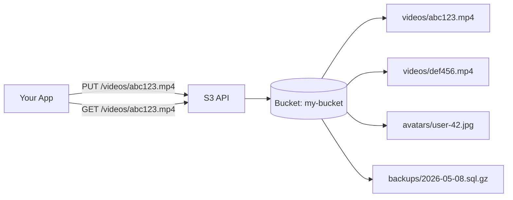

# Object Storage

> Cheap, durable, infinite — and the wrong tool for half the things people use it for.

## The hook

Your app lets users upload videos. You're sitting at 100TB and growing. You're not putting that in Postgres — your DBA would quit.

Object storage is the default. S3, Google Cloud Storage, Azure Blob, MinIO if you're self-hosting. Cheap per GB, effectively infinite, and durable enough that losing a file is a once-in-a-lifetime story. Every cloud-native app uses it.

The trap: engineers also reach for it as a slow, expensive database. Updating tiny JSON files on every request. Trying to "list all objects where user_id = 42." That's where the system starts hurting.

## The concept

Object storage is blob storage with an HTTP API. You `PUT` bytes at a key. You `GET` them back. You `DELETE` when done. That's the whole interface.

No queries. No transactions. No schema. No joins. Just keys mapped to bytes.

What you trade away in features, you get back in scale:

- **Durability.** S3 advertises 11 nines (99.999999999%). Lose a file, write a postmortem.
- **Cost.** S3 standard runs around $0.023/GB/month. Glacier deep archive drops to ~$0.00099/GB/month. Compare to managed Postgres at 10x+.
- **Scale.** S3 stores trillions of objects across millions of customers. There is no "running out of room."
- **Consistency.** Strongly consistent for read-after-write since 2020. Older docs still say "eventually consistent" — ignore them.
- **Immutability.** Objects don't get patched. To "update," you write a new object at the same key and the old bytes get replaced wholesale.

That last point is the one engineers keep forgetting.

## Diagram

Compared to a relational DB:

| | Object store | Relational DB |
|---|---|---|
| Lookup by | Key (string) | Any indexed column |
| Query | None — fetch by key | SQL |
| Item size | Bytes to terabytes per object | Bytes to megabytes per row |
| Update semantics | Replace whole object | Patch a field |
| Cost per GB | Cents | Dollars |
| Best for | Files, blobs, archives | Queryable state |

Object storage is a hash table the size of the internet. Don't ask it to be more than that.

## Example — Netflix on S3

Netflix runs the largest single S3 footprint on the planet. Last public number was tens of exabytes — call it "more than you can fit in your head." The architecture is the lesson.

**What lives in S3**

- **Encoded video.** Every title is encoded into dozens of bitrates, resolutions, and codecs. A single movie can produce 1,000+ output files. All of those go to S3.
- **Source masters.** The pristine pre-encode files studios deliver.
- **Logs and analytics events.** Petabytes of viewing data feeding their data platform.
- **ML training data.** Recommendation models train on data sitting in S3.

**What does NOT live in S3**

- The "what should I watch next" lookup. That's a recommendation service backed by a real database.
- User accounts, viewing history, billing. Cassandra and other operational stores.
- Anything on the request path where you can't tolerate ~100ms latency.

**The pairing**

A user hits play. Cassandra resolves the user, the title, and the entitlement. A metadata service points at the right encoded file in S3 — by key. That key gets handed to **Open Connect**, Netflix's purpose-built CDN, which long ago pre-positioned the bytes on appliances inside ISPs. The user streams from a box a few miles away.

S3 is the source of truth. The CDN is the delivery layer. The database is the brain that knows which key to ask for.

That's the pattern: **object storage holds the bytes, the database holds the metadata, the CDN delivers it close to the user.** Drop any one of those and the system breaks.

## Mechanics — object stores, warehouses, and lakes

People confuse these three constantly. They're not the same thing.

| Type | Examples | What it is | Query model |
|---|---|---|---|
| **Object store** | S3, GCS, Azure Blob, MinIO | Generic blob storage | By key only — no search |
| **Data warehouse** | Snowflake, BigQuery, Redshift | Structured analytics on transformed data | SQL, schema-on-write |
| **Data lake** | S3 + Athena, Iceberg, Delta Lake | Raw data queried in place | SQL over files, schema-on-read |

The relationship: a data lake is *built on* an object store. You dump raw files (JSON, Parquet, CSV) into S3, then layer a query engine on top so you can run SQL without ever moving the bytes. A warehouse, by contrast, ingests data through an ETL pipeline into its own optimized storage — you pay more, you get faster queries.

**When to use which:**

- **Object store** — files that get read as files. Videos, images, backups, ML inputs.
- **Data lake** — large volumes of raw or semi-structured data you'll query occasionally. Cost-optimized for storage.
- **Warehouse** — clean, structured data you query constantly for dashboards and BI. Cost-optimized for queries.

A common stack uses all three: raw events land in the lake, get transformed into the warehouse, and feed dashboards. The object store is the foundation under everything.

## Related concepts

| Concept | What it is | How it relates |
|---|---|---|
| **CDN** | Geographic cache of static assets at edge nodes | Object store + CDN is the canonical pattern for serving images and video. Bytes live in S3, get cached at the edge. |
| **Database types** | Relational, document, key-value, graph | Object store handles blobs. Database handles queryable state. Use both. |
| **Backups** | Point-in-time snapshots of databases or filesystems | Object storage is the natural destination — durable, cheap, and easy to lifecycle into colder tiers. |
| **Replication** | Copying data to multiple physical locations | Object stores handle this internally. S3 stores every object across multiple availability zones by default. Cross-region is opt-in. |
| **Versioning** | Keeping old copies of an object after overwrite or delete | One toggle on the bucket. Saves you from the "wait, who deleted that?" call. |
| **Lifecycle policies** | Automatic rules to transition or delete objects over time | Move objects from S3 Standard → Infrequent Access → Glacier as they age. Cuts storage cost 90%+ for cold data. |
| **Pre-signed URLs** | Time-limited URLs that grant temporary read or write access | How you let a browser upload directly to S3 without proxying through your server. |
| **Search index** | Inverted-index store for full-text or attribute search | Object stores can't search. If you need to find blobs by content, pair S3 with Elasticsearch or OpenSearch. |

The recurring theme: object storage is one piece of a system, not the whole system.

## When (and when not) to use it

**Use object storage for:**

- **User uploads** — images, videos, documents, anything a user hands you as a file
- **Backups** — database dumps, filesystem snapshots, application archives
- **Logs** — long-term retention beyond what your log platform keeps hot
- **ML training data** — datasets too large to fit anywhere else, read in batches
- **Static assets** — images, JS bundles, fonts (paired with a CDN)
- **Data lake foundations** — raw event data queried by Athena, Spark, or similar

**Skip it for:**

- **Anything you need to query.** No SELECT, no WHERE, no joins. Use a database.
- **Small, frequently-updated state.** Counters, session data, feature flags. Object stores rewrite the whole object on every change — that's slow and expensive. Use Redis or a real DB.
- **Transactional data.** No ACID, no row-level locking. Money moves through Postgres, not S3.
- **Searching by content.** "Find all images tagged 'sunset'" needs a search index. The object store holds the bytes; a separate index holds the searchable metadata.
- **Latency-critical reads.** First-byte latency to S3 is tens of milliseconds. Fine for video, terrible for a hot path. Cache it in front, or pick a faster store.

The rule of thumb: **if you'd describe the data as a file, S3 is right. If you'd describe it as a record, use a database.**

## Key takeaway

- **Object storage is for blobs, not state.** Files yes, counters no.
- **Pair it with a database for metadata.** S3 holds the video. Postgres holds who owns it, who can see it, and when it was uploaded.
- **Objects are immutable.** "Updating" means rewriting the whole thing. Build for that or pick a different store.
- **Lifecycle policies are free money.** Move cold data to Glacier and watch the bill drop 90%+.
- **Use pre-signed URLs for direct uploads.** Don't proxy 100MB videos through your app server.

---

*Quiz available in the SLAM OG app — three questions on file vs. record, immutability, and when object storage is the wrong answer.*
