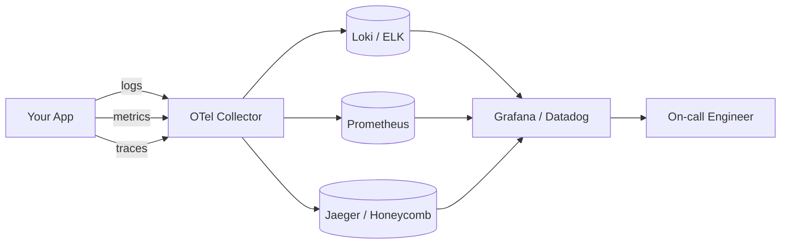

# Observability — Logs, Metrics, Traces

> Three pillars turn "it's broken" into "here's why" — without SSH-ing into 30 boxes.

## The hook

Debugging a monolith is `grep` and a stack trace. You know where the code lives, you know where the logs land, you read until the error makes sense.

Debugging a distributed system is different. "The request started here, went through 12 services, took 800ms, and we don't know which one caused it." SSH-ing into 30 boxes doesn't scale. Your stack trace ends at a network boundary.

Observability is the discipline that turns "it's broken" into "here's why." Three signals, one question each.

## The concept

Observability rests on three pillars. Each answers a different question. Skip any of them and you're guessing.

- **Logs — what happened.** Discrete events. "User 42 logged in." "DB query failed." "Cache miss on key X." Searchable, structured, high volume.
- **Metrics — how often, how much.** Numeric time series. Requests per second, p99 latency, error rate, CPU utilization. Aggregated, cheap to retain, perfect for dashboards and alerts.
- **Traces — where the time went.** End-to-end path of one request through every service it touched, with span timing. The only signal that survives a microservices boundary.

A fourth pillar is gaining ground: **profiles** — continuous CPU and memory profiling so you can see which function is eating the box. Tools like Pyroscope and Parca made this cheap enough to run in production.

The mental model: metrics tell you something's wrong. Traces tell you where. Logs tell you why.

## Diagram

OpenTelemetry is the open standard for emitting all three signals. The collector fans them out to the backend that's good at each one.

## Example — the slow endpoint

It's 14:32. PagerDuty fires. Your dashboard says p99 latency on `/api/checkout` jumped from 100ms to 2 seconds. Error rate is normal. Customers are starting to complain.

How do you find it?

**Step 1 — metrics tell you what.** You pull up the service map. `/api/checkout` is slow. Started at 14:32. No deploy, no error spike. Traffic is normal. So far you know *where* the pain is, not *why*.

**Step 2 — traces tell you where.** You pull a slow trace from Jaeger. The request flows API gateway → cart service → inventory service → DB. The waterfall shows it clearly: API gateway span is 5ms, cart is 20ms, inventory is **1.8 seconds**. The DB call inside inventory is the offender.

**Step 3 — logs tell you why.** You filter logs to the inventory service in that time window. Every other line: `connection pool exhausted, waiting`. Pool size 10. In-flight requests: 200.

You bump the pool to 50, ship it, latency drops. Crisis solved in 12 minutes.

Without all three pillars, you'd be guessing — staring at a single number and SSH-ing into boxes hoping to spot a pattern.

**Production picks:**

- **Honeycomb** — high-cardinality observability. Every event tagged with `user_id`, `request_id`, feature flag, region. Slice by any dimension after the fact. Best when "weird thing happens to one customer" is your hardest bug class.
- **Datadog** — all-in-one. Logs, metrics, traces, APM, RUM, synthetics in one UI. Expensive at scale, but the integration story is unmatched.
- **Open-source stack** — Prometheus (metrics) + Grafana (dashboards) + Loki (logs) + Tempo (traces) + OpenTelemetry (instrumentation). Free in license, expensive in ops time. Worth it once the Datadog bill crosses six figures.

## Mechanics — three pillars and the tools

| Pillar | What it stores | Storage shape | Cost profile | Tools |
|---|---|---|---|---|
| **Logs** | Discrete events, structured JSON | Indexed full-text | High volume, expensive at scale | ELK, Loki, Datadog Logs, Splunk |
| **Metrics** | Numeric time series, aggregated | Time-series DB | Cheap to retain long-term | Prometheus, Datadog, CloudWatch, InfluxDB |
| **Traces** | Distributed spans with timing | Span store, often sampled | Medium — sampling keeps it sane | Jaeger, Honeycomb, Datadog APM, AWS X-Ray |

**OpenTelemetry (OTel)** is the open standard. One SDK, one wire format, three signals. Vendor-neutral — instrument once, swap backends without rewriting code. If you're starting fresh in 2026, start with OTel.

Two methods worth memorizing:

- **USE method** — for every resource (CPU, disk, network), check **U**tilization, **S**aturation, **E**rrors. Brendan Gregg's framework for finding hardware-shaped problems.
- **RED method** — for every service, watch **R**ate (requests/sec), **E**rrors (failed/sec), **D**uration (latency distribution). Tom Wilkie's framework for finding service-shaped problems.

Most production dashboards are RED on top, USE underneath. That's not a coincidence.

## Related concepts

| Concept | What it is | How it relates to observability |
|---|---|---|
| **Microservices** | Architecture that splits one app into many services | Where observability earns its weight. One service, you can grep. Twenty services, you need traces. |
| **Distributed Patterns** | Saga, circuit breaker, retry, idempotency | You can't debug any of them without traces and structured logs. Observability is the price of distributed systems. |
| **Structured Logging** | Logs as JSON with consistent fields | The logs you can actually query. `grep` doesn't scale to 30 services — `service:inventory level:error` does. |
| **SLI / SLO / SLA** | The vocabulary of reliability targets | Metrics define your SLIs. SLOs are thresholds on metrics. Observability is how you measure whether you're hitting them. |
| **Incident Response** | How you handle production fires | Observability is the toolkit. RED dashboard → trace → log dive → fix. Without it, every incident is archaeology. |
| **Alerting** | Pages and notifications on threshold breach | Metrics + thresholds = alerts. Good alerts come from SLOs, not vibes. |
| **Profiling** | Continuous CPU and memory sampling | The fourth pillar. When metrics, traces, and logs all say "the service is just slow," profiling shows which function is eating the box. |

## When (and when not) to invest deeply

**Invest deeply when:**

- You have **5+ services** — log diving stops working at this point
- You're **customer-facing** with real reliability requirements
- You have an **on-call rotation** that pages humans at 3am
- Your incidents currently end with "we still don't know what happened"
- You're running **distributed patterns** (sagas, async workflows) that span services

**Skip the heavy stack when:**

- **Single service, small project.** Structured logs and one latency metric is plenty. Adding OpenTelemetry + Tempo + Loki is overhead with no payoff.
- **Hobby project or pre-PMF startup.** Spend the time on the product, not the dashboard. `console.log` and a free-tier monitor will get you to your first 1,000 users.
- **You haven't even instrumented logs yet.** Start there. Don't skip to traces.

The progression that actually works:

1. **Logs first.** Everyone needs them. Make them structured (JSON) from day one — retrofitting is brutal.
2. **Metrics next.** When you have a dashboard people look at, you've earned them. RED on every service, USE on every box.
3. **Traces last.** When service count makes log diving impossible — usually around 5–10 services — that's when distributed tracing pays for itself.

Full observability is expensive. The Datadog bill, the engineering time on dashboards, the alert fatigue. Start small, scale the toolkit as the system scales.

## Key takeaway

- **Logs: what happened. Metrics: how much / how often. Traces: where the time went.** All three pillars or you're flying blind in production.
- **OpenTelemetry is the default in 2026.** Instrument once, swap backends as needs change.
- **RED for services, USE for resources.** Two methods, every dashboard.
- **Logs first, metrics next, traces last.** Don't skip ahead — the progression matches how your system actually grows.
- **Observability isn't free.** Budget for it like you'd budget for tests or CI. The first time it saves a 3am incident, it pays for itself.

---

*Quiz available in the SLAM OG app — three questions on which pillar answers which question, when to reach for traces, and where to start when you're small.*
