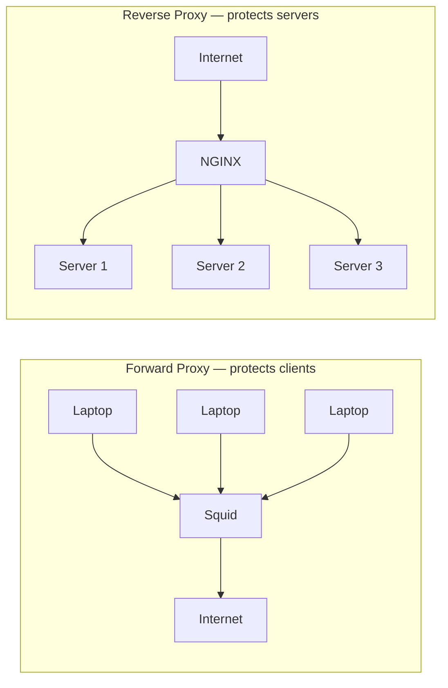

# Proxy vs Reverse Proxy

> A proxy hides clients. A reverse proxy hides servers. Same trick, opposite direction.

## The hook

Engineers say "proxy" to mean two completely different things, and the conversation goes sideways every time.

One person means *"the corporate filter that blocks YouTube at work."* The other means *"the NGINX box in front of our microservices."* Both are proxies. They sit in opposite places and solve opposite problems.

Here is the cleanest way to keep them straight: a **forward proxy** hides who is asking. A **reverse proxy** hides who is answering.

## The concept

Both are intermediaries. Both forward HTTP traffic. The only real difference is which side they protect.

A **forward proxy** sits in front of clients. Outbound traffic from your laptop goes through it on the way to the internet. The websites you visit see the proxy's IP, not yours. Forward proxies filter, log, cache, and anonymize what users do.

A **reverse proxy** sits in front of servers. Inbound traffic from the internet hits the proxy first, and the proxy decides which backend server actually handles it. Users see the proxy's IP. They have no idea how many servers live behind it. Reverse proxies load balance, terminate TLS, cache, and hide internal architecture.

Same mechanism — a middleman forwarding HTTP. Opposite direction.

## Diagram

Left side: clients route *out* through the proxy. Right side: traffic routes *in* through the proxy. Mirror images.

## Example — Squid at the office, NGINX in production

Two real deployments make the difference click.

**Forward proxy: Squid filtering outbound traffic at a corporate enterprise**

A 5,000-person company runs **Squid** between every employee laptop and the public internet. Browsers are configured (via Group Policy or PAC file) to send all HTTP/HTTPS through Squid first.

What Squid does:

- **Filtering** — blocks gambling, adult sites, known malware domains
- **Logging** — every request is recorded for compliance and incident response
- **Caching** — when 200 employees download the same Windows update, it leaves the building once
- **Anonymizing** — external sites see the company's egress IP, not individual user IPs

The clients are the thing being hidden and protected. That is forward proxy work.

**Reverse proxy: NGINX in front of Node.js microservices**

A company like **GitLab** or any product running on Node.js puts **NGINX** in front of its application servers. Public DNS points at NGINX. NGINX points at the fleet.

What NGINX does:

- **TLS termination** — handles the HTTPS handshake once, talks plain HTTP to backends
- **Load balancing** — spreads requests across Node processes (Node is single-threaded, so you run many)
- **Path routing** — `/api` to one fleet, `/static` straight from disk, `/admin` to a locked-down service
- **Caching** — serves repeat responses without bothering Node
- **Hiding architecture** — the public internet sees one address; behind it could be 3 servers or 300

**Cloudflare** is a reverse proxy at planetary scale — every site on Cloudflare has its real origin servers hidden behind Cloudflare's edge. **HAProxy**, **Envoy**, and **Traefik** play the same role with different strengths.

The servers are the thing being hidden and protected. That is reverse proxy work.

## Mechanics — when each shows up

| Use case | Forward proxy | Reverse proxy |
|---|---|---|
| Corporate web filtering (block sites, log usage) | Yes | No |
| Anonymizing user traffic (hide client IP) | Yes | No |
| Caching content for many clients hitting the same external sites | Yes | No |
| Bypassing geo-restrictions (look like you are elsewhere) | Yes | No |
| Load balancing across a backend fleet | No | Yes |
| TLS termination for your own site | No | Yes |
| Caching responses from a single backend | No | Yes |
| Hiding internal server count and IPs | No | Yes |
| Path-based routing (`/api` vs `/admin`) | No | Yes |
| DDoS absorption at the edge | No | Yes |

Same software (NGINX, HAProxy) can do both — the role depends on which side of the connection it sits on.

## Related concepts

| Concept | What it is | How it relates |
|---|---|---|
| **Load Balancer** | Distributes inbound traffic across backend servers | A specialized reverse proxy. Every load balancer is a reverse proxy; not every reverse proxy is a load balancer. |
| **API Gateway** | Reverse proxy with auth, rate limiting, and request transformation built in | A reverse proxy with extra cross-cutting concerns. Examples: Kong, AWS API Gateway, Zuul. |
| **CDN** (Content Delivery Network) | Geographic edge cache for static and dynamic content | A reverse proxy distributed worldwide. Cloudflare, Fastly, CloudFront. |
| **VPN** | Encrypted tunnel from a client into a private network | Different model — you join the network, not just route through a proxy. Used where forward proxies fall short. |
| **TLS Termination** | Decrypting HTTPS at the edge so backends speak plain HTTP | The most common reason teams put a reverse proxy in front of their app, even with one server. |
| **NAT** (Network Address Translation) | Maps many internal IPs to one public IP at the router | Conceptual cousin of forward proxy — many clients sharing one external identity, but at the network layer instead of the application layer. |
| **Zero Trust Proxy** | Identity-based proxy that authenticates every request | Modern replacement for corporate forward proxies + VPN. Cloudflare Access, Google BeyondCorp. |

These all build on the same idea — a middleman doing useful work — but the *direction* and the *job* are what tell them apart.

## When (and when not) to use each

**Use a forward proxy when:**

- You run a **corporate or school network** that needs filtering, logging, or compliance
- You are a developer running **Charles Proxy** or **Burp Suite** to inspect/intercept your app's traffic
- You need **outbound caching** for thousands of clients hitting the same external resources
- You need to **anonymize traffic** for legitimate reasons (research, scraping you have permission for)

**Skip the forward proxy when** a modern alternative fits better. **VPNs** beat forward proxies for remote-work tunneling. **Zero Trust** platforms (Cloudflare Access, Tailscale, Google BeyondCorp) beat them for identity-aware access control. New corporate networks rarely need a classic Squid box.

**Use a reverse proxy when:**

- You have **two or more backend servers** and need anything routed in front of them
- You want **TLS termination in one place** instead of every backend
- You want **path-based routing** (`/api`, `/admin`, `/static` going to different fleets)
- You need to **hide internal architecture** from the public internet

**Skip the reverse proxy when** your provider already runs one for you. Cloudflare, AWS Application Load Balancer, GCP Cloud Load Balancing, and Vercel all *are* reverse proxies — putting your own NGINX in front of them is usually pointless. For any production web app you actually run yourself with 2+ servers, a reverse proxy is the default answer.

## Key takeaway

- **Forward proxy → in front of clients.** Hides who is asking.
- **Reverse proxy → in front of servers.** Hides who is answering.
- **Same software** (NGINX, HAProxy) plays either role — the position decides the job.
- **Reverse proxies are everywhere** in modern web stacks. Forward proxies are mostly corporate networks and dev tools now.
- When someone says "proxy" in a system design conversation, ask which side. The whole discussion depends on it.

---

*Quiz available in the SLAM OG app — three questions on direction, identifying real-world tools, and which jobs belong to which proxy.*
