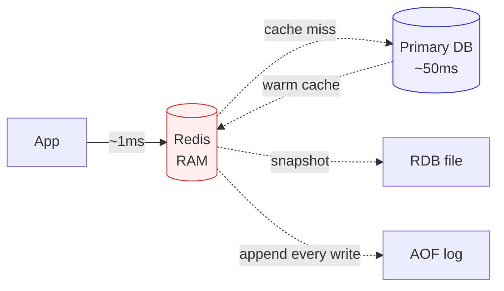

# Redis & In-Memory Data Stores

> RAM speed, with a knob for how much durability you can afford to lose.

## The hook

Your database is the source of truth. Reading it is slow — disk seeks, query planners, joins. Reading from RAM is roughly **100,000x faster**.

Redis is the answer to "what if the data my app reads most often just lived in memory?" Sub-millisecond reads. No query planner. No joins. Just `GET key`.

The trade-off shows up the moment the power flickers. RAM is volatile. So Redis hands you a knob: how much of that speed do you want to give back for durability?

## The concept

Redis is an in-memory key-value store. But "key-value" undersells it — the values can be lists, sets, sorted sets, hashes, streams, and more. That's why people use it for things a plain cache can't do: leaderboards, queues, rate limiters, pub/sub.

Three things to know up front:

1. **In-memory first** — every read and write hits RAM. That's where the speed comes from.
2. **Single-threaded** — one command at a time per instance. Sounds slow, isn't. No lock contention, no context switching, the CPU isn't the bottleneck.
3. **Persistence is optional** — you choose RDB snapshots, AOF append-only log, both, or nothing. Each option is a different point on the durability/speed curve.

The mental model: Redis is your database, but in RAM, but only sort of, depending on which persistence option you pick.

## Diagram



The hot path is app → Redis → done. The cold path only runs on a miss. Persistence (RDB + AOF) is a side channel — Redis doesn't block on it.

## Example — Twitter timelines on Sorted Sets

A timeline is hard. Every user follows hundreds of accounts. Every read is "give me the latest 50 posts from anyone I follow, in time order." Doing that against a write-heavy SQL database, on every refresh, for hundreds of millions of users — you'll buy a lot of database servers and they'll all be on fire.

Twitter's pattern (simplified): cache each user's timeline in Redis as a Sorted Set. The key is `timeline:user_id`. The score is the timestamp. The member is the tweet ID.

```
ZADD timeline:42 1714000000 tweet_9001
ZADD timeline:42 1714000060 tweet_9002
ZRANGE timeline:42 0 49 REV   # latest 50 tweets, newest first
```

What this buys you:

- **O(log N) writes**, **O(log N + M) reads** for M results — fast and predictable
- **Sub-millisecond response** — the timeline read never touches the primary DB
- **Read scaling is cheap** — add Redis replicas, point reads at them, done

When a new tweet is posted, a fan-out worker writes it into the Sorted Set of every follower. That's expensive on the write side, but it pushes the cost to the moment of posting (rare-ish) instead of the moment of reading (constant). For most timelines, that math wins.

The shape of this example shows up everywhere: GitHub session storage, gaming leaderboards, recent activity feeds, real-time analytics. Redis turns "scan a database" into "read a single key."

## Mechanics — data types and persistence

**Data types you'll actually use:**

| Type | What it is | Use case |
|---|---|---|
| **String** | Bytes — text, number, JSON blob | Counter (`INCR`), object cache, feature flag |
| **List** | Ordered, push/pop both ends | Lightweight queue, recent-items list |
| **Set** | Unordered, unique members | Deduplication, "have we seen this?" checks |
| **Sorted Set** | Set with a score per member | Leaderboard, time-ranked feed, priority queue |
| **Hash** | Field/value map under one key | Cached object with addressable fields (user profile) |
| **Stream** | Append-only log with consumer groups | Event log, durable message queue, audit trail |

The data types are the reason Redis stuck around. Memcached can cache. Redis can cache *and* be the leaderboard, the rate limiter, the queue.

**Persistence — pick your trade-off:**

| Option | What it does | Durability | Write cost | Recovery time |
|---|---|---|---|---|
| **None** | Pure cache, nothing on disk | Zero — restart loses all data | None | Instant (empty) |
| **RDB** | Periodic binary snapshot | Lose everything since last snapshot (often minutes) | Low (forked snapshot) | Fast — load one file |
| **AOF** | Every write logged to disk | Lose 0–1s depending on fsync setting | Higher (disk on writes) | Slower — replay the log |
| **AOF + RDB** | Snapshot for fast restore, AOF for fresh writes | Best of both | Higher | Fast (RDB) + tail (AOF) |

Defaults: pure cache → no persistence. Session store or queue → AOF every second. Anything where the data has real value → AOF + RDB hybrid, and budget for slightly slower writes. If you find yourself reaching for "AOF fsync on every write," ask whether the workload should actually live in a real database.

## Related concepts

| Concept | What it is | How it relates |
|---|---|---|
| **Caching strategies** | Read-through, write-through, write-behind, cache-aside | Redis is the *where*. Caching strategy is the *how*. You pick both. |
| **Memcached** | Pure in-memory key-value cache, no data types, no persistence | Simpler alternative when all you need is "string in, string out, fast." Redis won the broader fight. |
| **Kafka** | Durable, partitioned, replicated event log | Redis Streams handle modest queue workloads. Kafka is the answer at high throughput or strong durability. |
| **Database replication** | Master-replica replication for read scaling and failover | Redis has its own replication (master + replicas) plus Redis Sentinel/Cluster for failover. Same pattern, smaller scope. |
| **Session storage** | Server-side store for logged-in user state | Classic Redis use — fast reads, TTL handles expiry, survives an app restart. Replaces sticky sessions. |
| **Rate limiting** | Capping requests per user/IP per window | Token bucket or sliding window with `INCR` + `EXPIRE`. A handful of commands, sub-millisecond. |
| **Distributed locks** | Coordinating "only one worker does this job" across machines | `SETNX` + TTL gets you most of the way. Use the **Redlock** algorithm — and only when you've thought hard about correctness. |
| **Pub/Sub** | Publish messages, subscribers receive them | Built-in for fire-and-forget messaging. Not durable — use Streams or Kafka if you need replay. |

Each is its own topic. Redis tends to show up in all of them because in-memory speed makes every one of these patterns viable.

## When (and when not) to use it

**Reach for Redis when:**

- **Caching** — the most common use. Read-heavy data that's slow to compute or fetch.
- **Sessions** — fast lookups, TTL for expiry, no app-server affinity required.
- **Leaderboards and ranked feeds** — Sorted Set was made for this.
- **Real-time counters** — page views, likes, rate limit counts. `INCR` is atomic and instant.
- **Pub/Sub at modest scale** — internal notifications, cache invalidation fan-out.
- **Distributed locks** — only after reading the failure modes. Use a vetted library, not a homegrown `SETNX`.

**Skip Redis when:**

- **You need durable transactions.** Redis has transactions, but it's not your accounting system. Use Postgres or similar.
- **Working set exceeds RAM.** RAM is expensive — at terabyte scale, the bill outpaces the speed win. Look at SSD-backed stores or rethink what really needs to be hot.
- **You can't afford another moving part.** Redis is one more thing to monitor, replicate, fail over, and tune. If your traffic doesn't justify the cost of operating it, don't add it yet.
- **Strong durability beats latency.** Logs, payments, anything legal — Redis is not the system of record.

The honest default: cache what's hot and slow, persist what's expensive to lose, and don't cache what doesn't need it. RAM isn't free.

## Key takeaway

- **Redis is RAM speed plus rich data types** — that's the whole pitch. Sub-millisecond reads, Sorted Sets, Streams, Hashes.
- **Single-threaded isn't slow.** No locks, no context switching, memory bandwidth is the limit.
- **Persistence is a knob, not a switch.** None for pure cache, AOF for sessions/queues, AOF + RDB for anything you'd hate to lose.
- **It's a cache, a session store, a queue, a leaderboard — not a database of record.** When you need durable transactions, use a real DB.

---

*Quiz available in the SLAM OG app — three questions on why single-threaded Redis is fast, picking the right data type for a leaderboard, and the AOF fsync trade-off.*
