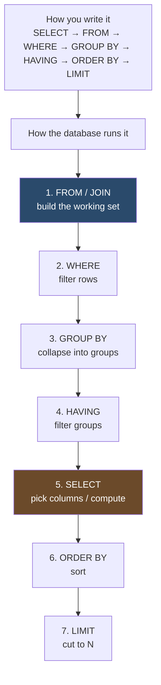

# SQL Fundamentals

> Sixty years in, still the lingua franca of data.

## The hook

Most engineers can write `SELECT * FROM users WHERE id = 42`. Fewer can confidently write a three-table join with aggregation. Almost no one can tell you the order the database actually processes that join.

SELECT is easy. JOIN is where most engineers get stuck — and unstuck-ing it is what separates juniors from seniors.

SQL is older than the public internet. It's outlasted four database fashion cycles. If you're going to build systems that store data — and you are — this is the language you fight in.

## The concept

SQL describes data as a **relational model**: rectangles of data (tables) with rows (records) and columns (fields). Every table has a **primary key** that uniquely identifies each row, and **foreign keys** that point to rows in other tables.

That's it. The whole model fits on a napkin.

The four verbs you'll use 95% of the time — **CRUD**:

| Verb | What it does |
|---|---|
| `SELECT` | Read rows |
| `INSERT` | Create rows |
| `UPDATE` | Modify existing rows |
| `DELETE` | Remove rows |

The superpower is **JOIN**. Foreign keys connect tables, and joins let you ask questions across them in one query: *"give me every user with the count of repos they own and the date of their last commit."* Without joins, you'd pull each table separately and stitch the results in application code — slower, more bugs, more code.

The skill is knowing what each join type returns and choosing the right one.

## Diagram

The order you *write* a query is not the order the database *runs* it. This trips up everyone.



This is why you can't say `WHERE total_commits > 5` if `total_commits` is an alias from your SELECT — at WHERE time, SELECT hasn't run yet. You have to use HAVING (which runs *after* aggregation) or wrap the query.

## Example — a GitHub-like activity feed

Real schema, real query, real result. We've got three tables in a code-hosting app:

```sql
-- users: who's on the platform
users(id, username, created_at)

-- repos: code repositories, each owned by a user
repos(id, owner_id, name, stars)

-- commits: every commit pushed to a repo
commits(id, repo_id, author_id, message, committed_at)
```

The product question: *"For each user, show their top repo by star count and how many commits they pushed in the last 30 days. Only include users with at least 10 commits."*

```sql
SELECT
    u.username,
    r.name           AS top_repo,
    r.stars,
    COUNT(c.id)      AS recent_commits
FROM users u
JOIN repos r       ON r.owner_id = u.id
LEFT JOIN commits c ON c.author_id = u.id
                    AND c.committed_at > NOW() - INTERVAL '30 days'
WHERE r.stars = (
    SELECT MAX(stars) FROM repos WHERE owner_id = u.id
)
GROUP BY u.username, r.name, r.stars
HAVING COUNT(c.id) >= 10
ORDER BY recent_commits DESC
LIMIT 20;
```

What each clause does, in execution order:

1. **FROM / JOIN** — build the working set. `users` joined to `repos` (every user who owns at least one repo). Then `LEFT JOIN commits` — keeping users even if they have zero recent commits, so the HAVING filter does the work.
2. **WHERE** — keep only the row where this repo's stars equal the user's max repo stars. The subquery picks the top repo per user.
3. **GROUP BY** — collapse to one row per (username, top_repo, stars) combo.
4. **HAVING** — drop groups with fewer than 10 commits in the window.
5. **SELECT** — project the four columns we want, including the `COUNT(c.id)` aggregation.
6. **ORDER BY** — sort by recent activity, descending.
7. **LIMIT** — take the top 20.

Sample result:

| username | top_repo | stars | recent_commits |
|---|---|---|---|
| torvalds | linux | 178000 | 247 |
| sindresorhus | awesome | 312000 | 89 |
| gaearon | react | 228000 | 42 |

One query. Three tables. A subquery, an outer join, an aggregate, and a group filter. This is the shape of real SQL — not `SELECT * FROM users`.

## Mechanics — join types

| Join | Returns | Use when |
|---|---|---|
| `INNER JOIN` | Only rows with a match in both tables | You want intersections — users *with* orders, repos *with* commits |
| `LEFT JOIN` | All rows from the left table, matched rows from the right (NULL if no match) | You want the left side complete — every user, even those with zero orders |
| `RIGHT JOIN` | All rows from the right, matched from the left | Rare in practice — flip the tables and use LEFT JOIN instead |
| `FULL OUTER JOIN` | All rows from both sides, NULL where no match | Reconciling two datasets — finding what's in A or B or both |
| `CROSS JOIN` | Cartesian product — every row from A paired with every row from B | Generating combinations (date dimension × product dimension for reporting) |
| `SELF JOIN` | A table joined to itself | Hierarchies (employees → managers), comparing rows to other rows in the same table |

The 90% answer is INNER and LEFT. If you find yourself reaching for RIGHT, swap your table order. FULL OUTER shows up in data reconciliation. CROSS and SELF are specialized but worth knowing the day you need them.

## Related concepts

| Concept | What it is | How it relates to SQL |
|---|---|---|
| **Database types** | SQL (relational), document, key-value, graph, columnar, time-series | SQL is one family. Pick by access pattern, not by trend. |
| **Indexes** | Pre-sorted lookup structures (usually B-trees) on specific columns | Joins without indexes on the join key turn into table scans — your 100ms query becomes 30 seconds. |
| **Query plans** (`EXPLAIN`) | The execution strategy the optimizer picked | When a query is slow, `EXPLAIN ANALYZE` shows you whether you're hitting indexes, doing nested loops, or scanning the universe. |
| **ACID transactions** | Atomicity, Consistency, Isolation, Durability | The reason banks run on SQL. `BEGIN ... COMMIT` either all happens or none of it does. |
| **Sharding** | Splitting a table across multiple physical machines by key | Joins across shards are painful — they require cross-machine coordination. Denormalize or co-locate to avoid it. |
| **ORMs** (Object-Relational Mappers) | Code abstractions that generate SQL for you (ActiveRecord, SQLAlchemy, Prisma) | Great for CRUD, dangerous for complex joins. Drop to raw SQL when the ORM produces N+1 queries. |
| **Normalization** | Splitting data to avoid duplication (3NF and friends) | The reason you have multiple tables instead of one fat one. Denormalize selectively for read-heavy paths. |
| **NoSQL** | Non-relational stores — document, key-value, wide-column | Often presented as a SQL replacement, usually a complement. Most production stacks run both. |

Each of these is a topic on its own. SQL is the foundation that makes the others make sense.

## When (and when not) to use it

**Use SQL when:**

- **Data has relationships** — users, orders, line items, products. Joins do in one query what NoSQL makes you do in three.
- **You need transactional consistency** — money movement, inventory, anything where partial writes break the world.
- **Complex analytics and ad-hoc queries** — slicing data by dimensions you didn't plan for. SQL's declarative model shines here.
- **You don't know exactly how data will be queried yet** — SQL's flexibility is hard to beat when product requirements are still moving.
- **Your team already knows SQL** — and they do, because everyone does.

**Skip it (or pair it with something else) when:**

- **Schema is genuinely unknown** — sensor payloads, third-party webhooks where the shape changes weekly. A document store fits better, or store JSON in a SQL column and treat it as semi-structured.
- **You need extreme key-value throughput** — session stores, caches, rate limiters. Redis or DynamoDB hit hundreds of thousands of ops/sec where SQL caps lower.
- **You're building a graph traversal app** — social networks, recommendation engines that walk N hops. Neo4j or another graph DB makes those queries trivial; SQL makes them painful recursive CTEs.
- **Single-machine SQL has hit its ceiling** — at petabyte scale, columnar warehouses (BigQuery, Snowflake) or distributed SQL (CockroachDB, Spanner) take over.

The default answer for any app with structured data and relationships is *use SQL — Postgres unless you have a specific reason otherwise.* The interesting questions come when scale or schema flexibility push you to add something alongside it.

## Key takeaway

- **Tables, rows, primary keys, foreign keys.** The relational model is small and powerful.
- **CRUD covers 95% of statements.** Joins are the superpower.
- **Execution order ≠ writing order.** FROM → WHERE → GROUP BY → HAVING → SELECT → ORDER BY → LIMIT.
- **INNER and LEFT joins are 90% of real work.** Know the others; you'll need them eventually.
- **Joins without indexes are catastrophic.** Run `EXPLAIN` when something feels slow.
- **SQL is still the right default** for structured, related data. Reach for NoSQL when access patterns demand it, not because SQL feels old.

---

*Quiz available in the SLAM OG app — three questions on LEFT JOIN behavior with NULLs, the order the database actually processes a query, and when SQL beats key-value.*
